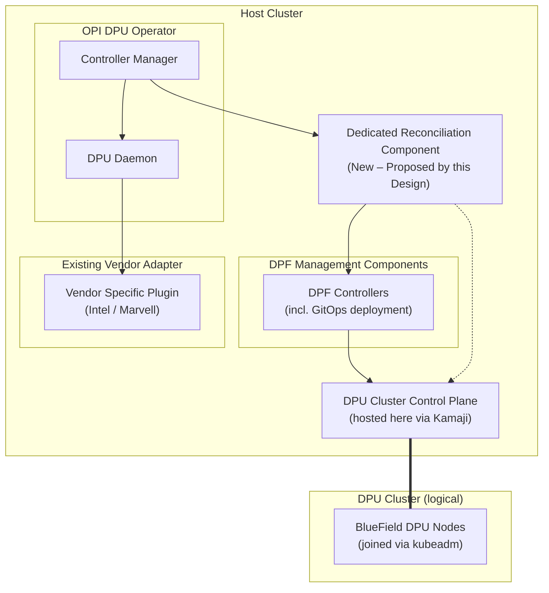
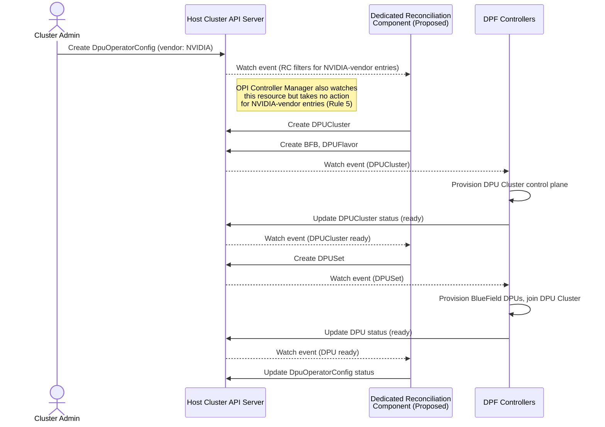
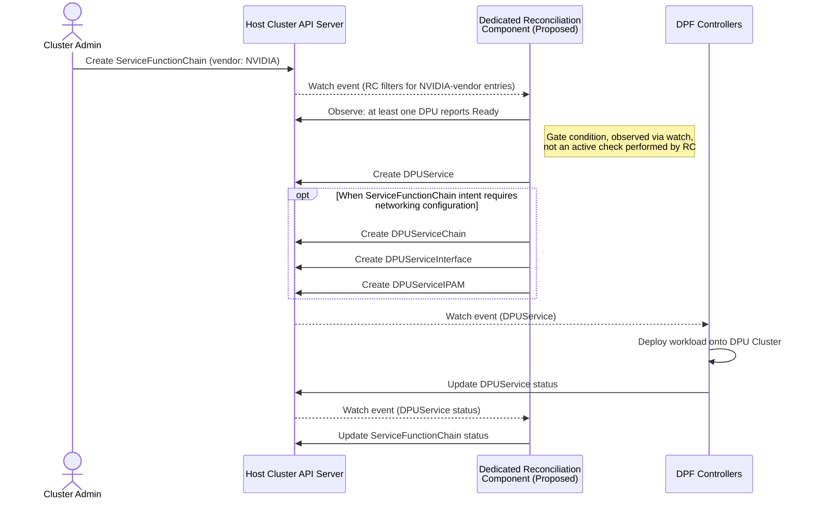
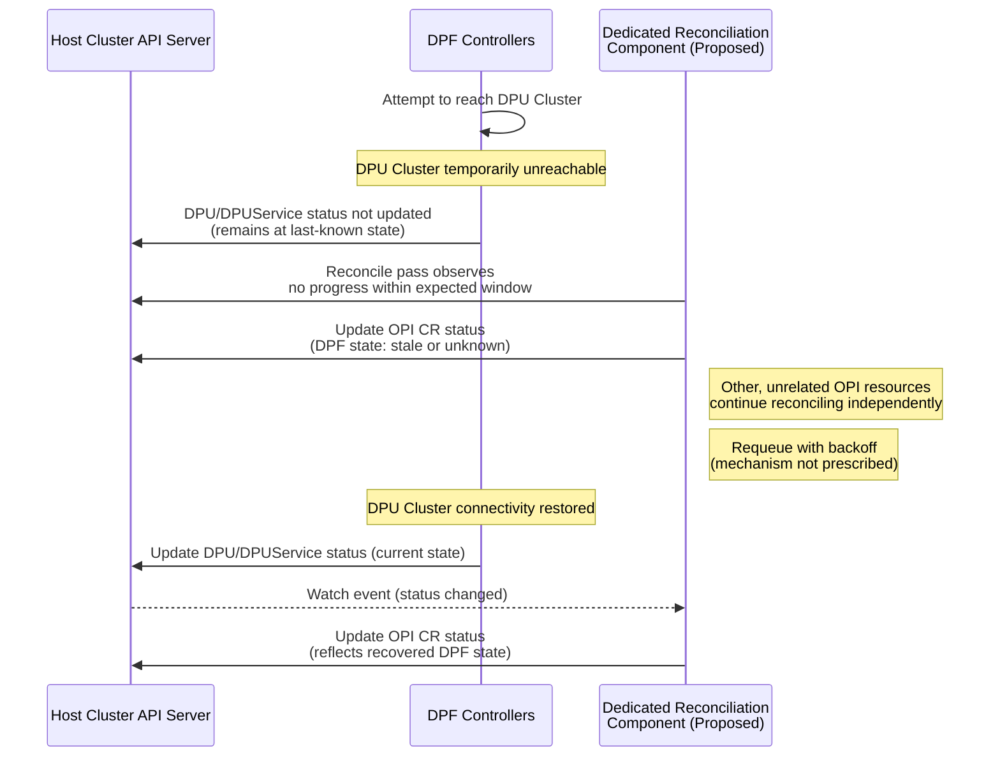
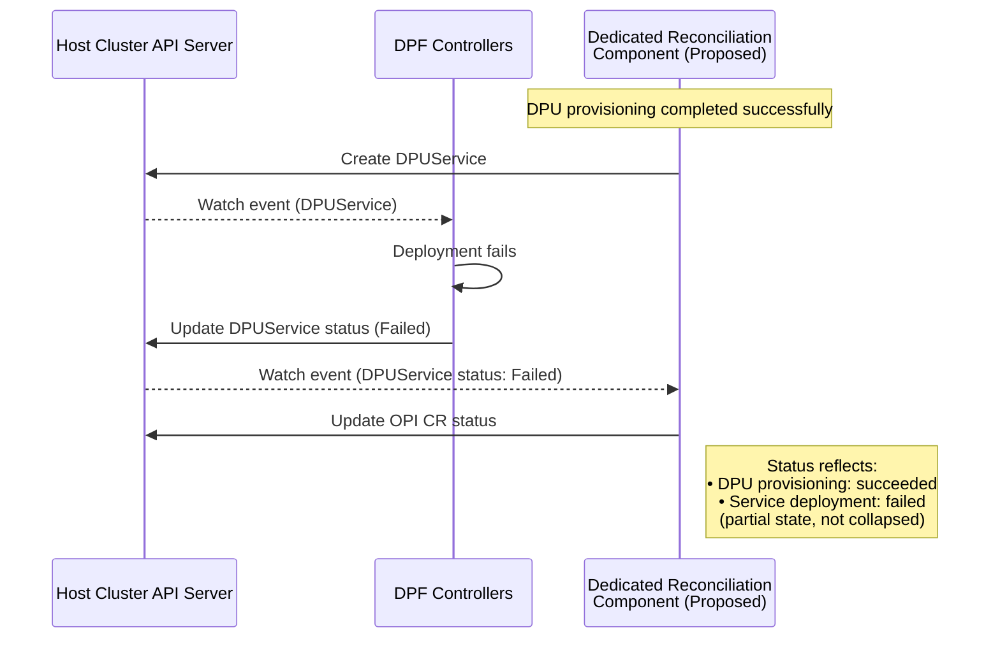
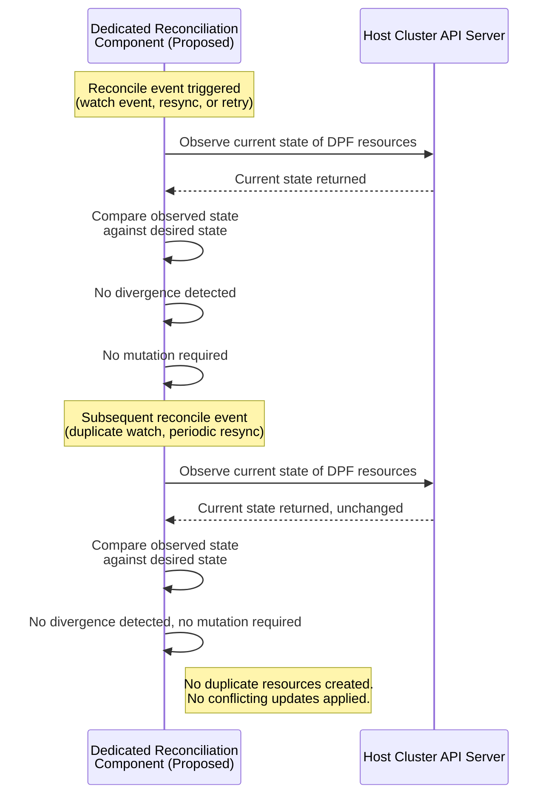

# 1. Executive Summary

## 1.1 Problem Statement

The OPI DPU Operator provides a vendor neutral Kubernetes interface for managing DPUs through a common set of CRDs & a shared adapter architecture. While Intel & Marvell integrate through this model, NVIDIA BlueField DPUs are managed by the DOCA Platform Framework (DPF), an independent Kubernetes native control plane with its own CRDs, controllers and lifecycle management. This architectural mismatch prevents NVIDIA from integrating into OPI's existing vendor abstraction.

## 1.2 Proposed Architecture

This design introduces a dedicated reconciliation component that bridges OPI and DPF. The component observes OPI's vendor neutral resources, translates them into DPF native resources and propagates DPF's reconciliation status back to OPI. The architecture preserves OPI as the vendor neutral entry point while allowing DPF to remain the authoritative control plane for NVIDIA specific operations.

## 1.3 Design Principles

The architecture is guided by 4 Principles:

- Preserve OPI's existing vendor neutral API & reconciliation model.
- Reuse DPF's existing controllers, CRDs & provisioning workflows.
- Maintain clear ownership boundaries between OPI & DPF.
- Follow standard Kubernetes operator reconciliation patterns throughout the integration.

## 1.4 Expected Outcome

The proposed architecture enables Intel, Marvell and NVIDIA DPUs to be managed through a unified OPI API while preserving each vendor's native implementation model. It establishes a reusable integration pattern for vendors that rely on independent Kubernetes native control planes without requiring changes to OPI's existing architecture or DPF's internal implementation.

# 2. Background & Definitions

The proposed architecture integrates the OPI DPU Operator with NVIDIA's DOCA Platform Framework (DPF). This section introduces the systems and architectural terminology referenced throughout the remainder of this document.

## 2.1 OPI DPU Operator

The OPI DPU Operator provides a vendor neutral Kubernetes interface for managing DPUs through a common set of Custom Resource Definitions (CRDs). Hardware specific functionality is abstracted behind a Vendor Specific Plugin (VSP) implementing the shared `dpu-api` interface, allowing multiple vendors to integrate through a common operational model while keeping the core operator vendor agnostic.

## 2.2 NVIDIA DOCA Platform Framework (DPF)

The DOCA Platform Framework (DPF) is NVIDIA's Kubernetes native platform for provisioning and orchestrating BlueField DPUs. It operates as an independent control plane with its own CRDs, controllers and reconciliation workflows, managing provisioning, cluster lifecycle, networking and service deployment across a Host Cluster and a dedicated DPU Cluster.

## 2.3 Architectural Terms

| Term | Definition |
|------|------------|
| **Host Cluster** | The Kubernetes cluster hosting the OPI DPU Operator, DPF management components, and user facing resources. |
| **DPU Cluster** | The Kubernetes cluster provisioned and managed by DPF whose worker nodes are BlueField DPUs. |
| **Control Plane** | The controllers, APIs and reconciliation logic responsible for maintaining the desired state of a system. |
| **Reconciliation Domain** | An independent reconciliation system that converges resources through its own controllers and API server. |
| **Vendor Specific Plugin** | A component implementing the `dpu-api` interface to translate vendor neutral operations into vendor specific SDK. |
| **Adapter Pattern** | OPI's existing integration model that abstracts vendor hardware behind a common synchronous interface. |
| **Ownership Boundary** | The principle that each system remains authoritative only for the resources and lifecycle it owns. |
| **Cross Cluster Status Propagation** | Reflecting reconciliation status between independent Kubernetes control planes while preserving eventual consistency. |

# 3. Design Drivers

This section summarizes the primary architectural forces that shaped the integration design. The complete derivation of design goals, constraints, and non-functional requirements is documented in `architecture_brief.md` (Sections 5–7).

## 3.1 Unified Vendor Neutral Operational Model

OPI's core value proposition is a single operational interface for managing DPUs regardless of vendor. The architecture must preserve this property, It's cluster administrators must continue to express intent through OPI's existing CRDs without requiring vendor specific knowledge or vendor specific CRDs at the point of use. The integration of NVIDIA must not fragment the user facing API surface that Intel and Marvell already share.

## 3.2 Preservation of DPF's Control Plane Authority

DPF is not a hardware programming library, it is an independently operating Kubernetes control plane responsible for provisioning BlueField DPUs, managing a dedicated DPU Cluster and orchestrating service deployment. The architecture must treat DPF as the authoritative system for NVIDIA specific provisioning and lifecycle management, delegating to its existing controllers and CRDs rather than reimplementing or bypassing them.

## 3.3 Zero Modification Reuse

Neither OPI's existing codebase (including the `dpu-api` interface and current VSP implementations) nor DPF's codebase, CRDs or controllers may be modified or forked. The integration must be purely additive, interacting with both systems exclusively through their documented public interfaces and extension points. This ensures that existing Intel and Marvell support remains unaffected and that DPF can continue to evolve independently.

## 3.4 Asynchronous Cross Cluster Reconciliation

DPF's provisioning and service deployment workflows are asynchronous,
multi controller processes that span two Kubernetes API servers. The
architecture must accommodate this reconciliation model rather than
attempting to force it behind a synchronous interface. It must therefore support asynchronous, cross cluster reconciliation while preserving eventual consistency, resilience to temporary communication failures and accurate status propagation across independently operating control planes.

## 3.5 Extensibility to Future Control Plane Vendors

The architectural approach should remain applicable to future vendors
whose DPU management is governed by an independent Kubernetes control
plane rather than a synchronous SDK. The resulting integration pattern
should allow such vendors to be incorporated without changing OPI's
vendor neutral API surface or core reconciliation model.

# 4. Selected Integration Pattern

The selected integration pattern introduces a dedicated reconciliation component that operates alongside the existing OPI DPU Operator while treating the NVIDIA DPF as the authoritative control plane for NVIDIA specific provisioning and lifecycle management. This design does not exist in either OPI or DPF today.

This pattern was selected because it is the only evaluated candidate that satisfies all mandatory architectural objectives while preserving the fundamental design principles of both systems. It maintains OPI's vendor neutral operational model, preserves DPF's ownership of its own control plane, and naturally supports asynchronous reconciliation across independently operating Kubernetes clusters. The complete evaluation of all candidate integration patterns is documented in `architecture_brief.md`, Section 10.

## 4.1 Architectural Overview

The following diagram provides a high level view of the proposed architecture and the relationship between the existing OPI and DPF systems. It is intended for architectural orientation only to component responsibilities, resource mappings and reconciliation behavior are described in Section 5.

The diagram illustrates the architectural separation between the existing adapter based integration used for Intel and Marvell and the proposed reconciliation based integration for NVIDIA. Both coexist within the OPI ecosystem while preserving DPF as the authoritative control plane for NVIDIA specific provisioning and lifecycle management.

The DPU Cluster is a single logical Kubernetes cluster whose control plane is hosted as pods within the Host Cluster via Kamaji, while its worker nodes are the physical BlueField DPUs, which join that same control plane via kubeadm. The double line between the control plane and the DPU nodes represents this membership relationship, rather than a connection between two separate physical clusters.

# 5 Component Responsibilities

This section defines the architectural responsibility of each component participating in the proposed integration and the ownership boundaries between OPI, DPF and the new reconciliation component.

### 5.1 Existing OPI Components

| Component | Architectural Responsibility | Does Not Own |
|-----------|------------------------------|--------------|
| **DPU Operator Controller Manager** | Serves as the reconciliation entry point for all vendor neutral OPI resources and dispatches reconciliation through the appropriate vendor integration path. | Vendor specific provisioning, DPF resources, or cross cluster lifecycle management. |
| **DPU Daemon** | Performs node level reconciliation for the existing Intel and Marvell adapter path by delegating hardware operations to the VSP. | NVIDIA provisioning or DPF based reconciliation. |
| **Vendor Specific Plugin (VSP)** | Translates vendor neutral operations into vendor specific SDK or driver calls for Intel and Marvell hardware. | NVIDIA integration or DPF control-plane interactions. |
| **Network Resource Injector** | Validates and mutates Kubernetes resources during admission in accordance with OPI's networking model. | Vendor specific provisioning or DPF orchestration. |

### 5.1.1 Existing DPF Components

| Component | Architectural Responsibility | Does Not Own |
|-----------|------------------------------|--------------|
| **DPF Operator** | Installs and configures the DPF management platform within the Host Cluster. | OPI resources or vendor neutral APIs. |
| **DPUCluster Manager** | Provisions and manages the DPU Cluster control plane. | Vendor neutral orchestration outside DPF. |
| **Kamaji Controllers** | Provide the control plane infrastructure backing the DPU Cluster. | Integration with OPI or vendor neutral reconciliation. |
| **DPUSet Controller** | Expands provisioning intent into per DPU lifecycle resources. | User facing vendor neutral orchestration. |
| **DPU Controller** | Manages the lifecycle of individual BlueField DPUs. | OPI reconciliation or provisioning intent translation. |
| **DPUService Controller** | Reconciles service deployment resources and delegates workload deployment through GitOps. | Vendor neutral APIs or service translation. |
| **ArgoCD** | Deploys and reconciles workloads onto the DPU Cluster using GitOps principles. | Provisioning decisions or OPI integration. |
| **DOCA Management Service (DMS)** | Executes hardware provisioning operations on BlueField DPUs. | High level orchestration or reconciliation decisions. |

### 5.1.2 Dedicated Reconciliation Component

| Responsibility | Ownership Boundary |
|----------------|--------------------|
| Translates vendor neutral OPI intent into the corresponding DPF resources required to fulfill that intent, coordinates interaction with DPF's existing control plane, observes DPF reconciliation state, and propagates resulting status back to OPI. | Does not replace the OPI Controller Manager, the Intel/Marvell adapter path, or any DPF controller. It performs no hardware provisioning, service orchestration, or cluster lifecycle management itself. All NVIDIA specific operations remain the responsibility of DPF's existing controllers and are invoked exclusively through DPF's documented public interfaces. |

## 5.2 Ownership Boundaries

This section defines the architectural boundaries between those components, expressed as rules that govern how they may interact. Each rule states the boundary, the systems it separates, and the consequence if the boundary is violated.

**Rule 1 :- Vendor Neutral API Ownership**

OPI is the sole authoritative owner of the vendor-neutral user facing API surface (`DpuOperatorConfig`, `ServiceFunctionChain` and any future vendor neutral CRDs). No other component, including the dedicated reconciliation component or DPF, may expose an alternative user facing interface for managing DPUs within the OPI ecosystem.

*If violated:* The operational model fragments. Administrators would need to learn vendor specific CRDs and workflows, undermining OPI's core value proposition of a unified interface.

**Rule 2 :- NVIDIA Specific Resource Ownership**

DPF is the sole authoritative owner of all NVIDIA specific CRDs (`DPUCluster`, `DPUSet`, `DPU`, `BFB`, `DPUFlavor`, `DPUService`, `DPUServiceChain`, `DPUServiceInterface`, `DPUServiceIPAM`, `DPUServiceCredentialRequest`) and their associated controllers. The dedicated reconciliation component may create, read, and observe these resources, but it must not reimplement, override, or circumvent the reconciliation logic that DPF's own controllers apply to them.

*If violated:* The integration duplicates DPF's control plane logic, creating competing reconciliation loops that produce state drift and ambiguous ownership of NVIDIA managed resources.

**Rule 3 :- No Duplicate Authoritative State**

The dedicated reconciliation component must not maintain its own independently authoritative copy of DPF managed state. Status reflected on OPI CRs must be derived from DPF's CRD status, not from a parallel record maintained by the reconciliation component. The reconciliation component may cache or aggregate status for propagation, but DPF's resources remain the single source of truth for NVIDIA specific state.

*If violated:* Two independently authoritative representations of the same state diverge over time, creating ambiguity about which representation is correct and undermining the ownership boundary established in Rule 2.

**Rule 4 :- Interaction Through Documented Public Interfaces Only**

All interaction between the dedicated reconciliation component and DPF must occur exclusively through DPF's documented public CRDs and supported integration mechanisms. The reconciliation component must not depend on undocumented internal behavior, internal controller implementation details, or non public API surfaces.

*If violated:* The integration becomes brittle to DPF's own internal refactors, which are outside this project's control. Any undocumented dependency risks breaking silently on DPF version upgrades.

**Rule 5 :- Additive Integration, Existing Paths Preserved**

The dedicated reconciliation component is an additive integration path for NVIDIA. It must not modify, replace, or interfere with the existing Intel/Marvell adapter path (Controller Manager → DPU Daemon → VSP), the `dpu-api` interface, or any existing VSP implementation.

*If violated:* Existing, validated Intel and Marvell support regresses, breaking the multi-vendor operational model that OPI already provides.

## 5.3 CRD / API Mapping

This section defines how vendor neutral intent expressed through OPI's existing CRDs is translated into DPF native resources by the dedicated reconciliation component. Each mapping identifies the OPI source, the DPF resource(s) produced, and any prerequisite that must be satisfied before the mapping is applied.

### 5.3.1 Infrastructure Provisioning

| OPI Intent | DPF Resources Produced | Prerequisite |
|---|---|---|
| `DpuOperatorConfig` specifying NVIDIA vendor and cluster configuration | `DPUCluster` | No readiness dependency. |
| `DpuOperatorConfig` specifying NVIDIA vendor and OS image configuration | `BFB` | Independent of `DPUCluster` readiness. |
| `DpuOperatorConfig` specifying NVIDIA vendor and DPU hardware configuration | `DPUFlavor` | Independent of `DPUCluster` readiness. |
| `DpuOperatorConfig` specifying NVIDIA vendor and node selection criteria | `DPUSet` | `DPUCluster` must report a ready state. Required provisioning resources (`BFB`, `DPUFlavor`) available. |

Note: `DPU` objects are not created by the reconciliation component. They are created automatically by DPF's own DPUSet Controller once `DPUSet` exists, per `architecture_brief.md` Section 9.5.3. The reconciliation component only observes `DPU` readiness. It does not produce this resource directly.

### 5.3.2 Service Deployment

| OPI Intent | Primary DPF Resource | Additional DPF Resources (when required) |
|---|---|---|
| `ServiceFunctionChain` specifying NVIDIA targeted service deployment | `DPUService` | At least one `DPU` (created by DPF's DPUSet Controller) must report a ready state before `DPUService` is created. |
| `ServiceFunctionChain` specifying NVIDIA targeted network function chaining, network interface configuration, or IP address management | *(optional, as needed)* `DPUServiceChain`, `DPUServiceInterface`, `DPUServiceIPAM` | These networking resources are created only when the corresponding `ServiceFunctionChain` intent requires them. This document does not assume a fixed one to one or chained dependency among these three resources. Their individual usage is governed by DPF's own networking model, per `architecture_brief.md` Section 9.4. |

### 5.3.3 Cross Cluster Credentials

| OPI Intent | DPF Resources Produced | Prerequisite |
|---|---|---|
| Cross cluster authentication, required for DPF managed credential needs between the Host Cluster and DPU Cluster | `DPUServiceCredentialRequest` | `DPUCluster` must report a ready state with an accessible kubeconfig. |

### 5.3.4 Mapping Principle

- OPI CRDs (`DpuOperatorConfig`, `ServiceFunctionChain`) remain the only user facing interface. Cluster administrators express intent exclusively through these resources.
- DPF CRDs listed above are internal implementation resources managed through the integration and reconciled by DPF's existing controllers. They are not exposed to end users as part of the OPI operational model.
- End users never create, modify, or interact with DPF CRDs directly. The mapping from OPI intent to DPF resources is entirely the responsibility of the dedicated reconciliation component, consistent with the ownership boundaries defined in Section 5.2.

## 5.4 Control Flow & Reconciliation Flow

The following sequence diagrams illustrate logical reconciliation dependencies rather than exact runtime execution order. Independent Kubernetes reconciliation loops may execute concurrently, provided the dependencies defined in Section 5.3 are respected. Each diagram addresses exactly one concern, and all participants, resources, and relationships are drawn from `architecture_brief.md` Section 9.

The dedicated reconciliation component is responsible for propagating NVIDIA related status from DPF resources onto OPI's CRs. The OPI Controller Manager does not aggregate or re-derive this status itself, It's every status update shown on an OPI CR in the diagrams below originates from the reconciliation component observing DPF's own reported state, consistent with Rule 3 and the Derived Status principle in Section 5.4.

### 5.4.1 Architectural Principles

These principles are implied by the diagrams that follow and are stated explicitly here so they need not be re-derived from diagram inspection alone.

**Event Driven Reconciliation :- ** The integration relies exclusively on Kubernetes watch events and level triggered reconciliation. No component performs continuous polling or synchronous orchestration. Every reconcile pass derives the desired state from the current cluster state, ensuring convergence under retries and duplicate events.

**Single Writer :- ** Every resource has exactly one authoritative controller responsible for its desired state. OPI owns OPI resources, DPF owns DPF resources and the dedicated reconciliation component creates DPF resources but never modifies DPF owned status or controller managed state.

**Eventual Consistency :- ** Because OPI and DPF reconcile independently, temporary divergence between the two systems is expected during reconciliation. The architecture guarantees convergence through repeated reconciliation rather than immediate consistency.

**Failure Isolation :- ** Failures within DPF do not prevent reconciliation of unrelated OPI resources, and failures within the dedicated reconciliation component do not alter DPF's independently operating control plane. Each system continues reconciling the resources it owns until communication is restored.

**Derived Status :- ** Status presented on OPI resources is derived from DPF's reported resource status and may temporarily lag during cross cluster reconciliation. The dedicated reconciliation component never maintains an independently authoritative representation of NVIDIA specific lifecycle state.

**Independent Control Planes :- ** OPI and DPF remain independently operating Kubernetes control planes with separate reconciliation loops and lifecycle ownership. The dedicated reconciliation component coordinates between them solely through their public APIs without coupling their internal controller behavior.

**Delegated Scalability :- ** The dedicated reconciliation component expresses declarative intent but does not manage per device provisioning concurrency. Scaling behavior remains the responsibility of DPF's existing controllers.

### 5.4.2 Infrastructure Provisioning Flow

The reconciliation component watches OPI's existing CRDs directly, filtering for NVIDIA targeted resources, rather than receiving a hand off from the OPI Controller Manager. The OPI Controller Manager continues to watch the same resource for Intel and Marvell entries, unmodified, consistent with Rule 5. DPF's internal controllers are treated as a single black box throughout, consistent with Rule 2, this diagram does not distinguish between DPF's individual controllers or its use of Kamaji, both of which remain internal implementation details of DPF.

### 5.4.3 Service Deployment Flow

Service deployment is gated on at least one DPU reporting a ready state, observed by RC as a resource condition, not as an active check RC performs. Networking resources are shown as optional, consistent with Section 5.3.2. DPF's internal use of a GitOps mechanism to deploy the workload is treated as an internal implementation detail and is not shown separately.

### 5.4.4 Temporary DPU Cluster Unavailability

This diagram shows the reconciliation component's behavior when DPF's own controllers are temporarily unable to reach the DPU Cluster. The reconciliation component observes this indirectly, through the absence of expected status progress on the Host Cluster, rather than by contacting the DPU Cluster directly. The specific retry algorithm and timing are not prescribed by this architecture, it's standard Kubernetes controller retry conventions apply. This behavior is an architectural inference consistent with NFR-1 and NFR-7 from `architecture_brief.md`, not a verified runtime relationship. Consistent with Failure Isolation (Section 5.4.1), other OPI resources unrelated to this DPU continue reconciling independently and are unaffected by this delay.

### 5.4.5 Partial Failure

This diagram shows a scenario in which DPU hardware provisioning succeeds but a subsequent DPUService deployment fails. The reason for the DPUService failure is internal to DPF and is not shown, consistent with the black box treatment used throughout this section. The reconciliation component surfaces this partial state distinctly on the OPI CR, rather than collapsing it into a single binary success or failure. The specific status representation is not prescribed here. This behavior is an architectural inference consistent with NFR-4 from `architecture_brief.md`.

### 5.4.6 Idempotent Reconciliation

This diagram shows that repeated reconcile events for the same OPI intent converge to the same end state without creating duplicate or conflicting DPF resources. Every reconcile pass recomputes the desired state from the currently observed state, rather than relying on previously cached execution history or a fixed sequence of existence checks, repeated reconcile events therefore converge to the same result. This is a standard property of correctly implemented Kubernetes reconciliation loops and is an architectural inference consistent with NFR-8 from `architecturebrief.md`.

### 5.4.6 Scope Clarifications

They both are included here to state explicit operational boundaries for the flows described above.

**Manual Drift :-** DPF resources created by the dedicated reconciliation component are expected to remain under DPF controller ownership. Manual modification of these resources is outside the supported operational model and may be overwritten by subsequent reconciliation.

**Unsupported Failure Boundary :-** The architecture assumes the DPF control plane remains available to reconcile resources it owns. Recovery procedures for permanent loss or removal of the DPF control plane are operational concerns outside the scope of this design.

### 5.4.7 Rule Compliance Check

- **Rule 1 (Vendor Neutral API Ownership) :-** All flows begin with an administrator creating an OPI CR (`DpuOperatorConfig` or `ServiceFunctionChain`). No DPF CRD is exposed as a user facing interface.
- **Rule 2 (NVIDIA-Specific Resource Ownership) :-** DPF resources are created by the reconciliation component but reconciled exclusively by DPF's own controllers, treated as a single black box throughout. The reconciliation component never contacts the DPU Cluster directly and never reimplements provisioning, cluster lifecycle or service orchestration logic.
- **Rule 3 (No Duplicate Authoritative State) :-** Status on OPI CRs is derived from DPF CRD status observed through watches on the Host Cluster API server, not from an independently maintained record. The idempotent reconciliation flow (5.4.6) confirms that the component recomputes desired state on every pass rather than unconditionally creating resources.
- **Rule 4 (Documented Public Interfaces Only) :-** All DPF interaction occurs through the CRDs verified in `architecturebrief.md` Section 9.4. No undocumented internal behavior, including DPF's internal use of Kamaji or any GitOps mechanism, is assumed or shown.
- **Rule 5 (Additive Integration) :-** The Intel/Marvell adapter path (Controller Manager → DPU Daemon → VSP) does not appear in any NVIDIA flow. The OPI Controller Manager is shown watching the same top level resources without modification, taking no action on NVIDIA vendor entries and remains entirely unchanged by the reconciliation component.

## 5.5 Status & Condition Propagation

This section defines the architectural structure of that propagated status that what information it must communicate, how consumers should interpret it and what guarantees it provides.

### 5.5.1 Required Status Categories

The OPI facing status surface must represent at minimum the following independent categories of information. Each category must be distinguishable from the others so that partial success or partial failure can be reported without collapsing into a single aggregate result (consistent with NFR-4 from `architecture_brief.md` and the partial failure flow in Section 5.4.5).

| Category | What It Communicates | Derived From |
|---|---|---|
| **Overall Readiness** | Whether the NVIDIA integration for this OPI resource has reached a fully operational state across all underlying DPF resources. | Aggregation of the categories below. |
| **Provisioning State** | Whether the DPU infrastructure lifecycle (DPU Cluster readiness, DPU hardware provisioning) has completed, is in progress, or has failed. | `DPUCluster` status, `DPU` status (as reported by DPF's provisioning controllers on the Host Cluster API server). |
| **Service Deployment State** | Whether the requested services have been successfully deployed onto the DPU Cluster, are pending, or have failed. | `DPUService` status (as reported by DPF's DPUService Controller on the Host Cluster API server). |
| **Status Freshness** | Whether the reported status reflects a recently observed DPF state or may be stale due to reconciliation lag or temporary cross-cluster unavailability. | The reconciliation component's own observation of how recently it successfully read DPF resource status. |

These four categories are independent. A resource may report provisioning as succeeded, service deployment as failed, and status as fresh and all simultaneously. Consumers must not assume that any single category implicitly determines the value of another.

### 5.5.2 Implementation Mechanism

The concrete representation of these categories, whether as Kubernetes Conditions, custom status subresource fields, or another mechanism is intentionally left to implementation. This architecture prescribes the information that must be expressible, not the schema through which it is expressed. Any implementation that satisfies the independence and distinguishability requirements stated above is architecturally compliant.

### 5.5.3 Interpreting Stale Status

Propagated status on OPI CRs reflects the last state successfully observed from DPF's resources on the Host Cluster API server. During normal operation, this status converges toward DPF's current state through repeated reconciliation passes. However, during periods of cross cluster reconciliation delay or temporary DPU Cluster unavailability (Section 5.4.4), the propagated status may temporarily lag behind DPF's actual state.

Consumers of OPI CR status should interpret it as follows:

- **When Status Freshness indicates a recent observation :-** the reported provisioning and service deployment states reflect DPF's current state with normal reconciliation latency.
- **When Status Freshness indicates staleness or unknown :-** the reported provisioning and service deployment states reflect the last successfully observed DPF state and may not represent current conditions. The reconciliation component will continue attempting to refresh this status through its standard reconciliation loop.

Consistent with the Derived Status principle & Rule 3, the reconciliation component never maintains an independently authoritative record of NVIDIA specific lifecycle state. All status values are derived from DPF's own reported resource status. If the reconciliation component is unable to observe DPF state, it reports that inability through the Status Freshness category rather than fabricating or inferring a state it has not observed.

# 6. Design Trade offs

The integration pattern selected in Section 4 and detailed in Section 5 involves deliberate architectural trade offs. This section makes them explicit. Each trade off states the originating decision, what the design gains, what complexity or limitation is accepted and whether it is mitigated elsewhere in the architecture.

## 6.1 DPF as a Black Box

**Decision :-** DPF's internal controllers, including its use of Kamaji, ArgoCD, and the DOCA Management Service, are treated as opaque. The reconciliation component interacts only with DPF's public CRD surface and never models or depends on DPF's internal controller behavior.

**Gains :-** The integration is decoupled from DPF's internal implementation. DPF can refactor its internal controller architecture, replace Kamaji, or change its GitOps engine without requiring changes to the reconciliation component, provided the public CRD surface remains stable.

**Accepts :-** The reconciliation component has no visibility into intermediate internal states within DPF. If a provisioning step stalls inside DPF (for example, a DMS pod fails to flash a BFB image), the reconciliation component can only observe that the corresponding DPF resource has not reached a ready state. It cannot diagnose or report the internal cause. Troubleshooting internal DPF failures requires interacting directly with DPF's own observability surface.

**Mitigated by :-** The Status Freshness category (Section 5.5.1) ensures that prolonged absence of status progress is surfaced rather than silently absorbed. The Failure Isolation principle (Section 5.4.1) ensures that a stalled DPF resource does not block reconciliation of unrelated OPI resources.

## 6.2 Derived Status and Eventual Consistency

**Decision :-** All status on OPI CRs is derived from DPF's reported CRD status rather than maintained independently (Rule 3, Derived Status principle). The propagated status is explicitly eventually consistent and may temporarily lag.

**Gains :-** There is exactly one authoritative source of truth for NVIDIA specific lifecycle state, DPF's own resources. No state drift is possible between two independently authoritative representations. The dedicated reconciliation component does not maintain an independently authoritative lifecycle state, relying instead on DPF's reported status.

**Accepts :-** During cross-cluster reconciliation delays or temporary DPU Cluster unavailability (Section 5.4.3), the OPI CR status may not reflect DPF's current state. Consumers must interpret status in conjunction with the Status Freshness indicator rather than assuming instantaneous accuracy. Operators accustomed to the existing adapter based reconciliation model should expect eventual consistency rather than immediate status convergence for NVIDIA managed resources.

**Mitigated by :-** The Status Freshness category (Section 5.5.1) makes staleness explicitly visible. The reconciliation component's standard requeue with backoff behavior (Section 5.4.3) ensures that status converges automatically once communication is restored, without requiring manual intervention (consistent with NFR-7).

## 6.3 Sequenced Service Deployment

**Decision :-** Service deployment (`DPUService` creation) is gated on at least one `DPU` reporting a ready state (Section 5.3.2). The reconciliation component enforces this dependency rather than creating all DPF resources unconditionally.

**Gains :-** Services are never deployed to a DPU Cluster with no available worker nodes, avoiding guaranteed to fail ArgoCD deployments and the cascading status noise they would produce. The sequencing aligns with DPF's own verified lifecycle dependencies (`architecture_brief.md` Section 9.5.3, 9.5.4).

**Accepts :-** The end to end provisioning toservice deployment latency includes a synchronization point: the reconciliation component must observe DPU readiness before proceeding with service deployment. If DPU provisioning is slow or encounters transient failures, service deployment is delayed proportionally. This is an inherent consequence of the multi controller, asynchronous architecture, It cannot be eliminated without violating DPF's own lifecycle model.

**Mitigated by :-** The Provisioning State and Service Deployment State categories (Section 5.5.1) are reported independently, so consumers can observe that provisioning is in progress even before service deployment has begun. The delay is visible, not hidden.

## 6.4 Independent Watches on Shared CRDs

**Decision :-** The dedicated reconciliation component watches OPI's top level CRDs (`DpuOperatorConfig`, `ServiceFunctionChain`) independently, filtering for NVIDIA vendor entries, rather than receiving a delegated hand off from the OPI Controller Manager.

**Gains :-** The OPI Controller Manager requires no modification. The reconciliation component is purely additive and can be deployed or removed independently of the OPI controller's lifecycle. There is no coupling between the two controllers' internal state or reconciliation schedules.

**Accepts :-** Two controllers watch the same top level resources. Both must correctly filter for their respective vendor scope to avoid conflicting actions. If a future OPI change alters the CRD schema or introduces a new routing mechanism, the reconciliation component's watch and filter logic must be updated in parallel. Additionally, any informer overhead from the additional watch is borne by the Host Cluster API server, though this is negligible in practice for low volume CRDs.

**Mitigated by :-** The Single Writer principle ensures that each controller only mutates the resources it owns. The reconciliation component never modifies OPI owned resources beyond updating status on the OPI CR it is responsible for; the OPI Controller Manager never touches DPF resources. There is no write contention, only parallel reads.

## 6.5 Explicitly Scoped Operational Boundaries

**Decision :-** Two operational scenarios are explicitly placed outside the supported operational model, it's manual modification of DPF resources created by the reconciliation component, and permanent loss of the DPF control plane.

**Gains :-** The architecture does not need to handle arbitrarily adversarial or catastrophic failure modes, which would substantially increase complexity. The reconciliation component can assume that DPF resources it creates remain under DPF controller ownership and that DPF's control plane will eventually be available to reconcile them.

**Accepts :-** If an operator manually modifies a DPF resource that the reconciliation component manages, the modification may be silently overwritten on the next reconcile pass. If the DPF control plane is permanently lost, the reconciliation component cannot make forward progress for NVIDIA resources and will continue requeueing indefinitely. Neither scenario produces a clean error message or a guided recovery path from within the OPI integration itself.

**Mitigated by :-** The Manual Drift and Unsupported Failure Boundary scope clarifications (Section 5.4.6) make these boundaries explicit in the architecture document so that operators are aware of them before deployment. Standard Kubernetes operational practices (etcd backups, control-plane high availability) apply to DPF's control plane independently of this integration.

# 7. Failure Modes & Edge Cases

This section catalogs the principal failure modes and edge cases the architecture must account for. Where the architecture explicitly excludes a scenario or where an open gap remains, this is stated directly.

| # | Failure Mode / Edge Case | Description | How the Architecture Addresses It |
|---|---|---|---|
| 1 | **Host Cluster API server temporarily unavailable** | The Host Cluster Kubernetes API server becomes temporarily unreachable, preventing the reconciliation component from observing or updating resources. | Standard Kubernetes controller behavior applies. Once connectivity is restored, watches are re-established and reconciliation resumes from the persisted cluster state. The reconciliation component requires no architecture specific recovery mechanism beyond standard controller runtime behavior. |
| 2 | **Duplicate or out of order watch events** | Kubernetes delivers duplicate watch events or events in an order different from the original resource mutations. | Addressed by the Idempotent Reconciliation principle (Section 5.4.6). Each reconcile pass derives the desired state from the current observed cluster state rather than from event ordering, allowing duplicate or reordered events to converge safely without creating conflicting resources. |
| 3 | **OPI resource deleted while DPF resources are still reconciling** | An administrator deletes a `DpuOperatorConfig` or `ServiceFunctionChain` while the corresponding DPF resources are still being reconciled. | The specific cleanup mechanism is intentionally left to implementation. Consistent with the ownership boundaries defined in Section 5.2, cleanup must respect DPF's ownership of its own resources and must not bypass DPF's existing control plane. The reconciliation component must not directly reimplement DPF's lifecycle management, and the existing Intel/Marvell adapter path remains unaffected. |
| 4 | **DPF CRD or API version change** | A future DPF release changes or removes a CRD, field, or API relied upon by the mappings defined in Section 5.3. | This is an accepted consequence of integrating through DPF's documented public CRD surface (Trade-off 6.1). If that public interface changes, the reconciliation component must be updated accordingly. Version compatibility is therefore an operational prerequisite rather than an architectural responsibility. |
| 5 | **Multiple OPI resources targeting the same physical DPU** | Two or more `DpuOperatorConfig` resources target overlapping physical BlueField hardware. | **Open architectural gap.** The current architecture does not define a conflict detection or resolution strategy for overlapping resource ownership. This scenario is intentionally identified as outside the scope of the current design and would require future architectural extension if conflict management becomes a requirement. |
| 6 | **DPU Cluster temporarily unavailable** | DPF's controllers temporarily lose connectivity to the DPU Cluster, preventing provisioning or service deployment from progressing. | Addressed in Section 5.4.4. The reconciliation component observes the absence of status progress through DPF's reported state and surfaces this via the Status Freshness category (Section 5.5.1). Recovery occurs automatically through normal reconciliation once connectivity is restored. |
| 7 | **Partial provisioning or deployment failure** | Infrastructure provisioning succeeds while a later stage, such as service deployment, fails. | The independent status categories defined in Section 5.5.1 allow provisioning state and service deployment state to be reported separately, preserving visibility into partial success rather than collapsing everything into a single readiness result. |
| 8 | **Manual modification of DPF resources** | An operator manually modifies DPF resources managed through the integration. | Addressed as an explicitly scoped operational boundary in Section 5.4.6. Manual modifications are outside the supported operational model and are not preserved by the architecture. |
| 9 | **Permanent loss of the DPF control plane** | The DPF management platform becomes permanently unavailable, preventing further reconciliation of NVIDIA resources. | Addressed as an explicitly scoped operational boundary in Section 5.4.7. Recovery from permanent loss of the DPF control plane is an operational concern outside the scope of this architecture. |
| 10 | **Reconciliation component restart or crash** | The reconciliation component restarts while reconciliation is in progress. | The reconciliation component maintains no independently authoritative lifecycle state. All authoritative state resides in Kubernetes resources managed by OPI and DPF. After restart, reconciliation resumes from the current observed cluster state, and the Idempotent Reconciliation principle (Section 5.4.6) ensures convergence without creating duplicate or conflicting resources. |

# 8. Security Considerations

This section describes the security implications of the architecture. It does not introduce new security mechanisms. It identifies the security posture that follows from the existing ownership boundaries, component responsibilities and interaction model.

## 8.1 RBAC Scope of the Reconciliation Component

The dedicated reconciliation component requires a Kubernetes service account with RBAC permissions scoped to two categories of resources:

**Required access:**

- **Read** access to OPI's vendor neutral CRDs (`DpuOperatorConfig`, `ServiceFunctionChain`) to observe user-facing intent and filter for NVIDIA vendor entries.
- **Read/write** access to the DPF CRDs it creates and observes (`DPUCluster`, `DPUSet`, `BFB`, `DPUFlavor`, `DPUService`, `DPUServiceChain`, `DPUServiceInterface`, `DPUServiceIPAM`, `DPUServiceCredentialRequest`).
- **Status update** access to the OPI CRs it is responsible for, to propagate derived status (Section 5.5).

**Prohibited access :-**

- The reconciliation component must not have write access to OPI's vendor neutral CRD specs. It reads OPI intent. it does not modify it (consistent with the Single Writer principle, Section 5.4.1).
- It must not have access to DPF's internal implementation resources, controller deployments, or Kamaji managed control plane components. All interaction is through DPF's public CRD surface (Rule 4, Section 5.2).
- It must not have cluste admin or node level privileges. Its operational scope is limited to the namespace(s) in which OPI and DPF resources reside.

The specific RBAC verbs, resource groups, and namespace scoping are implementation decisions not prescribed by this architecture. The architectural requirement is that the reconciliation component operates under least privilege. It has exactly the access needed to perform its defined responsibilities (Section 5.1.4) and no more.

## 8.2 Cross Cluster Credential Handling

Any credentials required for communication between the Host Cluster and the DPU Cluster are obtained exclusively through DPF's supported credential mechanism: `DPUServiceCredentialRequest` (Section 5.3.3). The reconciliation component creates this resource. DPF's own controllers fulfill it.

The reconciliation component does not independently generate, store, or distribute cross cluster credentials. It does not hold a persistent kubeconfig for the DPU Cluster and does not establish direct authenticated connections to the DPU Cluster API server. All cross cluster authentication is delegated to DPF's existing credential infrastructure. This is consistent with Rule 2 (DPF owns NVIDIA specific resources) and Rule 4 (interaction through documented public interfaces only).

## 8.3 Additive Integration and Existing Security Posture

The dedicated reconciliation component is an additive integration path. Its deployment does not modify, weaken or interact with the security model of the existing Intel/Marvell adapter path. The OPI Controller Manager, DPU Daemon, Vendor Specific Plugin, and their associated RBAC bindings, service accounts, and network policies remain entirely unchanged.

No existing RBAC role is broadened to accommodate the reconciliation component. The component operates under its own dedicated service account with its own narrowly scoped RBAC bindings. Removing the reconciliation component restores the cluster to its prior security posture without residual RBAC artifacts, provided standard cleanup practices are followed.

## 8.4 Trust Boundary: The Reconciliation Component's Service Account

The reconciliation component's service account represents an architectural trust boundary. A compromise of this credential would grant an attacker the ability to:

- Read OPI CRs to observe cluster administrator intent for NVIDIA targeted resources.
- Create, modify or delete DPF CRDs within the reconciliation component's permitted namespace(s), potentially disrupting NVIDIA DPU provisioning and service deployment.
- Update status on OPI CRs, potentially injecting false status information visible to cluster administrators.

A compromise would not grant:

- Access to Intel/Marvell resources, which are managed through separate service accounts and the existing adapter path.
- Cluster admin or node level access, which is outside the reconciliation component's RBAC scope.
- Direct access to the DPU Cluster API server, because the reconciliation component does not hold persistent cross cluster credentials (Section 8.2).
- The ability to modify OPI's vendor neutral CRD definitions or DPF's controller deployments.

## 8.5 Defense in Depth

The architecture limits the blast radius of a compromised reconciliation component through 2 complementary mechanisms already established in the design:

- **Ownership boundaries (Section 5.2)** ensure that the reconciliation component can only affect resources within its defined scope. OPI owned resources, DPF controller deployments, and the Intel/Marvell adapter path are architecturally isolated from the reconciliation component's write access.
- **Least privilege RBAC (Section 8.1)** enforces this boundary at the Kubernetes API server level, preventing the reconciliation component from escalating beyond its defined responsibilities even if its application logic is compromised.

Together, these mechanisms ensure that a security incident affecting the reconciliation component is contained to NVIDIA specific DPF resources and OPI CR status propagation, without cascading to other vendors, the DPU Cluster's own control plane or the Host Cluster's broader security posture.

## 8.6 Out-of-Scope Security Concerns

Consistent with the non goals defined in `architecture_brief.md`, this architecture does not address multi tenancy, tenant isolation, resource quota enforcement, or cost allocation. The security considerations in this document assume a trusted administrative environment and focus solely on securing the interaction between OPI, the dedicated reconciliation component and DPF within that scope.

# 9. Extensibility

This section describes how the architectural pattern established for NVIDIA generalizes to future vendors whose DPU management is provided through an independent Kubernetes control plane. It does not design an integration for any specific future vendor. It describes the extensibility of the existing pattern.

## 9.1 Why the Pattern Is Reusable

The architecture introduced in Section 4 does not embed NVIDIA specific assumptions into its structural design. Its core mechanism. A dedicated reconciliation component that watches OPI's vendor neutral CRDs, translates intent into a vendor's native declarative resources, observes vendor reported status, and propagates that status back to OPI is structurally independent of NVIDIA's specific CRDs, controller implementation or cluster topology. The architectural principles that govern the NVIDIA integration (event driven reconciliation, single writer ownership, derived status, failure isolation, independent control planes) apply equally to any vendor platform that reconciles resources through its own Kubernetes controllers.

## 9.2 Vendor Platform Prerequisites

A future vendor platform is suitable for this integration pattern if it satisfies the following architectural characteristics:

- **Declarative resource model :-** The platform exposes its provisioning, lifecycle, and service management capabilities through Kubernetes CRDs or an equivalent declarative API that supports create, read and watch operations.
- **Stable public interface :-** The platform's CRD surface (or equivalent) is documented and versioned, providing a stable integration surface that can be relied upon across platform releases (analogous to Rule 4, Section 5.2).
- **Independent reconciliation :-** The platform operates its own controllers that reconcile declared resources to their desired state without requiring external orchestration to drive individual provisioning steps.
- **Status reporting :-** The platform's controllers update resource status to reflect reconciliation progress, enabling the reconciliation component to derive OPI facing status without maintaining an independently authoritative record.

A vendor platform that does not satisfy these characteristics for example, one that requires synchronous SDK calls, does not expose declarative resources or does not report reconciliation status would not be suitable for this pattern. Such a vendor may instead be integrated through OPI's existing Adapter/VSP model.

## 9.3 Unchanged vs Vendor Specific Architecture

When integrating a future control plane vendor through this pattern, the following elements of the architecture remain unchanged:

| Element | Reason It Is Unchanged |
|---|---|
| OPI CRDs (`DpuOperatorConfig`, `ServiceFunctionChain`) | The vendor neutral user facing API surface does not change per vendor (Rule 1). |
| Ownership boundaries (Section 5.2) | The five rules apply identically, substituting the new vendor's platform for DPF. |
| Architectural principles (Section 5.4.0) | Event driven reconciliation, single writer ownership, derived status, failure isolation, and eventual consistency are pattern level properties, not NVIDIA specific. |
| Existing Intel/Marvell adapter path | The adapter path is unaffected by the addition of any reconciliation based vendor integration (Rule 5). |
| Security model (Section 8) | Each vendor's reconciliation component operates under its own least privilege service account, following the same trust boundary model. |

The following elements are vendor specific and require a new implementation per vendor:

| Element | What Changes |
|---|---|
| **Dedicated reconciliation component** | A new controller must be implemented for the vendor, responsible for translating OPI intent into the vendor's native declarative resources and propagating status back to OPI. |
| **CRD / API mapping (Section 5.3)** | The mapping from OPI CRDs to vendor native resources is entirely vendor specific. Different vendors will expose different CRDs with different field semantics and lifecycle dependencies. |
| **Sequencing dependencies** | The prerequisite ordering between vendor native resources (analogous to Section 5.3's DPF sequencing) is determined by the vendor platform's own lifecycle model. |
| **Status categories** | While the four status categories (overall readiness, provisioning state, service deployment state, status freshness) remain architecturally required, the DPF resources from which they are derived will differ per vendor. |
| **RBAC scope** | The reconciliation component's required access is scoped to the vendor's specific CRDs and will differ from the DPF RBAC profile. |

## 9.4 Relationship to the Adapter/VSP Model

The OPI CRDs remain the single vendor neutral entry point for both integration models. The existing OPI Controller Manager continues watching these resources unchanged, reconciling only adapter compatible vendors through the existing DPU Daemon and Vendor Specific Plugin path. Dedicated reconciliation components for control plane vendors independently watch the same OPI CRDs, filtering for their respective vendor specific resources and translating them into the vendor's native control plane. This independent watch model preserves the existing adapter path while allowing multiple reconciliation based integrations to coexist within the same OPI deployment without coupling between their reconciliation logic or schedules.

This architecture therefore establishes a reusable integration pattern for control plane managed DPU platforms rather than a vendor specific solution for NVIDIA.

# 10. Implementation Considerations

This section restates the implementation relevant architectural decisions from the finalized design in a form that can be directly translated into a compilable reconciliation loop skeleton (`feature_skeleton.go`). It introduces no new architecture, components, or mechanisms. It collects and clarifies what the preceding sections have already established.

## 10.1 Watch Inputs

The reconciliation component watches two OPI CRDs on the Host Cluster API server:

- `DpuOperatorConfig` — for infrastructure provisioning intent.
- `ServiceFunctionChain` — for service deployment intent.

For each watched resource, the reconciliation component filters for NVIDIA targeted entries only (for example, by inspecting a vendor field or label). Resources targeting Intel, Marvell, or any other adapter compatible vendor are ignored entirely. The OPI Controller Manager continues watching these same resources for non NVIDIA vendors, both controllers operate independently on the same resource stream without coordination.

## 10.2 Kubernetes Client Scope

The reconciliation component interacts exclusively with the Host Cluster API server. It reads OPI CRDs, creates and observes DPF CRDs, and updates OPI CR status, all through the Host Cluster's Kubernetes API. It never establishes a direct authenticated connection to the DPU Cluster API server. All cross cluster communication is delegated to DPF's own controllers and credential mechanisms.

## 10.3 Conceptual Reconcile Loop

Each reconcile pass follows this sequence:

1. **Observe OPI intent.** Read the triggering OPI CR to determine the desired NVIDIA configuration or service deployment.

2. **Compare desired and current DPF state.** For each DPF resource required by the mapping, determine whether it already exists on the Host Cluster and whether its current specification matches the desired state derived from the OPI CR.

3. **Create or update DPF resources.** Apply the mappings and sequencing dependencies. Resources without readiness prerequisites (`DPUCluster`, `BFB`, `DPUFlavor`) may be created immediately. Resources with prerequisites are created only after those dependencies have been satisfied. In particular, `DPUSet` is created only after `DPUCluster` reports a ready state and the required provisioning resources (`BFB` and `DPUFlavor`) are available. `DPUService` is created only after at least one `DPU` reports a ready state. If a prerequisite is not yet satisfied, the reconcile pass makes no further progress for that resource and relies on standard requeue behavior.

4. **Observe DPF reported status.** Read the status of the DPF resources created in previous reconcile passes. This status is produced by DPF's own controllers. The reconciliation component only observes it.

5. **Propagate derived status.** Update the originating OPI CR's status to reflect the current DPF state using the four status categories defined in Section 5.5.1: Overall Readiness, Provisioning State, Service Deployment State, and Status Freshness.

This loop is level triggered. Every reconcile pass derives the desired state from the current observed cluster state rather than relying on event payloads, cached execution history or a fixed sequence of existence checks.

## 10.4 Implementation Properties

The following properties are implied by the architectural principles established in Section 5.4.1 and must be preserved in any implementation:

| Property | Implementation Implication |
|---|---|
| **Event driven reconciliation** | The reconcile function is triggered by Kubernetes watch events and periodic resyncs, not by polling or synchronous orchestration. |
| **Idempotent reconcile passes** | Every reconcile pass must produce the same result regardless of how many times it is invoked for the same resource state. No reconcile pass may create a resource that already exists in the desired state. |
| **Eventual consistency** | The implementation must not assume that OPI and DPF states converge immediately. Temporary divergence is expected and resolved through repeated reconciliation. |
| **Single writer ownership** | The reconciliation component writes only the resources it owns (DPF CRDs it creates, OPI CR status it propagates). It never modifies DPF owned status, OPI CR specs, or resources belonging to other controllers. |
| **Failure isolation** | A failure affecting one OPI resource's reconciliation must not prevent reconciliation of unrelated OPI resources. Each resource is reconciled independently. |
| **Delegated scalability** | The reconciliation component creates declarative intent (`DPUSet`, `DPUService`) but does not manage per device provisioning concurrency. DPF controllers own scaling behavior. |
| **Derived status** | All status values propagated to OPI CRs are derived from DPF's reported resource status. The implementation must not maintain an independently authoritative lifecycle state store. |
| **Independent control planes** | The implementation must not assume or depend on synchronization between OPI's and DPF's reconciliation schedules. |

## 10.5 Status Propagation Requirements

The implementation must represent the following four status categories on OPI CRs:

- **Overall Readiness** :- aggregated from the categories below.
- **Provisioning State** :- derived from `DPUCluster` and `DPU` status.
- **Service Deployment State** :- derived from `DPUService` status.
- **Status Freshness** :- reflecting how recently DPF status was successfully observed.

These categories must be independent and distinguishable, supporting partial success representation (Section 5.4.5). The concrete schema, whether Kubernetes Conditions, custom status fields, or another mechanism is an implementation decision.

## 10.6 Implementation Constraints from Ownership Boundaries

The following constraints from Section 5.2 directly govern what the implementation may and may not do:

- **Rule 2:** The implementation may create, read, and observe DPF resources. It must never reimplement logic that DPF's own controllers provide (provisioning, cluster lifecycle, service orchestration, GitOps deployment).
- **Rule 3:** The implementation must not maintain a parallel authoritative record of NVIDIA lifecycle state. If DPF status is unavailable, the implementation reports that unavailability rather than inferring or fabricating a state.
- **Rule 4:** All DPF interaction must occur through the CRDs verified in `architecture_brief.md` Section 9.4. The implementation must not depend on undocumented DPF controller behavior, internal resource structures, or non public API surfaces.

## 10.7 RBAC Requirements

The implementation requires a dedicated Kubernetes service account with least privilege access:

- Read access to OPI CRDs (`DpuOperatorConfig`, `ServiceFunctionChain`).
- Read/write access to the DPF CRDs the reconciliation component creates and observes.
- Status update access to the OPI CRs it is responsible for.
- No write access to OPI CR specs, DPF controller deployments, Kamaji resources, or cluster level administrative resources.

## 10.8 Recovery and Retry

The implementation relies on standard Kubernetes reconciliation for automatic recovery. When a reconcile pass cannot make forward progress (for example, a prerequisite is not yet met or DPF status has not updated), it requeues the resource for a future reconcile pass using the controller runtime's standard requeue with backoff mechanism. No custom retry logic, retry counters or external retry infrastructure is required.

## 10.9 Relationship to `feature_skeleton.go`

This section forms the architectural basis for `feature_skeleton.go`. The skeleton's responsibility is to translate the watch inputs, reconcile loop, implementation properties, status propagation requirements, ownership constraints, RBAC scope, and retry behavior described above into a compilable Go reconciliation loop structure. All architectural decisions required to write the skeleton are contained in this document; `feature_skeleton.go` should not require further architectural decisions beyond what is specified here.