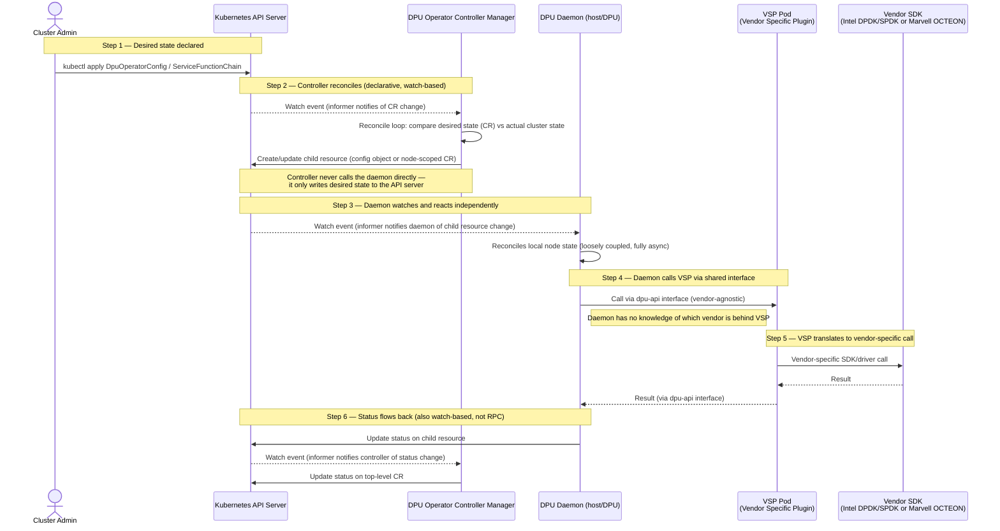
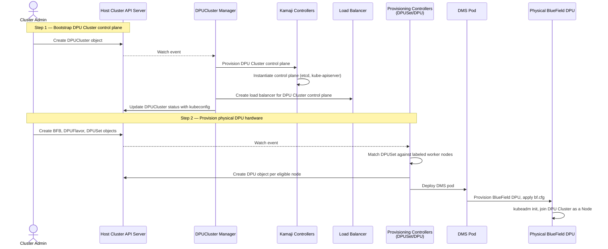
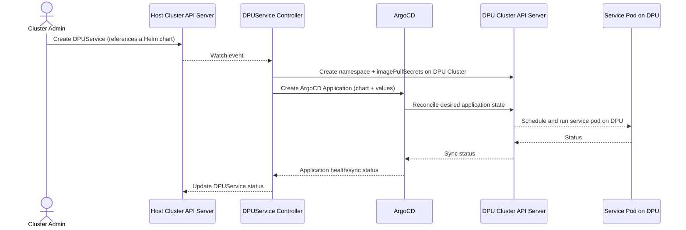
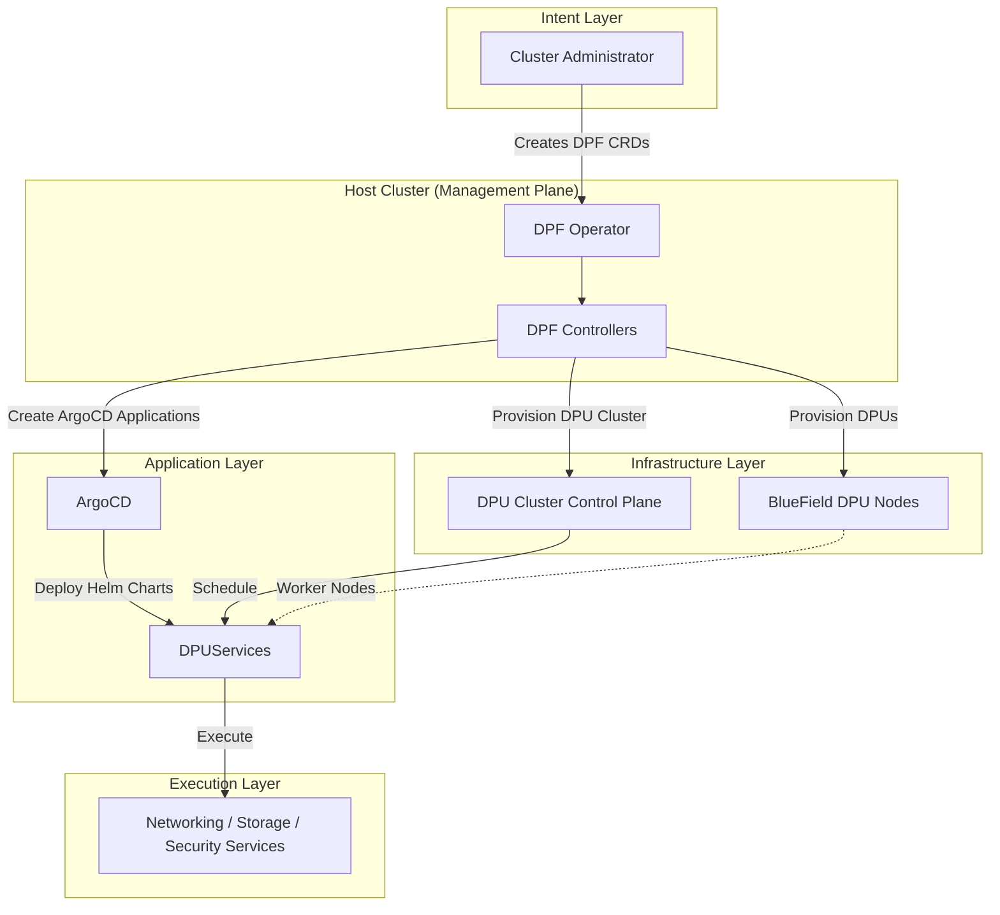

## Purpose

This document provides the verified architectural context, constraints, and design requirements used to guide the LLM during architecture generation. 
It intentionally separates factual analysis of the existing OPI and NVIDIA DPF architectures from the proposed solution, reducing the possibility of unsupported architectural assumptions or hallucinated components.

The final architecture proposed in `./architecture.md` should be traceable back to the requirements, constraints and verified components documented here.

## 1. Problem Context

The **Open Programmable Infrastructure (OPI)** project defines vendor neutral APIs and Kubernetes tooling for managing DPUs/IPUs, with the objective of providing a unified operational model in which a single Kubernetes operator and a common set of Kubernetes Custom Resource Definitions (CRDs) can manage hardware from multiple vendors. Today, the OPI DPU Operator achieves this objective for Intel & Marvell, both of which integrate through a lightweight Adapter Pattern implemented as a Vendor Specific Plugin (VSP) behind a shared controller, shared daemon and common CRD set.

**NVIDIA** follows a fundamentally different architectural approach through the DOCA Platform Framework (DPF), a Kubernetes native platform for provisioning and orchestrating BlueField DPUs. Rather than integrating as a VSP, DPF introduces its own CRDs, controllers and an independent DPU Cluster whose control plane is provisioned and managed separately (typically using Kamaji). Consequently, DPF maintains its own control plane, reconciliation model and operational lifecycle independent of the OPI ecosystem.

As a result, the operational model becomes fragmented. Organizations managing Intel or Marvell DPUs interact with a unified OPI API surface (for example, DpuOperatorConfig & ServiceFunctionChain), whereas NVIDIA deployments require a separate set of CRDs, controllers, deployment topology and operational workflows. Although both platforms ultimately solve the same problem managing DPU infrastructure they do so using fundamentally different architectural models. OPI abstracts vendor hardware behind a common interface whereas DPF manages the DPU as an independently orchestrated Kubernetes platform. Reconciling these two architectural models without compromising either system's design principles is the primary challenge addressed in this document.

The objective of this document is to define an integration architecture that enables NVIDIA DPU support within the OPI DPU Operator while preserving OPI's vendor neutral operational model. Rather than redesigning or replacing DPF, the proposed architecture should leverage DPF's existing capabilities wherever possible and integrate them into OPI in a manner consistent with Kubernetes operator principles and future extensibility.

## 2. Existing OPI Architecture

### 2.1 Description

The OPI DPU Operator integrates Intel and Marvell hardware using an
Adapter Pattern, implemented as a VSP. A
single, vendor agnostic operator and daemon expose one stable internal
interface and each hardware vendor ships a thin plugin that implements
that interface against its own SDK.

Architecturally, the OPI DPU Operator follows a layered design in which Kubernetes reconciliation, node level execution and vendor specific hardware programming are deliberately separated into independent components. The controller owns the desired state, the daemon owns node level execution  and the VSP owns hardware adaptation. This separation allows new hardware vendors to be supported by implementing only the DPU API interface without modifying the operator's reconciliation logic.

There is exactly one controller manager and one set of CRDs shared across
all vendors. Intel and Marvell do not have their own operators or their
own CRD groups.

### 2.2 Components

| Component | Role |
|---|---|
| **DPU Operator Controller Manager** | A control manager that makes decisions but never contacts the hardware directly. Responsible for watching Kubernetes CRDs, implementing the reconciliation loop, and communicating with the DPU Daemon via the Kubernetes API server. |
| **DPU Daemon** | The executor, it's runs directly on the machine. Responsible for receiving desired state from the controller (via watched resources), loading the vendor plugin, and monitoring DPU health. |
| **Vendor Specific Plugin (VSP)** | Where hardware specific code lives. Implements the common DPU API interface, translates generic API calls into vendor specific SDK calls and configures the hardware. |
| **Network Resource Injector** | An admission webhook that runs during Kubernetes object creation. Validates and modifies objects before they are stored and injects network configuration. |

**Insight:-** The OPI DPU Operator is fundamentally designed around the assumption that vendor implementations behave as synchronous hardware adapters rather than independent orchestration systems. This assumption enables the Adapter Pattern and becomes the key architectural premise evaluated in the following sections.

### 2.3 Request Flow

### 2.4 Step Explanation

1. **Declarative State Submission** :- the admin creates or updates a
   `DpuOperatorConfig` / `ServiceFunctionChain` CR through the Kubernetes
   API server. This is a declaration of intent, not a command.

2. **Control Plane Reconciliation** :- the
   `DPU Operator Controller Manager` does not call the daemon directly,
   Like standard Kubernetes operators, it runs a reconcile loop triggered
   by an informer watch event, compares desired state against current
   cluster state and if a change is needed, it creates or updates a
   child resource back in the API server. The controller's job ends there.

3. **Node-Level Reconciliation** :- the `DPU Daemon` runs its
   own informer watching that child resource. When it detects a change, it
   reconciles its own local node state on its own schedule. This makes the
   controller and daemon loosely coupled it neither blocks on the other.

4. **Hardware Adaptation** :- once the daemon
   determines local action is needed, it calls the VSP pod through the
   vendor agnostic DPU API interface. The daemon has no vendor specific
   logic or knowledge at all.

5. **Vendor Programming** — the VSP pod is the
   only component that knows which vendor it is running for, and
   translates the generic call into Intel or Marvell's native SDK/driver
   calls.

6. **Status Propagation** — The results propagate back up
   through the same watch based mechanism. The daemon writes status to the
   child resource, the controller's informer picks that up and the
   controller updates the top level CR's status. No direct call, it just
   state propagating through the API server.

### 2.5 Why This Structure Fits Intel & Marvell Programming Model

- **Intel** :- The offload is configured through DPDK/SPDK library calls and
  driver ioctls against the IPU. A function call either succeeds or fails
  immediately. So, there is no separate control loop watching for drift
  afterward.
- **Marvell**: The offload is configured through the OCTEON SDK against the
  DPU's onboard cores. The same shapes a direct, synchronous
  configuration call, not a reconciled resource.

Neither vendor's stack maintains its own desired state model, runs its own
reconcile loop or exposes its own Kubernetes API/CRDs. There is nothing on
the vendor side to reconcile against it's only a function to call and a
result to return. Given that, a lightweight Adapter is sufficient So, the VSP
pod's entire job is to translate one generic DPU API call into one
vendor specific SDK call, synchronously with no need to track asynchronous
state across two separate Kubernetes API servers.

### 2.6 Architectural Characteristics

The existing OPI architecture exhibits the following design characteristics :-

- **Single Control Plane** – Kubernetes remains the only source of truth for desired state.
- **Adapter Pattern** – Hardware specific SDKs are isolated behind the vendo neutral `dpu-api`.
- **Loose Coupling** – Components communicate through Kubernetes resources rather than direct RPC.
- **Separation of Concerns** – Control logic, node execution and hardware programming are isolated into separate components.
- **Extensibility** – Supporting a new synchronous SDK based vendor requires only a new Vendor Specific Plugin.
- **Vendor Agnosticism** – Core operator logic remains unchanged regardless of the underlying hardware implementation.

### 2.7 Note on Deployment Topology

The OPI DPU Operator additionally supports two deployment modes, a
single-cluster mode (host and DPU nodes in one cluster) and an optional
two-cluster mode (DPU nodes provisioned as workers of a separate
infrastructure cluster for stronger security isolation). This is a
deployment time choice orthogonal to the adapter pattern described above,
both modes use the identical controller/daemon/VSP architecture.

### 2.8 Sources

- Live pod listing confirming this shape (`DPU Daemon`, `VSP`, single
  controller-manager): https://github.com/openshift/dpu-operator
- `dpu-api` Go interface that VSPs implement: https://pkg.go.dev/github.com/openshift/dpu-operator/dpu-api
- Confirmed working end-to-end with real hardware (`oc get dpu` showing
  Intel and Marvell devices in one cluster): https://www.redhat.com/en/blog/unifying-multivendor-dpus-red-hat-openshift
- Official DPU Operator reference docs: https://docs.redhat.com/en/documentation/openshift_container_platform/4.20/html/networking_operators/dpu-operator-1
- Two-cluster deployment rationale: https://developers.redhat.com/articles/2022/04/26/orchestrate-offloaded-network-functions-dpus-red-hat-openshift

### Summary

The OPI architecture is fundamentally built around the assumption that vendor implementations are synchronous hardware adapters behind a shared control plane. This assumption enables a lightweight Adapter Pattern but also defines the architectural boundary against which alternative integration models must be evaluated.

## 3. Existing NVIDIA DPF Architecture

### 3.1 Description

Unlike Intel and Marvell, NVIDIA does not integrate as a plugin behind
OPI's vendor neutral API. Instead, NVIDIA built the DOCA Platform
Framework (DPF), It's a complete independent Kubernetes native platform for
provisioning and orchestrating BlueField DPUs.

Architecturally, DPF does not separate control logic from hardware
adaptation the way OPI's operator does. Instead, DPF introduces an
entire second Kubernetes control plane that the DPU Cluster is dedicated
to the DPU hardware. Provisioning, service orchestration, and networking
are each managed by their own dedicated controllers operating across two
API servers rather than one.

DPF operates across 2 logical Kubernetes clusters that run
concurrently at all times :-

- **Host Cluster** :- The management cluster. Provisions and manages DPUs,
  and hosts the DPU Cluster's control plane components.
- **DPU Cluster** :- A dedicated Kubernetes cluster whose control plane is
  hosted as pods within the Host Cluster (via Kamaji, a pod based
  control plane manager) or managed by a static cluster manager for
  existing clusters. BlueField DPUs join this cluster as worker nodes
  through `kubeadm` & `DPUServices` are deployed and managed within
  this cluster not the Host Cluster.

There is exactly one controller manager and one set of CRDs shared across
all vendors in OPI's model. DPF has no equivalent single controller shape. It's
responsibilities are distributed across many controllers because DPF
manages the lifecycle of an entire Kubernetes cluster, in addition to the
DPU hardware itself.

### 3.2 Components

| Component | Role |
|---|---|
| **DPF Operator (`DPFOperatorConfig` CR)** | Installs and configures the entire DPF system; the top level entry point. |
| **DPUCluster Manager** | Backed by Kamaji or a static cluster manager. Provisions the DPU Cluster's control plane as pods in the Host Cluster and produces a kubeconfig. |
| **Kamaji Controllers** | Create and manage the `TenantControlPlane` it's the actual etcd/API server pods backing the DPU Cluster. |
| **Provisioning Controllers (`DPUSet`, `DPU`, `BFB`, `DPUFlavor`)** | Manage the physical DPU lifecycle which hosts get a DPU provisioned, which OS image (BFB) is flashed, and DPU specific config. |
| **DOCA Management Service (DMS) pods** | Flash the BFB image onto the physical BlueField DPU hardware. |
| **DPUService Controller** | Manages services deployed onto the DPU Cluster by creating ArgoCD Applications pointing at Helm charts. |
| **ArgoCD** | Actually reconciles and installs the Helm chart workloads onto the DPU Cluster.It's a GitOps engine, not a native controller runtime reconcile loop. |
| **DPUServiceChain / DPUServiceInterface / DPUServiceIPAM** | Manage Service Function Chaining and networking config (VF representors, IPAM) between Host and DPU Cluster workloads. |
| **DPUServiceCredentialRequest** | Issues cross cluster secrets (kubeconfig/token) so a service in one cluster can talk to the other. |

**Insight:** Unlike the OPI DPU Operator, where the VSP
is a simple hardware adapter, DPF introduces an entire Kubernetes control
plane dedicated to the DPU. Consequently, many DPF components are
responsible for creating, operating and coordinating another Kubernetes
cluster, rather than merely translating hardware API calls. This makes DPF
significantly more powerful, but also introduces additional operational
complexity.

### 3.3 Request Flow

#### 3.3.1 DPU Infrastructure Bootstrap

#### 3.3.2 DPU Service Orchestration

### 3.4 Step Explanation

1. **Control Plane Bootstrap** :- Unlike OPI, which assumes an existing
   Kubernetes control plane is sufficient, DPF's first step creates an
   entirely new Kubernetes cluster dedicated to managing DPUs. The
   `DPUCluster Manager` delegates control plane provisioning to Kamaji,
   making the DPU Cluster an independently managed Kubernetes environment.

2. **Hardware Lifecycle Management** :- The provisioning controllers
   translate declarative resources (`DPUSet`, `BFB`, `DPUFlavor`) into the
   lifecycle of physical BlueField devices. Rather than remaining passive
   PCIe devices, provisioned DPUs boot their own operating system and join
   the DPU Cluster as genuine Kubernetes worker nodes.

3. **GitOps Based Service Deployment** :- This is the most important
   structural difference from the OPI adapter model. `DPUService` does not
   directly configure anything it creates an ArgoCD Application and
   ArgoCD is what actually reconciles and installs the workload onto the
   DPU Cluster. Two reconciliation systems are layered on top of each
   other are the DPF controllers, then ArgoCD.

4. **Cross Cluster State Synchronization** — It's because the Host Cluster and
   DPU Cluster maintain independent API servers, application status must
   be propagated across a genuine cluster boundary. Unlike OPI's
   single control plane model, DPF coordinates state across multiple,
   independently reconciling domains.

### 3.5 DPF Layered Architecture

The diagram highlights that DPF is not a single operator but a layered orchestration platform. Each layer owns a distinct responsibility and reconciles state independently, forming a hierarchy of control planes rather than a single reconciliation domain.

**Architectural Insight:** Unlike the OPI DPU Operator, which extends a
single Kubernetes control plane through a hardware adapter, DPF introduces
multiple orchestration layers which is a Host Cluster, a dedicated DPU Cluster,
GitOps based application deployment and hardware provisioning. This
layered architecture enables complete lifecycle management of the DPU as
an independent Kubernetes platform, at the cost of additional control plane
complexity and cross cluster state synchronization.

### 3.6 Why This Structure Differs from the OPI Adapter Model

The Adapter Pattern used by the OPI DPU Operator assumes the underlying
vendor implementation is a synchronous hardware programming interface. The
VSP simply translates generic `dpu-api` operations into vendor SDK calls,
while Kubernetes remains the only control plane responsible for
reconciliation.

DPF follows a fundamentally different architectural model :-

- DPF is itself a Kubernetes native control plane, not a hardware
  programming library. It manages BlueField DPUs through an independent
  DPU Cluster rather than direct SDK calls.
- Infrastructure and application lifecycle are managed declaratively
  through DPF specific CRDs (`DPUCluster`, `DPU`, `DPUService`,
  `DPUServiceChain`, etc.), each reconciled by dedicated controllers.
- State is coordinated across multiple reconciliation domains, it desired
  state originates in the Host Cluster, is propagated to the DPU Cluster,
  and application deployment is further reconciled by ArgoCD before
  workloads reach the DPUs.
- DPF is designed for controller level extensibility. The components such as
  the DPU Cluster Manager or Kamaji integration can be replaced outright,
  emphasizing extensible orchestration rather than pluggable hardware
  adapters.

| OPI Adapter Model | DPF Control Plane Model |
|---|---|
| SDK / Driver | Kubernetes Cluster |
| Function Call | Declarative Resource |
| Adapter (VSP) | Controllers + Operators |
| Synchronous Response | Asynchronous Reconciliation |
| Single Control Plane | Multiple Coordinated Control Planes |

Because of this architectural difference, a VSP style adapter is not
sufficient to represent DPF's behavior.It's a single interface cannot capture
operations whose completion depends on multiple controllers, cross cluster
synchronization and independent reconciliation loops.

### 3.7 Architectural Characteristics

The existing DPF architecture exhibits the following design
characteristics :-

- **Multiple Coordinated Control Planes** :– The Host Cluster and DPU
  Cluster are both authoritative sources of state for different parts of
  the system, it neither alone is the single source of truth.
- **Control Plane Pattern** :– DPU management is implemented as an
  independent Kubernetes control plane (the DPU Cluster), not as a
  translation layer behind a shared interface.
- **DPU as First Class Node** :– BlueField DPUs are treated as genuine     
  Kubernetes worker nodes, running their own kubelet and joining the
  DPU Cluster via `kubeadm`, rather than as passive PCIe devices
  configured from outside.
- **Cross Cluster Coupling** :– components communicate through Kubernetes
  resources, but across two separate API servers, with an additional
  GitOps layer (ArgoCD) mediating service deployment.
- **Distributed Responsibility** :– provisioning, cluster lifecycle, and
  service orchestration are each owned by separate, independently
  reconciling controllers rather than a small set of layered components.
- **Extensibility via Component Replacement** :– extending or customizing
  DPF means swapping out whole controllers (e.g. the DPUCluster manager
  or Kamaji dependency) not implementing one small interface.
- **Single Vendor Design** :– unlike OPI's vendor agnostic core, DPF's
  architecture is built specifically for NVIDIA BlueField hardware. It
  has no built in notion of pluggable vendor adapters.

### 3.8 Note on Deployment Topology

Unlike OPI's optional single cluster / two cluster choice,
DPF's two cluster topology is not optional. The DPU Cluster's
existence is a structural requirement, since `DPUServices` are only ever
scheduled and executed there. Both clusters run concurrently at all times. So,
there is no single cluster equivalent for DPF.

### 3.9 Sources

- DPF System Architecture (component descriptions, provisioning flows): https://github.com/NVIDIA/doca-platform/blob/release-v25.1/docs/architecture/system.md
- DPF Component Description (official docs, DPUService/ArgoCD flow, credential request flow): https://docs.nvidia.com/networking/display/dpf2504/component+description
- DPUCluster CRD reference (Kamaji vs. static cluster manager): https://docs.nvidia.com/networking/display/dpf2504/dpucluster
- Developing a Conformant DPF System (what integrators are expected to replace): https://docs.nvidia.com/networking/display/dpf2504/developing+a+conformant+dpf+system
- Red Hat: DPU-enabled networking with OpenShift and NVIDIA DPF (end-to-end walkthrough, DPUFlavor/BFB/DPUSet/DMS flow, OVN-Kubernetes offload via SFC): https://developers.redhat.com/articles/2025/03/20/dpu-enabled-networking-openshift-and-nvidia-dpf
- Why NVIDIA chose Kamaji (Host/DPU Cluster split rationale): https://clastix.io/post/why-nvidia-chose-kamaji-for-the-doca-platform/

### 3.10 Summary

DPF is fundamentally built around the assumption that DPU management
requires its own independent Kubernetes control plane, not a synchronous
hardware adapter behind a shared interface. This assumption enables
powerful, native lifecycle management of the DPU as a Kubernetes platform
in its own right, but is structurally incompatible with the Adapter/VSP
pattern that OPI uses for Intel and Marvell, defining the precise
architectural gap that Section 4 analyzes in detail.

## 4. Architectural Gap Analysis

### 4.1 Shared Premise

Both OPI and DPF are declarative, Kubernetes native systems which neither
relies on imperative scripts or out of band configuration and both use
Kubernetes as the interface through which desired state is expressed. The
divergence between them does not begin at how state is declared but at
where reconciliation happens and what desired state is authoritative
over the OPI reconciles hardware configuration behind a single control
plane, while DPF reconciles an entire second Kubernetes cluster in
addition to the hardware it manages.

### 4.2 Side by Side Comparison

| Dimension | OPI | DPF | Architectural Implication |
|---|---|---|---|
| **Control Plane Model** | Single Control Plane, Kubernetes is the only source of truth | Multiple Coordinated Control Planes which Host Cluster and DPU Cluster are each authoritative for different state | A design built around a single control plane must explicitly define how authority and reconciliation are coordinated across multiple control planes. |
| **Integration Pattern** | Adapter Pattern are vendor SDKs isolated behind `dpu-api` | Control Plane Pattern are DPU management is itself a Kubernetes control plane | DPF does not present the same integration boundary as a vendor SDK. |
| **Hardware Abstraction** | Hardware is a passive target configured via SDK calls | DPU as First Class Node are BlueField DPUs run their own kubelet and join the DPU Cluster as workers | There is no single configure the hardware call to adapt to the DPU is a cluster member |
| **Coupling Model** | Loose Coupling means components communicate via Kubernetes resources within one API server | Cross Cluster Coupling communication spans 2 API servers plus a GitOps layer (ArgoCD) | Any integration point must account for cross cluster, multi hop status propagation, not a single watch loop |
| **Component Responsibility** | Separation of Concerns are controller, daemon and VSP each own one narrow layer | Distributed Responsibility are provisioning, cluster lifecycle and service orchestration are each owned by independent controllers | DPF's responsibilities don't collapse into a single vendor plugin shape |
| **Extensibility Model** | New vendor = new VSP, assuming a synchronous SDK | Extensibility via Component Replacement are extending DPF means swapping whole controllers | The two systems extend along entirely different axes, OPI extends sideways (new plugin), DPF extends inward (replace a controller) |
| **Vendor Scope** | Vendor Agnosticism are core operator logic is unchanged regardless of hardware | Single Vendor Design are built specifically for NVIDIA BlueField, no built in adapter concept | DPF was never designed to be one of several interchangeable backends, OPI was |

### 4.3 Core Gap Statement

The OPI Adapter Pattern is effective because it assumes that a vendor
implementation behaves as a synchronous hardware adaptation layer. Under
this model, the VSP translates a generic
`dpu-api` operation into a vendor SDK or driver call, while Kubernetes
remains the single control plane responsible for reconciliation and
desired state management.

DPF does not conform to this architectural assumption. Rather than exposing
a hardware programming interface, DPF introduces an independent Kubernetes
control plane with its own CRDs, controllers, reconciliation loops and
worker nodes. Responsibility for provisioning, cluster lifecycle,
application deployment and networking is distributed across multiple,
independently reconciling components operating over two Kubernetes API
servers.

Consequently, the architectural integration boundary changes fundamentally.
Treating DPF as though it were a traditional VSP would
extend the VSP beyond its intended responsibility from adapting synchronous
hardware operations to coordinating state across multiple reconciliation
domains. This introduces concerns that the existing Adapter Pattern was
never designed to own, including cross cluster state propagation,
controller coordination and lifecycle synchronization.

Therefore, the primary challenge is not simply integrating another hardware
vendor. It is integrating a second Kubernetes native control plane while
preserving the architectural principles of both systems. Any viable
integration architecture must respect OPI's ownership of the vendor neutral
API surface while allowing DPF to remain authoritative for NVIDIA specific
provisioning and lifecycle management. Doing so also aligns with the design
objective established which is to maximizing reuse of DPF's existing
controllers and provisioning capabilities rather than duplicating or
replacing them.

### 4.4 Where the Adapter Pattern's Own Trade offs Foreshadowed This

The trade-off analysis of the Intel/Marvell adapter pattern already
signals this limitation directly, rather than it being an unforeseen
failure:

| Dimension | Advantage for Intel/Marvell | Where It Breaks for DPF |
|---|---|---|
| **Simplicity** | Single controller, common CRDs, one operational model | DPF already has its own controllers and CRDs are forcing them under one shared CRD set would require reimplementing or discarding them |
| **Extensibility** | New vendor = new VSP implementing one interface | DPF cannot be reduced to one interface implementation without losing its own control plane behavior |
| **Fault Isolation** | Vendor failures isolated within the VSP process | DPF's failure modes are cluster level (control-plane unavailability, cross cluster network partition) is a process boundary doesn't isolate this |
| **Execution Model** | Well suited to synchronous, SDK based programming | **Explicitly unsuited** to hardware requiring asynchronous workflows or independent control planes, which is exactly DPF's model |

The Execution Model row is the direct, previously identified signal
that this architecture would not extend to a vendor like NVIDIA without
modification.

### 4.5 Derived Architectural Requirements

This gap analysis does not yet select an integration pattern. It
establishes the requirements any viable pattern must satisfy :-

- It must accommodate asynchronous, multi hop reconciliation, not a
  single synchronous call.
- It must operate across multiple, independently reconciling control plane domains, not assume a single Kubernetes control plane
- It must preserve DPF's ownership of its CRDs, controllers, and lifecycle management responsibilities rather than
  replacing them with OPI native equivalents.
- It must still expose a single, vendor neutral CR surface to the end
  user, consistent with OPI's core design goal.
- It must remain extensible to future vendors whose hardware may
  similarly be governed by an independent control plane rather than an
  SDK (e.g., AMD, if its architecture follows a DPF like model).

### 4.6 Summary

Both OPI and DPF are legitimate, well-formed Kubernetes native
architectures which is the gap between them is not a defect in either system, but
a structural mismatch between an aadapter built around synchronous hardware adaptation and a control plane pattern built for asynchronous, multi cluster
orchestration. Resolving this mismatch without discarding either system's
design principles is the central design problem this document addresses.

## 5. Design Goals

### 5.1 Purpose

The goal in this section define what a successful integration
architecture must achieve, derived directly from the requirements
established. They describe desired outcomes, not
implementation choices. Section 6 (Architectural Constraints) defines
what the architecture must not do or cannot change. Section 7
(Non-Functional Requirements) defines the quality bar it must meet.
Section 8 (Architectural Assumptions) states what may be taken as given
rather than re derived. Keeping these four categories separate allows
each design decision made later in this document to be traced to exactly
one justification, rather than to an ambiguous mixture of goal,
constraint and assumption.

### 5.2 Primary Design Goals

DG-1 :- Support asynchronous, multi hop reconciliation across independent
controllers, rather than a single synchronous call.
Success looks like :- the design can represent an operation whose
completion is confirmed only after multiple controllers reconcile
asynchronously, without requiring the calling interface to block or
poll synchronously for a result.

DG-2 :- Support coordination across multiple, independently reconciling
control plane domains, rather than assuming a single Kubernetes API
server as the sole source of truth.
Success looks like :- the design defines an explicit mechanism for
propagating state across more than one independently reconciling
control plane domain (for example, watched resources or a status
aggregation step), without assuming a single shared API server.

DG-3 :- Preserve DPF's ownership of its own CRDs, controllers and
lifecycle management responsibilities. The architecture must reuse DPF's
existing capabilities rather than reimplementing or replacing them.
Success looks like :- no new controller introduced by this design
duplicates functionality already present in DPF's provisioning or
DPUService controllers. All NVIDIA specific state changes are effected
by creating or updating DPF's own custom resources, not by
reimplementing equivalent logic.

DG-4 :- Expose a single, vendor neutral Custom Resource surface to OPI end
users, regardless of which vendor's hardware is being managed.
Success looks like :- an OPI user managing Intel, Marvell, or NVIDIA
hardware issues the same top level CRD, with no vendor specific CRD
required at the point of use.

DG-5 :- Remain extensible to future vendors that expose independent
control plane architectures.
Success looks like :- adding support for a new vendor whose hardware is
governed by an independent control plane requires only defining a new
integration mechanism, without modifying OPI's core CRD
schema or reconciliation model.

### 5.3 Goal Prioritization

Not every goal carries equal weight when trade-offs arise between
candidate integration models. The following tiering is a
design decision made for this proposal, not a fact derived. A different, equally defensible tiering could be chosen it is the
tiering below reflects the priority this document places on preserving
DPF's control plane ownership and OPI's vendor neutral identity over the
mechanical details of how reconciliation is coordinated.

Mandatory, disqualifying if unmet:
- DG-3 (preserve DPF's ownership of its own control plane)
- DG-4 (single vendor neutral CR surface)

Preferred, strongly desired but not automatically disqualifying on
partial fulfillment :-
- DG-1 (asynchronous, multi hop reconciliation)
- DG-2 (coordination across multiple control plane domains)

Desirable, used as a tie breaker between otherwise comparable candidates:
- DG-5 (extensibility to future independent control plane vendors)

### 5.4 Traceability Summary

| Goal ID | Source (Section 4.5) | Priority | Evaluated in |
|---|---|---|---|
| DG-1 | Requirement 1 | Preferred | Section 10 |
| DG-2 | Requirement 2 | Preferred | Section 10 |
| DG-3 | Requirement 3 | Mandatory | Section 10 |
| DG-4 | Requirement 4 | Mandatory | Section 10 |
| DG-5 | Requirement 5 | Desirable | Section 10 |

This table allows Section 10's evaluation of each candidate integration
model to state explicitly which goals are satisfied, partially satisfied,
or unmet, rather than asserting a recommendation without a visible basis.

## 6. Architectural Constraints

### 6.1 Purpose

This section defines the boundaries within which the design goals in
Section 5 must be achieved. A constraint differs from a goal: a goal
describes a desired outcome the architecture should work toward, while a
constraint describes a hard boundary that may not be violated regardless
of how well it would serve a goal. Section 6.2 states these hard
boundaries directly. Section 6.3 states the reverse :- explicit non goals,
things this document deliberately does not attempt to solve, so that
scope creep into DPF's or OPI's internals is ruled out early rather than
discovered midway through the design.

### 6.2 Constraints

AC-1 :- Preserve Ownership Boundaries
Constraint: OPI retains ownership of the vendor neutral Custom Resource
surface and reconciliation entry point. DPF retains ownership of
NVIDIA specific provisioning, cluster lifecycle and service
orchestration logic. Neither system's control plane may be collapsed
into or subsumed by the other.
Reason :- This ownership boundary is the resolution to the core
architectural gap identified in Section 4.3.
Rules out :- designs where OPI reimplements DPF provisioning logic
directly, and designs where the integration layer bypasses OPI to
configure DPF CRDs directly at the point of use.

AC-2 :- No Modification to DPF Internals
Constraint :- Must not modify or fork DPF's own codebase, CRDs or
controllers.
Reason :- Traces to Section 1's objective of maximizing reuse of DPF's
existing capabilities without duplicating or replacing them.
Rules out :- patching DPF's controller manager, extending its CRD schemas
or maintaining a fork of the DOCA Platform Framework repository.

AC-3 :- Preserve Compatibility with the Existing Adapter Model
Constraint :- The proposed architecture shall preserve compatibility with
the existing Intel/Marvell adapter model and existing VSP
implementations.
Reason :- Intel and Marvell support is already functioning and validated in
Section 2. Redesigning the shared interface risks regressing
existing, working vendor support.
Rules out :- altering the dpu api interface itself to accommodate NVIDIA.

AC-4 :- Standard Kubernetes Operator Conventions
Constraint :- Any new component must follow the same Kubernetes operator
conventions already established in OPI (declarative reconciliation,
status/Conditions pattern, owner references) rather than introducing a
new paradigm.
Reason :- Consistency with existing OPI conventions keeps the system
auditable and maintainable using the same engineering practices already
in place.
Rules out :- out of band polling, imperative scripts, or non standard
status representations.

AC-5 :- Integrate Only Through Supported Extension Points
Constraint :- The design must integrate with DPF exclusively through
documented public APIs, CRDs, and supported integration mechanisms, not
through undocumented or internal behavior.
Reason :- Relying on undocumented internals would make the integration
brittle to DPF's own internal refactors, which are outside this
project's control.
Rules out :- designs that depend on DPF internal implementation details not
exposed as part of its public CRD/API surface.

AC-6 :- Authoritative State Ownership
Constraint :- Each system remains authoritative for the resources it owns.
The integration layer may synchronize or translate state but must not
introduce duplicate authoritative representations.
Reason :- A second, independently authoritative copy of DPF managed state
inside OPI would create drift and ambiguity about which representation
is correct, undermining the ownership boundary established in AC 1.
Rules out :- maintaining parallel authoritative copies of DPF managed
resources inside OPI.

### 6.3 Non-Goals

NG-1 :- DPF Internal Provisioning Redesign
Excluded :- redesigning or optimizing DPF's internal provisioning logic
(BFB flashing, Kamaji configuration, etc.).
Reason :- outside the scope of an integration architecture; already
functioning DPF behavior.

NG-2 :- DPU Cluster Manager Alternatives
Excluded :- proposing changes to Kamaji or an alternative DPU Cluster
manager implementation.
Reason :- orthogonal to the integration problem, DPF already supports
swapping this component independently .

NG-3 :- Full AMD Specific Design
Excluded :- defining a complete AMD specific integration.
Reason :- this document only establishes that the architecture generalizes
to a DPF like vendor, a full AMD design is a separate exercise.

NG-4 :- Multi Tenancy and Cost Allocation
Excluded :- multi tenancy, billing, or cost allocation concerns across
shared DPU infrastructure.
Reason :- outside the architectural scope.

### 6.4 Traceability Summary

| ID | Type | Traces to | Rules out / Excludes |
|---|---|---|---|
| AC-1 | Constraint | Section 4.3 | Collapsing OPI/DPF ownership boundaries |
| AC-2 | Constraint | Section 1 | Modifying DPF's codebase/CRDs |
| AC-3 | Constraint | Section 2 | Modifying dpu-api / existing VSPs |
| AC-4 | Constraint | Section 2.6 | Non-standard reconciliation patterns |
| AC-5 | Constraint | Section 3.6 | Reliance on undocumented DPF internals |
| AC-6 | Constraint | Section 4.3 | Duplicate authoritative state copies |
| NG-1 | Non-Goal | Section 3 | DPF provisioning internals |
| NG-2 | Non-Goal | Section 3.6 | Kamaji / cluster manager alternatives |
| NG-3 | Non-Goal | DG-5 | Full AMD design |
| NG-4 | Non-Goal | Section 1 | Multi tenancy / billing |

This table lets Section 10 cite a specific constraint or non-goal when
disqualifying a candidate model, the same way it cites Section 5.4 for
goals.

## 7. Non-Functional Requirements

### 7.1 Purpose

While Section 5 defines what the architecture must achieve and Section 6
defines what it must not do, this section defines the quality bar the
architecture must meet while doing so. Non functional requirements (NFRs)
govern properties such as reliability, security, and maintainability that
cut across every candidate integration model evaluated in Section 10,
rather than being tied to any single design goal. This section also
absorbs security and failure-mode considerations, since this document's
finalized structure does not include separate sections for them.

### 7.2 Non-Functional Requirements

NFR-1: Resilience to Cross Cluster Unavailability
Requirement: The architecture must degrade gracefully if the DPU Cluster's
API server is temporarily unreachable from the Host Cluster, without
causing the integration component or OPI's core reconciliation loop to
crash or enter an unrecoverable state.
Traces to: Section 3 (DPU Cluster as a genuine, independently available
control plane), Section 4.5 (multiple reconciliation domains).
Evaluated by: whether the design specifies retry/backoff behavior and a
defined status representation for DPF side state unknown, rather than
assuming constant connectivity.

NFR-2: Status Freshness
Requirement: Status propagated to OPI shall be explicitly identified as
eventually consistent, and the architecture shall provide a mechanism for
indicating freshness or synchronization state.
Traces to: Section 3.4, step 4 (Cross Cluster State Synchronization).
Evaluated by: whether the design specifies some concrete way to indicate
freshness or synchronization state (for example, a timestamp, generation
number or explicit sync-status field, the specific mechanism is not
prescribed here) rather than presenting status as instantaneous or
omitting a freshness indicator entirely.

NFR-3: Least Privilege Cross Cluster Access
Requirement: Cross cluster authentication shall follow the principle of
least privilege and rely only on supported DPF credential management
mechanisms.
Traces to: Section 6, AC-5 (integrate only through documented public
APIs, CRDs, and supported integration mechanisms); the general principle
of least privilege credential management rather than a specific DPF
feature.
Evaluated by: whether the design's cross cluster credential handling
relies on a supported, documented DPF credential issuance mechanism (such
as DPUServiceCredentialRequest, cited here only as an existing example)
rather than a broad or statically provisioned cross cluster credential.

NFR-4: Partial Failure Observability
Requirement: When a DPU is successfully provisioned but a dependent
DPUService fails, or vice versa, this partial state must be visible on
the OPI facing CR's status, not silently absorbed or reported as a
uniform success or failure.
Traces to: Section 4.3 (distributed responsibility across independently
reconciling components).
Evaluated by: whether the design's status/Conditions model can represent
partial success, not only a binary ready/not ready state.

NFR-5: Compatibility Across DPF Versions
Requirement: The architecture must tolerate incremental changes to DPF's
CRD schemas across releases without requiring a redesign for every DPF
version upgrade.
Traces to: Section 6, AC-5 (integration only through documented public
APIs/CRDs), Section 8 (Architectural Assumptions, where specific DPF
version dependencies are to be enumerated and bounded).
Evaluated by: whether DPF version specific dependencies are isolated and
minimized.

NFR-6: Conceptual Consistency
Requirement: The integration architecture shall remain consistent with
existing OPI reconciliation patterns and Kubernetes operator conventions,
minimizing the introduction of new architectural concepts.
Traces to: Section 6, AC-4 (standard Kubernetes operator conventions).
Evaluated by: whether the design's reconciliation pattern, status
conventions, and naming remain recognizable extensions of Section 2's
existing patterns.

NFR-7: Automatic Recovery
Requirement: The integration shall recover automatically from transient
communication failures without requiring manual intervention or
reconciliation restarts.
Traces to: Section 4.5 (asynchronous, multi-hop reconciliation, DG-1);
standard Kubernetes level triggered reconciliation convention.
Evaluated by: whether the design relies on automatic re reconciliation
(watch-triggered retry, periodic resync) rather than requiring an
operator to manually trigger recovery after a failure. Distinguished from
NFR-1: NFR-1 requires the system to not fail while the DPU Cluster is
unreachable; NFR-7 requires it to self heal once connectivity is
restored.

NFR-8: Idempotency
Requirement: Repeated reconcile events shall not produce inconsistent
state.
Traces to: standard Kubernetes reconciliation principle (level triggered,
idempotent reconcile), consistent with the reconciliation model
established in Section 2.
Evaluated by: whether repeated reconcile calls, whether triggered by
resync periods or duplicate watch events, converge to the same end state
without accumulating side effects.

### 7.3 Traceability Summary

| NFR ID | Category | Traces to | Evaluated in |
|---|---|---|---|
| NFR-1 | Reliability | Section 3, Section 4.5 | Section 10 |
| NFR-2 | Observability | Section 3.4 | Section 10 |
| NFR-3 | Security | AC-5 | Section 10 |
| NFR-4 | Observability | Section 4.3 | Section 10 |
| NFR-5 | Maintainability / Compatibility | AC-5, Section 8 | Section 10 |
| NFR-6 | Maintainability | AC-4 | Section 10 |
| NFR-7 | Reliability | Section 4.5 (DG-1) | Section 10 |
| NFR-8 | Correctness | Section 2 (reconciliation model) | Section 10 |

## 8. Architectural Assumptions

### 8.1 Purpose

Sections 5-7 define what the architecture must achieve (Goals), what it
must not do (Constraints/Non-Goals), and how well it must perform
(NFRs). This section states what the architecture is permitted to take
as given, without re deriving or re justifying it. Assumptions differ
from constraints :- a constraint is a boundary the design must actively
respect, an assumption is a precondition about the environment or
upstream system that, if false, would require revisiting this design
rather than being something this design itself must defend against.

Where an assumption bounds a requirement raised earlier in this document,
that link is stated explicitly so the assumption is traceable rather than
free floating.

### 8.2 Assumptions

AA-1: Targeted DPF Release
Assumption: This architecture is designed against the documented public
CRDs and APIs of a specific DPF release (identified in Section 9). It
assumes compatibility with the documented public interfaces of that
release and does not assume forward compatibility with future DPF
releases.
Bounds: AC-5, NFR-5.
If false: The integration layer would require redesign to accommodate
breaking upstream API changes.

AA-2: Eventual Reconciliation
Assumption: The reconciliation latency between the Host Cluster and DPU
Cluster is assumed to remain finite under normal operating conditions.
This is a claim about eventually consistent reconciliation completing in
finite time, not a claim that the network is failure free.
Bounds: NFR-1, NFR-2.
If false: NFR-1 becomes impossible to satisfy, and status reported to the
user could remain stale indefinitely rather than eventually converging.

AA-3: DPF Is Pre Installed and Operational
Assumption: DPF (the DPF Operator, DPUCluster, and either Kamaji or a
static cluster manager) is already installed and functioning before the
integration component is deployed.
Bounds: AC-2, NG-1.
If false: Bootstrapping DPF itself would become in-scope for this design,
which AC-2/NG-1 currently exclude.

AA-4: Sufficient RBAC at Install Time
Assumption: The person or process installing the integration component
already holds sufficient privileges on both the Host Cluster and DPU
Cluster to grant the integration component's own RBAC roles.
Bounds: NFR-3.
If false: A privilege escalation or admin onboarding flow would need to
be added to the design.

AA-5: Single DPF Instance per Host Cluster
Assumption: One DPF installation manages DPUs within a given Host
Cluster, multi DPF or federated DPF topologies are not assumed.
Bounds: DG-5
If false: Multi DPF or federated DPF support would need to be evaluated
as a new design goal, not just an implementation detail.

AA-6: OPI CRDs remain the authoritative user facing interface.
Assumption: `DpuOperatorConfig` and `ServiceFunctionChain` (or their
direct successors) remain OPI's primary user-facing CRDs and are not
independently redesigned concurrently with this work.
Bounds: DG-4, AC-3.
If false: The integration design would need to be re aligned with a new
OPI CRD shape before it could be considered complete.

### 8.3 Traceability Summary

| ID | Assumption Topic | Bounds | If False |
|---|---|---|---|
| AA-1 | Targeted DPF Release | AC-5, NFR-5 | Redesign the integration to accommodate breaking upstream API changes |
| AA-2 | Eventual Reconciliation | NFR-1, NFR-2 | Status may never converge; revisit degraded mode assumptions |
| AA-3 | DPF Is Pre Installed and Operational | AC-2, NG-1 | Bootstrapping DPF becomes in scope |
| AA-4 | Sufficient RBAC at Install Time | NFR-3 | Add a privilege-establishment or onboarding flow |
| AA-5 | Single DPF Instance per Host Cluster | Current deployment scope | Re evaluate multi DPF or federated deployments as a design goal |
| AA-6 | OPI CRDs Remain the Authoritative User Facing Interface | DG-4, AC-3 | Re-align the integration architecture with the updated OPI CRD model |

This table closes the traceability chain started in Section 5: every Goal, Constraint, and NFR in this document now either (a) is evaluated directly in Section 10, or (b) has its dependency on an external precondition explicitly named here, so nothing in the final recommendation rests on an unstated assumption.

## 9. Verified Components & CRDs

### 9.1 Purpose

Sections 2 and 3 described how OPI's and DPF's components behave. This
section consolidates the exact, citable names of every component, CRD,
and interface referenced elsewhere in this document into a single
authoritative reference, together with the verified relationships
between them. Section 10 (Candidate Integration Models) must reference
only names, layers, and relationships that appear here. Any component
introduced later that does not already appear in this section must be
explicitly marked as new, proposed by this design, never presented as if
it already existed in OPI or DPF.

Relationships are included alongside names because a name alone does not
constrain how a component behaves. Section 9.5 separates these
relationships by abstraction level, since a declarative control-plane
relationship (a controller watching a CRD) and a runtime relationship (a
pod flashing physical hardware) describe different kinds of facts and
should not be conflated in a single list.

### 9.2 Verified Software Baseline

This document targets a single, explicitly stated DPF release rather
than blending sources across releases. Where a detail could only be
confirmed against a different documentation page than the primary
architecture source, that gap is stated plainly rather than presented as
uniform.

OPI DPU Operator: verified against the openshift/dpu-operator repository
and the OpenShift Container Platform 4.20 Networking Operators
documentation. The upstream opiproject/dpu-operator repository is a
rolling, community-maintained project without discrete semantic version
tags in the same sense as DPF, so verification here is anchored to the
dated OpenShift 4.20 documentation rather than a pinned upstream commit.

DPF (DOCA Platform Framework): this document targets release-v25.1,
using the release-v25.1 architecture documentation
(github.com/NVIDIA/doca-platform, docs/architecture/system.md) as the
primary source for CRD names, component names, and structure, since that
document explicitly names the CRDs and controllers listed in Section
9.4. Individual CRD field-level pages referenced below (component
description, DPUCluster reference) were sourced from the docs.nvidia.com
v25.04 documentation set, since a directly equivalent v25.1-tagged page
was not independently confirmed during this research. This gap is noted
rather than resolved, in keeping with AC-5 and NFR-5: field-level details
should be reconfirmed against the exact DPF release actually deployed
before implementation, and this document does not assume v25.1 and
v25.04 are identical at the field level.

This resolves AA-1 (Section 8): the targeted DPF release is release-v25.1,
as stated above, with the sourcing caveat noted for CRD field-level
detail.

### 9.3 OPI Components

| Name | Type | Layer | Role | Source |
|---|---|---|---|---|
| `DpuOperatorConfig` | CRD | API Surface | Top-level user-facing configuration resource | https://docs.redhat.com/en/documentation/openshift_container_platform/4.20/html/networking_operators/dpu-operator-1 |
| `ServiceFunctionChain` | CRD | API Surface | User-facing resource describing a network service chain | https://docs.redhat.com/en/documentation/openshift_container_platform/4.20/html/networking_operators/dpu-operator-1 |
| `dpu-api` | Go interface | Integration | Vendor-neutral interface implemented by all VSPs | https://pkg.go.dev/github.com/openshift/dpu-operator/dpu-api |
| DPU Operator Controller Manager | Controller | Controller | Watches CRDs, reconciles desired state, creates child resources | https://github.com/openshift/dpu-operator |
| DPU Daemon | Component | Daemon | Watches node-scoped reconciliation resource, calls VSP, monitors DPU health | https://github.com/openshift/dpu-operator |
| VSP (Vendor Specific Plugin) | Component | Integration | Translates `dpu-api` calls into vendor SDK/driver calls | https://github.com/openshift/dpu-operator |
| Network Resource Injector | Admission webhook | Networking | Validates and mutates objects at admission time, injects network config | https://www.redhat.com/en/blog/unifying-multivendor-dpus-red-hat-openshift |

### 9.4 DPF Components

| Name | Type | Layer | Role | Source |
|---|---|---|---|---|
| `DPFOperatorConfig` | CRD | API Surface | Installs and configures the DPF system | https://github.com/NVIDIA/doca-platform/blob/release-v25.1/docs/architecture/system.md |
| `DPUCluster` | CRD | Provisioning | Describes and provisions the DPU Cluster control plane | https://docs.nvidia.com/networking/display/dpf2504/dpucluster |
| `DPUSet` | CRD | Provisioning | Selects which hosts receive a provisioned DPU | https://github.com/NVIDIA/doca-platform/blob/release-v25.1/docs/architecture/system.md |
| `DPU` | CRD | Provisioning | Represents a single physical BlueField DPU's lifecycle | https://github.com/NVIDIA/doca-platform/blob/release-v25.1/docs/architecture/system.md |
| `BFB` | CRD | Provisioning | Points to the OS image flashed onto a DPU | https://github.com/NVIDIA/doca-platform/blob/release-v25.1/docs/architecture/system.md |
| `DPUFlavor` | CRD | Provisioning | Supplies DPU-specific configuration values | https://github.com/NVIDIA/doca-platform/blob/release-v25.1/docs/architecture/system.md |
| `DPUService` | CRD | Service Management | Declares a Helm chart to deploy onto the DPU Cluster | https://docs.nvidia.com/networking/display/dpf2504/component+description |
| `DPUServiceChain` | CRD | Networking | Manages Service Function Chaining across DPU services | https://docs.nvidia.com/networking/display/dpf2504/component+description |
| `DPUServiceInterface` | CRD | Networking | Defines network interfaces used by DPU services | https://docs.nvidia.com/networking/display/dpf2504/component+description |
| `DPUServiceIPAM` | CRD | Networking | Manages IP address allocation for DPU services | https://docs.nvidia.com/networking/display/dpf2504/component+description |
| `DPUServiceCredentialRequest` | CRD | Credential | Issues cross-cluster secrets for Host to DPU Cluster communication | https://docs.nvidia.com/networking/display/dpf2504/component+description |
| DPUCluster Manager | Controller | Provisioning | Provisions the DPU Cluster control plane and produces kubeconfig | https://github.com/NVIDIA/doca-platform/blob/release-v25.1/docs/architecture/system.md |
| DPUSet Controller | Controller | Provisioning | Watches `DPUSet` resources and creates `DPU` resources for eligible nodes | https://docs.nvidia.com/networking/display/dpf2504/component+description |
| DPU Controller | Controller | Provisioning | Manages the lifecycle of individual `DPU` resources and provisioning operations | https://docs.nvidia.com/networking/display/dpf2504/component+description |
| Kamaji Controllers | Controller, external dependency | Provisioning | Creates and manages the TenantControlPlane backing the DPU Cluster | https://clastix.io/post/why-nvidia-chose-kamaji-for-the-doca-platform/ |
| DPUService Controller | Controller | Service Management | Creates ArgoCD Applications for `DPUService` resources | https://docs.nvidia.com/networking/display/dpf2504/component+description |
| ArgoCD | GitOps engine, external dependency | GitOps | Reconciles and installs Helm chart workloads onto the DPU Cluster | https://developers.redhat.com/articles/2025/03/20/dpu-enabled-networking-openshift-and-nvidia-dpf |
| DOCA Management Service (DMS) | Pod / Agent | Provisioning | Flashes the BFB image onto the physical BlueField DPU | https://developers.redhat.com/articles/2025/03/20/dpu-enabled-networking-openshift-and-nvidia-dpf |

### 9.5 Verified Architectural Relationships

#### 9.5.1 OPI, Control-Plane Relationships

| Source | Relationship | Target |
|---|---|---|
| Cluster Admin | creates | `DpuOperatorConfig` or `ServiceFunctionChain` |
| DPU Operator Controller Manager | watches | `DpuOperatorConfig` or `ServiceFunctionChain` |
| DPU Operator Controller Manager | creates or updates | node-scoped reconciliation resource |
| DPU Daemon | watches | node-scoped reconciliation resource |
| DPU Daemon | updates status on | node-scoped reconciliation resource |
| DPU Operator Controller Manager | watches status of | node-scoped reconciliation resource |
| DPU Operator Controller Manager | updates status on | top-level CR |
| Network Resource Injector | validates and mutates | Kubernetes objects, at admission time |

#### 9.5.2 OPI, Runtime Relationships

| Source | Relationship | Target |
|---|---|---|
| DPU Daemon | calls, via `dpu-api` | VSP |
| VSP | calls | vendor SDK, Intel DPDK/SPDK or Marvell OCTEON |

#### 9.5.3 DPF, Control-Plane Relationships

| Source | Relationship | Target | Verified By |
|---|---|---|---|
| Cluster Admin | creates | `DPUCluster` | https://github.com/NVIDIA/doca-platform/blob/release-v25.1/docs/architecture/system.md |
| DPUCluster Manager | watches | `DPUCluster` | https://github.com/NVIDIA/doca-platform/blob/release-v25.1/docs/architecture/system.md |
| DPUCluster Manager | updates status, with kubeconfig, on | `DPUCluster` | https://github.com/NVIDIA/doca-platform/blob/release-v25.1/docs/architecture/system.md |
| Cluster Admin | creates | `BFB`, `DPUFlavor`, `DPUSet` | https://developers.redhat.com/articles/2025/03/20/dpu-enabled-networking-openshift-and-nvidia-dpf |
| DPUSet Controller | watches | `DPUSet` | https://docs.nvidia.com/networking/display/dpf2504/component+description |
| DPUSet Controller | creates, per eligible node | `DPU` | https://developers.redhat.com/articles/2025/03/20/dpu-enabled-networking-openshift-and-nvidia-dpf |
| Cluster Admin | creates | `DPUService` | https://docs.nvidia.com/networking/display/dpf2504/component+description |
| DPUService Controller | watches | `DPUService` | https://docs.nvidia.com/networking/display/dpf2504/component+description |
| DPUService Controller | creates | namespace and imagePullSecrets, on DPU Cluster | https://docs.nvidia.com/networking/display/dpf2504/component+description |
| DPUService Controller | creates | ArgoCD Application | https://docs.nvidia.com/networking/display/dpf2504/component+description |
| DPUService Controller | updates status on | `DPUService` | https://docs.nvidia.com/networking/display/dpf2504/component+description |

#### 9.5.4 DPF, Runtime Relationships

| Source | Relationship | Target | Verified By |
|---|---|---|---|
| DPUCluster Manager | delegates to | Kamaji Controllers | https://github.com/NVIDIA/doca-platform/blob/release-v25.1/docs/architecture/system.md |
| Kamaji Controllers | creates | TenantControlPlane | https://clastix.io/post/why-nvidia-chose-kamaji-for-the-doca-platform/ |
| DPUCluster Manager | creates | Load Balancer | https://github.com/NVIDIA/doca-platform/blob/release-v25.1/docs/architecture/system.md |
| DPU Controller | deploys | DMS pod | https://developers.redhat.com/articles/2025/03/20/dpu-enabled-networking-openshift-and-nvidia-dpf |
| DMS pod | flashes | Physical BlueField DPU | https://developers.redhat.com/articles/2025/03/20/dpu-enabled-networking-openshift-and-nvidia-dpf |
| Physical DPU | joins, via kubeadm | DPU Cluster, as a Kubernetes Node | https://docs.nvidia.com/networking/display/dpf2504/component+description |
| ArgoCD | reconciles and deploys | Helm chart, onto DPU Cluster | https://developers.redhat.com/articles/2025/03/20/dpu-enabled-networking-openshift-and-nvidia-dpf |
| DPU Cluster API Server | schedules | Service Pod | https://developers.redhat.com/articles/2025/03/20/dpu-enabled-networking-openshift-and-nvidia-dpf |
| Service Pod | reports status to | DPU Cluster API Server | https://developers.redhat.com/articles/2025/03/20/dpu-enabled-networking-openshift-and-nvidia-dpf |
| ArgoCD | reports synchronization status to | DPUService Controller | https://docs.nvidia.com/networking/display/dpf2504/component+description |

### 9.6 Explicitly Out of Scope or Unverified

This document does not claim to have verified:
- Internal or undocumented DPF behavior not covered by the sources above
- DPF CRD field-level detail beyond what is stated in Section 9.2, since
  the field-level sources used were drawn from v25.04 documentation
  rather than a confirmed v25.1-identical source
- The precise underlying Kubernetes object type of the node-scoped
  reconciliation resource referenced in Section 9.5.1, since this detail
  was not independently confirmed in public documentation and would
  require inspection of the operator's source code to state exactly
- Any component name, layer, or relationship not appearing in Sections
  9.3, 9.4, or 9.5

## 10. Candidate Integration Models

### 10.1 Purpose

This section evaluates integration patterns against the goals (Section
5), constraints and non-goals (Section 6), and non-functional
requirements (Section 7) already established, using only the verified
components and relationships from Section 9. This section decides which
architectural pattern should be chosen. It does not specify how the
chosen pattern is implemented; implementation-level detail, including
concrete mechanisms for status propagation, credential handling, and
client construction, belongs in `architecture.md`.

Three named candidates are evaluated: an Adapter or VSP-style extension,
a dedicated reconciliation component operating as a sub-operator, and a
translation layer. Other integration patterns exist in the broader
Kubernetes ecosystem, including Cluster API's infrastructure-provider
convention and Crossplane-style composition. These were considered and
are not carried forward as independently evaluated candidates, because
each either collapses into one of the three candidates below once
correctly applied to DPF's actual, already-authoritative control plane,
or was judged unsuited to DPF's multi-resource sequencing requirements,
consistent with the finding in Section 10.4 below.

### 10.2 Candidate A: Adapter or VSP-Style Extension

Description: extend the existing dpu-api and VSP pattern (Section 2) to
NVIDIA, by writing a new VSP that treats DPF as though it were a
synchronous vendor SDK. On receiving a call through dpu-api, this VSP
would need to create or update DPF's own CRDs on the Host Cluster, then
wait for DPF's asynchronous, multi-controller, cross-cluster
reconciliation to complete, before returning a result synchronously back
through the dpu-api interface.

Evaluation against Design Goals:

DG-1, asynchronous multi-hop reconciliation: violated. The dpu-api
interface is call-and-return by contract (Section 2.5). Forcing an
asynchronous, multi-controller, cross-cluster process behind it means
the VSP must block or poll internally, which is not what the interface
was built to represent.

DG-2, coordination across multiple control-plane domains: partially
satisfied at best. The VSP can technically reach both clusters, but
nothing above it, the daemon or the controller, has visibility into
intermediate state, since the interface only returns a final result.

DG-3, preserve DPF's ownership of its own CRDs and controllers:
satisfied. The VSP only calls DPF's existing CRDs; it does not
reimplement provisioning or orchestration logic itself.

DG-4, single vendor-neutral CR surface: satisfied. The end user still
only interacts with `DpuOperatorConfig` or `ServiceFunctionChain`.

DG-5, extensibility to future independent-control-plane vendors:
violated. This same awkward blocking workaround would have to be
reinvented for every future vendor with a DPF-like shape, which is the
opposite of extensibility.

Evaluation against Constraints:

AC-1, preserve ownership boundaries: at risk. A VSP that must track
in-flight, multi-step DPF state internally in order to know when to
return starts to behave like a second, informal control plane, blurring
the boundary this constraint is meant to hold.

AC-6, authoritative state ownership: at risk. Any state the VSP must
hold in order to know when an in-progress DPF operation has completed is
a fragile, non-durable shadow of DPF's own authoritative state.

AC-4, standard Kubernetes operator conventions: violated. Blocking or
polling inside what is meant to be a fast, synchronous plugin call is not
consistent with declarative, level-triggered reconciliation.

Evaluation against Non-Functional Requirements:

NFR-1, resilience to cross-cluster unavailability: violated. A
synchronous call blocking on a temporarily unreachable DPU Cluster would
stall the calling daemon's entire reconcile step.

NFR-7, automatic recovery: violated, for the same structural reason.

NFR-8, idempotency: at risk. A call that times out after partially
succeeding could be retried against a system with no durable record of
what it already did, risking duplicate or conflicting DPF objects.

Verdict: disqualified. Fails DG-1, DG-2, and DG-5, and violates NFR-1,
NFR-7, and NFR-8, while placing AC-1 and AC-6 at risk. The underlying
problem is structural: this candidate tries to represent an
asynchronous, multi-cluster process behind an interface contract that
Section 2 established as synchronous, and that mismatch cannot be
resolved without changing the dpu-api contract itself, which AC-3
prohibits.

### 10.3 Candidate B: Dedicated Reconciliation Component (Sub-Operator)

Description: introduce a dedicated reconciliation component, explicitly
marked here as new, proposed by this design, not an existing OPI or DPF
component, whose responsibility is to translate vendor-neutral intent
expressed on OPI's existing CRs into DPF-native resources, while treating
DPF as the authoritative control plane for provisioning and
orchestration. This component runs its own reconcile loop, operating
across the Host Cluster and, where DPF's own resources expose status
there, the DPU Cluster. It does not reimplement any provisioning,
cluster-lifecycle, or service-orchestration logic that DPF's own
controllers already perform.

Evaluation against Design Goals:

DG-1: satisfied. A dedicated, independently reconciling component is
built for exactly this shape of problem, responding to state changes
over time rather than blocking on a single call.

DG-2: satisfied. A dedicated reconciliation component is capable, in
principle, of coordinating across more than one control-plane domain,
consistent with DPF's own `DPUCluster` model of exposing a separate
control plane with its own accessible state (Section 9.4).

DG-3: satisfied. This component only creates and updates DPF's existing
CRDs, per Section 9.4; it does not reimplement provisioning, cluster
lifecycle, or service orchestration logic.

DG-4: satisfied. The end user still only creates or updates OPI's
existing top-level CR; the new component and every DPF resource it
manages remain invisible at the point of use.

DG-5: satisfied. A future vendor with an independent control plane could
be supported by a comparable dedicated component, following the same
pattern established here, without changing OPI's core CR surface.

Evaluation against Constraints:

AC-1: satisfied, with a specific design obligation carried forward to
`architecture.md`. The boundary holds only if this component treats
DPF's CRD status as the sole source of truth and never reimplements what
those CRDs' own controllers already do.

AC-2: satisfied. Nothing about this candidate touches DPF's own
codebase or CRD schemas.

AC-3: satisfied. The existing dpu-api interface and Intel and Marvell
VSPs are untouched; this is an entirely separate, additive path.

AC-4: satisfied. This is a standard reconciliation component, using the
same declarative, watch-based approach already established in Section 2.

AC-5: satisfied. All DPF-side interaction is through the documented CRDs
listed in Section 9.4, not undocumented internals.

AC-6: satisfied, conditionally. This holds only if this component's own
status is designed as a reflection of DPF's CRD status, not a separately
maintained authoritative record. This condition is carried forward as a
requirement for the detailed design in `architecture.md`.

Evaluation against Non-Functional Requirements:

NFR-1: satisfied in principle. A dedicated reconciliation component can
be built to handle a temporarily unreachable API server without crashing
its reconcile loop; the specific error-handling mechanism is left to
`architecture.md`.

NFR-2: satisfiable. Nothing about this pattern prevents exposing a
freshness indicator for eventually-consistent status; the specific
mechanism is left to `architecture.md`.

NFR-3: satisfiable without inventing a new credential path, since DPF
already exposes a supported, documented credential-issuance mechanism
(`DPUServiceCredentialRequest`, Section 9.4) consistent with AC-5. How it
is used is a detail for `architecture.md`.

NFR-4: satisfiable. A dedicated component can, in principle, expose
distinct status per underlying DPF resource rather than a single
collapsed flag; the specific status representation is a detail for
`architecture.md`.

NFR-5: satisfied, as well as any candidate can be. DPF-version-specific
assumptions can be isolated to this one component, per AC-5 and Section
8.

NFR-6: satisfied. This candidate follows the same reconciliation and
status conventions already established by OPI's existing controller in
Section 2.

NFR-7: satisfiable, using standard reconciliation retry behavior; the
specific mechanism is a detail for `architecture.md`.

NFR-8: satisfiable, provided reconcile logic is written idempotently,
which is a standard, well-established property of correctly designed
reconciliation components and does not require anything DPF-specific.

Verdict: retained. This candidate satisfies every Mandatory goal (DG-3,
DG-4), every Preferred goal (DG-1, DG-2), the Desirable goal (DG-5), and
satisfies or is capable of satisfying every constraint and NFR evaluated
above, with two conditions, AC-1 and AC-6, that must be honored
explicitly in the detailed design rather than assumed.

### 10.4 Candidate C: Translation Layer

Description: a component whose defined responsibility is to translate
OPI resources into DPF resources, leaving lifecycle management to DPF.
This definition is stated broadly and deliberately, since "translation
layer" does not architecturally imply any specific implementation, a
purely mechanical, stateless field mapping and a fully reconciler-driven
component are both legitimate readings of this label, and many
real-world Kubernetes translation layers are reconciler-driven rather
than mechanical. Both readings are evaluated below rather than assuming
one.

Reading 1, translation only, a stateless or near-stateless mapping from
one OPI request to one corresponding DPF object, with no ongoing
sequencing responsibility: this reading does not hold up against the
verified relationships in Section 9. Provisioning a DPU concretely
requires `DPUCluster` to exist and report a ready kubeconfig before
`DPUSet`, `DPUFlavor`, and `BFB` can meaningfully be created, and a `DPU`
object must exist before a `DPUService` can reasonably target it
(Section 9.5.3, 9.5.4). A stateless, single-object mapping cannot express
this sequencing, and DG-1 and DG-2 would be violated for the same reason
Candidate A fails them.

Reading 2, translation plus orchestration, a reconciler-driven component
that also sequences the dependent DPF objects correctly over time: under
this reading, satisfying DG-1 and DG-2 requires the component to watch
DPF resource status and decide when it is safe to create the next
dependent resource, which is the same responsibility Candidate B already
performs.

Finding: Candidate C begins as a narrower architectural concept whose
stated responsibility is translation only. Evaluated against DPF's
actual, verified lifecycle dependencies, correct handling of those
dependencies necessarily expands its responsibilities until it is
operationally indistinguishable from Candidate B. This convergence is a
finding of this evaluation, not an assumption made in advance: a
translation-only reading fails DG-1 and DG-2 outright, and the only
reading of "translation layer" capable of satisfying them is one that
has, in substance, become Candidate B.

Verdict: not carried forward as an independently distinct candidate.
Reading 1 is disqualified on the same grounds as Candidate A. Reading 2
is not disqualified, but is not distinct from Candidate B either. Section
10.5's comparison matrix reflects Candidate C accordingly.

### 10.5 Comparison Matrix

| ID | Candidate A, Adapter/VSP | Candidate B, Dedicated Reconciliation Component | Candidate C, Translation Layer |
|---|---|---|---|
| DG-1 | Violated | Satisfied | Violated (Reading 1) / Converges with B (Reading 2) |
| DG-2 | Partial | Satisfied | Violated (Reading 1) / Converges with B (Reading 2) |
| DG-3 | Satisfied | Satisfied | Converges with B |
| DG-4 | Satisfied | Satisfied | Converges with B |
| DG-5 | Violated | Satisfied | Weaker under Reading 1; converges with B under Reading 2 |
| AC-1 | At risk | Satisfied, conditional | Converges with B |
| AC-2 | Satisfied | Satisfied | Converges with B |
| AC-3 | Satisfied | Satisfied | Converges with B |
| AC-4 | Violated | Satisfied | Converges with B |
| AC-5 | Satisfied | Satisfied | Converges with B |
| AC-6 | At risk | Satisfied, conditional | Converges with B |
| NFR-1 | Violated | Satisfiable | Violated (Reading 1) / Converges with B (Reading 2) |
| NFR-2 | Not addressed | Satisfiable | Converges with B |
| NFR-3 | Not addressed | Satisfiable | Converges with B |
| NFR-4 | Not addressed | Satisfiable | Converges with B |
| NFR-5 | Not addressed | Satisfied | Converges with B |
| NFR-6 | Violated | Satisfied | Converges with B |
| NFR-7 | Violated | Satisfiable | Converges with B |
| NFR-8 | At risk | Satisfiable | Converges with B |

### 10.6 Recommendation

The recommended integration pattern is Candidate B, a dedicated
reconciliation component operating alongside OPI's existing controller
manager, translating vendor-neutral intent into DPF-native resources
while treating DPF as the authoritative control plane. Candidate A is
disqualified on DG-1, DG-2, and DG-5, and on NFR-1, NFR-7, and NFR-8.
Candidate C, under the only reading capable of satisfying DG-1 and DG-2,
converges with Candidate B rather than remaining a distinct alternative.
Candidate B is chosen because it is the only evaluated candidate that
satisfies every Mandatory goal, every Preferred goal, and the Desirable
goal, while satisfying or being capable of satisfying every constraint
and non-functional requirement evaluated in this section.

The detailed architecture, including component responsibilities, control
flow, CRD mapping, and status propagation, is specified in
`architecture.md`.