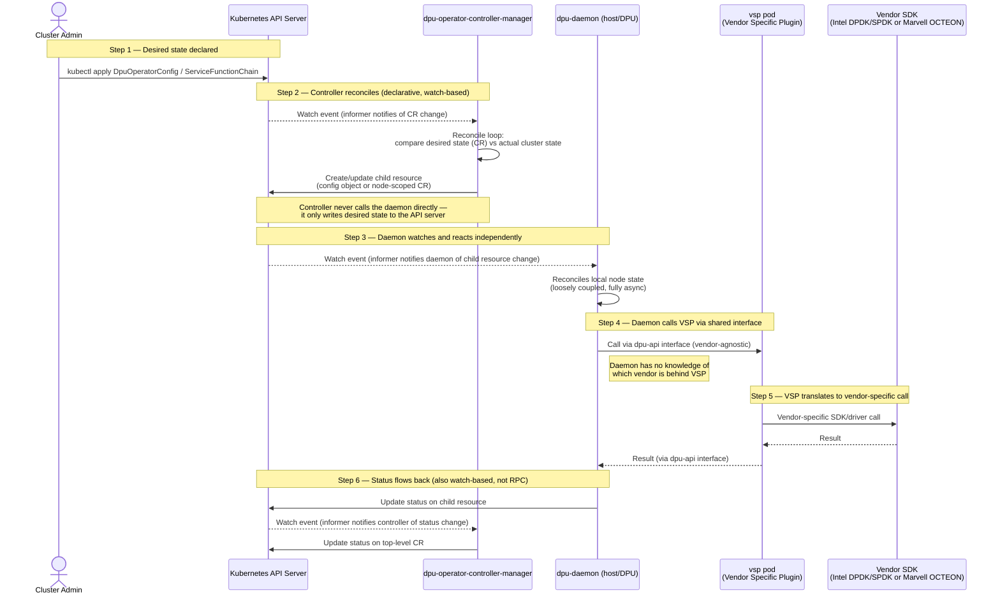
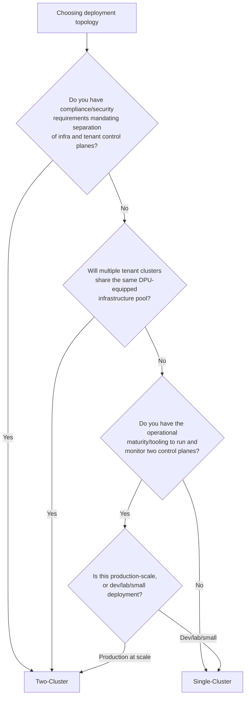
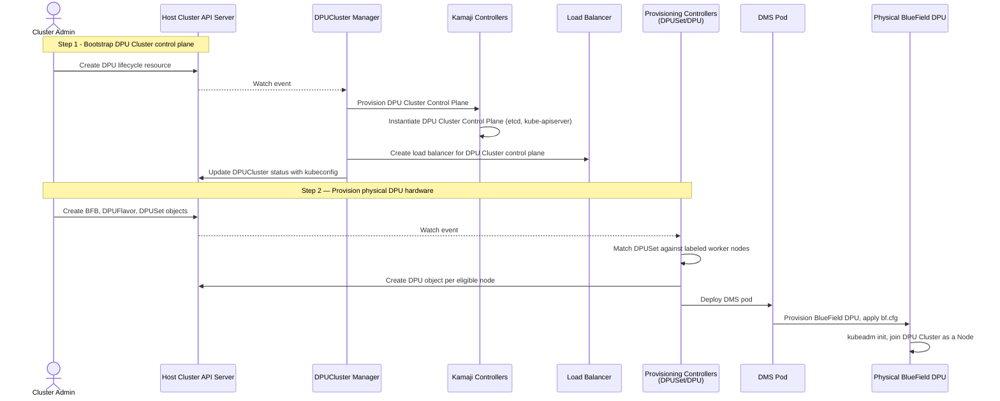
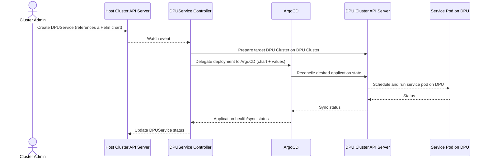
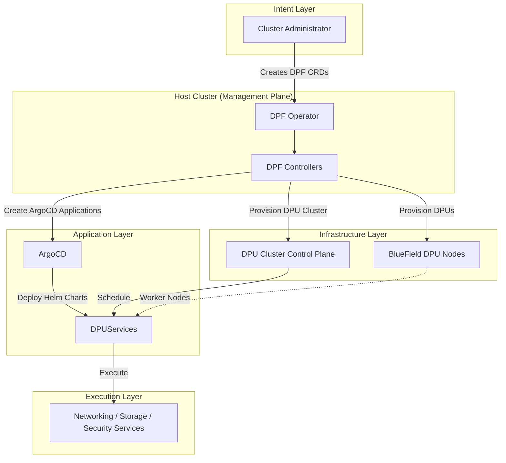

## OPI DPU Operator functioning with Intel / Marvell's Offload Stacks

### Description

The OPI DPU Operator integrates Intel and Marvell hardware using an
**Adapter Pattern**, implemented as a Vendor Specific Plugin. A single
vendor agnostic operator and daemon expose one stable internal interface and
each hardware vendor ships a thin plugin that implements that interface
against their own SDK.

There is exactly one controller manager and one set of CRDs
 shared across all vendors.
Intel and Marvell do not get their own operators or their own CRD groups.

### Components

| Component | Role |
|---|---|
| DPU Operator Controller Manager | It is the brain of entire system. It's a control manager that makes decision but never contact the hardware directly. It's reponsible for:  **Watches Kubernetes CRDs**,  **Implementing reconciliation loop**,  **Communicates with the DPU Daemon**. |
| DPU Daemon | It works as the executor and it's directly runs on the machine. It have responsibilty to **recieves commands form the controller**.  It loads the **vendor plugin**. Also checks the **monitors DPU health**. |
| Vendor Specific Plugin (VSP) | This is the body where hardware specific code lives. This plugin is an implementation of the common interface. It translate the generic API to vendors API. It calls the vendor specific SDK and also configures the hardware. |
| Network Resource Injector | It works during the kubernetes object creation. It's an admission webhook that validate, reject, modifies the object even before they are stored. It also validates the metwork configuration & injects network configuration.  |

### Request flow

### Diagram Explaination 

1. **Desired state declared** :- the admin creates or updates a `DpuOperatorConfig` / `ServiceFunctionChain` CR through the Kubernetes API server. This is a declaration of intent, not a command.

2. **Controller reconciles (declarative, watch based)** :— the `DPU Operator Controller Manager` does not call the daemon directly. Similar as standard Kubernetes operators, it runs a reconcile loop triggered by an informer watch event, compares the desired state in the CR against current cluster state. If a change is needed, It creates or updates a child resource (a configuration object representing desired DPU state) back in the API server. The controller's job ends there & it doesn't push anything to the daemon.

3. **Daemon watches and reacts independently** :— the `DPU Daemon` runs its own informer watching that child resource. When it detects a change, it reconciles its own local node state on its own schedule. This is what makes the controller and daemon loosely coupled neither blocks on the other and either can restart or lag without the other needing to know.

4. **Daemon calls VSP via the shared interface** :— once the daemon determines local action is needed, it calls the `VSP` pod through the vendor agnostic `DPU API` interface. The daemon has no vendor specific logic or knowledge at all.

5. **VSP translates to vendor specific SDK calls** :— the `VSP` pod is the only component that knows which vendor it's running for, and translates the generic call into Intel or Marvell's native SDK/driver calls.

6. **Status flows back the same way it came** :— the results propagate back up through the same watch based mechanism where the daemon writes status to the child resource & the controller's informer picks that up and the controller updates the top level CR's status again, no direct call, just state propagating through the API server.

### Deployment topology

- **Single Cluster** :- In this model, both the host nodes and DPU enabled nodes are managed by the same Kubernetes/OpenShift cluster. It have musch simple deployement & operation which made the debugging and monitoring lot easier.

- **Two Cluster** :- In this architecture, DPU nodes are provisioned as worker nodes of a dedicated infrastructure cluster, while tenant workloads execute in a separate application cluster. It Reduced attack surface for critical networking components.

### Factors Favoring Single Cluster Deployment

* **Simpler Operations** :– One Kubernetes control plane to manage, reducing operational overhead for upgrades, monitoring and security.
* **Small Scale Deployment** :– Ideal for development, testing, labs or environments with a limited number of DPU enabled nodes.
* **Lower Control Plane Latency** :– Controller and Daemon communicate through the same Kubernetes API server, avoiding cross cluster synchronization delays.
* **Simplified Management** :– Single kubeconfig, unified RBAC policies, networking, certificates, and authentication.
* **Lower Infrastructure Cost** :– Requires fewer cluster resources and less administrative effort.

### Factors Favoring Two Cluster Deployment

* **Stronger Security Isolation** :– Separates the infrastructure control plane from tenant workloads, reducing the attack surface and limiting the blast radius of potential compromises.
* **Multi Tenant Support** :– Enables multiple tenant clusters to share a centralized DPU infrastructure cluster.
* **Regulatory & Compliance Requirements** :– Supports separation of duties between infrastructure administrators and application teams.
* **Independent Lifecycle Management** :– Infrastructure components  can be upgraded independently of tenant applications.
* **Resource Efficiency** :– Offloading networking & infrastructure services to DPU cores frees host CPU resources, improving utilization and reducing infrastructure costs in large scale deployments.

### Decision Framework

### Why This Structure Fits Intel & Marvell

- **Intel**: offload is configured through DPDK/SPDK library calls and driver
  ioctls against the IPU. A function call either succeeds or fails immediately.
  There is no separate control loop watching for drift afterward.
- **Marvell**: offload is configured through the OCTEON SDK against the DPU's
  onboard cores same shape, It's a direct synchronous configuration call not a
  reconciled resource.

Neither vendor's stack maintains its own desired state model and it runs its own
reconcile loop or exposes its own Kubernetes API/CRDs.  
There is nothing on the vendor side to reconcile against. So, only a function to call and a
result to return. Given that, a lightweight Adapter is sufficient for it.  
The VSP pod's entire job is to translate one generic DPU API call into one
vendor specific SDK call, synchronously with no need to track asynchronous
state across two separate Kubernetes API servers.

### Trade Off Analysis

| Dimension| Advantages  | Trade-offs |
| ------------------------------- | ----------------------------------------------------------------------------------------------------------- |--------------------------------------------------------------------------------------------------------------------------------- |
| **Simplicity** | Single controller, common CRDs, and one operational model across all vendors. | Generic CRDs may not expose every vendor-specific capability directly. |
| **Extensibility** | Supporting a new vendor only requires implementing the DPU API interface in a new VSP. | New hardware features may require extending the common interface. |
| **Fault Isolation** | Vendors specific failures are isolated within the VSP, preventing failures from affecting the core operator. | Additional IPC/process boundary introduces a small communication overhead. |
| **Independent Vendor Delivery** | Vendors can develop, test and release their VSP's independently of the core operator. | Compatibility between the DPU API version and VSP implementation must be maintained. |
| **Performance Model** | Well suited for Intel and Marvell's synchronous SDK based programming model. | Less suitable for hardware requiring asynchronous workflows or independent control planes. |

### Sources

- Live pod listing confirming  (`DPU Daemon`, `VSP`, single
  controller-manager) :- https://github.com/openshift/dpu-operator
- DPU API Go interface that VSPs implement :- https://pkg.go.dev/github.com/openshift/dpu-operator/dpu-api
- Confirmed working end to end with real hardware (`OC get DPU` showing
  Intel Marvell in one cluster) :-
  https://www.redhat.com/en/blog/unifying-multivendor-dpus-red-hat-openshift
- Official DPU Operator reference docs :- https://docs.redhat.com/en/documentation/openshift_container_platform/4.20/html/networking_operators/dpu-operator-1
- Two cluster deployment rationale :- https://developers.redhat.com/articles/2022/04/26/orchestrate-offloaded-network-functions-dpus-red-hat-openshift

## DPF (DOCA Platform Framework) — How NVIDIA's Existing Operator Works

### Description

Unlike Intel/Marvell, NVIDIA did not integrate as a plugin behind OPI's
vendor neutral API. Instead, NVIDIA built **DOCA Platform Framework (DPF)** a complete Kubernetes-native platform for managing BlueField DPUs.

DPF had introduces it's own :-
- Kubernetes CRD's
- Controllers and reconciliation loops
- Infrastructure Kubernetes cluster dedicated to DPU management

DPF operates across **two logical Kubernetes clusters**:

- **Host Cluster** – The primary management cluster responsible for provisioning and managing DPUs. It hosts the DPF management components, including the control plane for the DPU Cluster.

- **DPU Cluster** – A dedicated Kubernetes cluster whose control plane is hosted as pods within the Host Cluster (using Kamaji, a pod based control plane manager) or managed by a static cluster manager for existing clusters. BlueField DPUs join this cluster as worker nodes through kubeadm and DPUServices are deployed and managed within this cluster rather than the Host Cluster.

### Components

Unlike the OPI DPU Operator, where most complexity is isolated within the VSP, DPF distributes responsibilities across multiple controllers because it manages the lifecycle of an entire Kubernetes cluster in addition to the DPU hardware.

| Component | Role |
|---|---|
| **DPF Operator (DPFOperatorConfig CR)** | Installs and configures the entire DPF system at the top level entry point |
| **DPUCluster Manager** | Backed by Kamaji or a static cluster manager. It provisions the DPU Cluster's control plane as pods in the Host Cluster and produces a kubeconfig |
| **Kamaji Controllers** | Create and manage the TenantControlPlane which is the actual etcd/API server pods backing the DPU Cluster |
| **Provisioning Controllers (DPUSet, DPU, BFB, DPUFlavor)** | Manage the physical DPU lifecycle which hosts get a DPU provisioned, which OS image (BFB) is flashed and DPU specific config |
| **DOCA Management Service (DMS) pods** | Flash the BFB image onto the physical BlueField DPU hardware |
| **DPUService Controller** | Manages services deployed onto the DPU Cluster by creating ArgoCD Applications pointing at Helm charts |
| **ArgoCD** | Actually reconciles and installs the Helm chart workloads onto the DPU Cluster GitOps, not a native controller runtime reconcile loop |
| **DPUServiceChain / DPUServiceInterface / DPUServiceIPAM** | Manage Service Function Chaining and networking config (VF representors, IPAM) between Host and DPU Cluster workloads |
| **DPUServiceCredentialRequest** | Issues cross cluster secrets (kubeconfig/token) so a service in one cluster can talk to the other |

**Insights** :- Unlike the OPI DPU Operator where the Vendor Specific Plugin is simply a hardware adapter but DPF introduces an entire Kubernetes control plane dedicated to the DPUs. Consequently, many DPF components are responsible for creating, operating and coordinating another Kubernetes cluster, rather than merely translating hardware API calls. This makes DPF significantly more powerful but also introduces additional operational complexity.

### Request Flow :- DPU Infrastructure Bootstrap

### Request Flow :- DPU Service Orchestration

### Step Explanation

1. **DPU Cluster bootstrap** — Unlike OPI which assumes an existing Kubernetes control plane, DPF first creates an entirely new Kubernetes cluster dedicated to managing DPUs. The DPUCluster Manager delegates control plane provisioning to Kamaji making the DPU Cluster an independently managed Kubernetes environment.

2. **Hardware Lifecycle Management** — The provisioning controllers translate declarative resources (DPUSet, BFB, DPUFlavor) into the lifecycle of physical BlueField devices, rather than remaining passive PCIe devices, provisioned DPUs boot their own operating system and join the DPU Cluster as Kubernetes worker nodes.

3. **Service deployment is GitOps based, not controller runtime-based** — this is the most important structural difference from the Intel/Marvell adapter. DPUService doesn't directly configure anything, it creates an ArgoCD Application, and ArgoCD is what actually reconciles and installs the workload onto the DPU Cluster. There are effectively two reconciliation systems layered on top of each other (the DPF controllers, then ArgoCD).

4. **Cross-Cluster State Synchronization** — Since the Host Cluster and DPU Cluster maintain independent API servers, application status must be propagated across cluster boundaries. Unlike OPI's single control plane model, DPF coordinates state between multiple reconciliation domains.

### DPF Layered Architecture

**Architectural Insight**: Unlike the OPI DPU Operator, which extends a single Kubernetes control plane through a hardware adapter, DPF introduces multiple orchestration layers. It's a Host Cluster, a dedicated DPU Cluster, GitOps based application deployment & hardware provisioning. This layered architecture enables complete lifecycle management of the DPU as an independent Kubernetes platform, at the cost of additional control plane complexity and cross cluster state synchronization.

### Why DPF Doesn't Fit the Adapter Pattern

The Adapter Pattern used by the OPI DPU Operator assumes that the underlying vendor implementation is a synchronous hardware programming interface. The VSP simply translates generic dpu-api operations into vendor SDK calls while Kubernetes remains the only control plane responsible for reconciliation.

DPF follows a fundamentally different architectural model :-

- DPF is itself a Kubernetes native control plane, not a hardware programming library. It manages BlueField DPUs through an independent DPU Cluster rather than direct SDK calls.
- Infrastructure & application lifecycle are managed declaratively through DPF specific CRDs (DPUCluster, DPU, DPUService, DPUServiceChain, etc.) each reconciled by dedicated controllers.
- State is coordinated across multiple reconciliation domains. Desired state originates in the Host Cluster, it is propagated to the DPU Cluster, and application deployment is further reconciled by ArgoCD before workloads reach the DPUs.
- DPF is designed for controller extensibility. NVIDIA's architecture allows components such as the DPU Cluster Manager or Kamaji integration to be replaced, emphasizing extensible orchestration rather than pluggable hardware adapters.

**this architectural abstraction changes :-** 

| OPI Adapter Model    | DPF Control Plane Model             |
| -------------------- | ----------------------------------- |
| SDK / Driver         | Kubernetes Cluster                  |
| Function Call        | Declarative Resource                |
| Adapter (VSP)        | Controllers + Operators             |
| Synchronous Response | Asynchronous Reconciliation         |
| Single Control Plane | Multiple Coordinated Control Planes |

Because of this architectural difference, a VSP style adapter is no longer sufficient. A single interface cannot represent operations whose completion depends on multiple controllers, cross cluster synchronization, and independent reconciliation loops.

Consequently, NVIDIA integration is better represented through sub operators / CRD translation layers, where each system retains responsibility for managing its own control plane while inter operating at the Kubernetes resource level.

### Sources

- DPF System Architecture (component descriptions, four provisioning flows): https://github.com/NVIDIA/doca-platform/blob/release-v25.1/docs/architecture/system.md
- DPF Component Description (official docs, DPUService/ArgoCD flow, credential request flow): https://docs.nvidia.com/networking/display/dpf2504/component+description
- DPUCluster CRD reference (Kamaji vs static cluster manager): https://docs.nvidia.com/networking/display/dpf2504/dpucluster
- "Developing a Conformant DPF System" (what integrators are expected to replace): https://docs.nvidia.com/networking/display/dpf2504/developing+a+conformant+dpf+system
- Red Hat: DPU-enabled networking with OpenShift and NVIDIA DPF (real end-to-end walkthrough, DPUFlavor/BFB/DPUSet/DMS flow, OVN-Kubernetes offload via SFC): https://developers.redhat.com/articles/2025/03/20/dpu-enabled-networking-openshift-and-nvidia-dpf
- Why NVIDIA chose Kamaji (Host/DPU Cluster split rationale): https://clastix.io/post/why-nvidia-chose-kamaji-for-the-doca-platform/