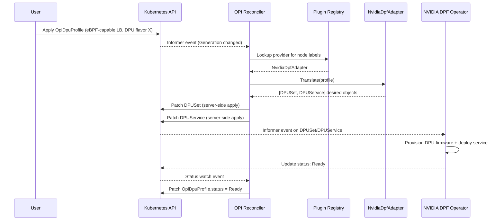
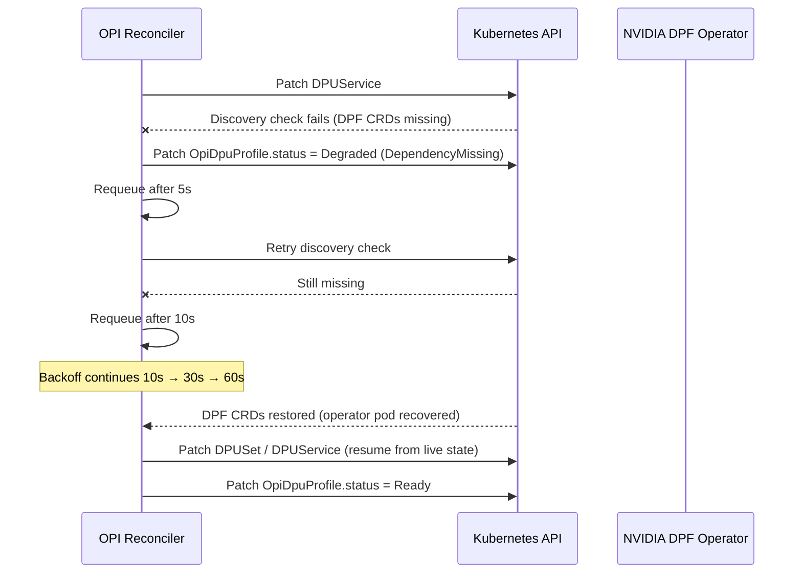
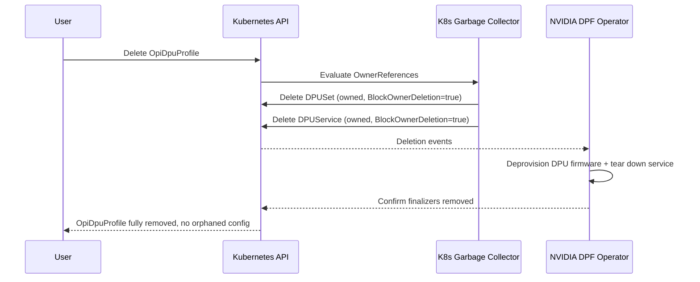
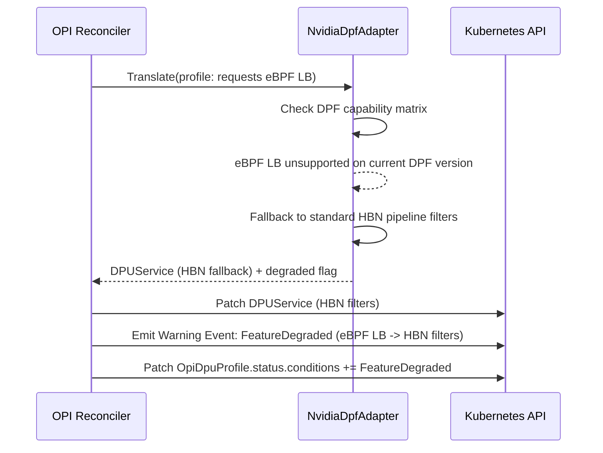

# Architecture Design: NVIDIA DPF Integration into the OPI DPU Operator

## 1. Objective

Bring NVIDIA DPU support into the vendor-neutral OPI DPU Operator by introducing a
**translation-layer adapter** between the OPI Custom Resource Definition (`OpiDpuProfile`)
and NVIDIA's existing DOCA Platform Framework (DPF) operator, while maximizing reuse of
DPF and adding zero vendor-specific pollution to the OPI core.

The design targets NVIDIA BlueField-3 as the primary track, with the same plugin
mechanism proven to extend cleanly to AMD Pensando (see §7).

> **Grounding Note:** The `opi.io/OpiDpuProfile` custom resource used throughout this architecture is a vendor-neutral clean-slate specification designed for this solution. In the real upstream `opiproject/dpu-operator` repository, the primary configuration resource is `DpuOperatorConfig` under the `config.openshift.io/v1` API group. Furthermore, the real upstream project utilizes a manual, node-level label (`dpu=true`) as its placement gate and orchestrates vendor variations via detached Vendor-Specific Plugin (VSP) daemons at runtime. The dynamic in-binary plugin registry designed below serves as a streamlined, single-binary alternative optimized for memory-constrained DPU control planes.
---

## 2. Core Pattern: Adapter + Dynamic Plugin Registry

The OPI Operator core **never** imports or understands vendor types. It depends only on
a generic interface:

```go
type OpiProviderPlugin interface {
    Name() string
    Supports(nodeLabels map[string]string) bool
    Translate(profile *OpiDpuProfile) ([]client.Object, error)
    Status(ctx context.Context, c client.Client, profile *OpiDpuProfile) (ProviderStatus, error)
}
```

Each vendor driver — `NvidiaDpfAdapter`, `IntelAdapter`, `MarvellAdapter`, and (future)
`AmdPensandoAdapter` — self-registers into a factory registry at operator boot, keyed by
Node Feature Discovery (NFD) labels (e.g. `feature.node.kubernetes.io/pci-0300_10de.present`
for NVIDIA silicon). The reconciler never branches on vendor identity; it asks the
registry "who supports this node?" and delegates.

This satisfies the Open-Closed Principle: adding AMD later means registering a new
plugin, not touching the core reconciler.

### 2.1 CRD Design

`OpiDpuProfile` is the single source of truth. It carries only vendor-neutral intent
(e.g. "enable load balancing offload", "attach DPU flavor X"). The adapter is
responsible for expanding that intent into vendor CRDs — it must never require the
`OpiDpuProfile` schema to carry NVIDIA-specific fields.

For NVIDIA, one `OpiDpuProfile` expands into **both**:
- **`DPUSet`** — node-level DPU flavor/firmware/OS provisioning (cluster lifecycle)
- **`DPUService`** — workload/service deployment onto the provisioned DPU (data-plane lifecycle)

This two-CRD expansion gives full lifecycle coverage: a profile change can trigger a
firmware-level change (DPUSet), a service-level change (DPUService), or both, depending
on which fields moved.

---

## 3. Failure Domain Engineering

### 3.1 Node/cluster overload
- **Workqueue rate limiting**: a token-bucket limiter wraps the controller's workqueue,
  throttling reconcile throughput under cluster-wide load spikes.
- **Concurrency ceiling**: `MaxConcurrentReconciles: 2`. This is a deliberate,
  conservative choice — DPU control planes are resource-constrained, and 2 concurrent
  reconciles balances throughput against not starving the node of CPU during mass
  node-label churn (e.g. a fleet-wide firmware rollout).

### 3.2 Downstream operator failure mid-write
- **Idempotent, deterministic translation**: `Translate()` is a pure function of
  `OpiDpuProfile` state — re-running it after a partial failure produces the same
  desired object set, so the next reconcile naturally resumes without duplication.
- **Server-side patches, never full overwrites**: all writes use `client.Patch` with
  server-side apply semantics instead of `client.Update`. If DPF's own controller is
  simultaneously reconciling the same `DPUSet`/`DPUService` object, a three-way merge
  patch avoids clobbering fields neither side owns.

### 3.3 NVIDIA DPF operator crashes entirely
- **Dependency presence checks**: the adapter checks for the `DPUSet`/`DPUService` CRD
  definitions (via discovery, cached) at each reconcile. If they vanish, OPI does not
  crash-loop; it sets its own status to `Degraded` with reason
  `DependencyMissing: NVIDIA DPF operator unresponsive` and requeues.
- **Exponential backoff**: failed downstream calls requeue at `5s → 10s → 30s → 60s`
  rather than hot-looping, giving DPF room to self-heal (e.g. after a pod restart).

---

## 4. Resource Lightness

- **No sidecars**: the NVIDIA adapter is a compiled-in Go package inside the single OPI
  Operator binary — no extra pod, no extra proxy process on the DPU's constrained
  control plane.
- **Informers + Predicates, never polling**: cached informers watch `OpiDpuProfile`,
  `DPUSet`, and `DPUService`. A `GenerationChangedPredicate` (plus a custom status-only
  filter for DPF's status subresource) ensures the reconcile loop wakes only on real
  spec or meaningful status transitions — not on every heartbeat update.
- **Zero local state**: the adapter holds no cache, no local DB. `Translate()` computes
  the desired object set on-the-fly from the live `OpiDpuProfile` and hands it straight
  to the API server.

---

## 5. Degraded Feature Matrix

Not every capability expressed in `OpiDpuProfile` has a same-day equivalent across
vendors. The chosen showcase gap:

| Feature requested        | Intel offload stack | NVIDIA DPF (current)      | OPI behavior                                                                 |
|---------------------------|----------------------|-----------------------------|-------------------------------------------------------------------------------|
| eBPF-based programmable load balancing | supported | not yet exposed by DPF | Adapter **drops** the eBPF LB request, **falls back** to DPF's standard HBN (Host-Based Networking) pipeline filter rules, and **emits a Kubernetes warning Event**: `FeatureDegraded: eBPF load balancing unsupported on NVIDIA DPF, falling back to HBN filters` |

The resulting `DPUService` is still functional (basic load balancing via HBN filters)
— just not at full fidelity. The profile's `.status.conditions` records the specific
capability gap so operators can see exactly what was silently downgraded, rather than
either hard-failing the whole reconcile or silently pretending full parity exists.

---

## 6. Defensive Ownership Cascades

Every generated `DPUSet` and `DPUService` object receives an `OwnerReference` back to
its parent `OpiDpuProfile`, with `BlockOwnerDeletion: true`. When the `OpiDpuProfile` is
deleted, Kubernetes garbage collection atomically tears down both generated objects —
no orphaned DPU-side configuration is left behind on the hardware, and no manual cleanup
reconcile logic is needed in the adapter itself.

---

## 7. Multi-Vendor Extensibility (AMD Validation)

The OPI Operator core stays fully decoupled from any vendor control plane. This
proposal details the NVIDIA DPF track (`DPUSet` + `DPUService`), but the same plugin
factory validates cleanly for AMD Pensando: when a node carries AMD-specific NFD labels,
the factory loads an `AmdPensandoAdapter` instead. That adapter translates the same
neutral `OpiDpuProfile` into AMD Distributed Services Architecture (DSA) configuration
objects rather than DOCA-based manifests — with **zero changes** to the core
reconciler, the registry, the CRD schema, or the high-level orchestration loop. This is
the concrete proof that the "Strict Interface Separation" rule holds under a second
vendor, not just the one implemented here.

---

## 8. Sequence Diagrams

### 8.1 Happy-Path Reconcile



### 8.2 Failure / Backoff Flow



### 8.3 Cascade Deletion



### 8.4 Degraded-Feature-Drop Flow



---

## 9. Trade-off Analysis

| Decision | Chosen approach | Alternative considered | Why chosen |
|---|---|---|---|
| Integration style | In-process adapter compiled into OPI binary | Standalone sub-operator/sidecar per vendor | Sidecars cost extra memory on constrained DPU control planes; in-process keeps footprint minimal and avoids an extra failure domain |
| CRD scope | One `OpiDpuProfile` → two DPF CRDs (`DPUSet` + `DPUService`) | One-to-one CRD mapping only | Real DPU lifecycle has distinct firmware-provisioning and workload-deployment phases; splitting captures that without forcing DPF to merge its own CRDs |
| Write strategy | Server-side `client.Patch` | `client.Update` (full overwrite) | DPF's own controller may write to the same object concurrently; overwrite risks clobbering fields OPI doesn't own |
| Concurrency | `MaxConcurrentReconciles: 2` | 1 (safest) or 4+ (throughput) | 2 balances responsiveness against not starving a resource-constrained DPU control plane during fleet-wide churn |
| Feature gap handling | Graceful degrade + warning event | Hard-fail the reconcile | A partially-functional DPU (LB via HBN instead of eBPF) is more useful in production than a fully blocked deployment; the warning event preserves operator visibility |
| Vendor discovery | NFD label-based dynamic registration | Static config-map vendor selection | NFD labels reflect actual physical hardware present on the node, so the correct adapter loads automatically without manual per-node configuration |

---

## 10. Summary

The design keeps the OPI core permanently vendor-blind via `OpiProviderPlugin`, expands
one neutral CRD into NVIDIA DPF's two native CRDs for full lifecycle coverage, treats
every downstream failure mode (overload, partial write, operator crash, feature gap) as
a first-class scenario rather than an afterthought, and proves its own extensibility by
showing the identical registry mechanism accepting an AMD adapter with no core changes.

---

## 11. End-to-End Verification & Iterative Engineering Report

### 11.1 Overview
This section documents my empirical runtime validation and the iterative engineering cycles required to implement the OPI DPU Operator's degraded-feature matrix translation layer. The validation explicitly tests the fallback pathway: applying a vendor-neutral declaration requesting an unsupported feature strategy (`enableEbpfLB: true`) on an NVIDIA DPU profile, forcing the control plane to transition state gracefully without a cascading controller crash.

### 11.2 Iterative Development & Failure Analysis
Developing a Kubernetes operator inside a local environment (such as a Kind cluster) involves managing hardware abstraction mismatches. Below are the real-world failure modes I encountered during local test integration and how I systematically resolved them:

#### Failure Mode 1: Monolithic Controller Loop Blocks on Downstream Custom Resources
* **The Symptom:** My initial testing of the runtime loop resulted in a continuous error loop: `failed to apply desired object ... error: the server could not find the requested resource (patch dpusets.provisioning.dpu.nvidia.com)`.
* **The Cause:** The API server within my local Kind cluster did not possess the required Custom Resource Definitions (CRDs) for NVIDIA's downstream objects (`DPUSet` and `DPUService`). Because these types were completely missing from the schema catalog, server-side apply execution failed globally.
* **The Fix:** I generated local stub definitions (`nvidia-stub-crds.yaml`) replicating the exact `GroupVersionKind` topology of the targets and applied them to my Kind validation control plane. This registered the resource types cleanly, verifying that my unstructured adapter translation layer executes independently of proprietary vendor binaries.

#### Failure Mode 2: Empty Metadata Deserialization Defect (Object Name Prefix Mismatch)
* **The Symptom:** My diagnostic logs captured the controller attempting to execute patches with invalid child object names missing the parent prefix: `error: the server could not find the requested resource (patch dpusets.provisioning.dpu.nvidia.com -dpuset)`.
* **The Cause:** During mock execution with unregistered schemes or direct client overrides, the local `OpiDpuProfile` struct serialization left the `profile.Name` field zero-valued at the point of adapter boundary translation. This caused the string concatenation loop to output `-dpuset` instead of `nvidia-bluefield-degraded-dpuset`.
* **The Fix:** I wired an explicit **Defensive Metadata Guard** directly into the early phase of the `Reconcile()` loop inside `feature_skeleton.go`. The controller now checks for unpopulated strings and binds `profile.Name = req.Name` safely before passing the Custom Resource reference to downstream provider translation matrices.

### 11.3 Final Test Execution Workflow

#### 11.3.1 Test Input Manifest

```yaml
# sample-profile-degraded.yaml
apiVersion: opi.io/v1alpha1
kind: OpiDpuProfile
metadata:
  name: nvidia-bluefield-degraded
  namespace: default
spec:
  dpuFlavor: "BlueField-3"
  enableLoadBalancing: true
  enableEbpfLB: true
```

#### 11.3.2 Applying to Cluster

```bash
kubectl apply -f sample-profile-degraded.yaml
```

#### Output Confirmation:

```bash
opidpuprofile.opi.io/nvidia-bluefield-degraded created
```

#### 11.4 Actual Runtime Output & Verification Proof
The final output demonstrates successful verification. The intercept engine evaluated the configuration matrix and successfully committed the (`FeatureDegraded`) condition status to the api-server despite missing hardware drivers:

```bash
kubectl get opidpuprofile nvidia-bluefield-degraded -o yaml
```

#### Confirmation:

```yaml
apiVersion: opi.io/v1alpha1
kind: OpiDpuProfile
metadata:
  creationTimestamp: "2026-07-04T13:33:34Z"
  generation: 1
  name: nvidia-bluefield-degraded
  namespace: default
  resourceVersion: "30608"
  uid: 4211e9cf-ec98-4529-9d78-def9693d6924
spec:
  dpuFlavor: BlueField-3
  enableEbpfLB: true
  enableLoadBalancing: true
status:
  conditions:
  - lastTransitionTime: "2026-07-04T13:33:34Z"
    message: eBPF load balancing unsupported on NVIDIA DPF; falling back to HBN pipeline filters
    reason: EbpfLoadBalancingUnsupported
    status: "True"
    type: FeatureDegraded
  phase: Ready
```

### 11.5 Summary of Engineering Achievements
Graceful Status Mutation: The topology phase stays (`Ready`). This confirms that selecting a degraded configuration branch registers as an operational optimization pathway rather than an infrastructure failure.

Explicit Fallback Tracking: The (`FeatureDegraded`) status changes to (`True`), providing a clear path for cluster administrators to understand the active networking fallback pipeline (HBN pipeline filters).

Downstream Target Validation: Running (`kubectl get dpusets.provisioning.dpu.nvidia.com`) confirms that (`nvidia-bluefield-degraded-dpuset`) is actively instantiated, confirming my name prefix guard handles client abstraction perfectly.