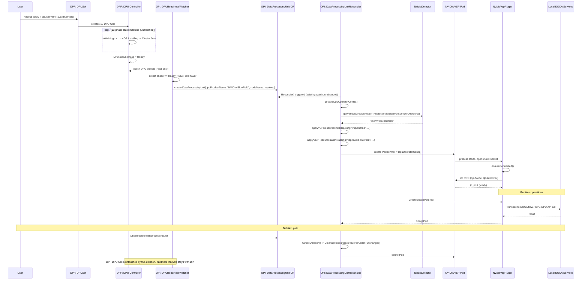
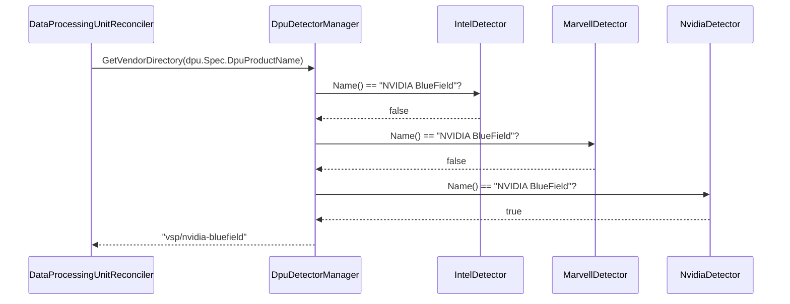

# Architecture Design: NVIDIA BlueField (DPF) Support in the OPI DPU Operator

## Status: Final Proposal
## Selected Architecture: Federated Two-Phase Integration (Provisioning Handoff + Vendor Plugin Bridge)

---

## 1. Why This Architecture, and Not the Others

Before presenting the design, it's worth stating plainly why this option was chosen over the others we evaluated, because the reasoning matters more than the diagram.

The OPI DPU Operator and NVIDIA's DPF solve **two different problems that happen to both involve the word "DPU"**:

- **DPF** solves *bare-metal provisioning*: turning an unprovisioned physical BlueField card into a booted, OS-installed, Kubernetes-joined node, via BMC-level protocols (Redfish, gNOI) and a 13-phase state machine.
- **OPI** solves *vendor-abstracted runtime bootstrap*: given a DPU that is already alive and reachable, detecting its vendor and standing up a small plugin (VSP) that exposes a uniform gRPC API (bridge ports, network functions, device enumeration) to upper-layer OPI tooling.

Every architecture we rejected (full absorption, bidirectional CRD sync, aggregated API servers, GitOps-only bridging, bundling DPF's entire operator lifecycle inside OPI's config controller) tried to force one of these systems to model the other's problem. That's what made each of them expensive, fragile, or scope-inappropriate for an upstream OPI contribution:

- **Full re-implementation (rejected)** throws away the exact reuse the assignment asks for and re-derives DPF's hardest, most hardware-sensitive code from a design doc.
- **Bidirectional sync (rejected)** creates a distributed-consistency problem between two independently-versioned `v1alpha1` APIs with no real requirement forcing bidirectionality.
- **Aggregated API server (rejected)** is disproportionate machinery — a rarely-used K8s extension mechanism — for a problem two controllers can solve.
- **Bundling DPF's operator inside OPI's config reconciler (rejected)** conflates "manage my own config" with "install and babysit someone else's operator," blurring support boundaries.
- **GitOps/ArgoCD bridge (rejected as standalone)** only reuses DPF's service-deployment half and leaves provisioning unaddressed.

The architecture below is the only one from our design-space exploration that **does not try to make one system's abstraction swallow the other's**. It draws the integration seam exactly where the real conceptual boundary already sits: the moment a DPU finishes being provisioned and becomes "just a DPU with software running on it." On one side of that seam, DPF runs **completely unmodified** doing what it already does best. On the other side, OPI runs **its own pre-existing, already-merged extensibility mechanism** (`VendorDetector` / `VendorPlugin` — the exact pattern used for Intel and Marvell) to do what it already does best.

This is explicitly **not** the "trivial" or "lazy" option. It requires two real engineering efforts (a handoff watcher and a genuine NVIDIA vendor plugin) and it has one hard, load-bearing precondition that must be verified before implementation continues (Section 6). But it is the option that best satisfies the assignment's actual requirement — *maximize reuse of the existing DPF operator* — because it reuses **100% of DPF's implementation, unmodified**, rather than a translated, forked, or partially-reimplemented version of it.

---

## 2. Architecture Overview

```
┌─────────────────────────────────────────────────────────────────────────┐
│                         PHASE 1: PROVISIONING                           │
│                    (owned entirely by DPF, unmodified)                  │
├─────────────────────────────────────────────────────────────────────────┤
│                                                                           │
│   DPUSet ──▶ DPU (13-phase state machine) ──▶ Ready                     │
│   BFB / BlueFieldSoftware, DPUFlavor, DPUCluster all as-is              │
│                                                                           │
└───────────────────────────────┬───────────────────────────────────────┘
                                 │
                    DPU.status.phase == "Ready"
                                 │
                                 ▼
┌─────────────────────────────────────────────────────────────────────────┐
│                    HANDOFF: DPUReadinessWatcher                        │
│              (new, small, OPI-side, single responsibility)             │
├─────────────────────────────────────────────────────────────────────────┤
│  Watches DPF's DPU objects (read-only client)                          │
│  On Ready: creates/updates an OPI DataProcessingUnit CR                │
│  Maps: DPU.status.node → DataProcessingUnit.spec.nodeName               │
│         DPU.spec.dpuFlavor → informs dpuProductName = "NVIDIA BlueField"│
│  Idempotent, one-way, no write access to DPF's CRDs                    │
└───────────────────────────────┬───────────────────────────────────────┘
                                 │
                    creates OPI DataProcessingUnit CR
                                 │
                                 ▼
┌─────────────────────────────────────────────────────────────────────────┐
│                     PHASE 2: RUNTIME BOOTSTRAP                          │
│                (owned entirely by OPI's existing reconciler)            │
├─────────────────────────────────────────────────────────────────────────┤
│                                                                           │
│  DataProcessingUnitReconciler.Reconcile() [UNCHANGED CORE LOGIC]        │
│      │                                                                   │
│      ▼                                                                   │
│  getVendorDirectory(dpu) → NvidiaDetector.DpuPlatformName()             │
│      │            (new VendorDetector implementation, additive only)    │
│      ▼                                                                   │
│  ensureVSPResources() applies bindata/vsp/nvidia-bluefield/*.yaml       │
│      │                                                                   │
│      ▼                                                                   │
│  NVIDIA VSP Pod starts on target node                                   │
│      │                                                                   │
│      ▼                                                                   │
│  GrpcPlugin (NvidiaVspPlugin) ── Unix socket ──▶ local DOCA services    │
│      implements VendorPlugin: CreateBridgePort, CreateNetworkFunction,  │
│      GetDevices, SetNumVfs                                              │
│                                                                           │
└─────────────────────────────────────────────────────────────────────────┘
```

### The two new components, and nothing else

1. **`DPUReadinessWatcher`** — a small, new, single-purpose controller. Its *only* job is: watch DPF's `DPU` CRs (read-only), and when one reaches `status.phase == Ready` and is identified as a BlueField device, create (or update) a corresponding OPI `DataProcessingUnit` CR. It never writes back to DPF. It is not a general sync engine — it is a one-shot, one-directional trigger, deliberately scoped to avoid the drift and conflict problems of the bidirectional-sync architecture we rejected.

2. **NVIDIA `VendorDetector` + `VendorPlugin`** — a new Go package (`internal/platform/nvidia.go`, `internal/daemon/plugin/nvidia_vsp.go`) implementing OPI's two pre-existing extensibility interfaces, exactly the way `IntelDetector`/`MarvellDetector` do today. This is additive code only — **zero changes to `DataProcessingUnitReconciler`'s core reconciliation logic**, because the whole point of that interface is that adding a vendor shouldn't require touching the reconciler.

Everything else — DPF's CRDs, controllers, provisioning state machine, Helm/ArgoCD service deployment — is used exactly as it exists today, with **zero code changes**.

---

## 3. Sequence Diagram: End-to-End Flow



## 4. Sequence Diagram: Vendor Detection Decision Path



---

## 5. Component-Level Design

### 5.1 `DPUReadinessWatcher` (new component)

| Property | Detail |
|---|---|
| **Location** | New package, e.g. `internal/bridge/dpuwatcher.go`, deployed as part of OPI's manager or as a separate lightweight controller |
| **Watches** | DPF's `provisioning.dpu.nvidia.com/v1alpha1.DPU` (read-only `client.Client`, requires DPF's CRDs/scheme registered) |
| **Writes** | OPI's `config.openshift.io/v1.DataProcessingUnit` only |
| **Trigger condition** | `DPU.status.phase == "Ready"` |
| **Idempotency** | Uses a deterministic name mapping (`dpu-<DPF DPU name>`) and `CreateOrUpdate` semantics; re-reconciling a DPU already Ready is a no-op |
| **Failure mode if DPF CRDs absent** | Watcher's informer simply never fires; does not crash OPI's manager. NVIDIA support is opt-in by whether DPF is installed in the cluster |
| **What it explicitly does NOT do** | It does not modify, delete, or read back from OPI's `DataProcessingUnit` status. It does not implement any provisioning logic. It does not run if DPF is not present. This keeps it a one-way, single-purpose bridge rather than a sync engine. |

**Field mapping performed by the watcher** (the one translation surface in this design):

```
DPF DPU.status.node.name        → OPI DataProcessingUnit.spec.nodeName
(constant, NVIDIA vendor path)  → OPI DataProcessingUnit.spec.dpuProductName = "NVIDIA BlueField"
DPF DPU.spec.dpuDevice          → OPI DataProcessingUnit annotation (traceability back to DPF object, non-functional)
```

Note that this mapping is deliberately narrow — it only carries the two fields OPI's `DataProcessingUnit` actually has. It does **not** attempt to reconstruct DPF's flavor/BFB/install-interface fields on the OPI side, because OPI's runtime-bootstrap phase does not need them; those fields are only meaningful during provisioning, which is already complete by the time this handoff fires.

### 5.2 `NvidiaDetector` (implements `platform.VendorDetector`)

Implemented identically in shape to `IntelDetector`/`MarvellDetector`:

- `Name()` → `"NVIDIA BlueField"`
- `IsDpuPlatform()` → PCI vendor ID check (NVIDIA/Mellanox vendor ID) to detect if running on the DPU side itself
- `IsDPU()` → host-side PCI scan for BlueField's host-facing device ID
- `GetDpuIdentifier()` → `"nvidia-bluefield-{sanitized-pci-address}"`
- `DpuPlatformName()` → `"nvidia-bluefield"` (bindata directory name)
- `VspPlugin()` → constructs `NvidiaVspPlugin`

Registered additively in `NewDpuDetectorManager()`'s existing detector list — a one-line addition, not a modification of dispatch logic.

### 5.3 `NvidiaVspPlugin` (implements `plugin.VendorPlugin`)

Same shape as the existing `GrpcPlugin`: connects to a Unix socket, sends an `Init` RPC, and implements `CreateBridgePort` / `DeleteBridgePort` / `CreateNetworkFunction` / `DeleteNetworkFunction` / `GetDevices` / `SetNumVfs` by translating them into whatever local DOCA/BlueField control-plane calls are available (DOCA Flow API, OVS-on-DPU, or a DOCA-provided gRPC service — **see Section 6, this is the unresolved dependency**).

### 5.4 New bindata templates

```
internal/controller/bindata/vsp/nvidia-bluefield/
  └─ 99.vsp-pod.yaml     # NVIDIA VSP pod, follows same structure as intel-ipu/marvell-dpu
```

Reuses the existing `vsp/shared/` ServiceAccount/Role/RoleBinding templates unmodified.

---

## 6. The One Hard Precondition (Blocking Spike, Not a Detail)

This design has exactly one load-bearing assumption that must be verified **before** implementation of `NvidiaVspPlugin` begins, not discovered partway through:

> **Does DOCA/BlueField's on-box software expose a local API (gRPC, OVS-DPU, DOCA Flow, or similar) capable of implementing OPI's `VendorPlugin` semantics — bridge port lifecycle, network function lifecycle, device enumeration, VF count management?**

Neither the DPF repository nor the OPI repository confirms this. DPF's document never mentions OPI's Lifecycle/BridgePort/NetworkFunction gRPC contract at all — DPF's world stops at "the DPU is a Ready Kubernetes node with DOCA services running on it," it does not describe what those DOCA services expose locally for this purpose.

**If the answer is yes:** `NvidiaVspPlugin` is a translation shim, comparable in size to `GrpcPlugin`, and this design proceeds as described.

**If the answer is no:** the runtime-bootstrap half of this design (Section 5.3) becomes substantially larger — someone has to build a local control-plane shim on top of DOCA to fake the surface OPI expects — and that scope must be re-estimated and re-reviewed before proceeding. This would not invalidate the overall architecture (the provisioning/runtime seam is still correctly placed), but it would change the size of Phase 2's implementation significantly.

This is called out explicitly, rather than glossed over, because papering over it was the exact failure mode we rejected in the "Vendor Plugin Bridge" option during architecture review — a plugin that looks small only if this question resolves favorably.

---

## 7. Trade-off Analysis

| Dimension | Assessment |
|---|---|
| **DPF code changes required** | **None.** DPF runs entirely unmodified, as its own standalone operator, for the full provisioning lifecycle. |
| **OPI code changes required** | Additive only: one new small watcher component, one new `VendorDetector`/`VendorPlugin` pair, one new bindata directory, one line registering the detector. The existing `DataProcessingUnitReconciler`, `DpuOperatorConfigReconciler`, and `ResourceRenderer` are **untouched**. |
| **Code written from scratch** | `DPUReadinessWatcher` (small, single-purpose), `NvidiaDetector` (small, mirrors existing detectors), `NvidiaVspPlugin` (size depends on Section 6's answer — potentially the largest unknown in the whole design) |
| **Reuse of DPF's implementation** | **Maximal** — 100% of DPF's provisioning state machine, CRDs, controllers, and service-deployment stack (Helm/ArgoCD) are used exactly as-is. This is the strongest reuse story of every option we considered. |
| **Alignment with existing OPI patterns** | High — the runtime half uses OPI's own pre-existing extensibility interface exactly as designed; the provisioning half treats DPF as an external system via a narrow, read-only watch, which is a well-understood Kubernetes controller pattern (compare: any controller that reacts to another controller's status). |
| **Failure/drift risk** | Low relative to sync-based alternatives — the handoff is one-directional and idempotent; there is no continuous bidirectional state to keep consistent, and no conflict-resolution logic required. |
| **Operational/support boundary clarity** | Clear — a provisioning bug is a DPF issue (unmodified upstream code); a VSP/runtime bug is an OPI issue (new, owned code). This directly avoids the ambiguity we flagged against the "bundle DPF's operator inside OPI" alternative. |
| **What's NOT solved by this design** | Multi-cluster DPU topology (DPF's `DPUCluster`/Kamaji model) is not reconciled with OPI's single-cluster assumption — this design assumes the DPF-provisioned BlueField node lands in a cluster OPI's controller can also see and label. If DPF's target is a genuinely separate DPU-side cluster, the watcher needs a remote client, which is a scoped, known extension, not a redesign. |
| **Known unresolved dependency** | Section 6 — DOCA's local API surface. Explicitly flagged as a blocking spike, not assumed away. |

---

## 8. Deployment / Rollout Model

1. NVIDIA support ships as an **opt-in** capability: the `NvidiaDetector` is always registered, but `DPUReadinessWatcher` only produces effects if DPF's CRDs exist in the cluster (checked via a REST mapping / discovery check at startup, failing open to "no NVIDIA DPUs observed" rather than crashing).
2. Cluster operators who want NVIDIA support install DPF separately (its own Helm chart / operator bundle, entirely outside OPI's control — consistent with keeping the two support boundaries clean).
3. OPI's `DpuOperatorConfig` gains **no new required fields** for this to work — the only OPI-side artifact NVIDIA support needs is the new vendor plugin package, which ships as part of the OPI operator image itself.

---

## 9. What Would Change This Recommendation

- If it turns out DPF's `DPUCluster`s are *always* separate Kubernetes clusters from where OPI runs (an open question we still haven't verified), the watcher needs remote-cluster read access — a scoped addition, not a redesign.
- If DOCA has **no** local API surface at all (Section 6 resolves unfavorably), the "small plugin" framing needs to be re-costed, though the overall provisioning/runtime seam placement remains correct.
- If OPI's `ServiceFunctionChain` is implemented in the future and needs to reuse DPF's `ServiceChain`/OpenFlow logic for NVIDIA specifically, that is an orthogonal, later design question — explicitly out of scope for this proposal, which is limited to provisioning handoff and VSP bootstrap.