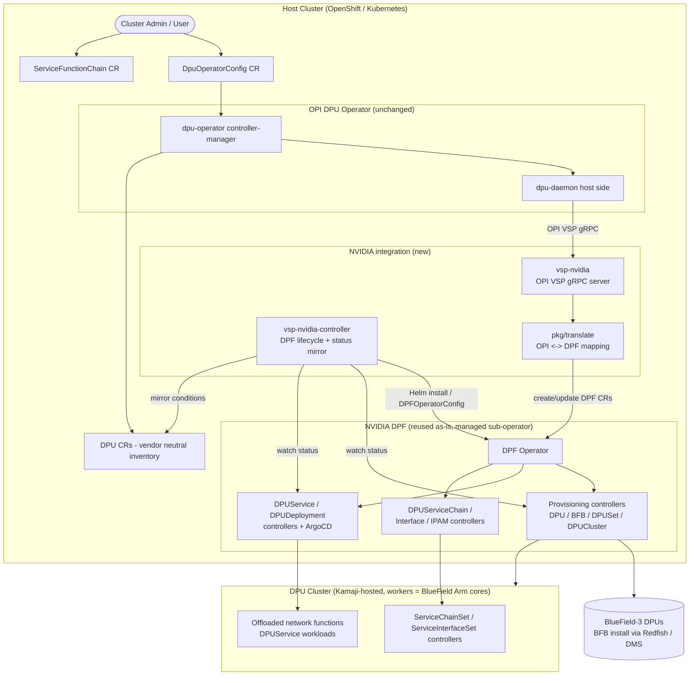
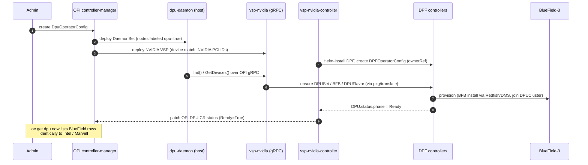
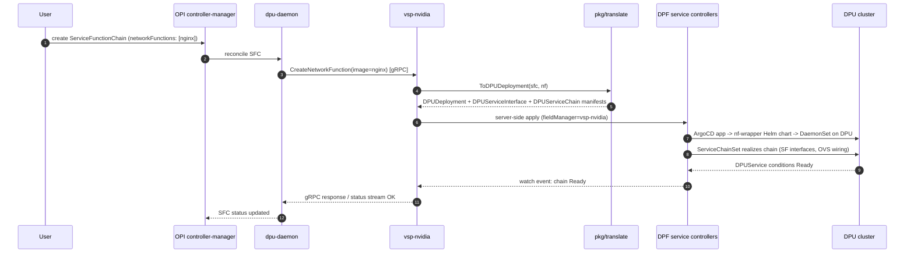
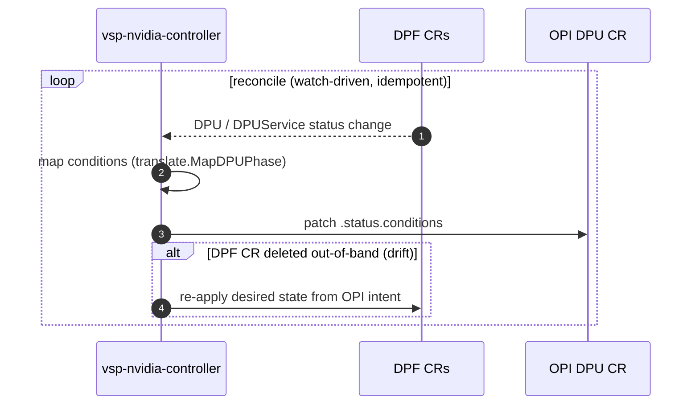

# Adding NVIDIA DPU Support to the OPI DPU Operator via a DPF-Backed Vendor Specific Plugin

**Status:** Proposal (Hands-On Assignment 1)
**Method:** Architecture designed interactively with an LLM (Claude, Anthropic). Full prompt/response log in `llm_transcript.json`.

---

## 1. Problem Statement

The OPI DPU operator (upstream: `openshift/dpu-operator`, built on OPI vendor-agnostic APIs) today supports Intel offload stacks (IPU E2100, NetSec Accelerator) and Marvell Octeon 10. NVIDIA BlueField DPUs are managed by a separate, standalone stack: the **DOCA Platform Framework (DPF)** operator (`NVIDIA/doca-platform`).

Goal: bring NVIDIA BlueField support into the unified OPI operator ecosystem so that a cluster admin gets the same experience for NVIDIA hardware as for Intel/Marvell — `oc get dpu`, one `DpuOperatorConfig`, one `ServiceFunctionChain` API — **while reusing as much of DPF as possible** instead of reimplementing NVIDIA provisioning and service orchestration.

## 2. Current State

### 2.1 OPI DPU Operator

The operator is intentionally thin and vendor-agnostic. Vendor logic lives behind a plugin boundary.

Key elements:

| Element | Role |
|---|---|
| `DpuOperatorConfig` CR (`config.openshift.io/v1`) | Singleton switch that activates the operator (`mode: host` / `mode: dpu`, single- or dual-cluster). |
| `dpu-operator-controller-manager` | Core reconciler; deploys daemons, manages lifecycle, exposes the `DPU` CR inventory (`oc get dpu`). |
| `dpu-daemon` (DaemonSet) | Runs on host nodes and on DPU nodes; host side talks to DPU side through the OPI vendor-agnostic API. |
| **VSP — Vendor Specific Plugin** (per-node pod) | The *only* vendor-specific component. Implements a gRPC contract consumed by `dpu-daemon` (device discovery/identification, bring-up, network function / bridge-port plumbing, service function chain realization). |
| `ServiceFunctionChain` CR | Vendor-neutral way to request network functions on the DPU. |
| `DPU` CR | Vendor-neutral inventory + health object, one per DPU side (host/dpu). |

The critical architectural property: **the core operator never contains vendor code.** Intel and Marvell support were both added purely as VSPs. Any NVIDIA integration that modifies the core reconcilers would break this contract and would not merge upstream.

### 2.2 NVIDIA DPF Operator

DPF is a full platform, not a plugin. It provisions and orchestrates BlueField-3 DPUs with:

| Element | Role |
|---|---|
| `DPFOperatorConfig` | Activates/configures the DPF system. |
| Provisioning controllers | `DPU`, `DPUNode`, `DPUDevice`, `BFB`, `DPUSet`, `DPUFlavor`, `DPUCluster` — BFB (BlueField Bundle) OS image install via Redfish/gNOI, firmware, node lifecycle. |
| DMS (DOCA Management Service) | Device-level management endpoint used during provisioning. |
| Kamaji + `DPUCluster` | Hosts a *secondary Kubernetes control plane* whose worker nodes are the DPU Arm cores. |
| Service orchestration | `DPUService`, `DPUDeployment`, `DPUServiceCredentialRequest` (ArgoCD-based delivery of Helm charts onto the DPU cluster). |
| Service chaining | `DPUServiceChain`, `DPUServiceInterface`, `DPUServiceIPAM`, `DPUServiceNAD` (+ in-DPU-cluster `ServiceChainSet`/`ServiceInterfaceSet` controllers). |

DPF encodes years of BlueField-specific operational knowledge (BFB flashing state machines, DPU mode handling, OVN offload wiring). Reimplementing this inside a from-scratch VSP would be the worst possible outcome.

### 2.3 The impedance mismatches to solve

1. **API shape:** OPI expects an imperative gRPC plugin; DPF exposes declarative CRDs.
2. **Topology:** OPI's dual-cluster model uses MicroShift per DPU; DPF insists on its own Kamaji-hosted DPU cluster.
3. **Workload model:** OPI `ServiceFunctionChain.networkFunctions[]` names container images; DPF `DPUService` deploys Helm charts via ArgoCD.
4. **Ownership:** two operators must not fight over the same hardware (dual-reconciler problem).

## 3. Options Considered

### Option A — Native NVIDIA VSP (reimplementation)

Write a VSP that talks directly to DOCA SDK / Redfish / mlxconfig, ignoring DPF entirely, exactly the way the Intel VSP talks to the IPU.

### Option B — Standalone CRD translation operator ("bridge operator")

A new top-level operator, sibling to both, that watches OPI CRs and writes DPF CRs (and vice versa for status). Neither existing operator is aware of it.

### Option C — DPF-backed VSP (adapter + CRD translation + managed sub-operator) — **recommended**

An NVIDIA VSP that satisfies the OPI plugin gRPC contract *outward* (so the OPI core is untouched) but is implemented *inward* as a Kubernetes client that creates/watches DPF CRDs. The VSP's lifecycle controller also installs and health-checks DPF itself (Helm/OLM dependency), making DPF a **managed sub-operator** of the OPI ecosystem.

### Trade-off analysis

| Criterion | A: Native VSP | B: Bridge operator | C: DPF-backed VSP |
|---|---|---|---|
| DPF reuse | ✗ None — reimplements provisioning, BFB flashing, service delivery | ✓ Full | ✓ Full |
| OPI architectural alignment | ✓ Perfect (pure VSP) | ✗ Weak — introduces a third pattern, core OPI unaware of NVIDIA; `oc get dpu` needs extra glue | ✓ Strong — NVIDIA is "just another VSP" from the core's point of view |
| Upstream mergeability | ✓ High (but enormous effort) | ✗ Low — new component with unclear ownership | ✓ High — follows the exact extension point built for this |
| Engineering cost | Very high (person-years; duplicates NVIDIA's work) | Medium | Medium-low |
| Dual-reconciler risk | None | High — three actors can touch DPU state | Controlled — VSP is the *single writer* of DPF CRs; DPF is the single owner of hardware |
| Maintenance tracking of DPF releases | N/A | High (two moving APIs) | Medium — versioned translation layer, conformance tests pin a DPF release |
| Failure blast radius | Small | Medium | Medium — DPF outage degrades NVIDIA DPUs only; Intel/Marvell unaffected |
| User experience uniformity | ✓ | Partial | ✓ — identical `DpuOperatorConfig` / `ServiceFunctionChain` / `oc get dpu` flows |

Option A fails the assignment's core constraint (maximize DPF reuse). Option B fails Kubernetes-operator hygiene: it creates a hidden coupling between two operators that don't know about each other, and status/ownership semantics (finalizers, ownerReferences across API groups) get ambiguous. Option C keeps a single, well-defined seam — the VSP gRPC contract — which is precisely the seam OPI designed for vendors.

## 4. Recommended Architecture (Option C)

### 4.1 Components

Three new deployable pieces, all NVIDIA-side, zero changes to the OPI core:

1. **`vsp-nvidia` (host-side VSP pod, per node with a BlueField):** implements the OPI VSP gRPC service. Stateless with respect to hardware — every request is translated into desired-state on DPF CRDs, every status query is answered from DPF CR `.status`.
2. **`vsp-nvidia-controller` (cluster-scoped deployment):** a small controller-runtime manager with two jobs: (a) *DPF lifecycle management* — install DPF via Helm, create a `DPFOperatorConfig` derived from `DpuOperatorConfig`, watch DPF health; (b) *status mirroring* — watch DPF `DPU`/`DPUNode`/`DPUService` objects and project them into OPI `DPU` CR conditions.
3. **Translation library (`pkg/translate`):** pure functions mapping OPI concepts ↔ DPF CRDs. Versioned against a pinned DPF API version (`v1alpha1`), covered by golden-file conformance tests. This is the only place that must change when DPF's API evolves.

### 4.2 CRD / concept mapping

| OPI concept | DPF resource(s) | Notes |
|---|---|---|
| `DpuOperatorConfig` (mode host) | `DPFOperatorConfig` | Created once by `vsp-nvidia-controller`; owns it via ownerReference. |
| Node labeled `dpu=true` with BlueField detected | `DPUNode` / `DPUDevice` / membership in a `DPUSet` | VSP discovery RPC returns identity from DPF discovery. |
| DPU bring-up / image lifecycle | `BFB` + `DPUSet.dpuTemplate` (+ `DPUFlavor`) | BFB URL/flavor come from VSP config ConfigMap, not hardcoded. |
| OPI DPU-side cluster (MicroShift in Intel/Marvell case) | `DPUCluster` (Kamaji-hosted) | Divergence accepted: for NVIDIA, the "DPU side" is DPF's DPU cluster; the OPI `DPU` CR still gets a `dpuSide: true` entry so `oc get dpu` looks uniform. |
| `ServiceFunctionChain.networkFunctions[i]` | `DPUDeployment` → `DPUService` (+ `DPUServiceInterface`, `DPUServiceChain`) | Container-image NFs are wrapped by a generic parametrized Helm chart ("nf-wrapper") so arbitrary images fit DPF's Helm-based delivery. |
| `DPU` CR `.status` | Aggregated from DPF `DPU.status.phase`, `DPUService` conditions | Condition mapping table in §4.5. |

### 4.3 Component diagram

### 4.4 Sequence diagrams

**Flow 1 — Operator activation and DPU provisioning**

**Flow 2 — Deploying a network function via ServiceFunctionChain**

**Flow 3 — Status propagation and drift repair (level-triggered)**

### 4.5 Kubernetes operator-pattern alignment

The design is deliberately conservative about controller hygiene:

**Single writer per resource.** The VSP (fieldManager `vsp-nvidia`, server-side apply) is the only writer of the DPF CRs it creates; DPF controllers are the only writers of hardware state; the OPI core remains the only writer of OPI CR specs. Status flows the opposite direction through `vsp-nvidia-controller` only.

**Ownership and garbage collection.** Every DPF resource created from an OPI intent carries an `ownerReference` to the originating OPI object where namespace/scope allows, and a `dpu.opiproject.org/owned-by` label otherwise (cross-namespace / cluster-scoped cases). Deleting a `ServiceFunctionChain` cascades: finalizer on the SFC → VSP deletes the `DPUDeployment` → DPF tears down ArgoCD apps and chain state → finalizer removed.

**Level-triggered, idempotent reconciliation.** The VSP never assumes its gRPC call succeeded durably; desired state is re-derived from OPI CRs on every reconcile and applied idempotently (SSA). Edge-triggered gRPC calls from `dpu-daemon` are treated as *intent notifications*, not as the source of truth.

**Status conditions mapping** (subset):

| DPF signal | OPI `DPU` condition |
|---|---|
| `DPU.status.phase = Initializing/OS Installing` | `Ready=False, reason=Provisioning` |
| `DPU.status.phase = Ready` ∧ node joined DPUCluster | `Ready=True` |
| `DPU.status.phase = Error` | `Ready=False, reason=DPUError` (message passthrough) |
| `DPUService` condition `Ready=False` | SFC condition `NetworkFunctionsReady=False` |
| DPF operator unhealthy | `Ready=Unknown, reason=VendorStackUnavailable` |

**CRD conversion discipline.** `pkg/translate` treats the DPF API version as an external contract: pinned in `go.mod`, verified by golden-file tests (`testdata/sfc_nginx.yaml` → expected `DPUDeployment` YAML), so a DPF API bump becomes a reviewable diff instead of a runtime surprise.

### 4.6 Topology decision: whose DPU cluster?

Intel/Marvell use MicroShift on the DPU with the OPI operator installed in `mode: dpu`. Forcing that onto BlueField would discard DPF's provisioning and Kamaji integration — the exact thing we're told to reuse. The proposal accepts a **per-vendor divergence below the API line**: for NVIDIA, the DPU-side runtime is DPF's Kamaji-hosted DPU cluster, and no OPI operator runs on the DPU side. The uniformity users see (`oc get dpu` showing host-side and dpu-side rows, SFC behavior) is preserved by the status mirror. This is consistent with OPI's philosophy: standardize the API, not the implementation.

### 4.7 Failure modes and mitigations

| Failure | Behavior | Mitigation |
|---|---|---|
| DPF operator down | NVIDIA DPUs report `Ready=Unknown`; Intel/Marvell unaffected | VSPC health-checks DPF deployment, can restart via Helm; alert surfaced on `DpuOperatorConfig` conditions |
| Translation bug after DPF upgrade | New DPF CRs rejected by CRD validation | Version pinning + conformance suite gate; VSP refuses to manage an unrecognized DPF API version (fails closed with clear condition) |
| Orphaned DPF resources | Leaked `DPUService`s after SFC deletion mid-crash | Finalizers + periodic garbage-collection pass keyed on `owned-by` label |
| Both DPF and OPI installed independently by admin | Dual ownership of BlueField | VSPC adopts an existing `DPFOperatorConfig` only if annotated for adoption; otherwise reports conflict condition and does nothing (fail-safe) |

### 4.8 Phased implementation plan

Phase 1 delivers discovery and inventory: NVIDIA VSP with `GetDevices` backed by DPF discovery, DPF lifecycle management, `oc get dpu` parity. Phase 2 delivers provisioning: `DPUSet`/`BFB` translation, Ready-status mirroring, e2e on BlueField-3. Phase 3 delivers workloads: SFC → `DPUDeployment` translation with the nf-wrapper chart, chain realization, cascading deletion. Phase 4 hardens: conformance suite against pinned DPF releases, upgrade tests, upstream submission to `opiproject`/`openshift` dpu-operator as a contrib VSP.

## 5. Bonus: Code Skeleton

`feature_skeleton.go` contains the foundational Go structures: the OPI-side `VendorPlugin` interface, minimal typed stubs for the DPF resources the adapter touches, the `Translator` (OPI → DPF mapping, including the SFC → DPUDeployment path), a generic `Client` seam so the skeleton compiles without vendoring controller-runtime, the `ReconcileAdapter` implementing the level-triggered loop from Flow 3, and the DPF→OPI condition mapper. It compiles with a plain `go build` (stdlib only, by design, so the interfaces are visible without dependency noise); the production version would swap the `Client` seam for `sigs.k8s.io/controller-runtime` and generated DPF API types from `github.com/nvidia/doca-platform/api`.

---

## Appendix A — Iteration 2: Design Defense and Deep Dives

*(Produced in a second LLM prompting round; see turns 3–4 of `llm_transcript.json`.)*

### A.1 Why Option C over Option B, in Kubernetes-native terms

Option B's genuine advantage is deployment independence — no vendor component on host nodes and no involvement of the OPI code path. It loses on four grounds. **Ownership:** Kubernetes forbids cross-namespace `ownerReferences`, so a bridge operator translating between two foreign API groups degenerates into label-based pseudo-ownership and hand-rolled garbage collection for every translated object; in Option C the VSP is itself lifecycle-managed by the OPI core (created, upgraded, and removed with `DpuOperatorConfig`), so no third lifecycle exists. **Discovery contract:** the OPI controller-manager populates `DPU` inventory CRs from VSP `GetDevices()` responses; a bridge would have to write `DPU` CRs directly, impersonating a vendor plugin and introducing a second writer of objects the core believes it owns. **Failure semantics:** VSP failures propagate through the existing gRPC error path and degrade conditions exactly as Intel/Marvell failures do; a bridge fails silently — translation simply stops, invisible to the OPI status model. **Upstream reality:** the VSP seam is the sanctioned extension point with two vendor precedents, while a bridge has no natural home repository and doubles the support matrix. Option B would prevail only if OPI lacked a plugin seam or vendor components were banned from host nodes; neither condition holds.

### A.2 Deep dive: SFC → DPUDeployment translation

The mismatch: `ServiceFunctionChain.networkFunctions[]` names bare container images, while DPF delivers Helm charts through ArgoCD into the Kamaji-hosted DPU cluster.

**nf-wrapper chart.** One generic chart closes the gap. Values schema: `image`, `chainName`, `nfName`, an interface list, and the scalable-function resource request (`nvidia.com/bf_sf` count). It renders a DaemonSet targeted at the relevant DPU nodes, with Multus network annotations referencing generated `DPUServiceNAD`s.

**Fan-out per network function.** The translator emits one `DPUDeployment`, two `DPUServiceInterface`s (ingress/egress SFs), and one `DPUServiceChain` whose ordering derives from the array order in the SFC — chain position is data, not configuration.

**Idempotency and naming.** Deterministic names (`<sfc>-<nf>` plus hash suffix under the 63-character limit) with server-side apply make repeated reconciles no-ops.

**Deletion.** Finalizer `dpu.opiproject.org/nvidia-vsp` on the SFC → VSP deletes the `DPUDeployment` → DPF cascades teardown of `DPUService`s and Argo applications → VSP confirms absence → finalizer released.

**Version-skew insurance.** `DPUDeployment` is DPF's stable high-level abstraction; most DPF release churn is absorbed by bumping the wrapper chart rather than changing the translator.

**Honest limit.** Network functions requiring privileged host-side access do not map onto DPF's delivery model; the VSP surfaces these as an `Unsupported` condition on the SFC rather than degrading silently.

### A.3 Stress-test summary

Split-brain with a pre-existing admin-installed DPF: adopt only when the `DPFOperatorConfig` carries an explicit adoption annotation, otherwise raise a conflict condition and take no action. DPF upgrades: fail closed on an unpinned API version; promote via the golden-file conformance suite as a canary. Scale: the per-node VSP is stateless and translation cost is linear in network functions. Status staleness: bounded by watch-driven mirroring with the 30-second periodic resync as a floor and drift-repair pass.
