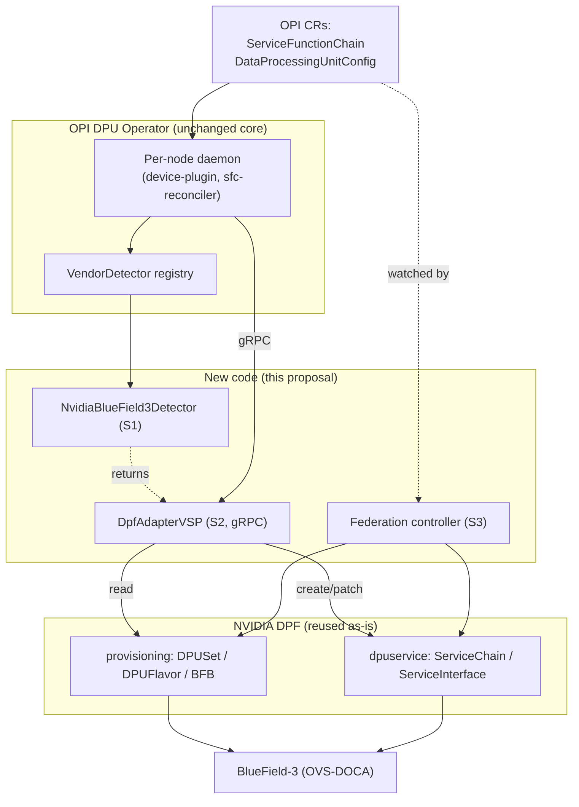
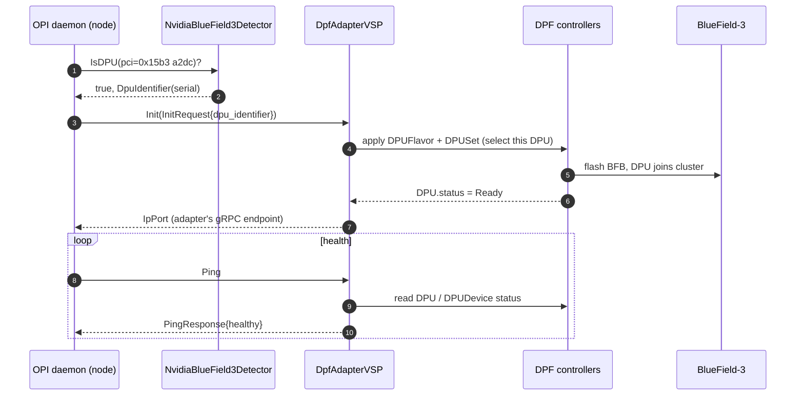
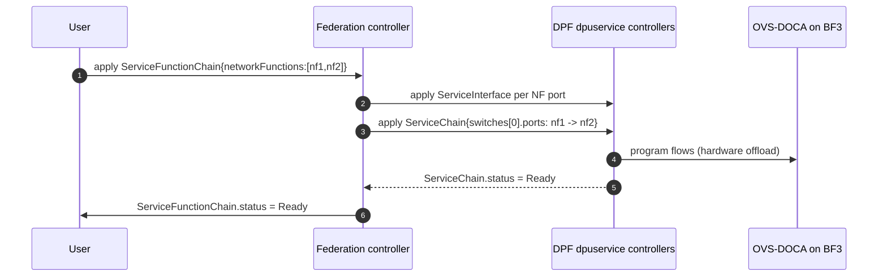
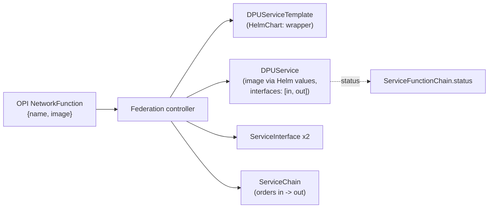

# Integrating NVIDIA BlueField (DPF) into the OPI DPU Operator

**Assignment 1, OPI Internship 2026 - Harsh Singh**

The goal of this proposal is to add NVIDIA DPU support to the OPI DPU Operator
(`opiproject/dpu-operator`) and to lean on NVIDIA's existing DOCA Platform Framework
(`NVIDIA/doca-platform`, "DPF") instead of rebuilding BlueField provisioning. My short answer: don't
reimplement any of DPF. Add a small NVIDIA plugin to OPI that drives DPF as the backend, and keep OPI
as the interface the user actually talks to.

Concretely, NVIDIA enters OPI through two pieces of new code: a Vendor Service Plugin (VSP) that
answers OPI's gRPC contract by translating each call into DPF custom resources, and a federation
controller that reconciles OPI's cluster-scoped CRDs into the matching DPF CRDs. Everything
BlueField-specific stays inside DPF; the new code is just those two translation layers.

## 1. What I explored first

Before drawing any boxes I read enough of both repos to know where a vendor is meant to plug in.

In `opiproject/dpu-operator`:

- `internal/platform/vendordetector.go` - the `VendorDetector` interface and the
  `NewDpuDetectorManager` registration list, where Intel, Marvell, and the NetSec accelerator are
  wired in with a literal `// add more detectors here` comment.
- `dpu-api/api.proto` - the gRPC contract every vendor plugin serves.
- `api/v1/*_types.go` - the CRDs: `DataProcessingUnit`, `DataProcessingUnitConfig`, and
  `ServiceFunctionChain`.
- `internal/daemon/*` - the per-node agent, the device plugin, and the `sfc-reconciler`.

In `NVIDIA/doca-platform`, the API groups under `api/`:

- `provisioning/v1alpha1` - `BFB`, `DPU`, `DPUDevice`, `DPUFlavor`, `DPUSet`: what flashes a
  BlueField and joins it to a cluster.
- `dpuservice/v1alpha1` - `DPUService`, `ServiceChain`, `ServiceInterface`: the service-chaining and
  offload layer.
- `operator/v1alpha1` - `DPFOperatorConfig`, which installs DPF itself.

Two things stood out. OPI's vendor contract is tiny: one Go interface plus about six gRPC methods.
And DPF already owns exactly the two expensive pieces a new NVIDIA plugin would otherwise have to
build, hardware provisioning and datapath service chaining. That overlap is the whole reuse argument.

## 2. Background needed to follow the design

A vendor is registered in one list in `vendordetector.go`:

```go
detectors: []VendorDetector{
    NewIntelDetector(),
    NewMarvellDetector(),
    NewNetsecAcceleratorDetector(),
    // add more detectors here   <-- NVIDIA goes here
},
```

Each detector implements `VendorDetector`, whose important methods are `IsDPU` (is this PCI device my
DPU?), `GetDpuIdentifier` (a stable id, in practice the serial number), and `VspPlugin` (hand back
the plugin the daemon drives over gRPC). That gRPC contract in `dpu-api/api.proto` is the entire
surface OPI asks of a vendor:

```proto
service LifeCycleService       { rpc Init(InitRequest) returns (IpPort); }
service DeviceService          { rpc GetDevices(Empty) returns (DeviceListResponse);
                                 rpc SetNumVfs(VfCount) returns (VfCount); }
service NetworkFunctionService { rpc CreateNetworkFunction(NFRequest) returns (Empty);
                                 rpc DeleteNetworkFunction(NFRequest) returns (Empty); }
service HeartbeatService       { rpc Ping(PingRequest) returns (PingResponse); }
```

On the DPF side, a `DPUSet` selects DPUs and, through a `DPUTemplate`, points at a `DPUFlavor`
(NIC/OVS/kernel config) and a `BFB` boot bundle; DPF then flashes the BlueField and joins it to a
cluster. A `ServiceChain` describes ordered `ServiceInterface` ports on an internal switch, and DPF
programs it onto OVS-DOCA on the BlueField Arm cores. DPF's `ServiceChain` is a close match for OPI's
`ServiceFunctionChain`, which is what makes the mapping in section 4 clean. DPF also runs in Host
Trusted or Zero Trust mode, which decides whether the host or the DPU owns the control plane; that
matters in section 5.

## 3. Architecture

There are three OPI extension points, and I use all three.

| Seam | OPI extension point | What NVIDIA adds | Reuses from DPF |
|---|---|---|---|
| S1 | `platform.VendorDetector` (Go) | `NvidiaBlueField3Detector` (PCI/serial detection) | nothing |
| S2 | VSP gRPC contract (`api.proto`) | `DpfAdapterVSP`, translating each RPC into DPF CRs | `DPUDevice`, `ServiceChain`, `ServiceInterface` |
| S3 | OPI cluster CRDs | a federation controller reconciling OPI CRs into DPF CRs | `DPUSet`, `DPUFlavor`, `ServiceChain` |

S1 and S2 are per-node and imperative: the daemon calls the plugin over gRPC on whichever node holds
the DPU. S3 is cluster-scoped and declarative, because fleet provisioning and multi-node chains are
cluster-wide, not per-node. That split is the one real design decision here, argued in section 5.



Discovery and provisioning:



Service-function-chain offload (declarative federation is primary; the per-node gRPC path is the
fallback the `sfc-reconciler` already drives):



## 4. How the translation works

The snippets below are written against the real DPF `v1alpha1` API (the
`github.com/nvidia/doca-platform/...` packages), using the actual field names I read from
`provisioning/v1alpha1/dpuset_types.go` and `dpuservice/v1alpha1/servicechain_types.go`. They are
illustrative: they show what the adapter emits, but they are **not** the compiling program. The
runnable skeleton (`feature_skeleton.go` and its sibling files) is a separate, self-contained package
that compiles and runs on its own, using local stand-in types in place of those imports.

`Init` provisions the DPU by applying a `DPUSet`. The adapter never flashes anything itself; it
selects the DPU it owns and lets DPF do the work. Everything it creates is labeled so the adapter and
the controller only ever touch objects they own.

```go
set := &provisioningv1.DPUSet{
    ObjectMeta: metav1.ObjectMeta{
        Name: "opi-" + id, Namespace: ns,
        Labels: map[string]string{"opi.dpu/owned": "true"},
    },
    Spec: provisioningv1.DPUSetSpec{
        Strategy: provisioningv1.DPUSetStrategy{Type: provisioningv1.RollingUpdateStrategyType},
        DPUDeviceSelector: &metav1.LabelSelector{
            MatchLabels: map[string]string{"opi.dpu/identifier": id}, // this BlueField only
        },
        DPUTemplate: provisioningv1.DPUTemplate{
            Spec: provisioningv1.DPUTemplateSpec{
                BFB:       &provisioningv1.BFBReference{Name: "bf-bundle"},
                DPUFlavor: "opi-default",
            },
        },
    },
}
return a.k8s.Patch(ctx, set, client.Apply, client.FieldOwner("opi-nvidia-vsp")) // idempotent
```

`CreateNetworkFunction` turns an `NFRequest{input, output}` into a `ServiceChain`. DPF models a chain
as ordered ports on a switch, each matching a `ServiceInterface` by label:

```go
chain := &dpuservicev1.ServiceChain{
    ObjectMeta: metav1.ObjectMeta{Name: "opi-chain-" + in + "-" + out, Namespace: ns},
    Spec: dpuservicev1.ServiceChainSpec{
        Node: &node,
        Switches: []dpuservicev1.Switch{{
            Ports: []dpuservicev1.Port{
                {ServiceInterface: dpuservicev1.ServiceIfc{MatchLabels: map[string]string{"opi.dpu/svc": in}}},
                {ServiceInterface: dpuservicev1.ServiceIfc{MatchLabels: map[string]string{"opi.dpu/svc": out}}},
            },
        }},
    },
}
```

The federation controller (S3) is an ordinary reconcile loop: watch an OPI CRD, mirror it into DPF
with server-side apply, then copy DPF's `status` back so the OPI object stays the single thing the
user reads. The two mappings it and the adapter implement:

| OPI input | DPF output |
|---|---|
| `Init` | check DPF ready, apply `DPUFlavor` + `DPUSet` for this DPU, return the adapter endpoint |
| `GetDevices` / `Ping` | list `DPUDevice`, fold conditions into inventory / a healthy bit |
| `SetNumVfs` | patch `numVfs` on the flavor NIC config |
| `CreateNetworkFunction` / `DeleteNetworkFunction` | apply / delete `ServiceInterface` x2 + `ServiceChain` |
| `DataProcessingUnitConfig` (CRD) | `DPUFlavor` + `DPUSet` (+ `BFB`) |
| `ServiceFunctionChain` (CRD) | `ServiceInterface` + `ServiceChain`; `nodeSelector` -> node / `DPUServiceChain` |

### Mapping a NetworkFunction image to a DPUService (sketch)

This is the one part of the translation I did not finish, so I at least want to point at a direction.
The complication is an impedance mismatch. OPI's `NetworkFunction` gives a name and a container
`image`, but DPF does not deploy raw images: both `DPUServiceTemplate` and `DPUService` are
Helm-chart based (each has a `HelmChart` field), a `DPUService` references the `ServiceInterface`s it
attaches to by name (`spec.interfaces`), and a template ties into a `DPUDeployment` through
`deploymentServiceName`. So the federation controller cannot copy an image into an image field,
because there is not one; it has to bridge image to Helm. Three options, roughly in order of
preference:

1. **Generic wrapper chart.** Ship one small, controller-owned Helm chart that runs an arbitrary
   image, and set the image through Helm values per NetworkFunction. OPI users keep the simple
   `{name, image}` model and the controller owns the packaging.
2. **Chart-by-convention.** Treat `NetworkFunction.image` as a chart reference by documented
   convention, so NF authors publish a DPF-compatible chart. Less work in the controller, more for
   the user.
3. **Extend OPI's `NetworkFunction`** to optionally carry a chart reference, with `image` as the
   default wrapped path. Cleanest long term, but it touches an OPI CRD, which the rest of this design
   deliberately avoids.

I would take option 1 first: no OPI API change, and users keep the image model. The resulting flow:



The open question I would settle with maintainers is which of these OPI wants as the standard, and
whether the wrapper chart lives in OPI or is contributed to DPF.

## 5. Trade-offs and alternatives

The design could take three shapes:

| | A. Reimplement in OPI | B. VSP-as-DPF-adapter | C. Federation controller |
|---|---|---|---|
| New code owns | flashing, OVS-DOCA, VF mgmt | thin gRPC -> DPF translation | OPI CRD -> DPF CRD reconcile |
| Reuse of DPF | none | high | high |
| OPI seam / scope | S1+S2, per-node | S1+S2, per-node | S3, cluster |
| Effort / risk | very high, duplicates NVIDIA's work | low-medium | medium |
| Verdict | rejected | use for device lifecycle + NF | use for provisioning + chains |

I use the hybrid B+C because the two cover different axes. OPI's daemon expects a live plugin per
node for device discovery, the device plugin, and heartbeats, so I can't drop S2 without editing
OPI's core. But fleet provisioning and multi-node chains are cluster-wide and declarative, and
pushing those through a per-node RPC would mean re-implementing reconciliation badly and fighting
DPF's model. The rule: whatever the daemon demands per node goes through the plugin; anything fleet-
or datapath-wide goes through the controller. A v0 would ship S1 plus a read-only S2, with S3 next.

Alternatives I rejected:

- **Fork DPF into OPI.** The most literal reading of "reuse," but OPI would then carry a copy of
  NVIDIA's provisioning stack, re-vendor its deps, and lose every upstream DPF fix. Referencing DPF
  as a running subsystem gets the reuse without owning the code.
- **Extend DPF instead of OPI.** Inverts the assignment: OPI is meant to be the vendor-neutral front
  end, so vendor operators sit behind it, not the reverse.
- **CRD-only, skip the VSP.** Cleaner in principle, but the daemon genuinely needs a plugin for
  discovery and heartbeats, so skipping S2 means patching OPI's core.

Risks I'd manage: OPI and DPF both reconcile, so the new code only patches objects it owns
(`opi.dpu/owned=true`) and never user-authored DPF CRs; `Init` returns as soon as the DPF objects
exist rather than blocking on a multi-minute BFB flash, reporting readiness through `Ping`; DPF is
`v1alpha1`, so I'd pin a tested version and surface skew as a condition instead of crash-looping.
Because the new code never touches hardware, the worst failure is "not provisioned," reported as a
condition, not a bricked DPU.

## 6. Validation

To reduce incorrect assumptions, I cross-checked the proposed integration against the upstream OPI DPU
Operator and NVIDIA DPF repositories. The architecture, API references, CRD mappings, and code
snippets are based on the corresponding upstream definitions. Specifically:

- Vendor integration through `VendorDetector` and `NewDpuDetectorManager`.
- The VSP gRPC interface defined in `dpu-api/api.proto`.
- OPI CRDs (`DataProcessingUnit`, `DataProcessingUnitConfig`, `ServiceFunctionChain`).
- DPF provisioning and dpuservice CRDs.
- The `DPUSet` and `ServiceChain` field names referenced in the illustrative code snippets, and the
  Go module import paths for both projects.
- BlueField-3 PCI device IDs, against the upstream `pci.ids` database.

Items that require a live DPF deployment or BlueField hardware remain documented as assumptions in the
Limitations section below.

## 7. Limitations and what I'd do next

I could not validate this end to end, so I want to be clear about what is designed versus proven.

- **No real hardware.** I have not run this against a BlueField-3 or a live DPF install; the flow is
  reasoned from source, not observed. With hardware, the first thing I'd confirm is the
  `Init -> DPUSet -> DPU Ready` path before writing any service-chain code.
- **NF packaging.** OPI models a network function as a container image (`NetworkFunction{name,
  image}`), while DPF's `DPUService`/`DPUServiceTemplate` are Helm-chart based. I sketched a direction
  for bridging this in section 4 (a controller-owned wrapper chart), but which packaging convention
  OPI should standardize on is still an open question for maintainers.
- **Two field-level assumptions** (documented below): the meaning of `NFRequest{input, output}`, and
  that DPF is pre-installed with RBAC granted to OPI.
- **Zero Trust** is accounted for in the design but not implemented in the skeleton, which covers Host
  Trusted.

Assumptions, per the "make a reasonable assumption and move on" guidance:

- **A1.** DPF is installed in the same management cluster and OPI's ServiceAccount can be granted RBAC
  on the DPF CRD groups. If DPF is absent, `Init` fails with a clear condition.
- **A2.** Target hardware is BlueField-3. Detection keys on vendor id `0x15b3` plus the BlueField-3
  device IDs from the pci.ids database - `a2dc` (integrated ConnectX-7 network controller, the
  host-visible NIC) and the `a2da`/`a2db` SoC functions - excluding `0x15b3` ConnectX NICs.
- **A3.** "Maximize reuse" means reuse DPF as a subsystem, not fork its code (section 5).
- **A4.** `NFRequest{input, output}` are interface endpoints mapped to DPF `ServiceInterface` ports;
  inferred from the proto and CRDs, not from a running `sfc-reconciler`.

## 8. Deliverables

```
harsh-singh/
  architecture_design.md   - this document
  llm_transcript.json      - the LLM-assisted design session
  NOTES.md                 - assumptions, verified-vs-assumed, open items
  go.mod
  feature_skeleton.go      - entrypoint + dry-run
  interfaces.go            - OPI-facing interfaces + message types (mirrors of dpu-api)
  detector.go              - NvidiaBlueField3Detector (the VendorDetector)
  vsp.go                   - DpfAdapterVSP (gRPC contract -> DPF CRs)
  dpf_client.go            - DpfClient boundary + a fake for the dry-run
```

The skeleton is one `main` package split across files; it compiles and runs with `go run .` and uses
local stand-in types so it needs no external modules. Sources read directly:
`opiproject/dpu-operator` (`vendordetector.go`, `api.proto`, `api/v1`, `internal/daemon`) and
`NVIDIA/doca-platform` (`api/{provisioning,operator,dpuservice}/v1alpha1`, including the `DPUSet` and
`ServiceChain` field definitions used in section 4).
