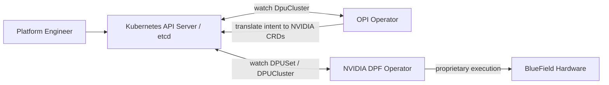
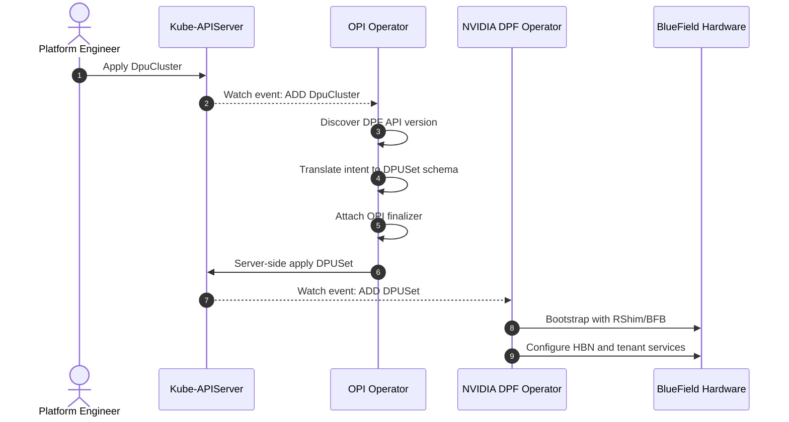
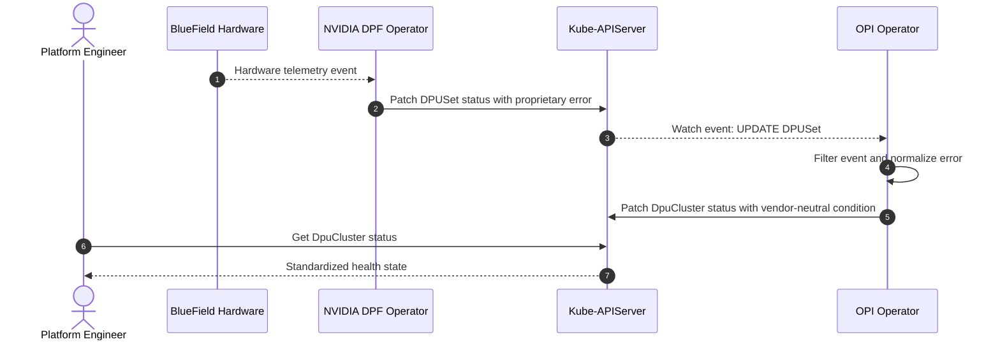

# Architecture Design Document

## 1. Executive Summary

We propose a CRD delegation architecture for supporting NVIDIA BlueField in OPI without sacrificing vendor neutrality. OPI remains the user-facing control plane and owns intent, while NVIDIA’s DPF Operator handles device-specific lifecycle work through downstream Custom Resources. This preserves a lightweight, decoupled API surface and lets vendors evolve independently. The trade-off is added state-synchronization complexity, which we address with controller-level coordination and clear ownership boundaries.

## 2. Existing Architecture

The OPI and NVIDIA DPF stacks solve the same infrastructure problem from different directions. OPI is a vendor-neutral orchestrator; DPF is a BlueField-specific execution stack.

### 2.1 Current OPI Architecture

The OPI Operator is a top-down, vendor-agnostic controller. It uses Kubernetes control loops and CRDs such as `DpuCluster` to reconcile desired state across xPUs.

* **Scope:** User-facing intent and vendor-neutral orchestration.
* **Execution model:** Reconciles OPI resources through standard Kubernetes control loops and OPI-compatible interfaces.
* **Limitation:** It does not provide vendor-specific bootstrapping or firmware flashing.

### 2.2 Current NVIDIA DPF Architecture

The NVIDIA DPF Operator is a bottom-up controller specialized for BlueField and DOCA.

* **Scope:** BlueField lifecycle management and hardware execution.
* **Execution model:** Uses proprietary CRDs such as `DPUSet`, `DPUCluster`, and `DPUService`, plus RShim/BFB flashing, HBN configuration, and tenant-cluster setup.
* **Limitation:** It does not expose a vendor-neutral OPI API during bootstrap and keeps users tied to NVIDIA-specific CRDs.

## 3. Background and Problem

Raw BlueField hardware requires proprietary PCIe-level initialization before it can expose any OPI-compatible API. OPI cannot flash BFB images directly, while using DPF directly breaks OPI's vendor abstraction. The design therefore needs a bridge that preserves the OPI API surface while delegating hardware bootstrapping to DPF.

## 4. Goals and Non-Goals

### 4.1 Design Goals

- Reuse the upstream NVIDIA DPF Operator for BlueField lifecycle execution.
- Keep `DpuCluster` as the stable, vendor-neutral API boundary.
- Avoid compile-time coupling to NVIDIA schemas and release cycles.
- Provide normalized status and errors through standard Kubernetes conditions.
- Maintain a resilient, memory-efficient `controller-runtime` control plane.

### 4.2 Non-Goals

- Implementing hardware drivers, PXE boot managers, RShim clients, or DOCA telemetry agents inside OPI.
- Modifying NVIDIA DPF internals, release cycles, or proprietary APIs.
- Replacing the long-term OPI goal of native vendor support for standard APIs.

## 5. Proposed Architecture: CRD Delegation

We implement a meta-controller pattern: the OPI Operator reconciles `DpuCluster`, translates that intent into NVIDIA `DPUSet` resources, and leaves device-specific execution to the NVIDIA DPF Operator. The two operators communicate only through the Kubernetes API server and etcd, which keeps OPI vendor-neutral and lets each side evolve independently. The trade-off is added state-synchronization complexity between desired and observed state.

This approach was chosen because it reuses the mature OPI and NVIDIA control-plane work that already exists instead of rebuilding BlueField boot, firmware, and networking logic inside OPI. That keeps the OPI surface stable for users while limiting the proprietary execution details to the NVIDIA side. The cost is an extra reconciliation layer and more careful state coordination, but that is still simpler and safer than duplicating hardware lifecycle behavior in the generic control plane.

### 5.1 Component Diagram



## 6. Component Responsibilities

Figure 5.1 shows the ownership split. The OPI Operator is responsible only for orchestration of OPI CRs; it does not perform hardware actions. The Translation Layer is an internal module that adapts schema and version differences between OPI and NVIDIA resources. The NVIDIA DPF Operator is treated as a black box that owns all BlueField boot, firmware, and networking tasks. All coordination flows through the Kubernetes API server, which remains the shared state store and event bus.

| Component | Scope | Primary responsibility | What it does not do |
| --- | --- | --- | --- |
| Kubernetes API Server | Shared control-plane substrate | Stores cluster state, serves watch events, and arbitrates conflicts | Contain OPI or NVIDIA domain logic |
| OPI Operator | User-facing OPI control plane | Reconciles `DpuCluster`, manages orchestration lifecycle, and publishes normalized health | Execute hardware actions or own BlueField bootstrapping |
| Translation Layer | Internal OPI module | Maps OPI intent to NVIDIA-compatible resources and normalizes returned state | Talk directly to hardware or external network clients |
| NVIDIA DPF Operator | Vendor-specific execution engine | Reconciles `DPUSet` / `DPUCluster` and performs BlueField lifecycle and networking work | Expose a vendor-neutral OPI API during bootstrap |

## 7. Control Loop Design

### 7.1 Version Compatibility & Translation (Anti-Corruption Layer)

OPI must adapt to whichever NVIDIA DPF API version is installed at runtime. The Translation Layer detects the available DPF CRD version, maps the generic `DpuCluster` intent to the matching NVIDIA `DPUSet` schema, and rejects unsupported features before they reach downstream reconciliation. This keeps OPI insulated from NVIDIA release churn while preserving a stable user-facing API.

### 7.2 Ownership and Conflict Resolution

OPI uses Kubernetes Server-Side Apply (SSA) to claim ownership of the downstream fields it manages and to prevent reconciliation wars with other writers. In practice, this means OPI can correct drift on managed fields while leaving NVIDIA-specific fields untouched. The intent is that OPI owns the orchestration contract, not the entire NVIDIA object.

### 7.3 Status Propagation (Bubbling)

Status moves from DPF back to OPI as an asynchronous, bottom-up flow. The NVIDIA DPF Operator updates its own CR status with hardware state and operational errors. OPI watches those updates, translates proprietary DPF signals into vendor-neutral OPI conditions such as Ready or Error, and publishes the normalized result on the parent `DpuCluster`. Only meaningful status changes should trigger reconciliation.

### 7.4 Lifecycle and Teardown

OPI adds a finalizer to `DpuCluster` so deletion cannot complete until the hardware has been cleaned up. On delete, OPI issues deletion for the downstream `DPUSet` and requeues while waiting for watch events that confirm DPF has finished its cleanup. A configurable TTL prevents resources from getting stuck forever: if DPF does not complete teardown in time, OPI eventually removes its own finalizer and unblocks deletion.

### 7.5 Appendix Reference

Implementation details for schema mapping, field paths, and event predicates are summarized in Appendix A.

## 8. Scalability, Resilience, and Security

### 8.1 Scalability

We scope the informer cache to only OPI-managed DPF resources by label, and we only wake the controller on meaningful spec or status changes. This reduces noise, limits cache growth, and avoids unnecessary reconciliation storms.

### 8.2 Resilience

DPF failures are isolated to the NVIDIA execution domain because DPF owns only its own CRs. OPI tolerates DPF crashes by requeuing, relying on the last-known state, and avoiding propagation of controller panics into cluster-wide state.

### 8.3 Security

OPI’s service account should have only the RBAC it needs: typically `get`, `list`, `watch`, `create`, `update`, and `patch` on the OPI and NVIDIA CRDs in the target namespace, including status subresources. Nothing more is required. The OPI Operator never communicates directly with BlueField hardware and therefore does not require privileged containers, host networking, or node-level execution.

## 9. Alternatives Considered

CRD delegation wins because it reuses existing OPI and NVIDIA work instead of rebuilding hardware management inside OPI. The trade-off is one additional reconciliation layer and more state-synchronization complexity, but that cost is lower than owning the hardware lifecycle directly.

The main alternatives were rejected for the following reasons:

- Southbound node shim: rejected because it is operationally complex and breaks the declarative Kubernetes model by pushing OPI logic into node-level agents.
- Embedded DPF client: rejected because it tightly couples OPI to NVIDIA code, duplicates logic, and expands the failure domain of the generic operator.
- Sub-operator for each vendor: rejected because it scales maintenance cost with every supported vendor and fragments the OPI control plane.

## 10. Reconciliation Flows

Figure 10.1 shows the component flow across the Kubernetes control plane, the OPI operator, the NVIDIA DPF operator, and the BlueField hardware.

### 10.1 Successful Provisioning

Figure 10.2 shows the provisioning flow.



### 10.2 Resource Deletion

Figure 10.3 shows the deletion and teardown flow.

```mermaid
sequenceDiagram
    autonumber
    actor User as Platform Engineer
    participant API as Kube-APIServer
    participant OPI as OPI Operator
    participant DPF as NVIDIA DPF Operator
    participant HW as BlueField Hardware

    User->>API: Delete DpuCluster
    API->>API: Set deletionTimestamp; OPI finalizer blocks deletion
    API-->>OPI: Watch event: UPDATE DpuCluster
    OPI->>API: Delete downstream DPUSet
    API->>API: Set deletionTimestamp; DPF finalizer blocks deletion
    API-->>DPF: Watch event: UPDATE DPUSet
    DPF->>HW: Wipe and reset hardware
    HW-->>DPF: Confirm sanitization
    DPF->>API: Remove DPF finalizer
    API->>API: Delete DPUSet
    API-->>OPI: DPUSet no longer exists
    OPI->>API: Remove OPI finalizer
```

### 10.3 Status Synchronization

Figure 10.4 shows the status bubbling flow.



## 11. Open Questions and Risks

- **DPF CRD version drift:** How often will NVIDIA change the `DPUSet` or `DPUCluster` schema, and how quickly can OPI update its translation mapping without breaking existing clusters?
- **Manual DPF resource edits:** What happens when administrators modify downstream NVIDIA resources outside OPI, especially on fields that OPI expects to own?
- **Cluster API mismatch:** How should OPI behave if the installed DPF API version is older or newer than the version expected by the translation layer?
- **Timely hardware cleanup vs. finalizer deadlock:** The teardown flow must eventually release the parent resource, but a forced timeout may let OPI delete its finalizer before hardware cleanup is fully verified.
- **Network partition:** What is the recovery behavior if OPI loses watch connectivity to the API server, or if the management cluster cannot observe DPF status updates during provisioning or teardown?
- **DPF upgrade interruption:** How should OPI handle a rolling DPF upgrade that temporarily changes status behavior, pauses reconciliation, or recreates the downstream CRDs?
- **Kamaji tenant isolation:** If the tenant control plane becomes partitioned, can OPI still confirm that the BlueField workload is ready or safely torn down?
- **Status staleness:** How long can OPI rely on last-known state before it should surface the resource as degraded or unknown to the user?

## 12. Conclusion

CRD delegation satisfies the design goals: it keeps OPI’s interface stable, reuses NVIDIA’s hardware execution stack, and preserves a vendor-neutral control plane. The trade-off is added state-management complexity and the risk of reconciliation races, which must be controlled with careful controller practices such as ownership boundaries, finalizers, and status normalization. In the future, NVIDIA or other vendors may expose direct OPI-compatible APIs from their bootstrap paths, reducing the need for this translation layer.

## Appendix A. Implementation Notes

The main text intentionally keeps the control loop at a conceptual level. These implementation notes capture the details that support that design.

- OPI should build downstream payloads dynamically so the control plane does not depend on compiled NVIDIA Go types.
- SSA should be used to express field ownership for the specific downstream fields that OPI manages.
- Reconciliation should be triggered by meaningful spec or status changes, not by every update event.
- Health normalization should map DPF-specific errors into a small set of OPI condition types.
- The teardown TTL should be configurable so operators can balance strict cleanup with namespace availability.