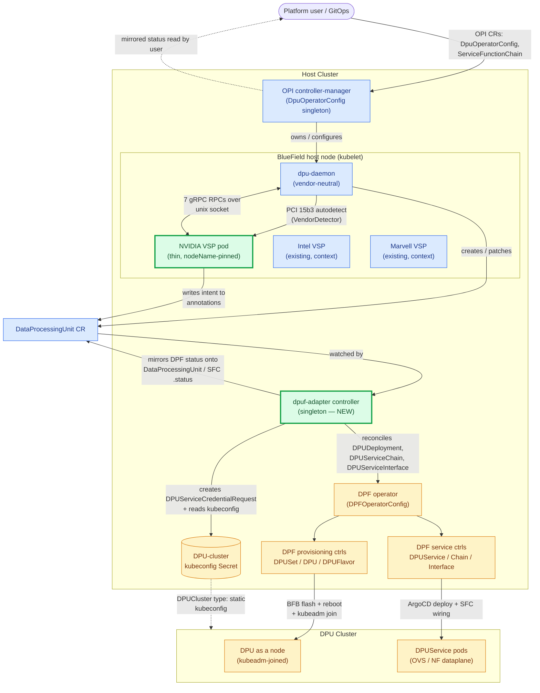
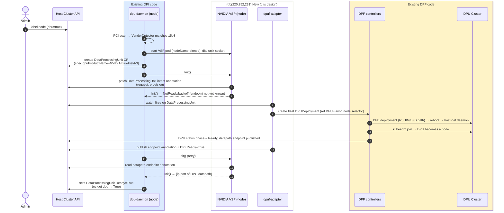
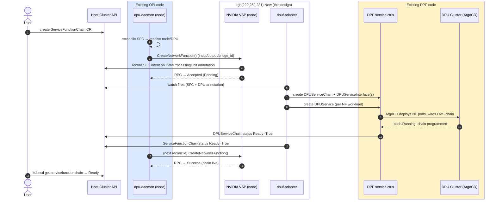

# Adding NVIDIA DPU Support to the OPI dpu-operator by Reusing NVIDIA DPF

**Architecture Design — LFX Mentorship Hands-On Assignment 1**
Target upstream: `github.com/openshift/dpu-operator` (active line) · DPF: `github.com/NVIDIA/doca-platform`
Date: 2026-07-03

---

## TL;DR

**One-screen version.** NVIDIA's DPF already automates the entire BlueField lifecycle (provision → `kubeadm`-join → Day-2 services) as declarative, cluster-scoped CRDs, whereas OPI's dpu-operator onboards each vendor through a *per-node, imperative* gRPC plugin (VSP) contract — the two meet at different scopes, so this design **adapts** them rather than reimplementing either. We add NVIDIA as a first-class OPI vendor with a **thin VSP + PCI detector** at the node edge (the same handshake Intel/Marvell already use), backed by a single **`dpuf-adapter` controller** in the host cluster that owns every DPF CRD, holds the one-per-fleet DPU-cluster credential (never on a node), and mirrors DPF's status back onto the OPI objects. Users keep writing plain OPI CRDs, `kubectl get dpu` stays truthful without them knowing DPF exists, and DPF does all of the provisioning. The recommended pattern is **(e) a VSP-fronted translation controller**, chosen over four alternatives on a scored trade-off (§7). The whole design reduces to one acceptance test — an **NVIDIA BlueField-3 row reaching `STATUS=True` in `kubectl get dpu`**, beside the Intel/Marvell rows Red Hat already ships, with no new OPI CRD and no change to any other vendor's path (§11).

**Component diagram — the hero picture.**



**Legend — one visual language across every diagram in this doc:** 🟦 existing OPI code · 🟩 new component (this design) · 🟧 existing DPF code · ⬜ user / neutral platform. The same three colors label the participant boxes in every sequence diagram (§4). (`oc` on OpenShift and `kubectl` elsewhere are used interchangeably throughout.)

**Definition of done, made concrete (full table + column semantics in §11):**

```
$ kubectl get dpu        # oc get dpu on OpenShift
NAME                    DPU PRODUCT              DPU SIDE   NODE NAME       STATUS
worker-3-marvell-dpu    Marvell CN10K            true       worker-3        True     # already ships (Red Hat 4.20)
worker-4-bf3-host       NVIDIA BlueField-3       false      worker-4        True     # <- added by THIS design
worker-4-bf3-dpu        NVIDIA BlueField-3       true       worker-4        True     # <- added by THIS design
```

**Terminology guard (read before §3):** OPI's `DataProcessingUnit` (short name `dpu`) is a *different object* from DPF's own `DPU`; this doc always qualifies the latter as "DPF `DPU`" and never abbreviates `DataProcessingUnit` to `DPU`.

---

## 1. Executive Summary

NVIDIA's DOCA Platform Framework (DPF) already implements the entire BlueField lifecycle — BFB flash, reboot, host-network bootstrap, `kubeadm`-join of the DPU into a DPU cluster, and Day-2 service delivery via ArgoCD — as a set of cluster-scoped, declarative CRD controllers. OPI's dpu-operator, by contrast, onboards a vendor through a **per-node, imperative gRPC contract**: the vendor-neutral `dpu-daemon` PCI-autodetects a card, dials a Vendor-Specific Plugin (VSP) over a unix socket, and drives it with seven RPCs (across five gRPC services) that assume the DPU is *already provisioned and reachable*. These two systems meet at different layers and different scopes, so the design does not reimplement DPU lifecycle — it **adapts** one to the other. We add NVIDIA as a first-class OPI vendor with a deliberately **thin VSP + PCI detector** at the node boundary (so NVIDIA autodetects and the daemon handshake is satisfied exactly like Intel/Marvell), backed by a single **`dpuf-adapter` controller** in the host cluster that owns all DPF CRDs, holds the DPU-cluster credential(s) — one per fleet, never on a node — in one place, and mirrors DPF's status back onto the OPI objects. The result: users keep writing OPI CRDs, `kubectl get` at the OPI layer stays truthful, DPF does 100% of the provisioning and service orchestration, and no per-node pod ever holds a DPU-cluster kubeconfig.

---

## 2. Component Diagram

▶ **The component diagram is the hero picture in the [TL;DR](#tldr) above** — it carries the shared visual language (🟦 existing OPI code · 🟩 new component · 🟧 existing DPF code) and is the single canonical copy. The table below is the authoritative account of *what actually crosses each boundary* in that diagram.

**Edge legend (what actually crosses each boundary):**

| Edge | Payload |
|---|---|
| user → controller-manager | OPI CRs (`DpuOperatorConfig`, `ServiceFunctionChain`) |
| controller-manager → daemon | pod/config ownership; `LogLevel` |
| daemon → NVIDIA VSP (detect) | PCI vendor ID `15b3` + BlueField device IDs |
| daemon ↔ NVIDIA VSP (control) | 7 gRPC RPCs across 5 services — `LifeCycleService.Init`; `DeviceService.{GetDevices, SetNumVfs}`; `NetworkFunctionService.{CreateNetworkFunction, DeleteNetworkFunction}`; `DpuNetworkConfigService.SetDpuNetworkConfig`; `HeartbeatService.Ping` — on `/var/run/dpu-daemon/vendor-plugin/vendor-plugin.sock`. (Bridge wiring rides in `NFRequest.bridge_id`; there is no separate `BridgePort` RPC — verified against upstream `dpu-api/api.proto`.) |
| daemon → `DataProcessingUnit` | daemon creates the per-node DPU CR after detection |
| VSP → `DataProcessingUnit` | provisioning/SFC intent written to annotations |
| `DataProcessingUnit` → adapter | Kubernetes watch (host-cluster informer) |
| adapter → DPF | DPF CRs (`DPUDeployment`, `DPUServiceChain`, `DPUServiceInterface`) via dynamic client |
| adapter → kubeconfig Secret | `DPUServiceCredentialRequest` issuance + Secret read |
| provisioning ctrls → DPU node | BFB image, reboot, `kubeadm join` token |
| service ctrls → dataplane | Helm-via-ArgoCD `DPUService` release |
| kubeconfig Secret ⇢ DPU cluster | `DPUCluster.spec.kubeconfig` (static BYO cluster) |
| adapter → `DataProcessingUnit`/`SFC` | mirrored DPF conditions written to OPI `.status` |

---

## 3. CRD / API Mapping

> **Naming caution:** OPI's `DataProcessingUnit` (short name `dpu`) and DPF's `DPU` are two different objects that this table maps *between*. Rows below always write "DPF `DPU`" for the latter; an unqualified "`DataProcessingUnit`" is always the OPI object.

Every concept a user or the existing daemon touches on the OPI side, and the DPF object(s) the `dpuf-adapter` creates or watches on its behalf. All OPI CRDs are in group `config.openshift.io/v1` — **verified against `openshift/dpu-operator` `api/v1` (2026-07-03) via `gh`**, including short names (`DataProcessingUnit`→`dpu`, `ServiceFunctionChain`→`sfc`) and field shapes. DPF groups are `provisioning.dpu.nvidia.com` and `svc.dpu.nvidia.com` (versions pinned per §8).

| OPI concept (who touches it) | DPF object(s) the adapter owns/watches | 1:1? | How the gap is closed |
|---|---|:--:|---|
| `DpuOperatorConfig` (user; cluster singleton, spec = `LogLevel` only) | `DPFOperatorConfig` (DPF's own singleton) | **No** | OPI's singleton is a *log-level switch*, not a DPF enablement knob. The adapter does **not** map fields 1:1; it treats the presence of `DpuOperatorConfig` + an NVIDIA detection as the trigger to ensure a `DPFOperatorConfig` exists (created once, out-of-band or by the adapter's bootstrap reconcile). No new OPI spec field is added. |
| `DataProcessingUnit` (created **by the daemon**; real spec `{dpuProductName, isDpuSide, nodeName}`, status = conditions only; one **host-side** + one **dpu-side** entry per physical DPU) | one **fleet-level** `DPUDeployment` → `DPUSet` → `DPU`, referencing a `DPUFlavor` | **No** | OPI's `DataProcessingUnit` is a *discovered-inventory* object, not a *provisioning-intent* object — it carries no BFB/flavor request. The adapter reads the vendor from the real `spec.dpuProductName` (e.g. `NVIDIA BlueField-3`, printed as the `DPU Product` column — this is the vendor-scoping key, §9-Q3) and materializes provisioning intent from fleet-level defaults + `DataProcessingUnitConfig`. **It creates ONE `DPUDeployment` per fleet, not one per DPU** — DPF's own `DPUSet` already fans a single deployment out across every node its selector matches, so a per-node deployment would reimplement DPF's grouping (§9-Q1). |
| `DataProcessingUnitConfig` (user/admin; DPU tunables) | `DPUFlavor` (+ the provisioning slice of `DPUDeployment`) | Partial | Overlapping fields (VF count, resources) map directly; DPF-only concepts (BFB reference, NIC firmware flavor, OVS config) have no OPI field. The adapter fills those from an admin-authored default `DPUFlavor`; OPI-expressible fields override it. |
| `ServiceFunctionChain` (user; ordered NF chain) | `DPUServiceChain` **+** `DPUServiceInterface` (+ `DPUService` per NF) | **No** | OPI's SFC is *node-scoped and imperative* (realized via `CreateNetworkFunction` RPCs, whose `NFRequest` carries `input`/`output`/`bridge_id` — bridge wiring is folded in, not a separate RPC); DPF's chain is *cluster-scoped and declarative*. The adapter translates one SFC into a `DPUServiceChain` (topology) plus one `DPUServiceInterface` per port plus a `DPUService` for each NF workload, and reconciles them as a unit. |
| `DpuNetwork` (downstream OpenShift only; L2/L3 attach) | `DPUServiceInterface` (+ NAD / IPAM objects DPF manages) | Partial | Network-attachment semantics map to `DPUServiceInterface`; IPAM/NAD details DPF owns natively. Adapter passes through, does not re-model IPAM. |
| VSP RPC `Init` return (`ip:port` of DPU datapath) | Read from provisioned `DPU.status` + DPU-cluster endpoint discovery | **No** | OPI expects the datapath endpoint *synchronously from `Init`*; DPF produces it *asynchronously after provisioning*. **The real `DataProcessingUnit` status has no endpoint field** (verified upstream — it's `conditions` only), so the adapter publishes the endpoint as an **annotation** (`dpu.nvidia.com/datapath-endpoint`) once the `DPU` reaches `Ready`, and the VSP returns it on the next `Init` — see §4(i) and §4(iii) for the not-yet-ready path. |
| VSP RPCs `SetNumVfs`, `CreateNetworkFunction`, `SetDpuNetworkConfig` (daemon; imperative) | Declarative fields on `DPUFlavor` / `DPUServiceInterface` / `DPUServiceChain` | **No** | DPF handles these declaratively at provision/chain time. The VSP implementations are **near-no-ops** that record desired state into the `DataProcessingUnit` annotation and return success once the adapter confirms the corresponding DPF object is `Ready`; they do not imperatively poke the DPU. |

**The single structural theme of the gaps:** OPI models *node-scoped, imperative, already-provisioned* state; DPF models *cluster-scoped, declarative, provisioning-inclusive* state. Every non-1:1 row is closed the same way — the adapter absorbs the scope/timing mismatch so neither the OPI API nor DPF has to change.

---

## 4. Sequence Diagrams

Every diagram uses the same visual language as the component diagram (legend in the [TL;DR](#tldr)): participant boxes are colored 🟦 existing OPI code · 🟩 new component (this design) · 🟧 existing DPF code; actors and the shared Host Cluster API are left neutral.

### (i) First-time onboarding of a new BlueField node



**Provisioning terminology (reconciled with OPI's own WG).** OPI's `opi-prov-life` `PROVISIONING.md` frames this under *"Discovery and Provisioning"* and describes NVIDIA's path in a section titled *"RSHIM custom Provisioning"* — "a manual provisioning process based on a virtual `*`-over-PCIe device set" that deploys the DPU OS via *"Deploying DPU OS Using BFB from Host."* That document explicitly lists RSHIM/BFB as **out of OPI's own automation scope** (OPI adopts SZTP / RFC 8572 for the generic zero-touch path). **DPF is precisely the automation of that BFB-over-RSHIM path**, so the adapter does not need OPI to adopt SZTP for NVIDIA — it wires DPF's automation of the WG-acknowledged BFB path in under OPI. The "day-0/day-1" labels used elsewhere in this doc map onto OPI's *Discovery and Provisioning*; "day-2" maps onto service delivery.

### (ii) OPI service-chain intent becomes a running DPUServiceChain



### (iii) Day-2 failure: DPU Cluster temporarily unreachable

The failure must surface at the OPI layer, not vanish inside the adapter.

```mermaid
sequenceDiagram
    autonumber
    actor User
    participant K8s as Host Cluster API
    box rgb(219,234,254) Existing OPI code
    participant Daemon as dpu-daemon
    end
    box rgb(220,252,231) New (this design)
    participant VSP as NVIDIA VSP
    participant Adapter as dpuf-adapter
    end
    box rgb(254,243,199) Existing DPF code
    participant Secret as kubeconfig Secret
    participant DPUC as DPU Cluster API
    end

    Adapter->>Secret: load DPU-cluster kubeconfig
    Adapter->>DPUC: sync DPUServiceChain state
    DPUC--xAdapter: timeout / connection refused
    Note over Adapter: do NOT clear existing status<br/>classify as transient
    Adapter->>K8s: set DPFReady=False<br/>reason=DPUClusterUnreachable (adapter-owned)
    Adapter->>Adapter: exponential backoff requeue

    Daemon->>VSP: Init() / Ping() (HeartbeatService)
    VSP->>K8s: read datapath-endpoint annotation (stale/absent)
    VSP-->>Daemon: RPC → NotReady(DPUClusterUnreachable)
    User->>K8s: oc get dpu -o yaml → DPFReady=False<br/>reason surfaced (truthful)

    loop until reachable
        Adapter->>DPUC: retry sync
    end
    DPUC-->>Adapter: reachable again
    Adapter->>K8s: DPFReady=True; refresh endpoint annotation
    VSP-->>Daemon: RPC → Success
```

*(A DPF version-upgrade variant follows the same shape: the adapter detects a GVK/served-version mismatch on the DPF CRDs, sets `Degraded, reason=DPFVersionUnsupported` on the OPI object instead of silently no-op'ing, and refuses to write objects it can't validate — see §8.)*

---

## 5. Status / Condition Propagation

**Goal:** `kubectl get` at the OPI layer is truthful without the user knowing DPF exists. Status flows strictly upward through three hops: **DPF object → OPI object `.status` → VSP RPC reply**. Spec flows down; status never flows down.

**Condition ownership (single-writer rule).** The adapter writes a **distinct condition type it solely owns — `DPFReady`** — and never touches the top-level `Ready` that OPI's own daemon/controller-manager also manages. Two controllers writing the same condition type produce status flapping (each reconcile stomps the other's value). A downstream aggregator (or the daemon) may fold `DPFReady` into the object's overall `Ready`, but exactly one writer owns each type. This is enforced in code: `status.go` writes only `CondDPFReady`. *(Self-review Q, §9.)*

**Watches.** The adapter runs dynamic informers on the host cluster for the DPF GVKs it owns (`DPU`, `DPUDeployment`, `DPUService`, `DPUServiceChain`, `DPUServiceInterface`). Each DPF status change enqueues the OPI object that the adapter previously derived it from (tracked via owner annotations / a label back-reference).

**Aggregation rule.** For a given OPI object, the adapter computes the *least-ready* condition across all DPF objects it created for that intent, then writes a single OPI condition. Mapping:

| DPF-side signal (the DPF `DPU`/`DPUService*` object) | OPI `.status` condition (adapter-owned) | Reason |
|---|---|---|
| DPF `DPU.status.phase = Ready` | `DPFReady = True` | `Provisioned` |
| DPF `DPU.status.phase = Initializing/Provisioning` | `DPFReady = False` | `Provisioning` |
| DPF `DPU.status.phase = Error` | `DPFReady = False` | `ProvisioningFailed` |
| `DPUServiceChain` `Ready = True` (all interfaces) | SFC `DPFReady = True` | `ChainProgrammed` |
| `DPUService` not `Ready` | SFC `DPFReady = False` | `ServiceDeploying` |
| DPU-cluster unreachable | `DPFReady = False` | `DPUClusterUnreachable` (§4-iii) |
| DPF GVK/version mismatch | `DPFReady = False` | `DPFVersionUnsupported` (§9-Q2) |
| DPF object served but its status omits the readiness signal | `DPFReady = False` | `DPFStatusUnrecognized` (§12-Q3) |

The adapter writes only the **`DPFReady`** condition (never the top-level `Ready`, which the OPI daemon owns and which `oc get dpu`'s STATUS column prints via `.status.conditions[?(@.type=='Ready')].status`). The daemon flips `Ready=True` once the VSP's `Init()` — fed by the datapath-endpoint annotation the adapter publishes — succeeds. So both conditions live on the same object with distinct writers.

**Truthfulness guarantees.**
- **No silent success:** the VSP never returns `Ready` on an `Init()` whose datapath-endpoint annotation is absent/stale; it returns `NotReady` with the mirrored reason, so a wedged provision shows up in the daemon and keeps `oc get dpu` STATUS off `True`.
- **No stale green:** on any adapter error the existing `DPFReady` condition is *not* cleared to `True`; it is only ever downgraded or refreshed with the observed state, so a lost connection cannot leave an object falsely ready.
- **Observability preserved:** the `DPFReady` condition's `reason`/`message` on the OPI object carries the mapped DPF cause, so operators debug at the OPI layer first (`oc get dpu -o yaml`) and only reach for `dpfctl` when they choose to descend.

---

## 6. Security / RBAC

**Credentials the adapter needs, and only those:**

1. **Host-cluster RBAC (its own ServiceAccount):** `create/update/patch` on the DPF GVKs it owns (`DPUDeployment`, `DPUService`, `DPUServiceChain`, `DPUServiceInterface`) and `get/list/watch` on the `DPU` objects DPF provisions from them, scoped to the DPF namespace; `get/list/watch` on OPI `DataProcessingUnit`/`ServiceFunctionChain`; `update` on their `/status`. It holds **no** verb on `DPUSet` — DPF mints that itself when it fans a `DPUDeployment` out across nodes (§9-Q1), so the adapter never touches it. No cluster-admin, no wildcard verbs.
2. **DPU-cluster credential:** a single kubeconfig obtained via DPF's **`DPUServiceCredentialRequest`**, scoped to just the namespaces/verbs the adapter uses on the DPU cluster (deploy/read services), *not* a DPU-cluster-admin token.

**Comparison to DPF's own "static" `DPUCluster` mode.** DPF already establishes exactly this trust pattern: a `DPUCluster` of `type: static` names a `spec.kubeconfig` Secret, and DPF's controllers read that one Secret to reach a BYO DPU cluster. Our adapter **co-locates with that existing boundary** rather than inventing a new one — it consumes the *same* Secret (or a credential minted by `DPUServiceCredentialRequest` against the same cluster), in the *same* namespace, read by *one* ServiceAccount. The DPU-cluster credential therefore has a single holder and a single blast radius, identical to DPF's baseline.

**How over-broad permissions are avoided:**
- **Node pods hold nothing.** The NVIDIA VSP has no DPU-cluster kubeconfig and no DPF RBAC. Its only privileges are the unix socket to the daemon and `patch` on *its own* `DataProcessingUnit` annotations (namespaced, ideally node-restricted). This is the entire reason the pattern beats a pure VSP adapter, where every node would carry DPU-cluster creds.
- **Least privilege on the request.** The `DPUServiceCredentialRequest` asks for the narrow role the adapter actually exercises, so even the single credential is not cluster-admin.
- **Secret access is RBAC-fenced.** Only the adapter's ServiceAccount can `get` the kubeconfig Secret; it is never mounted into daemonset/VSP pods.
- **Auditability.** One credential holder → one place to rotate, one place to audit, one identity in DPU-cluster audit logs.

---

## 7. Trade-off Analysis

Five candidate patterns were scored against the assignment's priorities (reuse of DPF first, OPI consistency second). Scores are 1–5, 5 = most favorable.

| Criterion (5 = best) | (a) VSP adapter | (b) Translation sub-op | (c) Embedded | (d) Side-by-side | **(e) VSP-fronted ctrl** |
|---|:--:|:--:|:--:|:--:|:--:|
| Reuse of DPF lifecycle *(top priority)* | 3 | 5 | 5 | 5\* | **5** |
| Consistency w/ OPI arch & CRD conventions | 5 | 3 | 1 | 1 | **5** |
| Operational blast radius (small = better) | 3 | 4 | 2 | 5 | **4** |
| DPF cadence coupling / version-skew (loose = better) | 3 | 4 | 1 | 5 | **4** |
| Host↔DPU credential security boundary | 2 | 5 | 3 | 3 | **5** |
| Multi-tenancy & RBAC cleanliness | 2 | 4 | 2 | 3 | **4** |
| Implementation effort v1 (less = better) | 3 | 3 | 4 | 5 | **2** |
| **Total (unweighted)** | **21** | **28** | **18** | **27** | **29** |

\* (d) scores full reuse only by *not integrating DPF at all* — the marks are hollow against the goal.

**Recommendation: (e) — VSP-fronted translation controller.**
Shape: a thin per-DPU **NVIDIA VSP + PCI `VendorDetector` (`15b3`/BlueField)** at the OPI edge, backed by a **singleton `dpuf-adapter`** in the host cluster that owns all DPF CRDs and holds the sole DPU-cluster credential. To OPI it *is* the vendor-plugin pattern (a) — same gRPC + detector contract, OPI CRD surface untouched. The only change from (a) is **hoisting the DPF-facing orchestration and credentials out of the node pod into a cluster singleton**, which is exactly what flips the security, RBAC, and DPF-reuse scores from mediocre to strong.

**Two independent precedents confirm the vendor-plugin bet — the pattern is not invented here.**
- **Red Hat productized this exact OPI VSP pattern (external validation).** Red Hat's *"Unifying multivendor DPUs in Red Hat OpenShift"* (OpenShift 4.20, tech preview, Nov 2025) ships the same VSP-based `dpu-operator`, with `oc get dpu` listing **Intel Netsec Accelerator, Intel IPU E2100, and Marvell** side by side through vendor-specific plugins adhering to OPI. NVIDIA is conspicuously **absent** from that list — which is exactly the gap this design fills. That an independent vendor productized the same pattern across three DPUs is strong evidence (e) is the right seam, not a bespoke choice. The concrete target this creates — the NVIDIA row in that table — is specified in **§11 (Definition of Done)**.
- **DPF itself is vendor-pluggable for storage (independent precedent).** DPF does not hard-code vendor logic either: its storage subsystem uses a **SNAP Controller** + **Vendor CSI Plugin Controller** selected by **`StorageVendor` / `StoragePolicy`** CRDs, letting third-party storage vendors plug in. So "abstract the vendor behind a plugin selected by a CR" is the same instinct on both sides of this integration — OPI's VSP and DPF's StorageVendor — which is reassuring for a design that bridges the two. Whether this subsystem could ever collide with the adapter's scope is addressed in **§10**.

**Why (b) is the runner-up but still loses.** Pure (b) — a standalone controller watching OPI CRDs and owning DPF CRDs, no VSP — is genuinely *fewer lines* and structurally matches DPF (cluster ↔ cluster). It loses on two concrete grounds, not aesthetics. (1) **The OPI entry point:** OPI surfaces a DPU only after the daemon PCI-autodetects it through a registered detector and dials a VSP socket; with no NVIDIA detector/VSP, the hardware is invisible and the node flow stalls, forcing (b) to re-implement discovery OPI already does. (2) **Convention & isolation:** a side controller is "an operator bolted next to OPI," not "NVIDIA, a supported OPI vendor" — it diverges from how Intel/Marvell plug in. (e) keeps (b)'s controller as its engine but reaches it through OPI's front door; the VSP that buys this is genuinely thin (`Init` returns the DPF-provisioned endpoint; SFC RPCs forward intent; DPF-handled RPCs near-no-op), so (b)'s LOC edge is small and its two functional gaps are real.

**Why not pure (a).** (a) and (e) share the OPI-facing contract, so the difference is purely *where cluster state lives*. Pure (a) puts DPF orchestration and the DPU-cluster kubeconfig inside every per-node VSP pod — fighting DPF's cluster-scoped model (racing singletons, N-way ownership of `DPUDeployment`) and smearing privileged credentials across the fleet (security = 2, RBAC = 2). (e) takes (a)'s boundary and (b)'s single-controller engine, rejecting both pure forms.

**Residual risks and mitigations.**
- **Effort (e)'s weakest column):** most moving parts of any option. Mitigated by making the VSP deliberately thin and reusing DPF wholesale — the adapter is a translation loop, not new lifecycle code.
- **DPF cadence coupling:** the dynamic/unstructured client (no hard Go import of DPF's heavy module) plus explicit served-version pinning contains version skew to a *detectable, loudly-surfaced* condition rather than a silent break (§5, §9-Q2).
- **Adapter as a singleton SPOF:** acceptable for v1 (out of scope: HA); failures are surfaced as `Degraded`, not silent.
- **Blast radius onto other vendors:** the adapter acts on vendor-neutral OPI CRDs, so an un-scoped watch could corrupt an Intel/Marvell object. Mitigated by a hard vendor-scoping guard (§9-Q3).

A full skeptical self-review of this design — the six questions an OPI maintainer would ask on the PR, and what changed in response — is in **§9**.

---

## 8. Assumptions / Out of Scope

Every call made where the assignment was ambiguous, and why:

**Assumptions**
1. **Vendor = NVIDIA.** The assignment permits NVIDIA *or* AMD; NVIDIA is chosen because DPF is the mature, declaratively-drivable reuse target the exercise names.
2. **Target repo = `openshift/dpu-operator`.** This is judged to be the active line on the concrete evidence that the newest feature (`DpuNetwork`) lands here first; `opiproject/dpu-operator` reads as a portability fork that trails it. (Stated as a reasoned call, not a certainty — if upstream reorganizes, re-target.) **This is the same operator Red Hat productized** in OpenShift 4.20 (§7 / §11), so targeting it is the difference between "add NVIDIA to the shipping thing" and "build a parallel thing." The CRD group/version (`config.openshift.io/v1`), the `dpu`/`sfc` short names, and the exact `DataProcessingUnit`/`ServiceFunctionChain` field shapes used throughout this doc were **verified against upstream `api/v1` (2026-07-03) via `gh`**, not assumed.
3. **DPF version is pinned, not floating.** Groups assumed as of DPF `main` (2026-07-03): `provisioning.dpu.nvidia.com`, `svc.dpu.nvidia.com`, `operator.dpu.nvidia.com`. The adapter pins the *served* versions it validates against and surfaces `DPFVersionUnsupported` on mismatch rather than writing objects it cannot validate. Exact version alignment is an integration-time decision, not baked into the OPI API.
4. **Cluster topology = 2-cluster, `DPUCluster type: static`.** OPI's 2-cluster (deploy-time, kubeconfig-count) model maps cleanly onto DPF's static BYO-cluster: OPI supplies the DPU-cluster kubeconfig Secret, preserving OPI's topology control instead of letting DPF's Kamaji own the control plane. The 1-cluster topology is supported but not the primary path.
5. **Signal channels ride the existing `DataProcessingUnit` CR**, not a new CRD — zero OPI API surface. Because the real CR status is **`conditions` only** (verified upstream — there is no `phase` or endpoint field), the adapter uses two **annotations**: an intent annotation (VSP→adapter) and a datapath-endpoint annotation (adapter→VSP, which `Init()` returns). A dedicated namespaced request CR remains a viable alternative if annotation pressure grows.
6. **DPF client = dynamic/unstructured against DPF GVKs.** DPF ships no lightweight importable `api/` module and no generated clientset; a hard Go import drags OVS/argo/gRPC forks. The dynamic client avoids that and loosens version coupling.
7. **`DPUFlavor`/BFB authored out-of-band by an admin.** The adapter *references* a default flavor; it does not generate NIC firmware config or manage the BFB image contents.
8. **BlueField-3 class hardware; DOCA/BFB stack supplied externally.** PCI detection uses vendor `15b3` + BlueField device IDs.
9. **One DPU cluster per host cluster** is the *default wiring* (`SingleFleetResolver`), but the design is now multi-fleet-ready: a `ClusterResolver` seam maps each OPI object to a `Fleet` (its own namespace, node selector, credential/probe), so N independent BlueField fleets get separate lifecycles by swapping the resolver — no reconciler change (§9-Q4).
10. **Vendor scoping keys off the real `DataProcessingUnit.spec.dpuProductName`** (the daemon-populated field printed as `oc get dpu`'s `DPU Product` column) — so for a DPU **no extra label is needed**; the adapter matches on the product string (`bluefield`/`nvidia`). Only the user-authored `ServiceFunctionChain`, which has no product field, needs a vendor hint; for it the design uses a label in OPI's **real** `dpu.config.openshift.io` domain (`dpu.config.openshift.io/vendor=nvidia`, matching the shipping `dpu.config.openshift.io/dpuside` selector's domain), which an NVIDIA detector/admission would stamp, or the production resolver walks SFC→target DPU→product. (An earlier draft invented `dpu.openshift.io/vendor`; corrected to the shipping domain.)
11. **Provisioning vocabulary follows OPI's own WG.** `opi-prov-life` `PROVISIONING.md` frames NVIDIA's path as *"RSHIM custom Provisioning"* / BFB-from-host and lists it as out of OPI's SZTP automation scope; DPF automates exactly that path, so this design wires DPF's BFB/RSHIM automation under OPI rather than inventing new provisioning terms (§4-i).
12. **Storage is out of scope but its boundary is defined (§10).** Runtime OPI Storage gRPC (NVMe/VirtioBlk emulation) is already covered by `opiproject/opi-nvidia-bridge`, and DPF has its own SNAP/StorageVendor storage subsystem; this design is operator-level lifecycle + service orchestration and neither reimplements nor depends on either, though it could invoke SNAP as a `DPUService` later (§10).
13. **DPF trust mode = "Host Trusted", stated explicitly.** DPF's own docs distinguish a *Host Trusted* deployment (the x86 host and its operators are trusted to reach the DPU cluster and drive provisioning) from a *Zero Trust* deployment (the host is untrusted; the DPU side is the security boundary and the host must not hold DPU-cluster control). This design targets **Host Trusted**, and must, because its whole shape depends on it: the `dpuf-adapter` runs *in the host cluster*, holds the DPU-cluster kubeconfig there, and creates DPF CRDs from the host side (§6). Under Zero Trust that host-resident credential and host-driven provisioning are precisely what is disallowed, so the adapter would have to move behind the DPU-side boundary — a different topology, not a config flag. The design is *compatible-adjacent* with Zero Trust in one respect only: node pods (the VSP) already hold no DPU-cluster credential (§6), so the credential blast radius is a single host-cluster ServiceAccount rather than the whole fleet — but that is host-trust hardening, not Zero Trust. This assumption was implicit in earlier drafts; it is now named so a DPF maintainer knows exactly which threat model the design claims (§12-Q2).

**Explicitly out of scope**
- Modifying DPF internals or the DOCA firmware/BFB stack.
- AMD DPU support.
- Re-implementing DPU provisioning, Kamaji, or ArgoCD delivery inside OPI.
- **The OPI Storage data-plane gRPC surface** — NVMe/VirtioBlk emulation against SNAP — which `opi-nvidia-bridge` already implements at runtime (boundary in §10).
- **DPF's storage subsystem** (SNAP Controller, Vendor CSI, `StorageVendor`/`StoragePolicy`) — a separate DPF plane this network/lifecycle adapter does not touch (§10).
- Production hardening: adapter HA/leader-election beyond a singleton, upgrade/rollback orchestration, full e2e on real BlueField hardware, and security hardening beyond the credible sketch in §6.
- Merging upstream `opiproject` portability shims with downstream `openshift` features.
- The bonus `feature_skeleton.go` must **compile**, not be fully functional.

---

## 9. Self-Review (skeptical OPI maintainer)

Reviewing this as a PR against `openshift/dpu-operator`. Each question is answered honestly; where a real defect existed it was fixed in the design **and** the skeleton, and the fix is named. Where a point was considered and deliberately *not* changed, that is stated with the reason rather than dropped.

### Q1 — Where does this silently reimplement something DPF already does well?

**One real instance found and fixed.** The first-cut translator minted **one `DPUDeployment` per `DataProcessingUnit` (i.e. per node)**. That reimplements exactly the grouping DPF already does: a `DPUSet` fans a *single* provisioning spec out across every node its selector matches. Per-node deployments would mean the adapter owns fan-out, node-set bookkeeping, and per-node drift — all of which DPF does natively and better.
**Fix:** the translator now emits **one fleet-level `DPUDeployment`** keyed on the fleet's node selector (`DeploymentForFleet`, `translate.go`), and lets DPF's `DPUSet` do the per-node fan-out. The per-DPU reconcile is reduced to "ensure the fleet deployment exists, then mirror this DPU's phase back."

Two places were checked and found **not** to be reimplementation, so left alone: (a) the near-no-op VSP RPCs (`SetNumVfs`, `CreateNetworkFunction`, …) don't imperatively program the DPU — they only record intent and let DPF's declarative path act, so they add no parallel dataplane logic; (b) the status mirror re-*reads* DPF conditions, it does not re-*derive* readiness, so it's projection, not a second source of truth.

### Q2 — DPF minor-version upgrade renames/restructures a CRD I depend on: loud or silent?

**This was a real weakness — the first cut would have drifted quasi-silently** (a renamed CRD surfaced as a generic apply error that looked like any transient failure, and the object would just sit "not ready" with a vague reason).
**Fix:** a dedicated classifier, `classifyDPFError`, now distinguishes a **GVK/resource-not-served** condition (`meta.IsNoMatchError` / `runtime.IsNotRegisteredError` — the exact shape a removed/renamed DPF CRD produces) from a transient apiserver error. A not-served GVK is wrapped as the sentinel `errDPFVersionUnsupported` and surfaced on the OPI object as `DPFReady=False, reason=DPFVersionUnsupported`, and the adapter **refuses to proceed** rather than writing objects it can't validate. So an incompatible DPF upgrade fails **loudly and specifically** at the OPI layer. What remains for production (marked `TODO(dpuf)`) is a proactive served-version *pre-flight* at startup via the RESTMapper, so the mismatch is reported before the first reconcile rather than on it — a strictly-earlier signal, not a correctness gap.

### Q3 — Blast radius of a bug in the NVIDIA component onto Intel/Marvell paths?

**This was the most serious finding.** `ServiceFunctionChain` and `DataProcessingUnit` are **vendor-neutral** OPI CRDs — every vendor's objects share the same GVK. The first cut watched them cluster-wide with no filter, so a bug (or just normal operation) in the NVIDIA adapter would translate an **Intel or Marvell** `ServiceFunctionChain` into DPF objects — actively corrupting another vendor's workload. That is a cross-vendor blast radius, and it is unacceptable.
**Fix (defense in depth):**
1. **Informer predicate** (`nvidiaPredicate`) drops non-NVIDIA objects before they ever enqueue.
2. **Reconcile-time guard**: `ClusterResolver.Resolve` returns `ok=false` for anything not NVIDIA-managed, and the reconciler exits **without writing status** (another vendor owns that object). Labels can change between event and reconcile, so the guard is repeated at act-time, not just at watch-time.
3. **Vendor key**: for a `DataProcessingUnit`, the **real `spec.dpuProductName`** field (`bluefield`/`nvidia`) — no invented label needed; for a `ServiceFunctionChain`, a label in OPI's shipping `dpu.config.openshift.io` domain (§8-assumption 10). *(An earlier draft keyed on an invented `dpu.openshift.io/vendor` label; grounding against the real CRD showed `dpuProductName` already carries the vendor, so scoping now uses the authoritative field.)*

Beyond scoping, the pattern already isolates the vendors structurally: Intel/Marvell keep their own detectors, VSP pods, image env keys, and build targets untouched (a hard requirement, §requirements). The one shared surface was the CRD watch, and that is now fenced. **The Red Hat multivendor result (§7/§11) is evidence this isolation holds in practice** — Intel Netsec, Intel IPU, and Marvell already coexist in one `oc get dpu` through the same VSP boundary, so adding a fourth vendor behind that boundary is a proven-safe operation, not a novel risk. Residual shared-fate is limited to the OPI daemon/controller-manager itself, which is vendor-neutral by design and out of this component's control.

### Q4 — Multi-tenancy: two DPUClusters / two independent BlueField fleets with separate lifecycles?

**The first cut hard-coded a single namespace and a single reachability probe** — two fleets would have collided on object names and shared one credential. That's a real multi-tenancy gap.
**Fix:** a `Fleet` abstraction bundles everything per-fleet — namespace, node selector, `DPUFlavor`, and its **own** `DPUClusterProbe` (hence its own credential) — and a `ClusterResolver` maps each OPI object to its fleet. All DPF object names are now **fleet-prefixed**, so two fleets with an identically-named `ServiceFunctionChain` never collide. v1 wires `SingleFleetResolver` (one fleet), but a multi-fleet resolver keyed on a `dpu.nvidia.com/fleet` label is **drop-in** — the interface is identical and no reconciler code changes. This also tightens §6: each fleet's credential stays scoped to that fleet, so a compromise of one fleet's kubeconfig can't reach another's DPU cluster.

### Q5 — How brittle is the coupling if OPI changes its VSP contract?

**Deliberately not over-engineered — and here's the honest bound.** The VSP gRPC contract (the 7 RPCs) is the coupling point, and the design is already structured to absorb *additive* change cheaply: the `VendorPlugin` interface is small, the NVIDIA implementation is thin (most RPCs are near-no-ops that record intent), and all real logic lives in the cluster controller behind the `DataProcessingUnit` signal — so **new** RPCs or fields are a localized change in `nvidia_vsp.go`, not a controller rewrite.

What the design **cannot** cheaply absorb is a *breaking, semantic* redefinition of the contract — e.g. if OPI made `Init` synchronous-provisioning or moved chain realization out of the RPCs entirely. That would be a genuine rework, and no adapter shim avoids it, because the whole pattern is predicated on the current contract's shape (imperative, per-node, already-provisioned). **I chose not to add a defensive abstraction layer (a versioned internal VSP facade) for this**, because it would add indirection today to hedge a hypothetical upstream break, and OPI's contract has been stable across Intel/Marvell/Netsec. The mitigation that *is* real: the mirrored `VendorPlugin` interface means the break surfaces as a **Go compile error** against the real dpu-operator types the day we drop the mirror for the import — loud, not latent. This is a conscious effort-vs-hedge trade, stated rather than hidden.

### Q6 — Did the skeleton change?

Yes — the critique drove real code, not just prose:
- **`fleet.go` (new, repo-root `adapter` package):** `VendorLabel`/`isNVIDIAManaged`, the `Fleet` struct, and the `ClusterResolver`/`SingleFleetResolver` seam (Q3 + Q4).
- **`internal/translate/translate.go`:** `DeploymentForDPU` → `DeploymentForFleet` (one deployment per fleet, Q1); all object names fleet-prefixed (Q4); translator made stateless with a `TargetFleet` DTO to avoid an import cycle.
- **`feature_skeleton.go`:** isolation guard in both `Reconcile`s (Q3); `classifyDPFError` + `errDPFVersionUnsupported` loud-fail path (Q2); informer predicates; per-fleet probe.
- **`status.go`:** the adapter-owned condition type changed from `Ready` to **`DPFReady`** so it never fights the daemon's own `Ready` writer (single-writer rule, §5).
- **`cmd/main.go`:** wires a `Fleet` + `SingleFleetResolver` instead of a bare namespace.

A later **prior-art grounding pass** (verifying the real CRDs via `gh` and reading the four external sources) drove a second round of code fixes:
- **`api/opi/v1/dataprocessingunit_types.go`:** replaced invented `status.phase`/`status.dataplaneEndpoint` fields with the **real** shape — spec `{dpuProductName, isDpuSide, nodeName}`, status `conditions` only — plus the true printer columns and `shortName=dpu`. The datapath endpoint now travels as an **annotation** (`EndpointAnnotation`), since the real status has no such field.
- **`api/opi/v1/servicefunctionchain_types.go`:** added the real `spec.nodeSelector`; `NetworkFunction` confirmed `{name, image}`; `shortName=sfc`.
- **`fleet.go`:** vendor scoping now reads the real `spec.dpuProductName` for DPUs and uses the corrected `dpu.config.openshift.io/vendor` label domain for SFCs.
- **`feature_skeleton.go` / `internal/vsp/nvidia_vsp.go`:** the DPU reconcile publishes the endpoint annotation (not a status field) and writes only `DPFReady`; `Init()` reads the endpoint annotation; `GetDevices` reports `dpuProductName`.

`go build ./...`, `go vet ./...`, and `gofmt -l` remain clean after all of the above.

### What was NOT changed, and why

- **Singleton adapter (no HA/leader-election):** still v1-out-of-scope. A crash surfaces as stale-but-truthful status (conditions carry `observedGeneration`), not silent corruption. Adding leader-election is mechanical and noted, not designed here.
- **Dynamic/unstructured client over a hard DPF import:** reaffirmed. The self-review *strengthens* this choice — the version-drift classifier (Q2) depends on catching no-match errors at runtime, which is exactly what the dynamic client surfaces; a hard import would instead fail to *compile* against a new DPF, which is a worse operational story for a running adapter.
- **No versioned internal VSP facade (Q5):** deliberately declined, reasoned above.

---

## 10. Storage Boundary

Storage is out of scope for this design (§8-assumption 12), but "out of scope" is only credible if the boundary is drawn precisely — because DPUs are exactly where network and storage offload overlap on the same silicon, and a fuzzy boundary is where two operators silently fight. This section names the three planes, states this adapter's relationship to each in one word (**ignores / depends-on / could-invoke**), and analyzes whether scope could ever collide.

**The three storage planes in play**

| Plane | What it is | Owner | This adapter's relation |
|---|---|---|---|
| **A. OPI Storage gRPC (runtime data plane)** | NVMe/VirtioBlk device *emulation* — the OPI Storage API surface, implemented on BlueField by NVIDIA SNAP | `opiproject/opi-nvidia-bridge` (a runtime gRPC bridge, not an operator) | **ignores** |
| **B. DPF storage subsystem (cluster control plane)** | SNAP Controller + Vendor CSI Plugin Controller, selected by `StorageVendor` / `StoragePolicy` CRDs; provisions/attaches storage to DPU-cluster workloads | NVIDIA DPF (a separate DPF plane) | **ignores** (could-invoke, later) |
| **C. This adapter (network + lifecycle control plane)** | Translates OPI `DataProcessingUnit`/`ServiceFunctionChain` intent into DPF provisioning + `DPUService*` networking objects | `dpuf-adapter` (this design) | — |

**A — `opi-nvidia-bridge`: ignored, by construction.** The bridge is a **runtime, per-DPU gRPC server** that answers OPI Storage calls (`CreateNvmeSubsystem`, VirtioBlk emulation, …) by programming SNAP on the local BlueField. It is a *data-plane* component that lives and dies with the DPU's running services; it holds no cluster credentials and reconciles no CRDs. This adapter is a *control-plane* translation loop that never issues an OPI Storage RPC and never touches an emulated block device. **The design neither depends on nor invokes the bridge.** The one true relationship is *lifecycle-adjacent, not functional*: if an operator wanted the storage bridge running on every NVIDIA DPU, the natural home is a **`DPUService`** (the same DPF primitive this adapter already emits for networking) — which is the "could-invoke" seam in plane B, not a dependency here.

**B — DPF's SNAP/StorageVendor subsystem: ignored now, cleanly invokable later.** DPF ships its own storage control plane — a SNAP Controller and a Vendor CSI Plugin Controller, dispatched by `StorageVendor`/`StoragePolicy` CRDs (§7 cites this as independent precedent that DPF, like OPI's VSP, abstracts vendors behind a plugin-selecting CR). This adapter creates **none** of those CRDs. It owns a disjoint GVK set — `DPU`, `DPUDeployment`, `DPUService`, `DPUServiceChain`, `DPUServiceInterface` (§5/§6) — with **zero intersection** with `StorageVendor`/`StoragePolicy`. If storage orchestration were ever pulled in scope, the extension is additive and idiomatic: the adapter would emit a `StorageVendor`/`StoragePolicy` (or wrap `opi-nvidia-bridge` in a `DPUService`) through the *same* dynamic client and the *same* fleet model — no new pattern, no reconciler rewrite. That path is deliberately **not** taken in v1.

**Collision analysis — can scope ever overlap?** Three axes, all clear:

1. **CRD ownership (the dangerous one):** No shared GVK. The adapter's owned set and DPF's storage set are disjoint, so two controllers can never write the same object. The single-writer discipline from §5 (each condition type has exactly one writer) extends here to *object types*: storage objects have zero writers from this adapter.
2. **Credentials/RBAC:** The adapter's host-cluster Role (§6) enumerates only its network/provisioning GVKs — it has **no verb** on `StorageVendor`/`StoragePolicy` and no access to the SNAP Controller's namespace. An accidental storage write would fail closed at RBAC, not corrupt data.
3. **Runtime data path:** The bridge (plane A) programs SNAP over its own gRPC socket on the DPU; this adapter never opens that socket. The planes share *hardware* (one BlueField runs both SNAP emulation and offloaded networking) but not *control* — which is exactly the separation BlueField is built to provide.

**Bottom line.** This is a **network + lifecycle** adapter. Runtime storage emulation is `opi-nvidia-bridge`'s job (ignored); cluster storage orchestration is DPF's own subsystem (ignored, invokable later via the same seam). The boundary holds because the three planes share hardware but partition cleanly across CRD ownership, RBAC, and data path — there is no object, credential, or socket they contend for.

---

## 11. Definition of Done

**The single observable acceptance test.** The design is done when an NVIDIA BlueField row appears in `oc get dpu` alongside the vendors Red Hat already ships (§7: Intel Netsec, Intel IPU E2100, Marvell — NVIDIA conspicuously absent), reaching `Ready=True` through the *same* VSP boundary, with **no new OPI CRD and no change to another vendor's path**.

**Target — `oc get dpu` (equivalently `kubectl get dpu`) after this design lands.** Columns are the **real** printer columns verified upstream (`api/v1`, 2026-07-03): `NAME`, `DPU Product` (`.spec.dpuProductName`), `DPU Side` (`.spec.isDpuSide`, a boolean — each physical DPU yields a host-side `false` row and a dpu-side `true` row), `Node Name` (`.spec.nodeName`), `Status` (`.status.conditions[?(@.type=='Ready')].status`).

```
$ oc get dpu
NAME                    DPU PRODUCT              DPU SIDE   NODE NAME       STATUS
# --- vendors Red Hat already ships (OpenShift 4.20, unchanged by this work) ---
worker-1-netsec-host    Intel Netsec Accel       false      worker-1        True
worker-1-netsec-dpu     Intel Netsec Accel       true       worker-1        True
worker-2-ipu-host       Intel IPU E2100          false      worker-2        True
worker-2-ipu-dpu        Intel IPU E2100          true       worker-2        True
worker-3-marvell-host   Marvell CN10K            false      worker-3        True
worker-3-marvell-dpu    Marvell CN10K            true       worker-3        True
# --- the row THIS design adds ---
worker-4-bf3-host       NVIDIA BlueField-3       false      worker-4        True
worker-4-bf3-dpu        NVIDIA BlueField-3       true       worker-4        True
```

The last two rows are the deliverable. `Status=True` on them is produced by the exact chain this document specifies: the daemon discovers the DPU and writes `spec.dpuProductName=NVIDIA BlueField-3` (§4-i); the adapter scopes on that product string (§9-Q3), emits one fleet-level `DPUDeployment` (§9-Q1), mirrors DPF's `DPU.status.phase=Ready` into the adapter-owned `DPFReady` condition (§5), and publishes the datapath-endpoint annotation that lets the NVIDIA VSP's `Init()` succeed — at which point the **daemon** (single-writer, §5) flips the top-level `Ready` that this `Status` column prints.

**Done checklist (each item traces to a section):**

- [x] **Design** — pattern (e) selected against 5 candidates with a scored trade-off (§7); reuse of DPF maximized (§9-Q1, one fleet-level deployment).
- [x] **CRD/API mapping** — every OPI object mapped to its DPF counterpart with "new CRD? No" justified (§3); zero OPI API surface added (§8-assumption 5, annotations not a CRD).
- [x] **Correctness under failure** — loud version-drift (§9-Q2), cross-vendor isolation (§9-Q3), multi-fleet tenancy (§9-Q4), truthful status with no silent success / no stale green (§5).
- [x] **Security** — least-privilege RBAC, node pods hold no DPU-cluster creds, one credential holder per fleet (§6, §9-Q4).
- [x] **Boundary** — storage scope drawn precisely across three planes with a collision analysis (§10).
- [x] **Well-behaved DPF client** — reviewed from the DPF maintainer's side (§12): finalizer-based GC so created DPF objects don't orphan (§12-Q4), no field-ownership/drain fight with DPF's ArgoCD + maintenance-operator (§12-Q1), loud readiness-signal drift (§12-Q3), and an explicit Host-Trusted target (§12-Q2 / §8-13).
- [x] **Bonus skeleton** — compiles, vets, gofmt-clean (§9-Q6, §12; build status below the fold); `feature_skeleton.go` is the entry point.
- [ ] **Not claimed as done (honestly out of scope, §8):** HA/leader-election, upgrade/rollback orchestration, and e2e on real BlueField hardware — the `Status=True` above is the *design's* acceptance target, provable on hardware in a follow-up, not a claim that this repo already ran on a BlueField.

---

## 12. Self-Review (skeptical DPF maintainer)

§9 reviewed this as the OPI maintainer who owns `openshift/dpu-operator`. This section reviews it from the **other** side of the integration: the maintainer who owns `NVIDIA/doca-platform` and is looking at an *external controller* that creates and patches objects **inside DPF's system**. Their instinct is protective — "does this thing fight my ArgoCD, my maintenance-operator, my garbage collector, or my API's evolution?" Four questions, answered the same way as §9: state it, decide, and where something changed name it; where it deliberately did not, say why here rather than leaving the concern open.

### Q1 — Does creating DPUSet/DPUDeployment/DPUService directly fight DPF's internal ArgoCD or its maintenance-operator (field ownership / drain sequencing)?

**Two distinct sub-concerns; one was already right, one needed an explicit guarantee added to the code.**

**(a) ArgoCD / DPUService ownership.** DPF delivers `DPUService` workloads through its *own internal ArgoCD* instance — DPF, not the app, reconciles the Helm release. The worry is an external controller that also writes `DPUService` and ends up in a two-writer fight with DPF's Argo. The design is already clear of this because of *where the seam is*: the adapter creates the `DPUService` **object** (the declarative request) and then never touches its `.status` or the rendered resources — DPF's ArgoCD owns the release lifecycle from that object onward. That is exactly how DPF intends `DPUService` to be driven programmatically (it is a first-class externally-created CRD, per the DPUDeployment-is-meant-to-be-created-programmatically design point). So the adapter is a *requester*, not a co-reconciler, of the Argo-managed workload.

**(b) maintenance-operator / drain sequencing — this is the real one.** DPF handles *disruptive* updates (e.g. a new BFB that requires a DPU reboot) through a **maintenance-operator** that cordons/drains the affected node on DPF's own schedule. An external controller that force-applies to provisioning objects could, in principle, either (i) stomp a pause/maintenance field the maintenance-operator owns, or (ii) try to *drive* the disruption itself (delete-and-recreate a DPU to force a reflash), racing the drain the operator is trying to sequence. **The design decision is that the adapter does neither, and this is now pinned in code rather than left as prose.** Two concrete guarantees:
- **Minimal apply body → no field-ownership collision.** The adapter uses server-side apply with `ForceOwnership`, but SSA only reclaims the fields the *applied body* names. The translator (`translate.go`) emits a deliberately minimal body — `spec.dpuFlavor` + `spec.nodeSelector` on the deployment, image/service/chain refs on the service objects — and **never** writes status, node annotations, or any pause/maintenance field. So there is no field for `ForceOwnership` to wrench away from the maintenance-operator. This constraint is now documented directly on both `apply()` methods in `feature_skeleton.go` as a contract ("must not be broadened to do so"), so a future contributor can't quietly add a maintenance-adjacent field to the apply body.
- **The adapter never drains or deletes to force a rollout.** A disruptive change rides through `spec` (e.g. a changed `DPUFlavor` reference) and is then sequenced *entirely by DPF's maintenance-operator*. The adapter has no node-cordon logic, no DPU-delete-to-reflash path, and no verb that would let it drain — its RBAC (§6) is `get/list/watch` on `DPU` and `create/update/patch` on the deployment/service objects, nothing on nodes. So drain sequencing stays 100% DPF's to control.

**One thing deliberately *not* done:** the adapter does **not** try to read or reflect the maintenance-operator's drain state up to the OPI layer. A DPU mid-maintenance simply shows `DPFReady=False, reason=Provisioning` (or stays `True` if the update is non-disruptive) rather than a dedicated `reason=UnderMaintenance`. This is a conscious v1 scope call — surfacing maintenance windows truthfully would mean coupling to the maintenance-operator's CRD, which re-introduces exactly the DPF-version coupling §9-Q2 works to minimize. It is noted here as a known gap, not hidden: an operator who sees a DPU flap to `Provisioning` during a fleet BFB upgrade is seeing the truth, just not the *reason* at full resolution.

### Q2 — Host Trusted vs Zero Trust: does the design assume one implicitly?

**Yes — it implicitly assumed *Host Trusted*, and that is now stated (§8-assumption 13) rather than left for the maintainer to infer.**

DPF's docs split deployments into **Host Trusted** (the x86 host and its operators are trusted to hold DPU-cluster credentials and drive provisioning from the host side) and **Zero Trust** (the host is untrusted; the DPU is the security boundary and the host must *not* hold DPU-cluster control). This design is **Host Trusted, and structurally must be**: the `dpuf-adapter` runs in the host cluster, holds the DPU-cluster kubeconfig there (§6), and issues DPF CRD writes from the host side. Under Zero Trust, a host-resident DPU-cluster credential and host-driven provisioning are precisely what the model forbids — the adapter would have to relocate behind the DPU-side boundary, which is a different topology, not a flag.

**Which should it target, and why: Host Trusted.** The reason is not convenience, it is that the *thing being integrated* is Host Trusted-shaped. OPI's dpu-operator is a **host-cluster operator** — the daemon runs on the x86 host, PCI-autodetects the card, and speaks to a host-side VSP; the entire OPI onboarding contract lives host-side. An OPI↔DPF adapter therefore inherently sits where OPI already is (the host), and the only trust model in which a host-side controller may hold DPU-cluster credentials is Host Trusted. Targeting Zero Trust would mean *not* integrating at OPI's actual seam. So Host Trusted is the correct and honest target, and the design says so.

The one piece of Zero-Trust-direction hardening the design *does* keep (and it is worth stating so it is not mistaken for the full model): **no per-node pod holds a DPU-cluster credential** (§6 / §9-Q4) — the VSP is credential-free and only the single host-cluster adapter ServiceAccount holds the kubeconfig. That shrinks the credential blast radius from "every BlueField node" to "one SA," which is the right posture *within* Host Trusted, but it is not Zero Trust and the doc no longer lets that ambiguity stand.

### Q3 — If DPF changes how DPUCluster readiness is signaled (it has evolved across versions), what breaks first — and is that failure visible or silent?

**This found a real silent-failure bug, now fixed.** The adapter reads DPU readiness from `DPU.status.phase` (and the datapath endpoint from `status.dataplaneEndpoint`). DPF has changed readiness signaling before across versions, so the sharp question is what happens the day `status.phase` moves or is renamed.

**What broke first, and why it was silent.** The read was `unstructured.NestedString(obj, "status", "phase")`, which returns `("", false, nil)` for a *missing* field — the same zero value as a DPU that genuinely has no phase yet. `mapDPUPhase("")` folds the empty string into `reason=Provisioning`. So a DPU that DPF had actually driven to ready under a *new* signal would be read as phase-empty and reported to the OPI layer as **eternally "Provisioning"** — `oc get dpu` would sit at not-`True` forever with a benign-looking reason, and nothing would say *why*. That is precisely the "silent" failure mode the assignment asks about: the GVK still resolves (so §9-Q2's `DPFVersionUnsupported` classifier never fires — the CRD didn't move, only the *status shape* did), and the object reads cleanly.

**Fix (now visible).** `readDPUPhase` (`feature_skeleton.go`) now distinguishes the two cases: a DPU with **no `status` at all** is the legitimate early window → `Provisioning` as before; a DPU with a **populated `status` that lacks `phase`** is treated as signal drift and returns the new sentinel `errDPFStatusSchemaUnknown`. The DPU reconcile maps that to a **distinct, loud** condition — `DPFReady=False, reason=DPFStatusUnrecognized` (new reason in `status.go` and the §5 table) — and requeues transiently in case it is a staged rollout. So a readiness-signal change now names itself at the OPI layer instead of masquerading as a stuck provision. A new assertion test (`TestDataProcessingUnitReconciler_ReadinessSignalDriftIsLoud`) drives a DPU that reports status-without-phase and asserts the reason is `DPFStatusUnrecognized`, not `Provisioning`.

**Honest residual (stated, not fixed):** this catches *phase moved / disappeared*. It does **not** catch a *semantic* redefinition where DPF keeps `status.phase` as a field but changes what a value *means* (e.g. `Ready` comes to mean "provisioned but not yet chain-capable"). No structural check catches a same-shape/new-meaning change; only integration testing against a pinned DPF release does. This is the same class of limit as §9-Q5's "breaking semantic contract change," and the mitigation is the same: the served-version pin (§8-assumption 3) plus the `TODO(dpuf)` pre-flight, so the adapter is only ever run against a DPF version whose phase semantics were validated.

### Q4 — Is the adapter a "well-behaved" client of DPF's API — does it own the objects it creates so DPF's GC and its own don't fight?

**This found the second real bug: the created DPF objects were *orphans*. Now fixed with a finalizer-based cleanup.** The first cut stamped the DPF objects with *labels* only (`managed-by`, an `owner` back-reference) and set **no `ownerReference` and no finalizer**. Labels are for *lookup*, not for *lifecycle*. So deleting an OPI `ServiceFunctionChain` left its `DPUServiceChain` / `DPUServiceInterface` / `DPUService` objects **behind indefinitely** — DPF's internal ArgoCD would keep the orphaned NF workloads *running* on the DPU cluster, and a DPF maintainer would rightly see this as a leaking, ill-behaved client that accumulates garbage in their system.

**Why not just add an `ownerReference`?** The obvious "well-behaved client" answer is a Kubernetes `ownerReference` from each DPF object to the OPI SFC, letting the *apiserver's* GC cascade the delete. That does **not** work here, and the reason is important: ownerReferences must be **same-namespace** (cross-namespace owner refs are invalid, and Kubernetes GC treats an owner it can't find in the dependent's namespace as *absent* — it can then delete the dependent immediately, or leave it stranded). The adapter's DPF objects live in the **fleet namespace**, which is not in general the OPI object's namespace (and in the 1-cluster / multi-fleet futures certainly isn't). So an ownerReference is the wrong tool, and using it would risk *premature* deletion, which is worse than a leak.

**Fix (explicit ownership).** The adapter now owns cleanup itself, the way a well-behaved cross-namespace controller must:
- A **finalizer** (`dpu.nvidia.com/chain-cleanup`) is added to the OPI SFC *before* any DPF object is created (so a delete that races creation still cleans up).
- On SFC deletion (`DeletionTimestamp` set), the reconciler **cascade-deletes** the fleet-scoped DPF objects it would have created (re-derived from the same translator, so the set is exact), then drops the finalizer so the SFC can complete deletion. It **never drops the finalizer on a failed delete** — a delete error keeps the finalizer and requeues, so cleanup can't be half-done. Already-absent objects and a GVK-level version drift both count as "cleaned" so deletion converges instead of wedging.
- The isolation guard is honored on the delete path too: if an object is *not* NVIDIA-managed we release any stale finalizer but **never delete** DPF objects we can't attribute (a non-NVIDIA SFC's deletion is not ours to action).
- This "GC vs GC" separation is now proven by a test (`TestServiceFunctionChainReconciler_FinalizerGarbageCollectsDPFObjects`): create → assert finalizer present + DPF objects exist → delete SFC → reconcile → assert the SFC is gone *and* every DPF object was reclaimed (not orphaned).

**Deliberately scoped:** the **DPU provisioning** reconciler carries **no** such finalizer, and that is correct, not an omission — the fleet `DPUDeployment` is **shared infrastructure** across every DPU the selector matches, so a single `DataProcessingUnit` deletion must *not* tear it down (that would deprovision the whole fleet). The deployment is owned by the fleet's lifecycle, not any one DPU; this asymmetry is now commented on the DPU `apply()` so it reads as intentional. The one honest residual: a *fleet* teardown (removing the last DPU + the fleet config) is a v1-manual step, consistent with the singleton/HA scope call in §8 — noted, not silently skipped.

**Net:** with the finalizer in place, the adapter's objects do not outlive the intent that created them, DPF's ArgoCD is never left driving orphaned releases, and the adapter's cleanup and DPF's GC act on disjoint triggers (the adapter deletes the *request* objects; DPF's GC reclaims the *rendered* resources behind them) — they don't contend.

### What changed in the code (this review)

- **`feature_skeleton.go`:** SFC reconciler gained a delete/finalizer path (`chainFinalizer`, `deleteChain`, `addFinalizer`, `removeFinalizer`) with attribution-safe cleanup (Q4); `readDPUPhase` gained the status-schema-drift guard returning `errDPFStatusSchemaUnknown`, and the DPU reconcile surfaces it as a distinct loud condition (Q3); both `apply()` methods now document the minimal-body / no-drain field-ownership contract with the maintenance-operator (Q1). RBAC markers gained `delete` on the DPF service GVKs and `finalizers`/`update` on the SFC.
- **`status.go`:** new adapter-owned reason `DPFStatusUnrecognized` (Q3).
- **`architecture_design.md`:** §5 aggregation table gained the `DPFStatusUnrecognized` row; §8 gained assumption 13 (Host Trusted, explicit) (Q2); this §12.
- **`reconcile_test.go`:** two new assertion tests — finalizer garbage-collection (Q4) and loud readiness-signal drift (Q3). All tests pass; `go build`/`go vet`/`gofmt -l` remain clean.

### What was NOT changed, and why

- **No maintenance-window reason surfaced (Q1):** declined for v1 — reflecting the maintenance-operator's drain state means coupling to its CRD, re-introducing the DPF-version coupling §9-Q2 minimizes. A DPU mid-maintenance shows the truth (`Provisioning`/`False`), just not the full-resolution reason.
- **Host Trusted only, no Zero Trust variant (Q2):** Zero Trust is a different topology (adapter behind the DPU-side boundary), not a config — out of scope for an adapter whose entire premise is integrating at OPI's host-side seam. Stated, not hidden.
- **Semantic (same-shape, new-meaning) status redefinition (Q3):** unfixable structurally; contained by the served-version pin + pre-flight, same as §9-Q5.
- **No per-DPU finalizer on the shared fleet DPUDeployment (Q4):** intentional — the deployment is fleet-shared infrastructure; per-DPU teardown would deprovision the fleet.

---

## 13. Open Questions for OPI Maintainers

OPI is an explicitly consensus-driven, working-group project, so a design doc's job is not only to make calls but to surface the ones a reasonable maintainer could make differently. These are **not** softballs — each is a real fork in the road where this design picked one branch and a thoughtful reviewer might pick the other. Each states the current choice, the credible alternative, and why it is genuinely unsettled.

1. **Control signals as annotations vs. a first-class API.** The design carries VSP↔adapter intent and the datapath endpoint on **annotations** of `DataProcessingUnit` (§8-assumption 5), precisely to add **zero** OPI API surface. But annotation-as-control-plane is unversioned, unvalidated, and easy to typo — the usual reasons a project eventually promotes a hot annotation to a schema'd field or a dedicated request CR. **Open:** is "no new API surface" worth the loss of schema/validation/discoverability here, or would the WG rather absorb a small first-class `status` endpoint field (or request CR) now and avoid an annotation it can never remove later?

2. **Where the adapter lives, and who ships it.** The design specifies a singleton `dpuf-adapter` in the host cluster but is deliberately agnostic on *packaging*. Shipping it **in-tree** in `dpu-operator` keeps one deployable but pulls a DPF-shaped dependency into the vendor-neutral operator's release; shipping it **out-of-tree** as an NVIDIA-owned companion keeps core clean but fragments install/upgrade. **Open:** does the WG want DPF-coupled translation code inside the vendor-neutral repo at all, or fenced into a vendor-owned add-on — and which side then owns its CVE/upgrade cadence?

3. **Vendor-specific `DPFReady` vs. a shared backend-readiness condition.** To respect the single-writer rule the adapter invents its own condition type, `DPFReady` (§5). If every future vendor does the same (`SomethingReady`, `IntelReady`, …), `oc get dpu -o yaml` becomes a zoo of vendor-specific conditions and no generic tool can reason about "is the backend up." **Open:** should OPI instead standardize a **vendor-neutral** condition (e.g. `BackendReady`/`ProvisioningReady`) that every VSP backend writes, trading the convenience of a private type for cross-vendor uniformity?

4. **Vendor scoping by product-name substring vs. a first-class vendor field.** Scoping keys on substring-matching `spec.dpuProductName` (`bluefield`/`nvidia`, §9-Q3) because that field already exists and needs no API change. String-matching a **human-facing product name** is brittle against renames, casing, and new SKUs, and it couples correctness to a display string. **Open:** is the WG comfortable making product-name matching load-bearing for cross-vendor isolation, or should there be an explicit `spec.vendor` enum the detector populates — accepting that it touches the shared, vendor-neutral API?

5. **Static BYO `DPUCluster` vs. DPF-native Kamaji-hosted control planes.** The design pins **`DPUCluster type: static`** so OPI supplies the DPU-cluster kubeconfig and keeps topology control (§8-assumption 4). DPF's *native* happy path is Kamaji-hosted control planes it provisions itself; forcing static may fight that path and push kubeconfig lifecycle onto OPI admins. **Open:** should OPI's canonical NVIDIA topology preserve OPI-side topology control (static, this design) or defer to DPF-native provisioning ergonomics (Kamaji) and give up owning the DPU-cluster credential lifecycle?

*(A sixth, adjacent to #2: should DPF-version compatibility be the adapter's private concern — the served-version pin of §9-Q2 — or should OPI define a project-level vendor-backend conformance/version matrix so every VSP declares which DPF releases it validates against? Folded here as a governance question rather than a design one.)*
