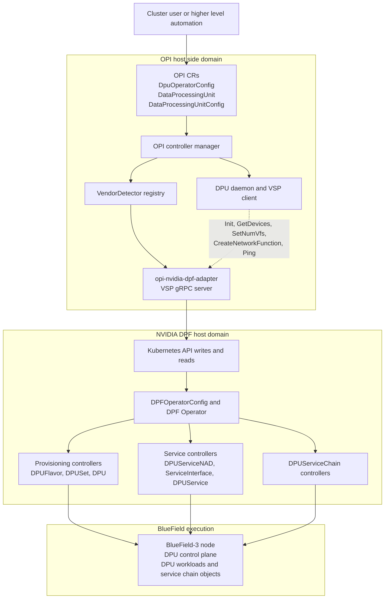
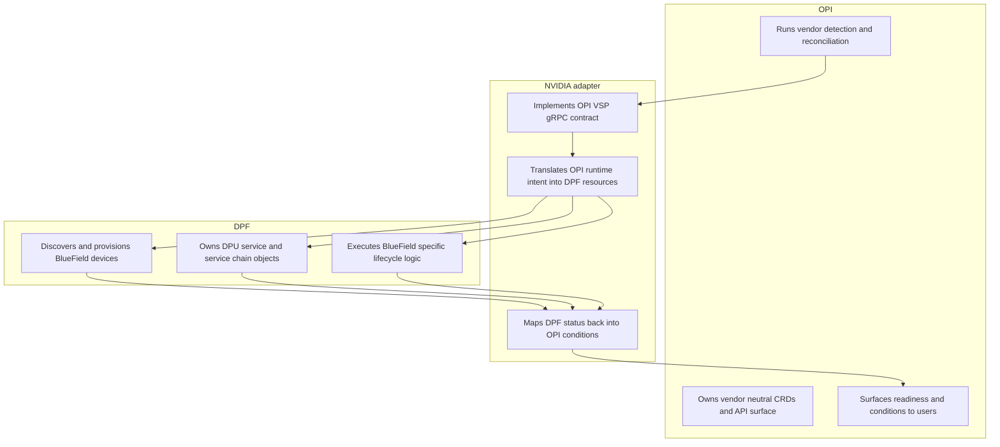
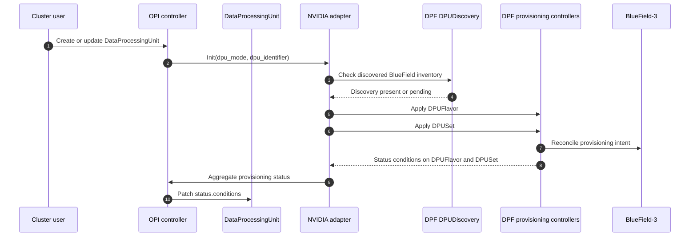
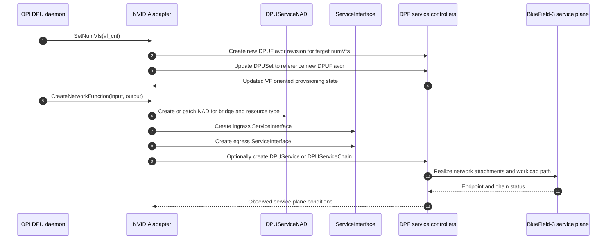
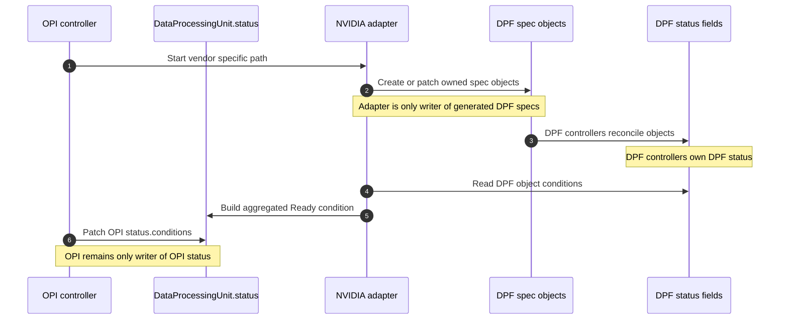

# NVIDIA BlueField Support in the OPI DPU Operator:

**Author:** Mridankan Mandal.

**Methodology note.** This document uses direct reading of the current `opiproject/dpu-operator` and `NVIDIA/doca-platform` source trees. It does not rely on architectural summaries alone. The accompanying Go skeleton was compiled locally and tested against a live cluster. Some details still depend on the target deployment. The selector labels emitted by a DPF installation are one example. Wherever that kind of dependency remains, it is stated explicitly rather than absorbed into the design as if it were already universal.

## 1. Problem Statement:

The task is to add NVIDIA BlueField support to the OPI DPU operator while still reusing NVIDIA's existing DOCA Platform Framework, or DPF. Once stated precisely, the problem changes. It is not simply a matter of attaching another vendor backend. The central question is where the integration boundary should sit, so that OPI remains vendor neutral while DPF continues to own BlueField specific lifecycle logic [5][6].

The OPI codebase makes one point clear almost immediately. A vendor insertion seam already exists. Vendor detection is centralized in `internal/platform/vendordetector.go`. Vendor runtime behavior is exposed through the compact gRPC surface in `dpu-api/api.proto`. Vendor specific pods are already deployed through the `DataProcessingUnitReconciler` path [1][2][3]. DPF leads to a parallel conclusion. It is not a thin helper library. It is already a substantial control plane with provisioning, DPU service, and service chain subsystems, and it assumes a host cluster and DPU cluster split [5][6][7].

Those observations shape the rest of the design. A credible architecture should use the OPI seam that already exists, avoid copying DPF internals into OPI, and leave BlueField specific control logic where it already belongs, inside DPF.

## 2. Codebase Grounding:

From OPI, the most relevant facts are these:

- `VendorDetector` is the actual registration seam for a new vendor, and `NewDpuDetectorManager()` is the place where a new detector would be added [1].
- `DataProcessingUnitReconciler` already resolves vendor specific manifest directories and vendor specific VSP images using `getVendorDirectory()` and `getVSPImageForDPU()` [2].
- The current vendor runtime contract is intentionally small. It consists of `Init`, `GetDevices`, `SetNumVfs`, `CreateNetworkFunction`, `DeleteNetworkFunction`, and `Ping` [3].
- `DataProcessingUnit` currently carries only a small amount of state, namely the DPU product name, node name, and whether the resource is on the DPU side [8].
- `DpuOperatorConfig` is cluster scoped and currently exposes only a small spec surface. Its present content is not rich enough to encode full BlueField service intent [9].
- `DataProcessingUnitConfig` exists, but it is still scaffold level. It still contains placeholder content, so it is not yet a reliable source for rich vendor policy translation [4].

From DPF, the most relevant facts are these:

- DPF is explicitly documented as a system that provisions and orchestrates BlueField DPUs in Kubernetes environments [5].
- DPF uses a host cluster and DPU cluster model. Provisioning and orchestration are separated into multiple controller families, not into one monolithic controller [6][7].
- `DPFOperatorConfig` already owns broad operator level settings such as deployment mode and networking configuration [10].
- `DPUDiscovery` already models discovery of BlueField hardware [11].
- `DPUFlavor` already carries NIC and VF related configuration, including `ewNicConfigurations[].numVfs` [12].
- `DPUFlavor.spec` is immutable, so VF count changes need a new flavor revision and a `DPUSet` update that points at it [12][13].
- `DPUSet` already models provisioning intent for a selected set of DPUs [13].
- `DPUServiceNAD`, `ServiceInterface`, `DPUService`, and `DPUServiceChain` already model the service side and the network attachment side of the DPU datapath [14][15][16][17].

There is also a useful ecosystem level precedent. OPI already contains vendor bridge repositories such as `opi-nvidia-bridge`, `opi-intel-bridge`, and `opi-marvell-bridge`. A bridge or adapter pattern is therefore already familiar to the project [18].

## 3. Design Constraints:

The architecture should satisfy the following constraints:

- OPI must remain vendor neutral.
- NVIDIA specific provisioning logic should stay inside DPF.
- The design should fit the current OPI code structure instead of assuming a future OPI API that does not yet exist.
- The first implementation should keep OPI core changes small and reviewable.
- Status must still surface back into OPI resources so that OPI remains the operator interface seen by users.
- The design should generalize to another vendor later, such as AMD, without changing the overall OPI control model.

## 4. Approach And Boundaries:

The analysis proceeds in three steps.

- The current OPI and DPF source trees were read closely in order to identify the real extension seam before proposing any new abstraction.
- The proposal was constrained to the smallest integration boundary that the current OPI APIs can support honestly.
- Any step that would require inventing declarative input not yet exposed by OPI was deferred.

The resulting scope is intentionally narrower than a full production integration. It identifies the first implementation slice that can be justified from the present source base. It also explains why that slice is a safe starting point and how it can expand later.

## 5. Design Decision:

The design adopted here is a **thin NVIDIA adapter behind the existing OPI VSP seam**.

Under this arrangement, OPI does not attempt to absorb DPF. It continues to do the things it already does well:

- detect the vendor.
- reconcile `DataProcessingUnit` objects.
- deploy the vendor specific sidecar or pod that implements the VSP contract.
- expose status back to the user through OPI resources.

The new NVIDIA specific pod, here called `opi-nvidia-dpf-adapter`, implements the current OPI VSP gRPC interface and translates those calls into DPF resources. DPF then continues to own:

- BlueField discovery.
- BlueField provisioning.
- DPU cluster lifecycle.
- DPU service lifecycle.
- DPU service chain lifecycle.

This arrangement fits the current codebase better than a direct DPF to OPI merge, because DPF is already a substantial control plane in its own right [5][6][7]. It also fits better than an immediate full CRD translation. The present OPI CRDs still do not carry enough information for a faithful high level mapping [4][8][9].

## 6. Figures 1A And 1B:

Rendered PNG: [figure1a_control_plane_path.png](diagrams/figure1a_control_plane_path.png).

Figure 1A. Control plane path for OPI to DPF integration. OPI terminates the user visible contract. The adapter terminates the vendor translation boundary. DPF remains responsible for provisioning and DPU service realization. The execution side shown here is the BlueField side, including the DPU cluster context.

Rendered PNG: [figure1b_responsibility_split.png](diagrams/figure1b_responsibility_split.png).

Figure 1B. Responsibility split for OPI to DPF integration. OPI is responsibility set 1, the NVIDIA adapter is responsibility set 2, and DPF is responsibility set 1. OPI owns the vendor neutral API and user visible status. The adapter owns translation. DPF owns BlueField specific lifecycle logic.

## 7. Why The Boundary Sits At The VSP:

The placement of this boundary follows the current code structure. OPI already expects vendor specific behavior to be implemented through a compact plugin or pod interface [1][2][3]. That is how the Intel and Marvell paths are arranged today. NVIDIA can therefore be introduced at a seam the codebase already recognizes, without creating a second and unrelated control path inside OPI.

There is a deeper architectural reason as well. DPF is documented as a multistage system with provisioning, DPU service orchestration, and service chain orchestration [5][6][7]. If OPI were to absorb that logic directly, it would become responsible for DPU discovery, BFB or software lifecycle, DPU cluster management, service deployment, and chain management. In practical terms, that would recreate DPF inside a second codebase. The resulting duplication is exactly the kind of drift this assignment should avoid.

## 8. Provisioning Translation:

Provisioning is the more direct part of the mapping because DPF already models much of it explicitly in its APIs. OPI's `Init` call can therefore be translated into a DPF flow that first checks state and then applies intent:

As part of this integration, OPI should make one small additive API improvement: persist the raw hardware identifier that detectors already know as `DataProcessingUnit.spec.dpuIdentifier`. That keeps the VSP `Init(dpu_identifier)` path explicit and removes the need to reconstruct identifiers from object naming.

- Check that DPF discovery has identified the target BlueField [11].
- Create a `DPUFlavor` for the target policy, including VF related settings when needed, and let later VF count changes create a new flavor revision instead of patching the existing one [12].
- Create or patch a `DPUSet` that selects the appropriate DPU or host side context [13].
- Let DPF create or reconcile the downstream provisioning objects it already owns [6][7].
- Aggregate DPF status back into OPI `DataProcessingUnit.status.conditions` [2][8].

The result is that `Init` becomes a translation of intent rather than an imperative host side provisioning script. This distinction matters because DPF already encodes deployment mode, networking, and provisioning semantics in its own API and controller model [10][12][13].

## 9. Figure 2:

Rendered PNG: [figure2_provisioning_flow.png](diagrams/figure2_provisioning_flow.png).

Figure 1. Provisioning translation path. OPI initiates reconciliation, but DPF owns the downstream provisioning graph. The adapter is only a translator and status aggregator.

## 10. Service And Datapath Translation:

The service side is less direct because the current OPI runtime input is still quite small. `NFRequest` carries only `input` and `output` strings, and the present DPU daemon code passes concrete endpoint identifiers rather than a rich declarative service policy [3][19].

That limitation has architectural consequences. A first version should not assume that OPI can already synthesize the full range of DPF higher level service objects in every case. A safer starting point is to map current OPI runtime intent into the smallest DPF objects that genuinely match it:

- `SetNumVfs(vf_cnt)` should create a new `DPUFlavor` revision with the desired `ewNicConfigurations[].numVfs`, update the `DPUSet` to reference that new flavor, and, if the exposed VF resource ranges change, also update `NodeSRIOVDevicePluginConfig` style resources on the DPF side [12][13].
- `CreateNetworkFunction(input, output)` should create or patch a `DPUServiceNAD` plus `ServiceInterface` objects that describe the network attachment and endpoint orientation [14][15].
- Where a concrete DPU workload or chain object is needed, the adapter can also materialize a `DPUService` or `DPUServiceChain` using deterministic naming and labels [16][17].

This is still a proper Kubernetes operator pattern because the adapter is translating runtime intent into declarative cluster objects. What it does not do is assume a future OPI service model that does not exist yet.

## 11. Figure 3:

Rendered PNG: [figure3_service_translation.png](diagrams/figure3_service_translation.png).

Figure 1. Service side translation path. The adapter translates compact OPI runtime input into DPF service objects. DPF then realizes the endpoint, network, and chain state on the BlueField side.

## 12. Ownership And Status Model:

The ownership model should be explicit because two operator domains are involved.

- OPI should remain the owner of `DataProcessingUnit.status.conditions` [2][8].
- The NVIDIA adapter should be the only writer of the DPF spec objects it creates.
- DPF controllers should remain the only writers of DPF status fields.
- Every generated DPF object should carry deterministic labels such as OPI DPU name, OPI DPU UID, and adapter ownership markers.
- Generated names should be short, stable, and derived from the DPU identifier and the OPI object identity.

This keeps write ownership unambiguous and makes cleanup deterministic. It also gives the adapter a stable basis for reading DPF status and projecting it back into OPI conditions.

The status path should be event driven. In practice, the OPI side reconciler should watch owned `DPUFlavor`, `DPUSet`, `DPUServiceNAD`, and `ServiceInterface` objects, map those events back to the owning `DataProcessingUnit`, and rely on a slow fallback requeue only if an event is missed.

### Canonical Conditions And Failure Handling:

The adapter should expose a small and stable condition vocabulary on `DataProcessingUnit.status.conditions`, so that OPI remains the user visible contract even if DPF internals change.

| Condition type | Set when | Retry behavior |
| --- | --- | --- |
| `TranslationValid` | The adapter can map the current OPI intent into DPF objects without schema or capability mismatch. | `False` blocks automatic progress until the OPI spec changes. |
| `Progressing` | Required DPF objects are missing, are still reconciling, or have not yet reported readiness. | Keep watching vendor objects and retry automatically. |
| `Degraded` | DPF reports a recoverable provisioning or service plane problem, such as a temporary deployment failure. | Keep watching and retry while surfacing the reason to the user. |
| `Ready` | All required provisioning and service side objects for this OPI DPU are present and report healthy readiness. | `True` stops active retry. `False` remains visible while another condition explains why. |

This also implies a small error taxonomy:

- Validation or translation mismatch should set `TranslationValid=False` and should not create partial vendor resources.
- Ordinary provisioning progress should keep `TranslationValid=True`, set `Progressing=True`, and continue through watch based reconciliation.
- Vendor reported nonterminal failures should set `Degraded=True` while preserving the underlying progress signal.
- Terminal failures should set `Ready=False` and `Degraded=True` with the vendor reason preserved as closely as possible.

## 13. Figure 4:

Rendered PNG: [figure4_status_ownership.png](diagrams/figure4_status_ownership.png).

Figure 1. Status and ownership flow. OPI owns OPI status. DPF owns DPF status. The adapter is the only translation layer between them.

## 14. Why Full `DPUDeployment` Translation Is Deferred:

Direct translation into `DPUDeployment` is initially appealing because DPF already uses that object to group provisioning and service resources [20]. However, the current OPI APIs still make that choice premature.

OPI does not yet expose enough structured declarative input to make a full `DPUDeployment` translation consistently faithful:

- `DpuOperatorConfig` is still very small [9].
- `DataProcessingUnitConfig` is still scaffold level [4].
- `NFRequest` is endpoint pair oriented rather than service bundle oriented [3][19].

For that reason, a lower level translation is the more honest and more robust choice for phase 1. The adapter should first translate OPI's current runtime intent into `DPUFlavor`, `DPUSet`, `DPUServiceNAD`, `ServiceInterface`, `DPUService`, and `DPUServiceChain`. If OPI later grows a richer declarative service model, likely through `DataProcessingUnitConfig`, the same adapter can move upward toward a more direct `DPUDeployment` translation.

## 15. Required OPI Changes:

The OPI side change set can remain intentionally small:

- Add `NewNvidiaDetector()` to the detector registry in `vendordetector.go` [1].
- Add `spec.dpuIdentifier` to `DataProcessingUnit`, and set it when detector code creates each `DataProcessingUnit` object.
- Add a vendor specific manifest directory such as `vsp/nvidia` so that `DataProcessingUnitReconciler` can deploy the NVIDIA adapter pod using the same pattern it already uses for other vendors [2].
- Add an image key for the NVIDIA adapter so that `getVSPImageForDPU()` can resolve it [2].
- Add the adapter implementation that serves the current OPI gRPC VSP contract and translates to DPF resources [3].
- Add a status mapper that aggregates DPF conditions back into OPI `DataProcessingUnit` conditions [2][8].

This keeps the OPI core diff narrow while still making NVIDIA a first class supported backend.

## 16. Risks And Mitigations:

This design has four main risks.

- **Risk 1. OPI intent is currently too small for rich DPF service graphs.** 
 Mitigation. Phase 1 uses the existing VSP seam and translates current OPI runtime intent into low level DPF objects. Phase 2 can extend `DataProcessingUnitConfig` into a richer declarative surface [4].

- **Risk 1. Namespaced DPF resources must be correlated with cluster scoped OPI resources.** 
 Mitigation. The adapter should own one DPF namespace and label every generated object with the OPI DPU identity, which gives deterministic selection, cleanup, and status aggregation [6][7].

- **Risk 1. Dual writers could create status ambiguity.** 
 Mitigation. OPI patches only OPI status. DPF patches only DPF status. The adapter patches only generated DPF spec objects.

- **Risk 1. Future service model growth could invalidate a low level translation.** 
 Mitigation. The adapter is a translation boundary by design, so richer OPI intent can be adopted later without changing the OPI controller topology.

## 17. Trade Off Analysis:

Three candidate architectures were considered.

- **Option A. Reimplement DPF behavior inside OPI.** 
 Rejected. This would duplicate DPF's provisioning and service orchestration systems and would quickly drift from upstream DPF behavior [5][6][7].

- **Option B. Thin NVIDIA adapter behind the current OPI VSP seam.** 
 Selected. This option aligns best with the present OPI code structure, preserves DPF as the BlueField backend, and keeps the OPI core diff small [1][2][3].

- **Option C. Immediate high level CRD translation to `DPUDeployment`.** 
 Deferred. This is architecturally attractive, but the current OPI declarative surface is not yet strong enough to make it a fully faithful translation in phase 1 [4][9][20].

## 18. Validation, Limits, And Next Steps:

This submission was validated in three ways. It was reviewed as a design artifact. It was compiled as a real implementation skeleton. It was also tested through a live Kubernetes integration harness against actual OPI and DPF CRDs.

- `feature_skeleton.go` was compiled under Linux with the real `controller-runtime` and Kubernetes dependency graph, and it was also formatted and artifact checked inside Ubuntu 24.04.4 running in Oracle VirtualBox.
- A live `k3s` integration harness was run against actual `DataProcessingUnit`, `DPUFlavor`, `DPUSet`, `DPUServiceNAD`, and `ServiceInterface` CRDs. That run exposed two real problems during development: invalid Kubernetes label values derived from raw product strings, and the immutability of `DPUFlavor.spec`. The skeleton was then corrected to handle both.
- `llm_transcript.json` was validated as proper JSON.

The limits are deliberate:

- The Go skeleton uses unstructured DPF objects instead of importing DPF Go modules, because the assignment asks for a self contained foundational file rather than a full multi module repository.
- The service path stops at `DPUServiceNAD` and `ServiceInterface` as the honest phase 1 mapping, because current OPI runtime input is still endpoint pair oriented.
- The current upstream OPI `DataProcessingUnit` CR does not yet carry `spec.dpuIdentifier`, so the skeleton models that field as the intended additive API fix and keeps annotation or name based fallback only as a compatibility path.
- The DPU selector used in the skeleton is deterministic and readable, but a real implementation would align it with the exact labels emitted by DPF discovery in the target deployment.

If I had more time, I would proceed in this order:

- replace the unstructured DPF objects with the generated DPF API types in a real Go module.
- add a real `NvidiaDetector` and a `vsp/nvidia` manifest directory to an OPI fork.
- add envtest or Kind based reconciliation tests for status mapping, secondary watches, and ownership behavior.
- validate the selector and service translation against a real DPF installation.

## 19. Future Vendor Onboarding Plan:

The same architecture can extend to another vendor later. That is not an afterthought. It follows from choosing the right seam at the start. Because the reusable parts are already in the right place, the next vendor should follow a deliberate onboarding plan rather than forcing a redesign.

1. Confirm the real OPI extension seam first, namely detector registration, VSP deployment wiring, and the vendor gRPC contract [1][2][3].
2. Read the target vendor stack at source level and identify its true declarative ownership objects, status objects, and immutable fields before proposing any mapping.
3. Add a vendor specific detector plus a minimal additive identifier field if the existing OPI CRs do not carry enough information to address hardware deterministically.
4. Implement the new adapter behind the same OPI seam, keeping OPI status as the public contract and the vendor stack as the owner of hardware specific lifecycle logic.
5. Validate the translation with live CRDs early, because immutable vendor fields, selector assumptions, and label constraints are easiest to catch there.

For AMD or another IPU or DPU stack, the new work should therefore remain in detector registration, vendor manifest wiring, and the downstream adapter implementation, not in redesigning OPI core.

## 20. Conclusion:

The proposed architecture is a narrow, code grounded adapter design.

OPI should continue to act as the vendor neutral control plane and status surface. NVIDIA DPF should continue to act as the BlueField provisioning and service lifecycle backend. The integration boundary should remain the existing OPI vendor VSP seam. That is where the present implementation already expects vendor specific behavior to live [1][2][3].

Compared with a full DPF merge, this design is smaller and better aligned with the current code structure. Compared with an immediate high level CRD translation, it asks less of the present OPI API surface. It fits the current OPI codebase. It respects the existing DPF architecture. It keeps the first upstream diff reviewable. It also leaves a clean path for later API growth in OPI [4][5][6][7].

## References:

1. OPI DPU Operator. `internal/platform/vendordetector.go`. https://github.com/opiproject/dpu-operator/blob/main/internal/platform/vendordetector.go.
2. OPI DPU Operator. `internal/controller/dataprocessingunit_controller.go`. https://github.com/opiproject/dpu-operator/blob/main/internal/controller/dataprocessingunit_controller.go.
3. OPI DPU Operator. `dpu-api/api.proto`. https://github.com/opiproject/dpu-operator/blob/main/dpu-api/api.proto.
4. OPI DPU Operator. `api/v1/dataprocessingunitconfig_types.go`. https://github.com/opiproject/dpu-operator/blob/main/api/v1/dataprocessingunitconfig_types.go.
5. NVIDIA DOCA Platform Framework Documentation. Overview. https://docs.nvidia.com/networking/display/dpf25101.
6. NVIDIA DOCA Platform Framework repository. `docs/public/developer-guides/architecture/system-overview.md`. https://github.com/NVIDIA/doca-platform/blob/public-main/docs/public/developer-guides/architecture/system-overview.md.
7. NVIDIA DOCA Platform Framework repository. `docs/public/developer-guides/architecture/component-description.md`. https://github.com/NVIDIA/doca-platform/blob/public-main/docs/public/developer-guides/architecture/component-description.md.
8. OPI DPU Operator. `api/v1/dataprocessingunit_types.go`. https://github.com/opiproject/dpu-operator/blob/main/api/v1/dataprocessingunit_types.go.
9. OPI DPU Operator. `api/v1/dpuoperatorconfig_types.go`. https://github.com/opiproject/dpu-operator/blob/main/api/v1/dpuoperatorconfig_types.go.
10. NVIDIA DOCA Platform Framework. `api/operator/v1alpha1/dpfoperatorconfig_types.go`. https://github.com/NVIDIA/doca-platform/blob/public-main/api/operator/v1alpha1/dpfoperatorconfig_types.go.
11. NVIDIA DOCA Platform Framework. `api/provisioning/v1alpha1/dpudiscovery_types.go`. https://github.com/NVIDIA/doca-platform/blob/public-main/api/provisioning/v1alpha1/dpudiscovery_types.go.
12. NVIDIA DOCA Platform Framework. `api/provisioning/v1alpha1/dpuflavor_types.go`. https://github.com/NVIDIA/doca-platform/blob/public-main/api/provisioning/v1alpha1/dpuflavor_types.go.
13. NVIDIA DOCA Platform Framework. `api/provisioning/v1alpha1/dpuset_types.go`. https://github.com/NVIDIA/doca-platform/blob/public-main/api/provisioning/v1alpha1/dpuset_types.go.
14. NVIDIA DOCA Platform Framework. `api/dpuservice/v1alpha1/dpuservicenad_types.go`. https://github.com/NVIDIA/doca-platform/blob/public-main/api/dpuservice/v1alpha1/dpuservicenad_types.go.
15. NVIDIA DOCA Platform Framework. `api/dpuservice/v1alpha1/serviceinterface_types.go`. https://github.com/NVIDIA/doca-platform/blob/public-main/api/dpuservice/v1alpha1/serviceinterface_types.go.
16. NVIDIA DOCA Platform Framework. `api/dpuservice/v1alpha1/dpuservice_types.go`. https://github.com/NVIDIA/doca-platform/blob/public-main/api/dpuservice/v1alpha1/dpuservice_types.go.
17. NVIDIA DOCA Platform Framework. `api/dpuservice/v1alpha1/dpuservicechain_types.go`. https://github.com/NVIDIA/doca-platform/blob/public-main/api/dpuservice/v1alpha1/dpuservicechain_types.go.
18. OPI NVIDIA bridge repository. https://github.com/opiproject/opi-nvidia-bridge.
19. OPI DPU Operator. `internal/daemon/dpusidemanager.go`. https://github.com/opiproject/dpu-operator/blob/main/internal/daemon/dpusidemanager.go.
20. NVIDIA DOCA Platform Framework. `api/dpuservice/v1alpha1/dpudeployment_types.go`. https://github.com/NVIDIA/doca-platform/blob/public-main/api/dpuservice/v1alpha1/dpudeployment_types.go.
