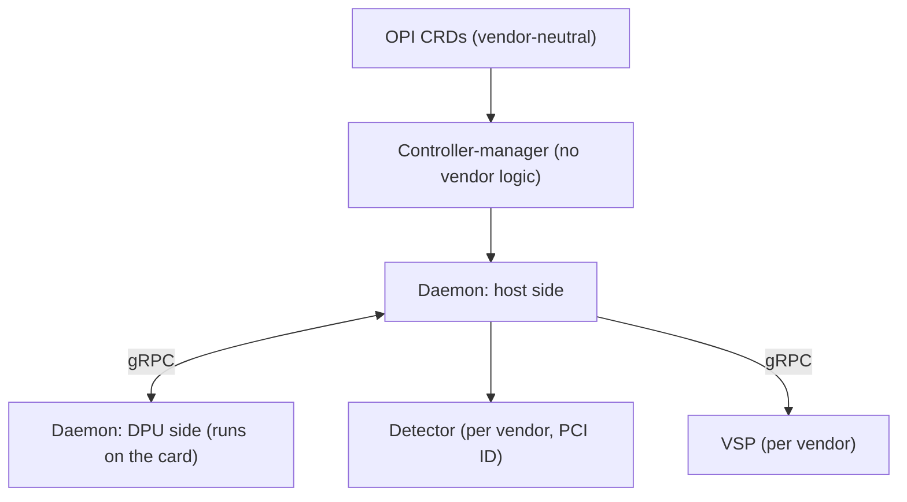
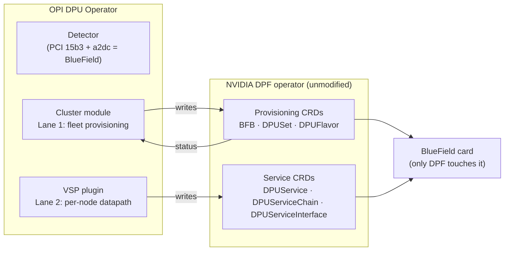
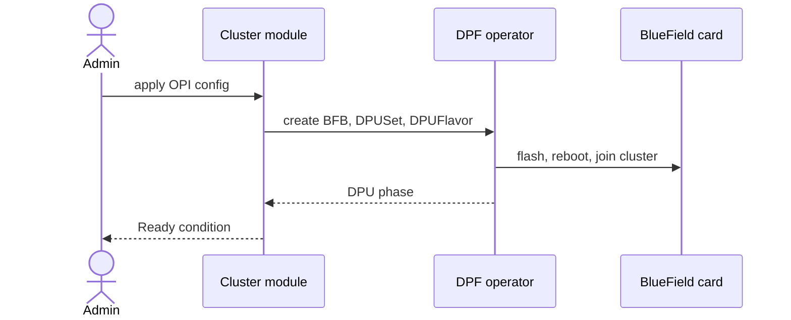
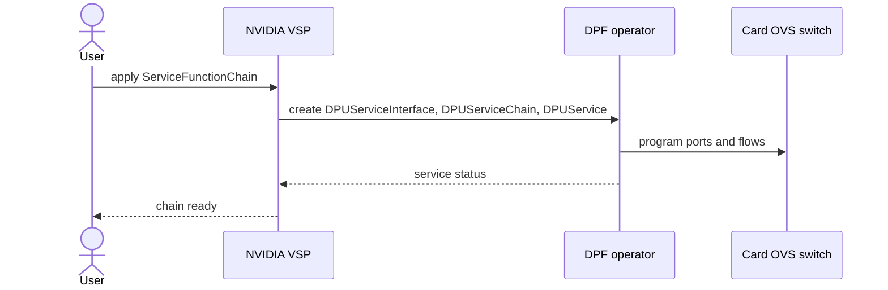

# NVIDIA BlueField Support in the OPI DPU Operator

## 1. Summary

This document proposes adding NVIDIA BlueField DPU support to the OPI DPU Operator by reusing NVIDIA's DOCA Platform Framework (DPF) operator. We do not modify DPF, import its code, or access the hardware directly. Instead, we translate OPI resources into DPF's public Kubernetes APIs and let DPF handle provisioning and datapath configuration.

The integration has three small components:

- a **detector** that identifies BlueField cards by PCI vendor plus device ID;
- a **cluster module** that creates DPF provisioning resources (`BFB`, `DPUSet`, `DPUFlavor`) and updates OPI's `Ready` status (**Lane 1**);
- a **VSP plugin** that converts OPI datapath requests into DPF service resources (`DPUService`, `DPUServiceChain`, `DPUServiceInterface`) (**Lane 2**).

The result is that administrators manage NVIDIA DPUs through the same OPI resources and `kubectl get dataprocessingunits` view as Intel and Marvell, with **no new CRDs** and **no changes to NVIDIA's operator**.

One key design decision came from tracing the OPI source code. Since BlueField does not run OPI's DPU-side daemon, the VSP watches the `ServiceFunctionChain` resource directly instead of waiting for a gRPC call that never arrives (see [Lane 2](#7-lane-2-datapath-flow) and [Verified vs. Assumed](#8-verified-vs-assumed)).

## 2. Background & Context

### The OPI DPU Operator today

The OPI DPU Operator manages DPUs (Data Processing Units, smart NICs with their own CPUs) through vendor-neutral Kubernetes APIs. An administrator interacts with four CRDs: `DpuOperatorConfig` (enable the operator), `DataProcessingUnitConfig` (how to configure DPUs), `DataProcessingUnit` (one per detected card, carries status), and `ServiceFunctionChain` (run network functions on a DPU).

Vendor-specific code lives at two extension points: **detectors** and **VSPs** (Vendor Specific Plugins).

Today the operator supports Intel IPU and Marvell DPUs. There is no NVIDIA support.

### NVIDIA's DPF operator

NVIDIA maintains its own open-source Kubernetes operator for BlueField DPUs: the **DOCA Platform Framework (DPF)**. DPF handles everything hardware-related: downloading firmware (`BFB`), flashing cards, rebooting them, joining them to a DPF-managed cluster, deploying workloads to the card (`DPUService`), and programming the card's OVS switch (`DPUServiceChain`, `DPUServiceInterface`). All of this is driven through DPF's own public CRDs, installed from its released Helm chart.

This creates the integration question this document answers: OPI users want to manage BlueField cards through OPI's vendor-neutral APIs, but rebuilding what DPF already does would be wasteful and unmaintainable. The goal is therefore to maximize reuse of the existing DPF operator while keeping the integration aligned with the OPI operator's existing architecture.

## 3. Design Goals & Non-Goals

### Goals

1. **Maximize reuse of DPF.** NVIDIA already open-sourced and maintains the hard parts (firmware flashing, provisioning, OVS programming). We only translate between APIs.
2. **Fit the operator's existing architecture.** New code goes where vendor code already goes: a detector, a VSP, and vendor translation logic. No deployment units beyond the standard per-vendor VSP pod, no parallel operator.
3. **Keep the admin experience vendor-neutral.** NVIDIA cards are managed through the same OPI CRDs and appear in the same `kubectl get dataprocessingunits` view as Intel and Marvell.
4. **Fail visibly, never destructively.** Every failure surfaces as a status condition on an OPI resource. The integration has no code path that can damage a card.
5. **Production-shaped simplicity.** The pilot cuts scope (one pinned DPF version, config via ConfigMap), but every shortcut is stated and has a clear path to the production version.

### Non-Goals (things we deliberately never do)

1. **Never fork or modify DPF.** It is installed as-is from its released Helm chart. Every NVIDIA release works without a rebase.
2. **Never import NVIDIA Go code.** We write DPF objects as unstructured resources against pinned API versions. A startup capability probe checks the installed DPF version and fails fast with one clear error on mismatch.
3. **Never touch hardware.** Only DPF's own code speaks to the card (rshim, DMS). Our worst possible direct failure is "not provisioned", reported as a condition; every disruptive action goes through NVIDIA's own validated path.
4. **No new CRDs.** The pilot needs none. A richer vendor-neutral datapath CRD is a possible future community proposal, not a dependency of this design.

## 4. Architecture Overview

The integration is split into **two lanes** by scope. Fleet-wide provisioning work (which cards to flash, with what firmware) is cluster-scoped, so it lives in the controller-manager. Per-node datapath work (wire this chain on this node's card) is node-scoped, so it lives in the VSP. This matches how the rest of the operator is already split.

We build exactly three small pieces, each at an existing extension point.

**1. Detector** (`internal/platform/`). A new `NvidiaBlueFieldDetector` that recognizes a BlueField card by PCI vendor `15b3` plus a BlueField device ID (`a2dc` for BlueField-3; to confirm on hardware), so plain Mellanox ConnectX NICs are not misdetected. It is added to the detector list marked `// add more detectors here` (`internal/platform/vendordetector.go:69`), exactly where the Intel, Marvell, and NetSec detectors already register (the Marvell detector matches vendor plus device the same way, `marvell-dpu.go:35`). This is the same ~60-line pattern every other vendor follows; it produces a `DataProcessingUnit` object so NVIDIA cards appear in the same inventory as Intel and Marvell.

**2. Cluster module (Lane 1)**. Fleet-scoped translation inside the existing controller-manager. It reads OPI intent (`DataProcessingUnit` / `DataProcessingUnitConfig`), creates the DPF provisioning objects (`BFB`, `DPUSet`, `DPUFlavor`) that tell DPF which cards to flash and how, then watches DPF's `DPU` objects and folds their provisioning phase back into OPI's standard `Ready` condition. This is the one component that adds vendor logic to the cluster tier; section 9 explains why fleet work belongs here rather than in the per-node plugin.

**3. VSP plugin (Lane 2)** (`internal/daemon/vendor-specific-plugins/`). OPI's standard per-node vendor plugin, implementing the same gRPC contract as the Intel and Marvell VSPs. Its job is translation: it turns datapath intent into DPF service objects (`DPUService`, `DPUServiceChain`, `DPUServiceInterface`), and DPF programs the card's OVS switch. Because a BlueField never runs OPI's DPU-side daemon, this VSP watches the `ServiceFunctionChain` resource directly rather than being driven by the DPU-side CNI path (detailed in [Lane 2](#7-lane-2-datapath-flow)).

Everything else, the firmware flashing, the reboot, the OVS programming, is done by DPF's own unmodified controllers. Our three pieces only read and write DPF's public objects.

## 5. CRD Mapping

The whole design is a translation between two families of Kubernetes objects. Users only ever touch the OPI family; our code reads it and writes the DPF family. We create **no new CRDs** in either family.

### OPI CRDs (the vendor-neutral API the admin uses)

| CRD | Group | Meaning |
|---|---|---|
| `DpuOperatorConfig` | `config.openshift.io` | Turn the operator on |
| `DataProcessingUnitConfig` | `config.openshift.io` | How to configure DPUs of a type |
| `DataProcessingUnit` | `config.openshift.io` | One per detected card; carries `Ready` status |
| `ServiceFunctionChain` | `config.openshift.io` | Run network functions between interfaces on a DPU |

### DPF CRDs (installed by NVIDIA's Helm chart; we only read/write, never define)

| CRD | Group | Purpose |
|---|---|---|
| `BFB` | `provisioning.dpu.nvidia.com` | Firmware bundle to flash |
| `DPUSet` | `provisioning.dpu.nvidia.com` | Which cards to provision |
| `DPUFlavor` | `provisioning.dpu.nvidia.com` | Card configuration |
| `DPU` | `provisioning.dpu.nvidia.com` | One per card; carries DPF's provisioning phase |
| `DPUService` | `svc.dpu.nvidia.com` | Workload deployed to the card |
| `DPUServiceChain` | `svc.dpu.nvidia.com` | The wiring between ports |
| `DPUServiceInterface` | `svc.dpu.nvidia.com` | A port on the card's switch |

### The two translations

| Lane | OPI input (read) | DPF output (written) | Status folded back |
|---|---|---|---|
| **Lane 1** (cluster module) | `DataProcessingUnit`, `DataProcessingUnitConfig` | `BFB`, `DPUSet`, `DPUFlavor` | `DPU.status.phase` → OPI `Ready` condition |
| **Lane 2** (VSP) | `ServiceFunctionChain` | `DPUServiceInterface`, `DPUServiceChain`, `DPUService` | DPF service status → daemon health |

The mapping is deliberately narrow: each OPI field maps to a DPF field we can point at directly. The one place the mapping is not one-to-one is the network-function image, which DPF expects as a Helm chart rather than a raw image; that gap and its resolution are covered in [Lane 2](#7-lane-2-datapath-flow).

## 6. Lane 1: Provisioning Flow

Lane 1 is fleet-wide and runs once per cluster. It takes an admin's vendor-neutral request and turns it into the DPF objects that provision BlueField cards, then reports DPF's progress back through OPI's own status.

| Step | Who | What happens |
|---|---|---|
| 1 | Admin | Applies normal OPI objects (`DpuOperatorConfig`, `DataProcessingUnitConfig`). Nothing NVIDIA-specific. |
| 2 | OPI detector (per node) | Sees PCI vendor `15b3` plus a BlueField device ID (`a2dc`), creates a `DataProcessingUnit` object, exactly as the Intel and Marvell flows do. |
| 3 | Cluster module | Checks a compatible DPF is installed (capability probe, fails fast with one clear error if not). Then creates the `BFB`, `DPUSet`, and `DPUFlavor` objects, once, each carrying our ownership label. |
| 4 | DPF operator | Does the real work: downloads firmware, flashes the card, reboots it, joins it to the DPF cluster. Walks its own provisioning state machine on the `DPU` object. |
| 5 | Cluster module | Watches those `DPU` objects and folds the phase into OPI's `Ready` condition: `Ready=True` (done), `Ready=False`/Provisioning (in progress), `Ready=False`/Error (failed, reason attached). |
| 6 | Admin | `kubectl get dataprocessingunits`: NVIDIA cards appear next to Intel and Marvell, one view. |

The only vendor-specific object the admin never sees is the DPF provisioning set; from their side it is the same three OPI resources they already use for Intel and Marvell. The cluster module never touches the card, it only creates the objects that instruct DPF to.

## 7. Lane 2: Datapath Flow

Lane 2 is per-node and runs on demand. A user asks for a network function to run between interfaces on a DPU; the VSP translates that into DPF service objects, and DPF programs the card's OVS switch.

| Step | Who | What happens |
|---|---|---|
| 1 | User | Applies a `ServiceFunctionChain`: run this network function between these interfaces on that node's DPU. |
| 2 | NVIDIA VSP | Watches the `ServiceFunctionChain` resource directly and reads the requested chain. |
| 3 | NVIDIA VSP | Translates it into DPF service objects: `DPUServiceInterface` (the ports), `DPUServiceChain` (the wiring), `DPUService` (the workload). |
| 4 | DPF operator | Deploys the workload to the card and programs the card's OVS switch, host CPU bypassed. |
| 5 | NVIDIA VSP | Reads DPF's service status back and reports chain health. |

One detail in step 2 is not obvious and comes from tracing the code: the VSP watches the `ServiceFunctionChain` resource rather than being called over gRPC, because OPI's network-function call fires only from the DPU-side daemon, which a BlueField never runs. That finding and its justification are in [Verified vs. Assumed](#8-verified-vs-assumed) and [Trade-off Analysis](#9-trade-off-analysis); the two consequences it creates (the VSP running a small watch loop, and the Helm wrapper chart the `DPUService` needs) are covered in [Failure Modes & Safety](#10-failure-modes--safety) and [Future Work](#11-future-work).

## 8. Verified vs. Assumed

What was checked against the source code, and what remains an assumption with a mitigation.

### Verified against the code

| Claim | Evidence |
|---|---|
| New vendor detectors register in one list | `internal/platform/vendordetector.go:69` |
| The controller-manager's reconciler logic has no vendor-specific branching today | No vendor names appear in any Go file under `internal/controller/`. The only vendor references are the VSP pod manifests under `internal/controller/bindata/vsp/` (intel-ipu, intel-netsec, marvell-dpu), which are deployment assets, not control flow, and are the same seam our `nvidia-bluefield/` template would slot into. |
| The network-function call has exactly one caller, on the DPU side | `internal/daemon/dpusidemanager.go:156` |

This last row is what the whole Lane 2 design rests on: because a BlueField never runs the DPU-side daemon, the only caller of `CreateNetworkFunction` never runs, so the VSP watches the `ServiceFunctionChain` CR instead.

### Assumed, with mitigation

| Assumption | Mitigation if wrong |
|---|---|
| The host-side path can drive the VSP end to end for a host-only vendor | Verify on hardware before implementation; this is the one precondition for Lane 2 |
| DPF is installed and the pinned API versions match | Startup capability probe fails fast as a condition, not a crash loop |
| `DPUService` can run an arbitrary image via a generic wrapper chart | Build and host one small wrapper chart (see [Future Work](#11-future-work)) |

## 9. Trade-off Analysis

### Why two lanes, and not the alternatives

| Approach | What it means | Why not |
|---|---|---|
| Rebuild NVIDIA support from scratch | Write our own firmware, flashing, reboot logic | Reimplements what NVIDIA already open-sourced; impossible to keep correct without NVIDIA's help |
| Fork NVIDIA's operator | Copy DPF's code into the OPI operator | Every NVIDIA release becomes a painful rebase; large dependency bloat |
| Separate translator operator | A brand-new operator plus new CRDs between OPI and DPF | Heavy: a new component to install and own, a new API the community must debate; OPI itself still would not "support NVIDIA" |
| Everything in the node plugin | The VSP creates all NVIDIA objects, including fleet-wide ones | 100 nodes means 100 plugins racing to write the same fleet object; works via idempotent apply, but inelegant |
| **Two-lane split (chosen)** | Fleet work in the cluster module, per-node work in the VSP | Fits both scale and OPI's existing architecture; zero new CRDs |

The two-lane split keeps the substantive per-node plugin (OPI's own required mechanism) and moves only the fleet-scoped work up to the cluster tier, where cluster-scoped objects belong. This is why the cluster module adds the first vendor-specific reconciler logic to the controller-manager (today it holds only vendor VSP manifests as bindata, no vendor Go code): not because it is convenient, but because fleet objects like `DPUSet` are cluster-scoped and do not belong in a per-node plugin.

### The NF trigger

The code trace showed a problem: the call that wires a network function (`CreateNetworkFunction`) is only ever triggered from the daemon on the DPU card, which a BlueField never runs. So without a fix, nothing would trigger Lane 2. There were two ways to solve it.

- **Option 1: change OPI's shared daemon** so the host side can fire the trigger too. This is the cleaner long-term fix and would help any future host-only vendor, but it edits core code that Intel and Marvell also run, so it needs the maintainers' approval.
- **Option 2 (chosen): let the NVIDIA plugin watch the `ServiceFunctionChain` resource itself** and act when one appears. This adds only NVIDIA code, changes nothing in OPI's core, and fits naturally because DPF already programs the card's switch. The cost is that the VSP becomes a small controller: it needs a service account, RBAC to read `ServiceFunctionChain` and write the DPF service CRDs, and a watch loop, a modest addition over today's pure-gRPC VSPs.

We chose Option 2 for the pilot because it is self-contained and safe. Option 1 is recorded in [Future Work](#11-future-work) as the better long-term contribution.

## 10. Failure Modes & Safety

The integration is designed so that every failure is visible and none is destructive.

**No hardware path.** Only DPF touches the card; our code only reads and writes Kubernetes objects. So we never touch hardware directly, but our objects still *instruct* DPF to do disruptive things (a wrong `DPUSet` selector would flash and reboot the wrong cards). The honest claim: every disruptive action goes through DPF's own validated path.

**Version skew.** We write DPF objects as unstructured resources against pinned API versions. A startup probe checks the installed DPF and fails fast as a condition, not a crash loop. The pilot pins one tested DPF release.

**Coexistence.** Everything we create carries an ownership label and our own field manager, so we only touch objects we own and coexist with any pre-existing DPF install.

**Host-side NF pods.** OPI's reconciler still creates network-function pods on the host requesting `openshift.io/dpu`. Since the NVIDIA workload runs on the card via `DPUService`, the pilot exposes the card's host-facing VFs through the VSP's device-plugin path so those pods schedule instead of sitting Pending.

## 11. Future Work

The pilot deliberately cuts scope. Each shortcut below has a clear path to a production version.

**Host-side network-function handler (upstream).** The pilot works around the DPU-side-only `CreateNetworkFunction` trigger by having the VSP watch the CR (Option 2 in [Trade-off Analysis](#9-trade-off-analysis)). The cleaner long-term fix is to add a host-side network-function handler to the daemon core, so any host-only vendor (not just NVIDIA) gets a proper trigger. This touches OPI core and should be proposed upstream with maintainer buy-in.

**A generic `VendorClusterModule` interface.** The cluster module is the first vendor-specific reconciler logic in the controller-manager. Rather than leaving it NVIDIA-shaped, it should be introduced behind a small generic interface mirroring `VendorDetector`, with NVIDIA as the first implementation. This keeps the cluster tier extensible and makes upstream review easier.

**The Helm wrapper chart.** DPF's `DPUService` needs a Helm chart, while OPI models a network function as an image. The pilot ships one small generic wrapper chart that runs an arbitrary image via Helm values. Standardizing which packaging convention OPI adopts (wrapper chart, chart-by-convention, or an optional chart reference on the NF spec) is an open question for the community.

## 12. References

- **OPI DPU Operator** (this repository): detector seam `internal/platform/vendordetector.go:69`; VSPs `internal/daemon/vendor-specific-plugins/`; SFC reconciler `internal/daemon/sfc-reconciler/sfc.go`; network-function call site `internal/daemon/dpusidemanager.go:156`; host-side manager `internal/daemon/hostsidemanager.go`; status conditions `internal/controller/dataprocessingunit_controller.go`; OPI CRDs `config/crd/bases/`.
- **NVIDIA DOCA Platform Framework (DPF)**: public operator, CRDs, and Helm chart, from the [`NVIDIA/doca-platform`](https://github.com/NVIDIA/doca-platform) repository and NVIDIA's [DPF documentation](https://docs.nvidia.com/networking/display/dpf2504). Verified API groups and Kinds: `provisioning.dpu.nvidia.com/v1alpha1` (`BFB`, `DPUSet`, `DPUFlavor`, `DPU`) and `svc.dpu.nvidia.com/v1alpha1` (`DPUService`, `DPUServiceChain`, `DPUServiceInterface`), confirmed against the [DPF API reference](https://github.com/NVIDIA/doca-platform/tree/public-main/docs/public/developer-guides/api).
- **DPF on OpenShift**: [DPU-enabled networking with OpenShift and NVIDIA DPF](https://developers.redhat.com/articles/2025/03/20/dpu-enabled-networking-openshift-and-nvidia-dpf) (Red Hat Developer).
- **BlueField PCI identifiers**: Mellanox/NVIDIA vendor ID `15b3` plus BlueField device IDs (e.g. `a2dc` for BlueField-3), from the public `pci.ids` database.

All sources are public; no non-published information was used.
