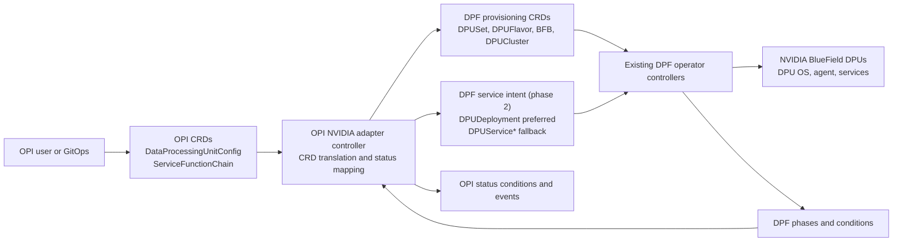
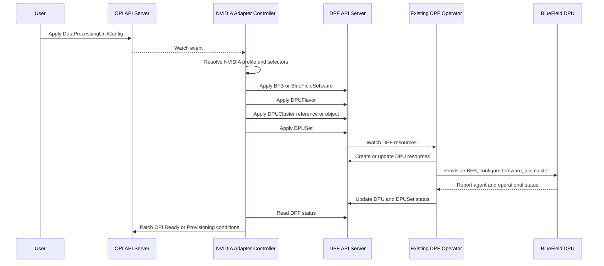
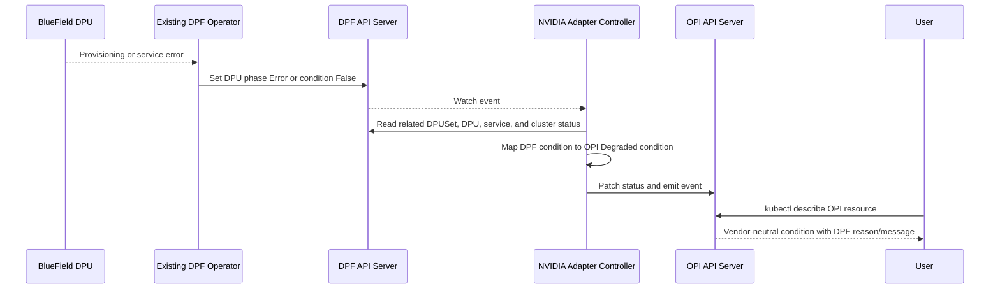
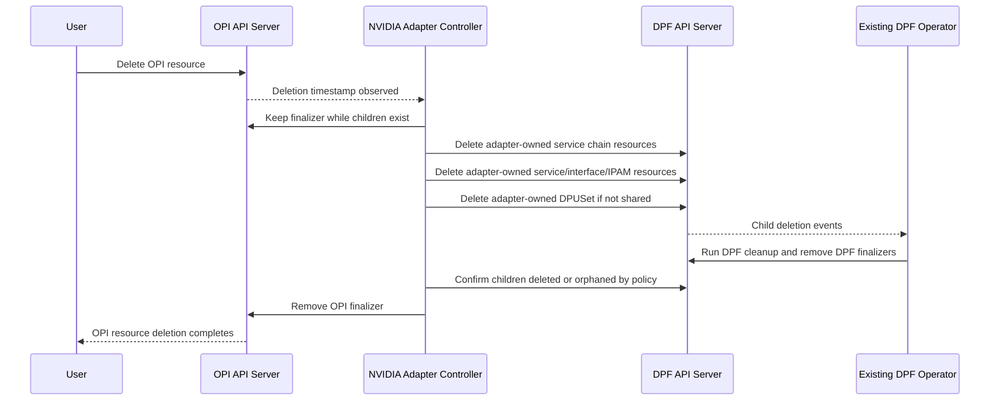

# OPI NVIDIA DPF Architecture Design

## Executive Summary

The recommended architecture is an OPI-owned NVIDIA adapter controller that watches OPI custom resources and translates them into NVIDIA DOCA Platform Framework (DPF) custom resources. OPI remains the vendor-neutral user API. DPF remains the implementation engine for NVIDIA BlueField provisioning, DPU lifecycle management, service deployment, service chaining, and operational health.

This design maximizes reuse of the existing DPF operator. The adapter does not fork DPF logic, does not import DPF controller internals as business logic, and does not expose NVIDIA-specific configuration directly in the OPI user-facing API. It uses standard Kubernetes operator patterns: declarative CRDs, reconciliation, owner references or labels where legal, finalizers, status conditions, idempotent create/update, and watch-driven drift correction.

## Requirements Interpreted From `Readme.md`

- Add NVIDIA support to the OPI DPU operator while preserving OPI's vendor-neutral model.
- Reuse the existing NVIDIA DPF operator as much as possible.
- Align with Kubernetes operator patterns and the current OPI architecture.
- Produce a design that can support an adapter pattern, sub-operator pattern, or CRD translation layer.
- Keep the output machine-readable and reviewer-friendly in Markdown with Mermaid diagrams.
- Treat implementation as optional. This document therefore focuses on architecture and deliberately avoids a full feature implementation.

## Assignment Decomposition and Coverage

| Assignment part | What a reviewer expects | Where it is covered |
|---|---|---|
| LLM prompting and design | Prompts should guide the model through architecture choices rather than one-shot generation. | `llm_transcript.json` shows staged prompts for repo evidence, option comparison, mapping, reconciliation, critique, research, ADRs, and TDD validation. |
| Architecture alignment | Design should fit Kubernetes operator patterns and current OPI APIs. | Current-state observations, API mapping, reconcile behavior, finalizer/status flows, security/RBAC, and testing sections. |
| NVIDIA DPF reuse | DPF should remain the NVIDIA lifecycle engine rather than being copied into OPI. | Recommended architecture, DPF components, `DPUDeployment` mapping, and ADR-001/ADR-002. |
| Required Markdown proposal | Final proposal should include diagrams and trade-offs. | This file includes Mermaid architecture, provision, error/status, and deletion flows plus trade-off analysis and ADRs. |
| Required transcript JSON | Transcript should be structured and machine-readable. | `llm_transcript.json` uses alternating `user` and `assistant` entries. |
| Bonus Go skeleton | Skeleton should compile and model the adapter foundation without claiming full implementation. | `feature_skeleton.go` renders DPF-like objects and condition-style status without external dependencies. |
| Reviewer navigation | Reviewers should quickly see what is included, what changed after critique, and how to validate it. | This document includes source evidence, PR-comparison improvements, validation commands, and limits so the submission can stay within the exact expected file set. |

## Current-State Observations

### Source Evidence Used

| Evidence area | Repository evidence inspected | Design impact |
|---|---|---|
| OPI DPU inventory | `api/v1/dataprocessingunit_types.go` | `DataProcessingUnit` has product, node, DPU-side flag, and conditions, but not enough stable per-device identity for multi-DPU NVIDIA hosts. |
| OPI provisioning intent | `api/v1/dataprocessingunitconfig_types.go` | `DataProcessingUnitConfig` has a DPU selector but lacks NVIDIA provisioning fields, so the design requires administrator-owned provisioning profiles. |
| OPI service-chain intent | `api/v1/servicefunctionchain_types.go` | `ServiceFunctionChain` carries node selection and ordered network functions, but raw name/image entries need service profiles before they can become safe DPF services. |
| OPI operator status/config | `api/v1/dpuoperatorconfig_types.go`, bundle RBAC/finalizer manifests | The architecture uses Kubernetes conditions, finalizers, status updates, and least-privilege RBAC instead of imperative lifecycle scripts. |
| OPI vendor service provider contract | `dpu-api/api.proto`, `internal/daemon/plugin/vendorplugin.go`, OPI EVPN bridge API references | The design covers `DeviceService`, `NetworkFunctionService`, `LifeCycleService`, `DpuNetworkConfigService`, `HeartbeatService`, and bridge-port integration as optional NVIDIA VSP/gRPC surfaces alongside CRD reconciliation. |
| DPF provisioning APIs | `api/provisioning/v1alpha1/dpuset_types.go`, `dpu_types.go`, `dpudevice_types.go`, `dpuflavor_types.go`, `bfb_types.go`, `bluefield_types.go`, `dpucluster_types.go` | DPF remains the NVIDIA lifecycle engine. The adapter renders or references DPF provisioning CRDs rather than reimplementing provisioning logic. |
| DPF service APIs | `api/dpuservice/v1alpha1/dpudeployment_types.go`, `dpuservice_types.go`, `dpuservicechain_types.go`, `dpuserviceinterface_types.go`, `dpuserviceipam_types.go` | `DPUDeployment` is the preferred production mapping for service-chain intent, with lower-level service CRDs retained for profile and compatibility paths. |

### OPI DPU Operator

- The OPI README describes the DPU operator as vendor-agnostic. Users should be able to use DPU resources without deep vendor-specific expertise.
- `DataProcessingUnit` is cluster-scoped and currently models the DPU product name, whether the object represents the DPU side, and the Kubernetes node name. Its status already uses Kubernetes `metav1.Condition`.
- `DataProcessingUnitConfig` has a `dpuSelector` and a scaffold `foo` field. Its controller is currently scaffolded, so it is a natural place to add provisioning intent without preserving today's placeholder shape as final API.
- `ServiceFunctionChain` has `nodeSelector` and ordered `networkFunctions` with `name` and `image`. Its status is currently empty.
- Current OPI APIs do not yet carry enough stable per-device identity or provisioning intent for lossless NVIDIA translation. The adapter design must treat those as explicit API/profile gaps, not as implicit defaults.
- Existing vendor-specific plugin directories for Intel and Marvell show that OPI already expects vendor integration boundaries, but the NVIDIA path should be controller-level translation rather than daemon-only logic because DPF already owns rich Kubernetes APIs.

### NVIDIA DPF

- DPF provisions and orchestrates NVIDIA BlueField DPUs through Kubernetes APIs.
- DPF's provisioning flow is already modeled around `DPUSet`, `BFB` or `BlueFieldSoftware`, `DPUFlavor`, `DPUCluster`, and generated `DPU` resources.
- `DPUSet` owns DPU selection, update strategy, and DPU template fields. Current DPF APIs prefer `DPUNodeSelector` and `DPUDeviceSelector`; older `nodeSelector` or `dpuSelector` forms should be treated as compatibility inputs only.
- `DPU` has detailed lifecycle phases such as `Initializing`, `Pending`, `Prepare BFB`, `OS Installing`, `DPU Cluster Config`, `Host Network Configuration`, `Ready`, `Error`, and `Deleting`. It also exposes provisioning conditions, operational conditions, firmware, BFB version, DPF version, deployment mode, agent status, and reboot state.
- `DPUFlavor` owns DPU-side configuration such as grub, sysctl, NVConfig, OVS, config files, packages, systemd services, containerd config, resource reservations, and host interface configuration.
- DPF's service model includes `DPUDeployment`, `DPUService`, `DPUServiceTemplate`, `DPUServiceConfiguration`, `DPUServiceChain`, `DPUServiceInterface`, and `DPUServiceIPAM`. `DPUDeployment` is important because it describes a set of DPU services plus a service chain running on selected DPUs with a given BFB or BlueFieldSoftware and DPUFlavor.

## Recommended Architecture

Use a CRD translation controller inside the OPI operator, or as a tightly packaged OPI NVIDIA adapter manager, that watches OPI resources and reconciles DPF resources.

In the current OPI architecture, the NVIDIA path should land behind the existing vendor-detection and VSP extension points first. The CRD adapter is the provisioning and status translation behind that boundary, not a replacement for it.

The OPI API is the northbound interface. The adapter is the boundary. DPF APIs are the southbound implementation. DPF controllers continue to perform provisioning, DPU reboots, BFB handling, DPU cluster joins, Helm-based service deployment, service interface reconciliation, IPAM, service chains, and detailed status production.

The adapter should use DPF public Go API types or Kubernetes unstructured clients for CRD compatibility. It should not import DPF controller packages or copy DPF reconcile logic. The only NVIDIA-specific behavior in OPI should be adapter selection and translation policy.

## Non-Goals

- No fork of DPF provisioning, service, or lifecycle controller logic.
- No full implementation in this task.
- No NVIDIA-specific leakage into the OPI user API.
- No attempt to make OPI own BlueField firmware flashing, rshim, DMS, DPU agent, or DPU cluster internals.
- No replacement of DPF's install, upgrade, or compatibility model.

## Assumptions and Scope

- DPF remains the supported NVIDIA implementation backend and is either preinstalled by the cluster operator or checked by an optional dependency manager.
- OPI owns the vendor-neutral intent API and status surface, not the low-level NVIDIA lifecycle machinery.
- Administrator-owned profiles are acceptable because BFB images, DPU flavors, Helm charts, privileged service settings, and DPU selection are cluster-sensitive controls.
- A production implementation needs OPI API extension or adapter-owned annotations for stable DPU identity before it can safely reconcile multi-DPU hosts.
- This proposal targets architecture and foundational skeleton code. It does not claim hardware validation on BlueField devices.
- The first implementation should fit a small operator team: one adapter controller, profile resolution, status mapping, and compatibility tests before any broader sub-operator packaging.

### Claim Boundaries

- This submission proposes the architecture; it does not claim a complete NVIDIA implementation in OPI.
- The Go skeleton is a compilable foundation for translation and validation behavior; it is not a controller-runtime reconciler.
- Validation performed for this submission is static/document validation plus standalone Go compile/run checks. Real BlueField provisioning remains future lab validation.
- DPF API references are treated as public CRD/status contracts. The design intentionally avoids claims about DPF controller internals.

## Components

### OPI CRDs and Controllers

OPI CRDs remain the user-facing source of intent:

- `DataProcessingUnit` represents observed DPU inventory and high-level readiness.
- `DataProcessingUnitConfig` represents desired provisioning configuration for selected DPUs.
- `ServiceFunctionChain` represents desired network function ordering and target nodes.

Existing OPI controllers continue to reconcile vendor-neutral resources. The NVIDIA adapter registers watches on these APIs and claims only objects selected for NVIDIA-backed DPUs.

### Provider Registry and NVIDIA Provider

The OPI side should not hardcode NVIDIA as a one-off path inside generic reconcilers. A small provider registry gives OPI a stable extension boundary:

- OPI reconcilers normalize intent and ask a provider registry for the provider that can handle the resolved DPU vendor or capability set.
- The NVIDIA provider owns NVIDIA-specific profile resolution, DPF API rendering, DPF status mapping, and VSP delegation.
- Future AMD, Intel, or Marvell providers can register behind the same narrow interface without changing the OPI user API.

The first implementation can keep this simple: a static in-process registry with one NVIDIA provider enabled behind a feature gate. Dynamic plugin loading, separate binaries, or a full provider marketplace would add risk without helping this assignment. The provider registry is an extension boundary, not a new control plane.

### OPI VSP/gRPC Extension Surface

The repository also exposes a vendor service provider contract in `dpu-api/api.proto`. NVIDIA support should not ignore that surface, but it must not create a second writer for the same DPF state.

Single-writer rule:

- OPI CRDs are the source of desired state.
- The CRD adapter is the only phase-1 path that writes DPF provisioning or service intent.
- The VSP/gRPC path is read-only for inventory, initialization, dependency health, and heartbeat in phase 1.
- Future VSP write operations must create or update OPI CRs first, or be rejected until a matching OPI CRD intent exists. They should not mutate DPF resources directly.

Phase-1 inventory also needs one owner. This proposal assumes VSP-backed discovery remains the source of NVIDIA `DataProcessingUnit` inventory. The CRD adapter consumes that inventory plus explicit bindings to DPF `DPU` objects; it does not create a second inventory source from selectors alone.

With that guardrail, NVIDIA support can use two integration surfaces without split-brain behavior:

- The CRD adapter translates cluster desired state into DPF public CRDs.
- A NVIDIA VSP or daemon adapter satisfies OPI vendor gRPC operations for device inventory, initialization, and health checks. Mutating network-function requests are routed through OPI CRD intent.

Relevant VSP and OPI service surfaces:

- `DeviceService.GetDevices` can feed inventory and preflight checks before provisioning. `DeviceService.SetNumVfs` should be deferred or routed through OPI intent plus an approved profile because it changes device configuration.
- `NetworkFunctionService.CreateNetworkFunction` and `DeleteNetworkFunction` should create/update OPI service-chain intent or return an unsupported/deferred response in phase 1. They must not bypass the CRD adapter and write DPF resources directly.
- `DpuNetworkConfigService.SetDpuNetworkConfig` should be treated as a mode/configuration signal and policy input in phase 1, not as permission to directly rewrite DPF or host networking state.
- OPI bridge-port operations, such as the EVPN `BridgePortService`, should follow the same rule: they may become OPI intent or profile-gated service attachment requests, but they must not create a second writer for DPF-managed host networking or service-chain resources.
- `LifeCycleService.Init` can expose adapter initialization for DPU mode and selected DPU identity.
- `HeartbeatService.Ping` can report adapter and DPF dependency health.

The key boundary is the same as the CRD adapter: OPI owns the vendor-neutral contract, while DPF owns NVIDIA lifecycle behavior. The VSP layer should delegate to shared inventory, profile, translation, and status modules rather than duplicating a second NVIDIA control plane.

### Target-State OPI API Extensions

The adapter-owned annotations described in this proposal are a bridge, not the desired long-term API. The cleaner target state is a small set of vendor-neutral OPI extension points:

- stable DPU identity such as `spec.deviceID` or `spec.vendorRef`;
- provisioning profile reference for software, flavor, rollout, node effect, and DPU cluster policy;
- service profile references for service templates, interface policy, IPAM, and privilege posture;
- optional namespace-to-DPU claim or lease object for multi-tenant control.

Those fields keep hard requirements visible in OPI instead of hiding the real contract in NVIDIA-specific annotations. The adapter can use annotations during an early integration phase, but upstream API extensions should replace them before the design is treated as production-ready across vendors.

### NVIDIA Adapter Controller

The adapter controller is the translation layer. It:

- Watches OPI `DataProcessingUnitConfig`, `ServiceFunctionChain`, and relevant `DataProcessingUnit` objects.
- Selects NVIDIA targets by product name, labels, node selectors, or future vendor capability discovery.
- Requires an unambiguous OPI-to-DPF device binding before reconciling per-DPU state.
- Resolves administrator-approved provisioning and service profiles before creating DPF resources.
- Creates and patches DPF CRDs using server-side apply.
- Adds OPI ownership labels and adapter annotations for reverse lookup and drift detection.
- Maintains finalizers on OPI resources while DPF child resources exist.
- Maps DPF status and errors back into OPI `metav1.Condition` fields.

### Internal Adapter Pattern and Boundaries

The adapter should use a small hexagonal architecture rather than putting all behavior inside Kubernetes reconcile methods. The reconcile loop is an outer adapter; translation and policy decisions stay in a testable core.

Recommended internal modules:

- `watchers`: Kubernetes controller-runtime reconcilers for OPI and DPF watch events.
- `providers`: static provider registry and provider capability selection.
- `intent`: normalized OPI intent models for provisioning, service chains, identity, and ownership.
- `profiles`: resolvers for administrator-owned provisioning and service profiles.
- `claims`: per-device claim and conflict detection logic.
- `translate`: pure OPI-to-DPF rendering functions for `DPUSet`, `DPUDeployment`, and lower-level service CRDs.
- `status`: DPF-to-OPI condition mapping.
- `vsp`: optional OPI vendor gRPC service implementation backed by shared inventory, profile, translation, and status modules.
- `clients`: thin Kubernetes clients for OPI and DPF APIs.

Dependency rule:

- Core translation, validation, claims, and status mapping must not depend on controller-runtime reconcile state or DPF controller internals.
- Kubernetes clients, informers, events, and server-side apply live at the edge.
- Unit tests target the core modules with plain structs. Envtest and integration tests cover the outer Kubernetes adapters.

This keeps the first implementation small while preserving clean boundaries for testing, DPF API version adapters, and future vendor integrations.

### Authorization and Ownership Boundary

Provisioning a DPU or deploying a privileged DPU service is a cluster-level action, even when the OPI intent object is namespaced. The adapter should not let any namespace select arbitrary cluster-visible DPUs just because an approved profile exists.

The first safe policy is cluster-admin-only reconciliation for NVIDIA provisioning profiles and DPU selection. A later multi-tenant model can add a namespace-to-DPU claim or lease object, enforced by admission, where a namespace may reference only DPUs explicitly assigned to it. Profiles should be cluster-scoped, administrator-owned, and referenceable only by subjects allowed through RBAC or admission policy. If a user references a profile or DPU outside that boundary, the adapter sets `Degraded=True` with reason `UnauthorizedReference` and does not create DPF resources.

### Stable Device Identity

Stable identity is a first-class adapter requirement. Node name, product name, and ordinary labels are insufficient on hosts with multiple DPUs or identical BlueField models.

Minimal strategy:

- Add a vendor-neutral OPI identity extension such as `spec.deviceID` or `spec.vendorRef` on `DataProcessingUnit`, where the NVIDIA adapter can bind to DPF `DPU.spec.serialNumber`, `DPU.spec.pciAddress`, `DPU.spec.dpuDeviceName`, or a `DPUDevice` reference.
- Until that field exists, allow an adapter-owned annotation such as `dpu.opi.io/vendor-ref: provisioning.dpu.nvidia.com/<namespace>/<dpu-or-dpudevice>` plus immutable hash labels for lookup.
- Maintain an adapter-owned binding index on both OPI and DPF resources. Labels should contain only safe owner tokens and short hashes. Raw values such as DPF namespace/name, serial number, and PCI address belong in annotations or status because they may be too long or contain characters that are not valid Kubernetes label values.
- Treat the binding as immutable after creation. If serial, PCI address, or DPF object identity changes, set `Degraded=True` with reason `IdentityChanged` and require deliberate rebind.
- Fail closed when identity is missing or ambiguous. The adapter must not choose the first matching DPU on a node or infer identity from product name alone.

### Provisioning Profile Layer

`DataProcessingUnitConfig` currently has only a selector plus scaffold placeholder data. That is not enough to construct a correct DPF `DPUSet`, because DPF also requires rollout strategy, node effect, BFB or BlueFieldSoftware reference, DPUFlavor or DPUFlavorTemplate, and DPUCluster policy.

The adapter therefore requires an administrator-owned profile/template layer, for example `NVIDIAProvisioningProfile`, referenced by a future vendor-neutral OPI profile field or by an adapter annotation during an early integration phase. The profile resolves OPI intent into approved DPF resources:

- `strategy`: DPF `OnDelete` or `RollingUpdate`.
- `nodeEffect`: drain, hold, taint, custom action, or no effect.
- `software`: approved `BFB` or `BlueFieldSoftware` reference.
- `flavor`: approved `DPUFlavor` or `DPUFlavorTemplate`.
- `clusterPolicy`: target `DPUCluster` selector or managed/static cluster policy.

If no matching profile exists, the adapter should reject reconciliation with `DependencyReady=False` or `Degraded=True` rather than silently applying hidden defaults.

### Service Profile Layer

`ServiceFunctionChain` currently provides only network function `name` and `image`. DPF `DPUService` needs Helm chart configuration, deployment policy, service ID, interface references, optional IPAM, port policy, and security settings. A service profile/template registry is therefore a prerequisite for credible production mapping.

Each OPI network function should resolve to an approved service profile that defines the DPF service template, service configuration, Helm chart, values mapping, service interfaces, IPAM policy, and privilege policy. Raw `name` and `image` may map only to a constrained default development profile, and only when explicitly enabled. Otherwise the adapter must reject the chain with a clear condition until a matching service profile exists.

For a production service-chain path, the preferred DPF target is `DPUDeployment` when the adapter needs to deploy services and chain them together across selected DPUs. `DPUDeployment` can reference BFB or BlueFieldSoftware, DPUFlavor, DPUSet strategy, node effect, service templates/configurations, dependencies, and service-chain switches in one higher-level DPF intent. The adapter should still understand lower-level `DPUService`, `DPUServiceInterface`, `DPUServiceIPAM`, and `DPUServiceChain` objects because profiles may reference admin-owned objects directly or because older DPF versions may require explicit lower-level reconciliation.

### Conflict and Adoption Model

Only one OPI intent object may own a given NVIDIA DPU binding or adapter-managed DPF child object at a time. This check must happen before the adapter renders a `DPUSet`, not only after DPF child objects exist.

- The adapter first resolves the OPI selector to a canonical set of stable DPU identities.
- It then checks a per-device claim index keyed by stable identity hash, with raw serial, PCI address, and DPF object reference recorded in annotations or status.
- If any resolved DPU identity is already claimed by another OPI object, the new object gets `Degraded=True` with reason `Conflict` and no DPF objects are created.
- If another OPI object already owns the target DPU set or service-chain object, the new object also gets `Degraded=True` with reason `Conflict`.
- If a DPF object exists without adapter ownership labels, the adapter leaves it alone by default.
- Adoption is allowed only when an administrator adds an explicit adoption annotation that names the OPI object UID and expected DPF object identity.
- Shared admin-owned objects such as common `BFB`, `DPUFlavor`, `DPUCluster`, or service profiles are referenced, not adopted or deleted.

### DPF Operator and DPF CRDs

DPF is installed as the NVIDIA implementation backend. Its controllers own:

- `BFB` or `BlueFieldSoftware` download and readiness.
- `DPUSet` expansion into per-device `DPU` resources.
- `DPU` provisioning lifecycle and operational readiness.
- `DPUCluster` creation or connection.
- `DPUDeployment` orchestration of DPU services, DPU service chains, and related service resources when the higher-level API is available.
- `DPUService`, `DPUServiceInterface`, `DPUServiceIPAM`, and `DPUServiceChain` reconciliation.

### Status Mapper

The status mapper converts detailed DPF status into stable OPI conditions. It preserves useful messages while keeping OPI condition types vendor-neutral.

Suggested OPI condition types:

- `Ready`: on `DataProcessingUnit`, true only when its bound DPF `DPU` is provisioned and operationally ready; on `DataProcessingUnitConfig`, true when selected DPF provisioning objects are reconciled; on `ServiceFunctionChain`, true when translated DPF service and chain objects are ready.
- `Provisioning`: true while DPF phases are progressing.
- `Degraded`: true when DPF reports `Error`, failed prerequisites, or operational readiness failures.
- `DependencyReady`: true when required DPF CRDs, operator deployment, and DPF operator config are ready.
- `ServiceChainReady`: true when translated service resources report ready.

### Optional Install/Dependency Manager

An optional manager can validate or install DPF dependencies. In a conservative first version, it should only check that DPF CRDs and the DPF operator are present and ready. Automated installation can be added later because cluster operators may already manage DPF through Helm, OLM, GitOps, or vendor-supported flows.

## API Mapping Table

| OPI API | DPF API | Mapping |
|---|---|---|
| `DataProcessingUnit` | `DPU` observed state | OPI DPU remains the inventory and user-facing status object, but translation requires a stable identity binding. A minimal OPI extension should add `deviceID` or `vendorRef`; until then, adapter-owned immutable annotations/labels must bind OPI UID to DPF DPU or DPUDevice identity using serial and PCI address. Ambiguous identity fails closed. DPF `DPU.status.phase`, `conditions`, `operationalConditions`, firmware, BFB version, DPF version, and deployment mode become OPI conditions and optional diagnostic annotations/events. |
| `DataProcessingUnitConfig` | `DPUSet` | Current OPI config is not sufficient by itself. `dpuSelector` can select target OPI DPUs, but the adapter must resolve an approved `NVIDIAProvisioningProfile` that supplies DPF strategy, node effect, BFB or BlueFieldSoftware, DPUFlavor or template, and DPUCluster policy before creating a `DPUSet`. |
| `DataProcessingUnitConfig` | `DPUFlavor` | Vendor-neutral OPI provisioning profile names map to referenced DPF flavors. DPF-specific details stay in administrator-approved templates, not in the OPI user API. |
| `DataProcessingUnitConfig` | `BFB` or `BlueFieldSoftware` | The provisioning profile resolves an approved software image reference. The adapter should not accept arbitrary user-provided BFB URLs through the generic OPI config. |
| `DataProcessingUnitConfig` | `DPUCluster` | The provisioning profile selects the target DPU control-plane policy. Adapter resolves this to a static or DPF-managed `DPUCluster` and sets cluster selectors on `DPUSet`. |
| `DeviceService.GetDevices` | DPF `DPU` and `DPUDevice` inventory | The VSP path reports discovered NVIDIA devices through OPI's gRPC inventory contract. Missing or ambiguous DPF inventory blocks provisioning with `DependencyReady=False` rather than guessing from node labels. |
| `DeviceService.SetNumVfs` | OPI intent plus profile-gated VF configuration | VF changes are deferred in phase 1 unless they are represented by OPI desired state and an administrator-approved profile. Unsupported or unsafe requests return a degraded condition instead of imperative best-effort mutation. |
| `DpuNetworkConfigService.SetDpuNetworkConfig` | OPI policy/config signal, then profile-gated DPF intent | DPU networking mode should be interpreted as desired policy and reconciled through OPI CRD/profile state. The adapter should reject direct best-effort mutation if the request would bypass the single-writer rule or DPF's own host-network controllers. |
| OPI EVPN `BridgePortService` operations | OPI service attachment intent, then profile-gated DPF service/interface resources | Bridge-port requests can be represented as OPI intent or rejected/deferred until the equivalent CRD intent exists. They must not race DPF service interface or host-network reconciliation. |
| `ServiceFunctionChain` plus provisioning profile | `DPUDeployment` | Phase-2 preferred production target after provisioning plus inventory/status parity are validated. When services and chains are enabled, the adapter maps approved service profiles into `services`, dependencies, service-chain switches, DPUSet strategy, node effect, software, and flavor fields. |
| `NetworkFunctionService.CreateNetworkFunction` / `DeleteNetworkFunction` | OPI service-chain intent, then `DPUDeployment` | Mutating VSP calls should create/update OPI CRD intent or be rejected until such intent exists. The CRD adapter remains the only phase-1 writer to DPF service resources. |
| `ServiceFunctionChain` | `DPUService`, `DPUServiceTemplate`, `DPUServiceConfiguration` | Compatibility/profile fallback after the `DPUDeployment` path is validated. Each OPI network function must resolve to an approved service profile/template that defines the DPF Helm chart, values mapping, service ID, interface references, and security posture. Raw `name` and `image` are accepted only through an explicitly enabled constrained dev profile; otherwise the chain is rejected. |
| `ServiceFunctionChain` | `DPUServiceChain` | Compatibility/profile fallback after service-chain readiness is validated. OPI network function order maps to DPF service chain template/order for selected DPU clusters and nodes. |
| `ServiceFunctionChain` | `DPUServiceInterface` | Phase-2 compatibility/profile input. OPI node selection and service attachment intent map to DPF service interfaces consumed by `DPUService` resources. |
| `ServiceFunctionChain` | `DPUServiceIPAM` | Phase-2 compatibility/profile input. If a chain needs DPU-side addresses, the service profile resolves a vendor-neutral IPAM policy to DPF `DPUServiceIPAM`. If no profile supplies IPAM, the adapter rejects the chain with a clear condition. |
| `LifeCycleService.Init` / `HeartbeatService.Ping` | Adapter and DPF dependency readiness | These gRPC calls expose initialization and health. They should read the same compatibility and dependency checks used by the controller, including DPF CRD presence, served versions, and operator readiness. |

## Reconcile Behavior

### Create/Update

1. Fetch the OPI object and return if it is gone.
2. Validate that the DPF CRDs and adapter configuration exist.
3. Resolve the OPI selector to a canonical set of stable OPI-to-DPF device identities. Stop with a condition if identity is missing, duplicate, mutable, or ambiguous.
4. Resolve the target DPF namespace plus required provisioning or service profile.
5. Resolve BFB or BlueFieldSoftware, DPUFlavor, DPUCluster, service templates, IPAM, and selectors from approved profiles.
6. Claim each resolved DPU identity through an adapter-owned per-device claim record or equivalent label/annotation index. Stop with `Degraded=True` reason `Conflict` if any target identity intersects another OPI object's claim.
7. Build desired DPF child objects from deterministic templates.
8. Apply child objects with field ownership assigned to the adapter.
9. Record hash labels and annotations linking DPF resources back to OPI owner namespace/name/UID and stable device identity. Keep raw identity material in annotations or status, not labels.
10. Requeue on dependency-not-ready states and watch DPF child resources for event-driven reconciliation.

### Drift Correction

The adapter treats OPI resources as the desired source of truth for adapter-owned DPF fields. It should:

- Reapply adapter-owned fields when they drift.
- Avoid overwriting fields owned by the DPF operator or cluster administrators.
- Detect immutable DPF field changes and surface a condition requiring recreate or rollout.
- Use DPF's own `DPU.status.outdated` and `DPUSet` strategy behavior instead of inventing a parallel reprovisioning model.

### Finalizer/Delete

On OPI object deletion:

1. Add finalizer during normal reconcile before creating DPF children.
2. When deletion timestamp is set, stop creating new children.
3. Delete adapter-owned DPF children in dependency order: service chain resources, services/interfaces/IPAM, then provisioning resources if they are not shared.
4. Wait for DPF finalizers to complete.
5. Remove the OPI finalizer after child resources are gone or intentionally orphaned by policy.

Shared resources such as common `BFB`, `DPUFlavor`, or `DPUCluster` should be reference-counted by labels or treated as admin-owned and not deleted by default.

Because adapter-managed DPF objects may live in a central DPF namespace while OPI intent objects may be cluster-scoped or namespaced elsewhere, Kubernetes owner references are not always a valid garbage-collection mechanism. Labels plus OPI finalizers are the primary cleanup path. Owner references are used only when Kubernetes scope rules allow them.

### Status Propagation

Status propagation is a separate status-only reconcile path:

- Read DPF `DPUSet`, `DPU`, `DPUCluster`, `BFB` or `BlueFieldSoftware`, and service CR statuses.
- Use only the stable binding index to select related DPF `DPU` status. Do not infer per-DPU status from node/product matching when multiple candidates exist.
- Collapse them into OPI conditions without exposing every DPF phase as an OPI API contract.
- Preserve DPF phase, reason, and message in condition messages and Kubernetes events.
- Set `observedGeneration` where OPI status supports it in future API iterations.
- Never block DPF reconciliation because OPI status update fails; retry status updates separately.

## High-Level Architecture

This diagram shows the target architecture. Phase 1 should implement provisioning plus inventory/status parity first; service-chain translation remains phase 2 after service profiles and DPF service API assumptions are validated.



## Provision Sequence



## Status/Error Sequence



## Deletion Sequence



## Trade-Off Analysis

| Option | Pros | Cons | Fit |
|---|---|---|---|
| Recommended adapter / translation controller | Maximizes reuse of DPF operator; keeps OPI API vendor-neutral; aligns with Kubernetes reconciliation; allows independent DPF upgrades behind a stable OPI boundary; limits implementation scope. | Requires careful status mapping, version compatibility checks, and ownership boundaries for shared resources. | Best fit for the assignment and for production maintainability. |
| Sub-operator wrapper | Can package DPF installation and adapter together; gives OPI a single NVIDIA enablement component; useful for clusters that want OPI to bootstrap dependencies. | Risks turning OPI into a DPF lifecycle manager; increases install/upgrade scope; may conflict with vendor-supported DPF deployment flows. | Useful later as packaging, not as the core architecture. |
| Direct DPF code import or fork | Allows deep integration and direct reuse of some Go types. | Couples OPI to DPF internals; duplicates or forks controller logic; increases upgrade burden; risks leaking NVIDIA concepts into OPI APIs; violates the reuse goal by bypassing the DPF operator as the lifecycle owner. | Not recommended. |

## Architecture Decision Records

### ADR-001: Use an OPI NVIDIA Adapter Controller

**Status:** Proposed

**Context:** OPI must add NVIDIA support while preserving a vendor-neutral API and maximizing reuse of NVIDIA DPF. The simpler alternative is to expose DPF fields directly through OPI; the more invasive alternative is to fork or import DPF controller logic.

**Decision:** Use an OPI-owned NVIDIA adapter controller that translates OPI intent into DPF public CRDs and maps DPF status back into OPI conditions.

**Rationale:** This keeps OPI as the northbound intent API, lets DPF remain the NVIDIA lifecycle owner, and limits the implementation to translation, ownership, authorization, and status mapping.

**Trade-offs accepted:** The adapter must handle profile resolution, field ownership, version compatibility, and status collapse. This is acceptable because those are integration concerns; provisioning, firmware, service deployment, and DPU lifecycle stay inside DPF.

**Revisit trigger:** Reconsider only if OPI adopts a native vendor-extension framework that can express DPF concepts without weakening vendor neutrality, or if DPF exposes a new stable integration API above CRD translation.

### ADR-002: Prefer DPUDeployment for Production Service Chains

**Status:** Proposed

**Context:** OPI `ServiceFunctionChain` expresses ordered network functions, while DPF exposes both low-level service CRDs and a higher-level `DPUDeployment` API that groups services and service chains for selected DPUs.

**Decision:** Prefer `DPUDeployment` when the adapter must deploy and chain services together. Keep lower-level `DPUService`, `DPUServiceChain`, `DPUServiceInterface`, and `DPUServiceIPAM` support for profile references, admin-owned resources, and version compatibility.

**Rationale:** `DPUDeployment` is closer to OPI service-chain intent and reduces the number of low-level child objects the adapter must own directly. It also keeps service template, service configuration, dependency, and chain topology concerns in the DPF model.

**Trade-offs accepted:** The adapter must maintain compatibility paths for DPF versions or deployments that require lower-level objects. This is safer than pretending raw OPI `name` and `image` can always become production DPF services.

**Revisit trigger:** Revisit if DPF deprecates `DPUDeployment` or if OPI adds a richer service API that maps more directly to lower-level DPF objects.

### ADR-003: Require Admin Profiles and Per-Device Claims

**Status:** Proposed

**Context:** Provisioning a BlueField DPU and deploying privileged DPU services are cluster-sensitive operations. OPI selectors can overlap, and today's OPI APIs do not carry enough NVIDIA provisioning details or stable DPU identity.

**Decision:** Require administrator-owned provisioning and service profiles, resolve selectors to stable DPU identities, and claim each target identity before rendering DPF children.

**Rationale:** Profiles keep BFB images, DPU flavors, Helm charts, privilege policy, node effects, and DPU cluster choices out of ordinary user input. Per-device claims prevent two OPI objects from controlling the same physical DPU through overlapping selectors.

**Trade-offs accepted:** This adds an approval workflow and claim bookkeeping. The added control is justified because silent defaults or first-match selection can provision the wrong DPU or grant unsafe service privileges.

**Revisit trigger:** Revisit when OPI standardizes vendor-neutral DPU identity, namespace-to-DPU claims, or profile APIs.

### ADR-004: Keep Translation Core Separate From Kubernetes Drivers

**Status:** Proposed

**Context:** Kubernetes controllers can easily become fat reconcile methods that mix watches, validation, translation, API writes, and status mapping. That would make the NVIDIA adapter difficult to test and harder to adapt across DPF API versions.

**Decision:** Use a small hexagonal structure inside the adapter. Keep normalized intent models, profile resolution, per-device claims, translation, and status mapping as core modules. Keep controller-runtime reconcilers, Kubernetes clients, server-side apply, events, and watch wiring at the edge.

**Rationale:** The assignment values architecture judgment more than a full implementation. A ports-and-adapters boundary shows how the future code can stay testable while still using Kubernetes-native reconciliation.

**Trade-offs accepted:** This adds a few internal interfaces and module boundaries. The cost is acceptable because it prevents controller bloat and lets translation logic be unit tested without a cluster.

**Revisit trigger:** Revisit if the first implementation remains very small and the interfaces become ceremony rather than useful seams.

### ADR-005: Support Both OPI CRD and VSP/gRPC Surfaces

**Status:** Proposed

**Context:** OPI exposes Kubernetes CRDs for declarative intent, a vendor service provider gRPC contract in `dpu-api/api.proto`, and related OPI networking surfaces such as EVPN bridge-port operations. NVIDIA DPF is primarily reused through its public CRDs and controllers, but OPI callers may also use `DeviceService`, `NetworkFunctionService`, `DpuNetworkConfigService`, `LifeCycleService`, `HeartbeatService`, or bridge-port APIs.

**Decision:** Implement NVIDIA support as a CRD adapter plus an optional VSP/gRPC adapter, but keep CRDs as the single write path in phase 1. The VSP path can serve inventory, initialization, and health. Mutating VSP operations must create/update OPI CRs first or be deferred.

**Rationale:** This keeps the OPI API complete without creating two control planes for DPF state. A gRPC request and a CRD reconcile should reach the same policy decisions, but only the CRD adapter writes DPF desired state.

**Trade-offs accepted:** Some VSP write operations are deferred or routed through OPI CRs. That is stricter than a direct gRPC-to-DPF adapter, but it avoids split-brain ownership and makes audit, RBAC, finalizers, and status behavior easier to reason about.

**Revisit trigger:** Revisit if OPI removes the VSP/gRPC surface or standardizes a single northbound API for device inventory, lifecycle, and network-function operations.

### ADR-006: Use Provider Registry as the Vendor Extension Boundary

**Status:** Proposed

**Context:** This assignment targets NVIDIA support, but OPI is a vendor-neutral project. Hardcoding NVIDIA selection directly into generic OPI reconcilers would solve the immediate task while making the next vendor harder to add.

**Decision:** Add a small provider registry abstraction. Generic OPI reconcilers normalize intent and select a provider by vendor, capability, or stable device binding. The NVIDIA provider then delegates to DPF-backed translation, status mapping, profile resolution, and VSP handling.

**Rationale:** A provider registry keeps the NVIDIA path explicit without turning the OPI core into NVIDIA-specific code. It also gives reviewers a clear path for AMD or future providers while keeping the first NVIDIA implementation simple.

**Trade-offs accepted:** The registry adds one abstraction. It should stay static and in-process at first; dynamic plugins or remote provider processes are deferred because they would add packaging, lifecycle, and security complexity.

**Revisit trigger:** Revisit if OPI standardizes a different vendor-extension mechanism, or if multiple providers need out-of-process lifecycle isolation.

### ADR-007: Promote Shadow Contract Into OPI API Extensions

**Status:** Proposed

**Context:** Stable identity, provisioning profiles, and service profiles are required for safe NVIDIA translation. If those remain only as adapter annotations or NVIDIA-specific profile conventions, OPI gains a shadow API that is harder to standardize across vendors.

**Decision:** Treat adapter annotations as an interim bridge. The target upstream design should add vendor-neutral OPI extension points for stable DPU identity, provisioning profile reference, service profile reference, and optional namespace-to-DPU claims.

**Rationale:** Making these fields explicit in OPI turns hidden adapter policy into a reviewable northbound contract. The NVIDIA provider can still map that contract to DPF, while future providers get the same input model.

**Trade-offs accepted:** Upstream API changes take longer than annotations. The bridge keeps the assignment implementable, while the target-state API avoids locking production behavior into hidden metadata.

**Revisit trigger:** Revisit if OPI maintainers reject generic profile and identity fields, or if a separate policy API becomes the preferred northbound contract.

## Security and RBAC

- Use least-privilege RBAC for the adapter. It needs read/watch access to OPI resources and create/update/patch/delete access only for the DPF CRDs it owns.
- Use separate RBAC for status updates on OPI resources.
- Avoid granting the adapter broad access to Secrets unless install management explicitly requires it.
- Preserve DPF security controls, including DPF's explicit privileged service policy.
- Validate profile references so ordinary OPI users cannot select arbitrary BFB URLs, Helm charts, image pull secrets, or privileged service settings unless an administrator has exposed those choices through approved profiles.
- Enforce an authorization boundary between namespaced OPI intent and cluster-visible DPUs. In the first version, only cluster administrators should bind NVIDIA profiles to DPU selectors. In a later tenant model, admission must verify namespace-to-DPU claims before reconciliation.
- Emit Kubernetes events for rejected unsafe mappings.

## Reliability and Idempotency

- Use deterministic child names derived from OPI namespace/name plus a short hash when needed.
- Apply resources declaratively with server-side apply and adapter field ownership.
- Treat reconcile as idempotent: repeated reconcile of the same OPI spec should produce the same DPF desired state.
- Use finalizers for cleanup and tolerate partial deletion.
- Use labels and annotations for reverse lookup and watch predicates.
- Requeue with backoff on missing dependencies, immutable-field conflicts, or DPF resources not ready.
- Prefer DPF readiness and rollout mechanisms over custom polling or imperative lifecycle steps.

## Version Compatibility and Upgrade

- Detect DPF CRD presence and served versions before reconciling.
- Maintain a small compatibility matrix from adapter version to supported DPF API versions.
- Use conversion or translation functions per DPF version when fields change. For example, prefer `DPUDeviceSelector`, `DPUNodeSelector`, and `DPUClusterSelector` in current DPF APIs while retaining explicit compatibility handling for deprecated selector fields until they are removed.
- Surface `DependencyReady=False` when DPF is absent, unsupported, or upgrading.
- Stop reconciliation for unsupported served DPF API versions. Resume only after the compatibility check passes, rather than attempting best-effort writes against unknown schemas.
- Avoid depending on DPF controller internals; depend only on public CRD schemas and status contracts.
- Preserve existing DPF upgrade semantics, including BFB compatibility and DPU reprovisioning rules.

## Testing Strategy

- Unit test OPI-to-DPF translation functions for `DataProcessingUnitConfig` and `ServiceFunctionChain`.
- Unit test status mapping for DPF phases, DPF conditions, operational readiness, service chain readiness, and error states.
- For the optional skeleton, keep validation lightweight and standalone: compile/run the Go file, then add future unit tests only if the submission format allows supporting test files.
- Envtest controller tests should verify create/update, drift correction, finalizer cleanup, and status patching against fake OPI and DPF CRDs.
- Contract tests should load representative DPF CRD schemas and fail when expected fields disappear or change incompatibly.
- Integration tests should run the adapter with DPF CRDs installed and DPF controllers mocked or disabled for fast reconciliation checks.
- Hardware or lab e2e tests should validate real BlueField provisioning through DPF, not through copied adapter logic.

## Rollout Plan

The first credible implementation milestone is provisioning plus inventory/status parity. `ServiceFunctionChain` to `DPUDeployment` should stay deferred until service-profile conventions and DPF API assumptions are validated.

1. Add adapter-only code behind an explicit NVIDIA feature gate or controller flag, with CRDs as the only write path.
2. Register a static NVIDIA provider behind a small provider registry.
3. Introduce admin-owned NVIDIA profiles that map vendor-neutral OPI policy names to DPF BFB, DPUFlavor, DPUCluster, service, interface, and IPAM templates.
4. Implement `DataProcessingUnitConfig` translation to `DPUSet` and related provisioning resources.
5. Implement status mapping from DPF provisioning resources back to OPI conditions.
6. After provisioning and inventory/status parity are validated, implement `ServiceFunctionChain` translation first through `DPUDeployment`; keep lower-level `DPUService*` rendering as a compatibility fallback.
7. Add read-only VSP inventory and health support. Route or defer mutating VSP calls.
8. Add install/dependency validation. Keep automated DPF installation optional.
9. Run envtest, integration, and lab e2e validation.
10. Promote from opt-in preview to supported NVIDIA adapter after compatibility and upgrade tests are stable.

## Next Implementation Steps

If this architecture moved from proposal to implementation, the first build should stay narrow:

1. Add a NVIDIA adapter feature gate and controller registration without changing existing Intel or Marvell behavior.
2. Add a static provider registry and register `NVIDIAProvider`.
3. Keep VSP read-only for inventory and health until mutating calls can round-trip through OPI CRs.
4. Define administrator-owned provisioning and service profile APIs, plus admission checks for unsafe references.
5. Add a stable DPU identity binding path, either through an OPI API extension or adapter-owned immutable annotations.
6. Implement pure translation functions for OPI intent to DPF `DPUSet` and `DPUDeployment`.
7. Add lower-level `DPUService*` rendering only as a compatibility fallback after the high-level path works.
8. Add envtest coverage for create/update, conflict detection, drift correction, status patching, and finalizer cleanup.
9. Add DPF CRD contract tests so selector/status field drift fails before runtime.
10. Validate against a real BlueField lab only after contract and integration tests are stable.

## Self-Check

- File path is `rahul-tripathi/architecture_design.md`.
- Mermaid diagrams are fenced with `mermaid`.
- Trade-off analysis is included.
- The architecture explicitly maximizes reuse of the existing DPF operator.
- The design addresses both OPI CRD reconciliation and the OPI VSP/gRPC contract in `dpu-api/api.proto`.
- The provider-registry boundary keeps NVIDIA support explicit without hardcoding it into generic OPI reconcilers.
- Source evidence is explicitly mapped to design choices.
- Claim boundaries separate proposal, skeleton, static validation, and future hardware proof.
- CRDs remain the single write path for phase-1 desired state; VSP writes are deferred or routed through OPI CRs.
- Adapter annotations are documented as an interim bridge, with vendor-neutral OPI API extensions as the target state.
- The design aligns with Kubernetes operator patterns: CRDs, controllers, reconciliation, finalizers, status conditions, declarative apply, and idempotency.
- Required deliverables are present: `architecture_design.md`, `llm_transcript.json`, and `feature_skeleton.go`.
- Submission folder is intentionally limited to the exact expected files: `architecture_design.md`, `llm_transcript.json`, and optional `feature_skeleton.go`.

## Reviewer Validation Commands

```bash
python3 -m json.tool rahul-tripathi/llm_transcript.json
GO111MODULE=off go test ./rahul-tripathi
go run rahul-tripathi/feature_skeleton.go
```
