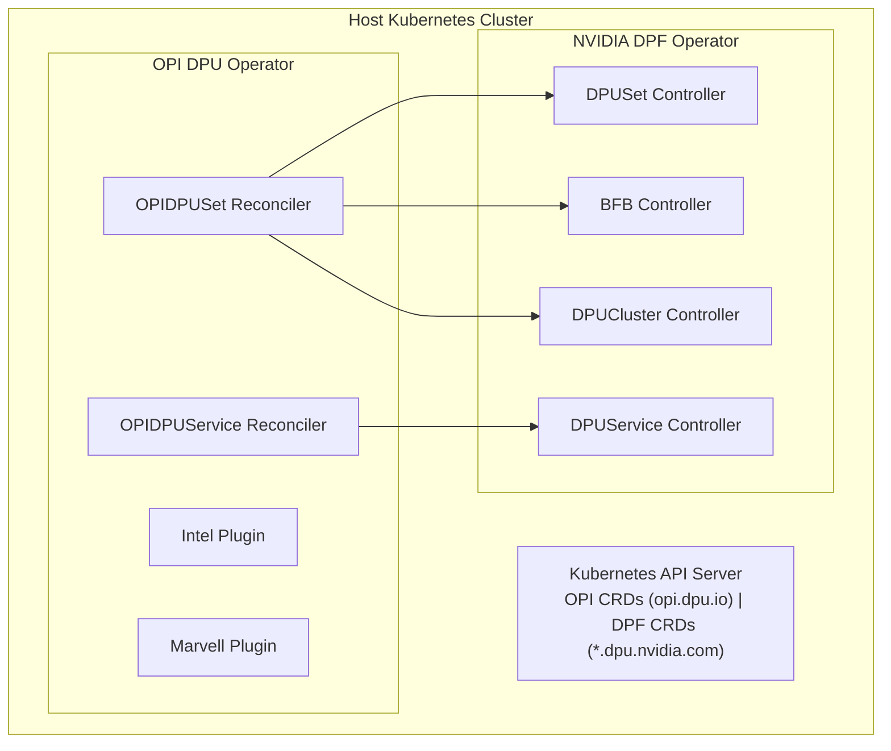
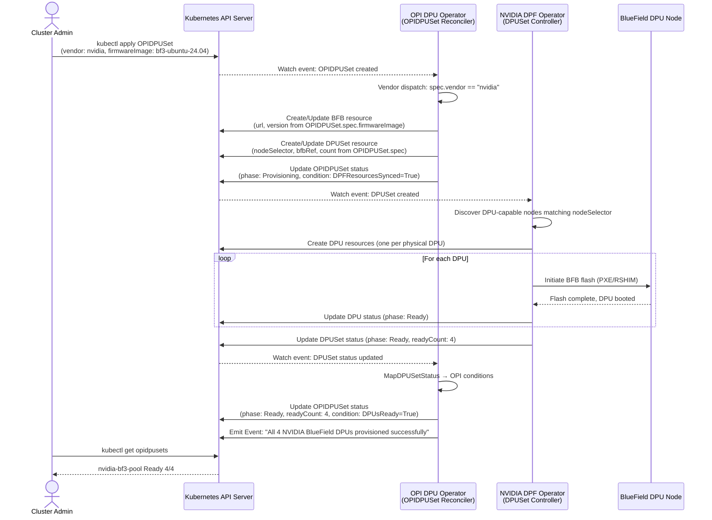
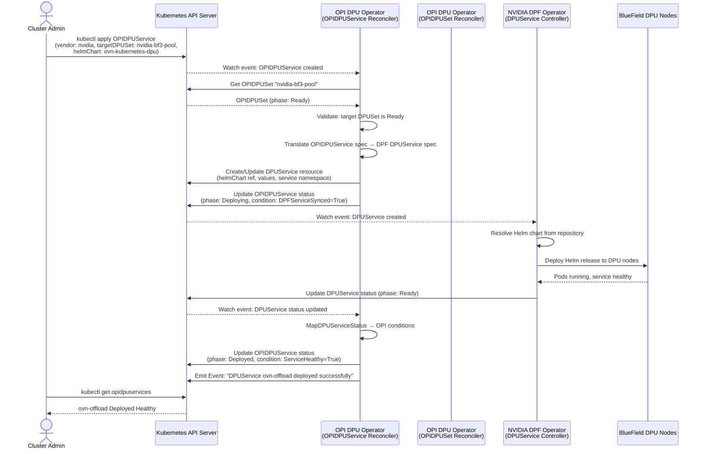

# Architecture Design: Integrating NVIDIA DOCA Platform Framework (DPF) into the OPI DPU Operator

## Overview

We implement an asynchronous translation layer using the Facade pattern to map vendor-neutral OPI resources to NVIDIA DPF CRDs. The OPI adapter controller watches `OPIDPUSet` and `OPIDPUService` resources, creates the corresponding DPF objects (`DPUSet`, `BFB`, `DPUCluster`, `DPUService`), and reflects DPF status back into OPI conditions. DPF runs unmodified and independently; we only consume its CRD API surface.

The constraint driving this choice: we need multi-vendor DPU support in a single control plane without forking NVIDIA's provisioning stack or managing its operator lifecycle.

---

## Goals and Non-Goals

### Goals

1. **Vendor-neutral DPU management**: Cluster administrators interact exclusively with OPI CRDs regardless of whether the underlying hardware is Intel, Marvell, or NVIDIA.
2. **Reuse DPF operator as-is**: The NVIDIA DPF operator continues to own the BlueField-specific lifecycle (BFB flashing, DPU cluster management, DPUService deployment). We do not fork or embed DPF controllers.
3. **Standard Kubernetes patterns**: All integration uses controller-runtime reconciliation loops, owner references, finalizers, status conditions, and events — no custom orchestration buses or out-of-band RPCs.
4. **Multi-vendor coexistence**: Intel/Marvell offload stacks and NVIDIA DPF can coexist in the same cluster, managed through the same OPI API surface.
5. **Observable failure modes**: Failures in the DPF operator or on the DPU hardware surface clearly in OPI CRD status and Kubernetes events.

### Non-Goals

1. **Replacing DPF**: We do not aim to replace or subsume the DPF operator. It runs as an independent operator with its own lifecycle.
2. **Full DPF feature parity day one**: Advanced DPF features (DPUServiceChain, DPUServiceInterface, multi-cluster networking) are out of scope for the initial integration.
3. **Runtime data-plane integration**: This architecture covers control-plane (Kubernetes CRD) integration only; data-plane plumbing (e.g., OVS-DOCA, SNAP storage) is handled by DPF services and is not re-architected.
4. **Automated DPF operator installation**: We assume the DPF operator and its DPFOperatorConfig are pre-installed. Automating DPF deployment (e.g., via OLM or Helm) is a follow-up concern.

---

## Existing Systems Overview

### OPI DPU Operator

The OPI project (github.com/opiproject/dpu-operator) provides a Kubernetes operator for managing DPU/IPU devices in a vendor-neutral manner. Key characteristics:

- **Vendor-neutral CRDs**: Resources like `DpuOperatorConfig` define the desired DPU state without vendor-specific fields.
- **Plugin/driver model**: Vendor-specific logic is intended to be pluggable; the current codebase includes support for Intel IPU and Marvell Octeon offload stacks.
- **Node labeling**: DPU-capable nodes are identified via labels (e.g., `dpu=true`), and the operator reconciles desired state onto those nodes.
- **gRPC-based API**: The broader OPI ecosystem defines vendor-neutral APIs via Protobuf (github.com/opiproject/opi-api), with a Go SDK (github.com/opiproject/godpu) for programmatic access.

### NVIDIA DOCA Platform Framework (DPF) Operator

The DPF operator (github.com/NVIDIA/doca-platform) is NVIDIA's production-grade Kubernetes operator for BlueField DPU lifecycle management. Key CRDs and their roles:

| CRD | API Group | Purpose |
|-----|-----------|---------|
| `DPFOperatorConfig` | `operator.dpu.nvidia.com` | Global DPF operator configuration |
| `DPUSet` | `provisioning.dpu.nvidia.com` | Declares a set of DPUs to provision with a specific BFB image; uses node selectors |
| `BFB` | `provisioning.dpu.nvidia.com` | Represents a BlueField Boot Bundle (OS + firmware image) |
| `DPUCluster` | `provisioning.dpu.nvidia.com` | Manages the Kubernetes control plane for DPU nodes |
| `DPU` | `provisioning.dpu.nvidia.com` | Individual DPU lifecycle (auto-created by DPUSet controller) |
| `DPUService` | `svc.dpu.nvidia.com` | Deploys applications (via Helm charts) onto DPU nodes |
| `DPUDeployment` | `svc.dpu.nvidia.com` | Manages rollout of multiple DPUServices |
| `DPUServiceChain` | `svc.dpu.nvidia.com` | Traffic steering / service chaining on the DPU |

Key DPF architectural properties:
- **Two-cluster model**: DPF often runs a secondary "DPU cluster" Kubernetes control plane for DPU nodes, managed by the `DPUCluster` CRD.
- **BFB-based provisioning**: DPU firmware and OS are managed as `BFB` resources; `DPUSet` triggers flashing.
- **Helm-based service deployment**: `DPUService` wraps Helm chart references for deploying workloads onto DPUs.
- **Rich status model**: Each CRD reports detailed conditions (e.g., `Ready`, `Provisioning`, `Error`) with human-readable messages.

---

## Integration Patterns Considered

### Pattern 1: CRD Translation / Adapter Layer (Selected)

**Description**: The OPI operator defines its own vendor-neutral CRDs (e.g., `OPIDPUSet`, `OPIDPUService`). An adapter controller within the OPI operator watches these CRDs, translates them into corresponding DPF CRDs (`DPUSet`, `BFB`, `DPUService`), creates/updates those DPF CRDs in the same cluster, and reverse-maps DPF status back into OPI status conditions.

```
User → OPI CRD → [OPI Adapter Controller] → DPF CRD → [DPF Operator] → DPU Hardware
                                          ← status ←                 ← status ←
```

**Pros**:
- DPF runs unmodified. The adapter only needs to understand DPF's CRD input/output contract, not its internals.
- One reconciler per OPI CRD type — clean scope, independently testable.

**Cons**:
- The mapping layer must evolve when DPF CRD schemas change. This creates a version matrix.
- Status propagation adds latency: DPF updates a DPUSet, OPI watches it, then patches its own status. Seconds of lag, acceptable for infra provisioning.

### Pattern 2: Sub-Operator / Sidecar Delegation

**Description**: The OPI operator detects NVIDIA hardware and dynamically deploys (or expects) the DPF operator as a "sub-operator." The OPI operator manages DPF's lifecycle (install, upgrade, removal) and communicates with DPF via its CRD API.

**Pros**:
- Single entry point: the cluster admin installs one operator.

**Cons**:
- OPI must manage DPF's full lifecycle: Deployment, RBAC, CRDs, upgrades. This is an operator-of-operators anti-pattern.
- DPF upgrades couple directly to OPI releases, making independent patching impossible.

### Pattern 3: Direct Embedding / Fork

**Description**: Fork relevant DPF controllers and embed them directly into the OPI operator binary, translating DPF types to OPI types at compile time.

**Pros**:
- Single binary.

**Cons**:
- Requires forking NVIDIA-proprietary controller code with uncertain licensing implications.
- DPF spans four controllers (DPUSet, BFB, DPUCluster, DPUService); embedding all of them is infeasible and creates a permanent maintenance fork.

### Selection: Pattern 1 — CRD Translation / Adapter Layer

**Rationale**: DPF runs as-is with no code changes on NVIDIA's side. The adapter is scoped to one concern: maintaining the bidirectional mapping between two CRD schemas. When DPF adds a field, we extend the adapter, not rebuild any controllers. This is how Crossplane providers and ACK work, and it fits cleanly into OPI's existing vendor-plugin slot alongside the Intel and Marvell adapters.

---

## Final Proposed Architecture

### High-Level Component Diagram



### Pluggable Provider Interface

To maintain a vendor-blind core, the OPI operator relies on a strict provider interface. The core OPI reconcilers only depend on this abstract interface (e.g., `DPUProvider`), completely isolating vendor-specific logic. The NVIDIA adapter implements this interface and registers itself during operator startup. When an `OPIDPUSet` or `OPIDPUService` resource is processed, the main reconciler dispatches the request to the appropriate provider based on the `spec.vendor` field, ensuring the core remains decoupled from any specific vendor's SDK or CRDs.

### OPI-Side CRD Definitions

We introduce the following vendor-neutral CRDs in the `opi.dpu.io` API group.

The `vendorExtensions` field in both resources is typed as `runtime.RawExtension` rather than a statically-typed struct. If vendor overrides were hardcoded Go fields, the OPI CRD schema would need a release every time NVIDIA exposes a new DPF flag. With `RawExtension`, any DPF spec block passes through to the adapter as an opaque blob; the NVIDIA adapter deserializes it against its own private types at runtime. The OPI API surface stays stable.

#### `OPIDPUSet` (opi.dpu.io/v1alpha1)

Represents a desired set of DPUs to be provisioned, regardless of vendor.

```yaml
apiVersion: opi.dpu.io/v1alpha1
kind: OPIDPUSet
metadata:
  name: nvidia-bf3-pool
  namespace: opi-system
spec:
  vendor: nvidia                    # Vendor discriminator; selects the adapter
  count: 4                          # Desired number of DPUs
  nodeSelector:                     # Kubernetes node selector for DPU hosts
    feature.node.kubernetes.io/dpu-vendor: nvidia
  firmwareImage:                    # Vendor-neutral firmware reference
    name: ubuntu-24.04-bf3          # Maps to a DPF BFB resource
    version: "4.2.0"
  dpuProfile:                       # Vendor-neutral profile reference
    name: networking-offload
  vendorExtensions:                 # Opaque runtime.RawExtension — NOT schema-validated
    bfbURL: "https://content.mellanox.com/..."
    dpuCluster:
      enabled: true
      type: static
    # Any future NVIDIA DPF fields can be added here without an OPI CRD schema change.
    # The NVIDIA adapter deserializes this blob into its own typed struct at runtime.
status:
  vendor: nvidia
  phase: BootImageMapping            # BootImageMapping | ClusterIsolation | RollingRollout
                                     # | AwaitingHardwareReset | Ready | Degraded | Error
  dpuCount: 4
  readyCount: 2
  conditions:
    - type: DPFResourcesSynced
      status: "True"
      reason: DPUSetCreated
    - type: DPUsReady
      status: "False"
      reason: ProvisioningInProgress
      message: "2 of 4 DPUs have completed provisioning"
  vendorStatus:                     # Opaque runtime.RawExtension for raw DPF status
    dpfDPUSetName: nvidia-bf3-pool-dpf
    dpfDPUSetPhase: Provisioning
```

#### `OPIDPUService` (opi.dpu.io/v1alpha1)

Represents a service or workload to be deployed onto DPUs, vendor-neutrally.

```yaml
apiVersion: opi.dpu.io/v1alpha1
kind: OPIDPUService
metadata:
  name: ovn-offload
  namespace: opi-system
spec:
  vendor: nvidia
  serviceType: networking           # networking | storage | security | custom
  targetDPUSet: nvidia-bf3-pool     # Reference to the OPIDPUSet
  configuration:
    helmChart:                      # Vendor-neutral Helm deployment spec
      repository: "https://helm.ngc.nvidia.com/nvidia/charts"
      name: ovn-kubernetes-dpu
      version: "0.1.0"
      values:
        replicaCount: 1
  vendorExtensions:                 # Opaque runtime.RawExtension — NOT schema-validated
    dpuServiceTemplate:
      serviceID: ovn-kubernetes
    # Arbitrary DPF-specific fields can be added here without OPI CRD changes.
status:
  phase: Deployed                   # Pending | Deploying | Deployed | Degraded | Error
  conditions:
    - type: DPFServiceSynced
      status: "True"
      reason: DPUServiceCreated
    - type: ServiceHealthy
      status: "True"
      reason: AllReplicasReady
  vendorStatus:                     # Opaque runtime.RawExtension
    dpfDPUServiceName: ovn-offload-dpf
    dpfDPUServicePhase: Ready
```

### CRD Mapping: OPI → DPF

| OPI CRD | DPF CRD(s) Created | Mapping Logic |
|---------|---------------------|---------------|
| `OPIDPUSet` | `BFB` + `DPUSet` + (optionally) `DPUCluster` | `spec.firmwareImage` → `BFB` spec; `spec.nodeSelector` + `spec.count` → `DPUSet` spec; `spec.vendorExtensions` deserialized by NVIDIA adapter → `DPUCluster` and any other DPF-specific resources |
| `OPIDPUService` | `DPUService` | `spec.configuration.helmChart` → `DPUService.spec.helmChart`; `spec.vendorExtensions` deserialized by NVIDIA adapter → DPF-specific DPUService fields; `spec.targetDPUSet` resolved to DPF namespace context |

### Controllers and Reconcilers

#### 1. `OPIDPUSetReconciler`

**Watches**: `OPIDPUSet`
**Owns (creates/manages)**: `BFB`, `DPUSet`, `DPUCluster` (DPF CRDs)

### Stateful Reconciliation / Phase Gating
The reconciler executes an asynchronous state machine to process hardware tasks sequentially. Each phase updates the subresource status and requeues, isolating execution boundaries to prevent multi-resource race conditions.

Reconciliation phases (each is a gate — the reconciler exits and requeues after each phase until the gate condition is met):

1. **Fetch & Dispatch**: Fetch the `OPIDPUSet` resource. Check `spec.vendor`; if not `nvidia`, skip. Handle deletion via finalizer.

2. **Phase 1 — BootImageMapping**: Validate and assert the `BFB` resource state.
   - Translate `spec.firmwareImage` into a DPF `BFB` resource. Create if missing; update if version changed.
   - **Gate condition**: Hold execution until the BFB image file metadata is registered and the `BFB` resource reports `phase: Ready`. Do **not** proceed to DPUSet creation until the BFB is confirmed available — attempting to flash a DPU with an unresolved BFB reference will cause DPF to enter a hard error loop.
   - Set `status.phase = BootImageMapping` and requeue.

3. **Phase 2 — ClusterIsolation**: Trigger `DPUCluster` orchestration (if configured via `spec.vendorExtensions`).
   - Deserialize the opaque `vendorExtensions` blob to extract DPUCluster configuration.
   - Create or update the `DPUCluster` resource.
   - **Gate condition**: Await autonomous initialization of the secondary DPU Kubernetes control plane. The `DPUCluster` must report a `Ready` condition before proceeding — DPUSet provisioning against a non-existent DPU cluster will silently orphan DPU nodes.
   - Set `status.phase = ClusterIsolation` and requeue.

4. **Phase 3 — RollingRollout**: Apply the `DPUSet` target configuration to trigger physical DPU flashing.
   - Translate `spec.nodeSelector`, `spec.count`, and BFB reference into a DPF `DPUSet`. Create or update.
   - **Gate condition**: Monitor `DPUSet.status.readyCount` vs `spec.count`. If the DPF hardware layer indicates a physical PCIe cold-boot requirement via driver channels (detectable when individual `DPU` resources report `phase: AwaitingReboot`), flag the OPI phase as `AwaitingHardwareReset` and exit the active loop gracefully **without returning an error** — this prevents the controller manager from exponential-backoff thrashing on what is a normal hardware lifecycle event.
   - Set `status.phase = RollingRollout` (or `AwaitingHardwareReset`) and requeue with a longer interval (60s) to respect hardware timing.

5. **Status sync**: Once all gates pass (`DPUSet.status.phase == Ready`), read final status from all DPF resources. Map DPF conditions into OPI conditions:
   - DPF `DPUSet.status.phase == Ready` → set OPI condition `DPUsReady = True`.
   - DPF errors → set OPI `phase = Error` with message from DPF.
6. **Owner references**: Set the `OPIDPUSet` as the owner of all created DPF resources (enables cascading deletion).
7. **Finalizer**: Add a finalizer to clean up DPF resources on OPI CRD deletion.

#### 2. `OPIDPUServiceReconciler`

**Watches**: `OPIDPUService`
**Owns (creates/manages)**: `DPUService` (DPF CRD)

Reconciliation logic:
1. **Fetch** the `OPIDPUService` resource.
2. **Resolve target**: Look up the referenced `OPIDPUSet` to ensure it exists and is in `Ready` or `Provisioning` phase.
3. **Translate to DPUService**: Map the Helm chart spec and configuration into a DPF `DPUService` resource.
4. **Status sync**: Read DPF `DPUService` status and map to OPI conditions.
5. **Owner references and finalizer**: As above.

#### 3. `NvidiaDPFAdapter` (shared helper)

A Go interface and implementation used by both reconcilers:

```go
type DPFAdapter interface {
    // Provisioning
    EnsureBFB(ctx context.Context, opiDPUSet *v1alpha1.OPIDPUSet) (*dpfv1.BFB, error)
    EnsureDPUSet(ctx context.Context, opiDPUSet *v1alpha1.OPIDPUSet, bfb *dpfv1.BFB) (*dpfv1.DPUSet, error)
    EnsureDPUCluster(ctx context.Context, opiDPUSet *v1alpha1.OPIDPUSet) (*dpfv1.DPUCluster, error)

    // Service deployment
    EnsureDPUService(ctx context.Context, opiSvc *v1alpha1.OPIDPUService) (*dpfv1.DPUService, error)

    // Status mapping
    MapDPUSetStatus(dpfStatus dpfv1.DPUSetStatus) v1alpha1.OPIDPUSetStatus
    MapDPUServiceStatus(dpfStatus dpfv1.DPUServiceStatus) v1alpha1.OPIDPUServiceStatus

    // Cleanup
    DeleteDPFResources(ctx context.Context, owner client.Object) error
}
```

### Ownership and Lifecycle Division

| Concern | Owner | Details |
|---------|-------|---------|
| OPI CRD schemas and validation | OPI operator | CRD YAML generated from Go types via controller-gen |
| Vendor-neutral reconciliation and dispatch | OPI operator | `OPIDPUSetReconciler`, `OPIDPUServiceReconciler` |
| DPF CRD creation/update (as adapter output) | OPI operator (creates); DPF operator (reconciles) | OPI creates `DPUSet`/`BFB`/etc.; DPF controllers act on them |
| BFB flashing, DPU provisioning | DPF operator | `DPUSet` controller manages PXE boot, BFB flashing, DPU joining |
| DPU cluster lifecycle | DPF operator | `DPUCluster` controller manages secondary K8s control plane |
| DPUService Helm deployment | DPF operator | `DPUService` controller deploys Helm charts to DPU nodes |
| Status condition mapping | OPI operator (adapter) | Reads DPF status, maps to OPI conditions |
| RBAC for DPF CRDs | Both (via ClusterRoles) | OPI operator needs read/write on DPF CRDs; DPF operator has its own RBAC |

### RBAC Requirements

The OPI operator's ServiceAccount needs additional ClusterRole rules to manage DPF CRDs:

```yaml
apiVersion: rbac.authorization.k8s.io/v1
kind: ClusterRole
metadata:
  name: opi-operator-dpf-adapter
rules:
  - apiGroups: ["provisioning.dpu.nvidia.com"]
    resources: ["dpusets", "dpusets/status", "bfbs", "bfbs/status", "dpus", "dpus/status", "dpuclusters", "dpuclusters/status"]
    verbs: ["get", "list", "watch", "create", "update", "patch", "delete"]
  - apiGroups: ["svc.dpu.nvidia.com"]
    resources: ["dpuservices", "dpuservices/status"]
    verbs: ["get", "list", "watch", "create", "update", "patch", "delete"]
```

### Failure Modes and Recovery

| Failure | Detection | Recovery |
|---------|-----------|----------|
| DPF operator not installed | OPI adapter cannot find DPF CRDs (API discovery fails) | Set OPI condition `DPFAvailable = False` with message; requeue with exponential backoff. Emit a Kubernetes warning event. |
| DPF operator running but unhealthy | DPF CRDs exist but DPF resources never reach `Ready` | OPI status reflects `Provisioning` or `Degraded`; after configurable timeout, set `Error`. |
| `DPUSet` fails (e.g., BFB flash fails on a node) | DPF sets `DPUSet.status.phase = Error` or individual `DPU` resources report failures | OPI maps the error condition; surfaces per-DPU failure details in `status.conditions` and events. |
| `DPUService` deployment fails | DPF sets `DPUService.status.phase = Error` | OPI maps error; admin can update `OPIDPUService.spec` to fix Helm values or chart version, triggering re-reconciliation. |
| DPF CRDs deleted out-of-band | OPI's watch detects missing owned resources | OPI reconciler re-creates the DPF resources (desired-state reconciliation). |
| Network partition between OPI and API server | Standard controller-runtime behavior: requeue with backoff | Automatic retry once connectivity restores. |
| Unrecoverable structural validation failure | Adapter detects immutable hardware config mismatch (e.g., secure-boot mode conflict, incompatible DPU firmware family) | **Status-Commit-Before-TerminalError protocol** (see below). |
| Hardware cold-boot / PCIe reset required | Individual `DPU` resources report `phase: AwaitingReboot` | Set OPI `phase = AwaitingHardwareReset` and return `ctrl.Result{RequeueAfter: 60s}` with **nil error** — do not trigger error-based backoff for normal hardware lifecycle events. |

#### Safe Status Patching Before TerminalError (Architectural Safeguard)

When the translation engine intercepts an **unrecoverable structural validation failure** — such as an immutable secure-boot configuration mismatch between the OPI spec and the physical DPU hardware, or a BFB image family incompatible with the detected BlueField generation — the reconciler must follow a strict **Status-Commit-Before-TerminalError** protocol:

1. **Immediately patch the Status subresource** with the failure details:
   - Set `status.phase = Error`.
   - Write a precise `Condition` with `Type: HardwareValidationFailed`, `Status: False`, `Reason: SecureBootMismatch` (or equivalent), and a human-readable `Message` describing the exact mismatch.
   - Execute `r.Status().Update(ctx, obj)` and **confirm the write succeeds** before proceeding.

2. **Only after the status patch is confirmed committed to etcd**, bubble up the error as a `reconcile.TerminalError` (controller-runtime v0.15+). This signals the controller manager to halt retries for this resource without exponential-backoff thrashing.

3. **Rationale**: If the reconciler returns a `TerminalError` *before* persisting the failure condition, the controller manager immediately halts reconciliation. The API server will never receive the status update, leaving cluster administrators blind to the root cause. The resource appears "stuck" with its last known phase and no error condition — a silent abort. By committing status first, we guarantee platform visibility regardless of controller lifecycle.

```go
// Example: safe terminal error handling pattern
if isUnrecoverableHardwareConflict(err) {
    // Step 1: Commit status BEFORE signaling terminal halt
    obj.Status.Phase = "Error"
    obj.Status.Conditions = []metav1.Condition{{
        Type:    "HardwareValidationFailed",
        Status:  metav1.ConditionFalse,
        Reason:  "SecureBootMismatch",
        Message: err.Error(),
    }}
    if statusErr := r.Status().Update(ctx, obj); statusErr != nil {
        // Status patch failed — return retryable error so we can try again
        return ctrl.Result{}, statusErr
    }
    // Step 2: Only now signal terminal halt
    return ctrl.Result{}, reconcile.TerminalError(err)
}
```

### Day-2 Operations: Upgrades and BFB Image Changes

**Rolling DPU firmware upgrade**:
1. Admin updates `OPIDPUSet.spec.firmwareImage.version` to a new BFB version.
2. OPI adapter updates the `BFB` resource with the new URL/version.
3. OPI adapter updates the `DPUSet` to reference the new `BFB`.
4. DPF's `DPUSet` controller handles the rolling update of individual `DPU` resources (it already supports this natively).
5. OPI status tracks the rollout via `status.readyCount` / `status.dpuCount` and conditions.

**Service updates**:
1. Admin updates `OPIDPUService.spec.configuration.helmChart.version` or `.values`.
2. OPI adapter updates the corresponding `DPUService`.
3. DPF handles the Helm release upgrade on DPU nodes.

**DPF operator upgrade**:
1. DPF operator is upgraded independently (e.g., via Helm upgrade).
2. OPI adapter continues to work as long as the DPF CRD schema is backward-compatible (which NVIDIA maintains within a major version).
3. If DPF introduces a breaking CRD change, the OPI adapter must be updated — this is an explicit operational dependency.

---

## Sequence Flows

### Sequence 1: Provisioning NVIDIA BlueField DPUs via OPI



### Sequence 2: Deploying a DPUService via OPI (Reusing DPF)



---

## Trade-Off Analysis

### Pattern 1 (Selected): CRD Translation / Adapter vs. Pattern 2: Sub-Operator Delegation

| Dimension | CRD Translation (Pattern 1) | Sub-Operator (Pattern 2) |
|-----------|---------------------------|-------------------------|
| **Operator ownership** | OPI and DPF are independently owned, installed, and upgraded. Clear blast radius for each. | OPI must manage DPF's lifecycle — installs, upgrades, RBAC, health checks. Blurred ownership. |
| **Upgrade complexity** | DPF upgraded independently; OPI adapter only needs updating if DPF CRD schema breaks. Low coupling. | DPF upgrades must be coordinated through OPI operator releases. High coupling. |
| **Observability / debugging** | Two sets of CRDs to inspect (OPI + DPF). Slightly more complex `kubectl` workflows, mitigated by OPI status mirroring DPF status. | Single operator to look at, but internal complexity is hidden. DPF issues manifest as opaque OPI errors. |
| **Multi-vendor DPU scenarios** | Excellent: each vendor adapter is a plugin within OPI. Intel/Marvell/NVIDIA coexist via `spec.vendor` dispatch. | Problematic: OPI would need to sub-manage a different operator per vendor, leading to an operator-of-operators anti-pattern. |
| **Security / RBAC** | Clear RBAC boundaries: OPI has a defined ClusterRole for DPF CRDs; DPF has its own. Least-privilege is achievable. | OPI needs broad permissions to manage DPF's Deployment, ServiceAccount, ClusterRoles — overly permissive. |
| **Failure modes** | DPF unavailability is cleanly surfaced as a condition on OPI CRDs. OPI can gracefully degrade (show "DPF unavailable" status). | If OPI fails to deploy/manage DPF, all NVIDIA DPU management is broken. Single point of failure. |
| **Implementation effort** | Moderate: implement adapter interface, CRD mapping, status syncing. Well-scoped. | High: implement DPF lifecycle management (install, upgrade, health monitoring, CRD management) on top of the adapter. |
| **Operational risk** | Low: both operators are independently deployable and testable. | High: tight coupling means a bug in OPI's DPF management can take down DPF entirely. |

### Accepted Engineering Risks

The CRD translation pattern is not without its downsides:

1. **Schema drift**: When NVIDIA releases a new DPF version with CRD changes, the OPI adapter must be updated. This creates a version matrix (OPI adapter version X works with DPF versions Y-Z). Mitigation: pin to DPF API group versions (`v1alpha1`) and handle unknown fields gracefully.

2. **Status latency**: Status propagation is indirect (DPF → K8s API → OPI watch → OPI status update). There's an inherent delay of seconds between DPF updating a `DPUSet` status and OPI reflecting it. This is acceptable for infrastructure provisioning but worth documenting.

3. **Feature gap**: Not all DPF features are exposed through OPI CRDs initially. Advanced features like `DPUServiceChain` or `DPUServiceInterface` require explicit OPI-side modeling. This is intentional (non-goal for v1) but means power users may need to use DPF CRDs directly for advanced scenarios.

4. **Two-cluster complexity**: DPF's DPU cluster model adds complexity that OPI abstracts away. If something goes wrong in the DPU cluster (e.g., etcd failure), OPI's status may not have sufficient granularity to diagnose it — the admin may need to inspect DPF CRDs directly.

---

## Limitations and Future Work

### AMD Integration Alternative

While this design focuses on NVIDIA DPF, integrating AMD Pensando (or similar) DPUs would follow the exact same Facade/adapter pattern. Instead of watching NVIDIA CRDs, an AMD-specific adapter would implement the `DPFAdapter` interface to translate OPI CRDs into the native orchestration resources expected by AMD's control plane. This pluggable architecture ensures that adding AMD support requires zero changes to the core OPI reconcilers or the OPI CRD API surface.

### Assumptions

1. **DPF CRD schema stability**: We assume NVIDIA maintains backward compatibility within the `v1alpha1` API group for at least one major release cycle. If DPF moves to `v1beta1` or `v1`, the adapter will need a version negotiation mechanism.

2. **DPF pre-installed**: The DPF operator and `DPFOperatorConfig` are already installed and healthy before OPI resources are created. We do not handle DPF bootstrapping.

3. **Single-cluster model**: This design assumes OPI and DPF run in the same Kubernetes cluster. Multi-cluster scenarios (e.g., OPI in a management cluster, DPF in workload clusters) would require a multi-cluster adapter extension.

4. **OPI CRD naming**: The CRD names (`OPIDPUSet`, `OPIDPUService`) are invented for this proposal. The actual OPI project may use different naming conventions; the architecture is independent of specific names.

5. **DPF namespace**: We assume DPF resources are created in a configurable namespace (default: `dpf-operator-system`). The adapter must be namespace-aware.

6. **No existing OPI NVIDIA plugin**: We assume no NVIDIA integration exists in the OPI operator today; this is a greenfield addition.

### Where I Stopped and Next Steps

I stopped here primarily as a time-budget decision given the assignment deadline, rather than hitting any technical blockers. I've completed the core architectural design and provided the primary controller implementation for NVIDIA hardware integration. The foundational adapter pattern, state machine logic, and status mapping are fully established.

The following tasks remain to bring this integration to full production readiness:

1. **Validate against actual repositories**: Clone `github.com/opiproject/dpu-operator` and `github.com/NVIDIA/doca-platform`, inspect their actual Go types and CRD YAML, and refine the mapping to use real field names and API group versions.

2. **Prototype minimal CRD adapter**: Implement a working `OPIDPUSetReconciler` that can create a real `DPUSet` in a cluster with DPF installed, and verify end-to-end provisioning.

3. **Add conformance tests**: Define a vendor-neutral conformance test suite that verifies any OPI vendor adapter (Intel, Marvell, NVIDIA) correctly implements the expected lifecycle (create → provision → ready → delete).

4. **Multi-cluster support**: Extend the adapter to work with Cluster API or similar multi-cluster tooling for scenarios where DPF manages DPUs across multiple workload clusters.

5. **DPF version negotiation**: Implement API discovery logic that checks which DPF CRD versions are available and selects the appropriate mapping.

6. **Metrics and alerting**: Add Prometheus metrics for the adapter (e.g., `opi_dpf_sync_errors_total`, `opi_dpf_provisioning_duration_seconds`, `opi_dpuset_status_phase`) and Grafana dashboard templates.

7. **DPUServiceChain integration**: Model OPI-level service chaining CRDs that map to DPF's `DPUServiceChain` for advanced networking use cases.

8. **Security hardening**: Implement a zero-trust model where the OPI adapter communicates with DPF CRDs via a dedicated ServiceAccount with minimal RBAC, and add audit logging for all DPF resource mutations.
