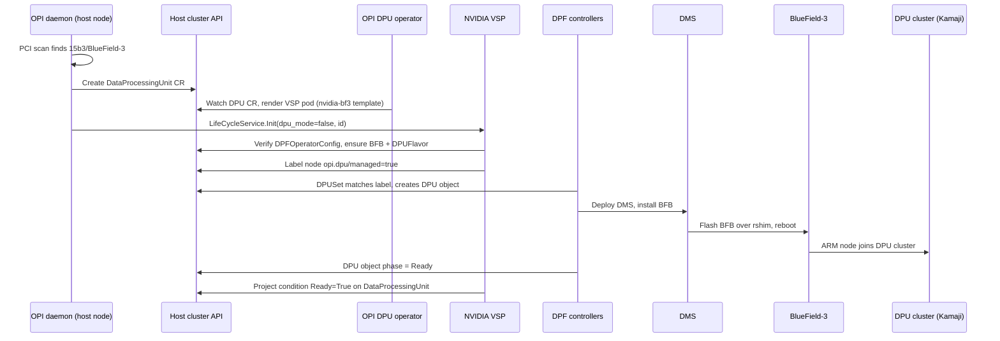
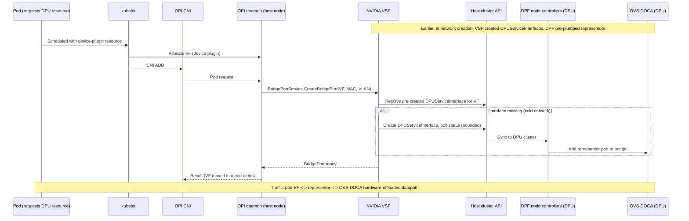
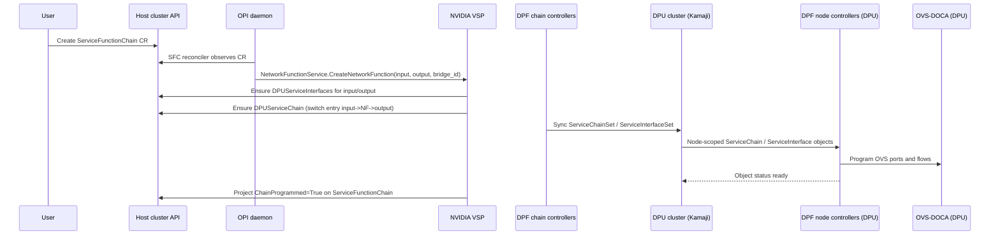
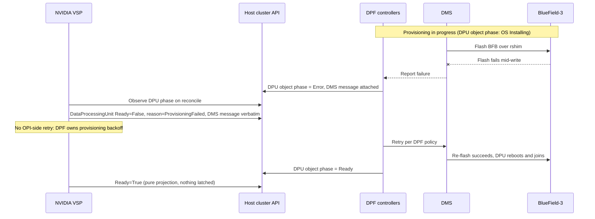
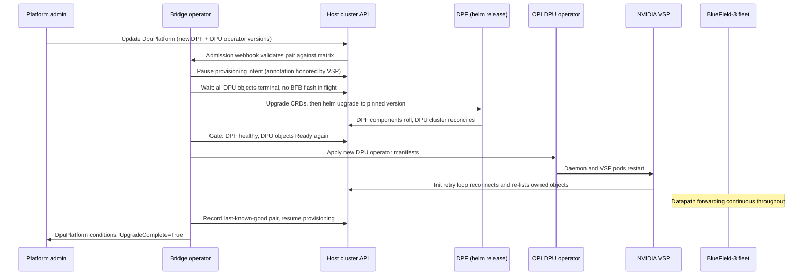

# Adding NVIDIA BlueField-3 support to the OPI DPU operator by reusing the DPF operator

Shridhar Panigrahi - OPI internship, hands-on assignment 1

This document proposes an architecture for bringing NVIDIA DPU support into the
OPI DPU operator while maximizing reuse of NVIDIA's DOCA Platform Framework
(DPF) operator. The design was developed in a structured LLM session; the full
prompt/response record is in `llm_transcript.json`, and the section "How the
LLM was used" at the end describes how the prompts were engineered. Everything
stated here about the two codebases was verified by reading their source, not
taken from the LLM.

## Assumptions

The assignment brief leaves a few things open. Following the instruction to
document assumptions rather than ask, these are mine:

1. "The OPI DPU operator" means the codebase at `openshift/dpu-operator`,
   which the OPI project carries in an upstream-portable form at
   `opiproject/dpu-operator` (same tree, plus non-RHEL images and plain-k8s
   kustomizations; its closed PRs describe syncs from the openshift repo). I
   target the opiproject form.
2. "NVIDIA support" means BlueField-3 managed through DPF, since DPF is what
   NVIDIA ships and supports for BlueField fleet management. Direct DOCA
   programming without DPF is treated as a rejected alternative, not the goal.
3. The DPF version referenced is the current `doca-platform` main
   (v1alpha1 APIs). Version coupling is treated as a first-class risk rather
   than assumed away.
4. Phase 1 targets the host-side integration completely and leaves the DPU-side
   OPI daemon to phase 2. The phasing test I hold the design to: phase 2 must
   not change any phase 1 object or ownership rule, only add to them.

## The two systems, as they actually are

The dpu-operator is small and deliberately vendor-thin. A daemon runs on every
node, detects DPUs (PCI scan on hosts, DMI product name when running on a DPU's
ARM cores), and creates a `DataProcessingUnit` CR per device. The operator then
launches a per-vendor VSP (Vendor Specific Plugin) pod from a template, and the
daemon talks to it over gRPC on a unix socket. That socket carries two API
layers: the operator's own `dpu-api` services (lifecycle Init, device listing,
VF counts, network functions, heartbeat) and - notably - the official OPI API
from `opiproject/opi-api`, whose evpn-gw `BridgePortService` serves the pod
attach path. The daemon's device plugin and CNI handler are what make a pod
spec identical across Intel, Marvell and (after this design) NVIDIA nodes.
Adding a vendor is a documented, mechanical act: a `VendorDetector`, a VSP pod
template, a VSP image. The detector list in `internal/platform/vendordetector.go`
ends with the comment "add more detectors here".

DPF is the opposite kind of system: some thirty CRDs across provisioning
(`BFB`, `DPUSet`, `DPU`, `DPUCluster`, `DPUFlavor`), service orchestration
(`DPUService`, delivered as helm charts through ArgoCD) and service chaining
(`DPUServiceChain`/`DPUServiceInterface`, materialized down to OVS-DOCA ports
and flows by node controllers). It provisions BlueFields by flashing BFB images
through the DOCA Management Service (DMS) over rshim, and it runs a dedicated
DPU cluster - a Kamaji tenant control plane hosted in the host cluster - that
the BlueField ARM nodes join. None of this should be reimplemented; most of it
cannot be, realistically, by anyone but NVIDIA.

So the problem has a precise shape: **a small imperative node-local socket on
one side, a large declarative multi-cluster platform on the other, and the
requirement that the seam between them preserve both the OPI user experience
and DPF's ownership of the hardware.**

## The design: a DPF-backed VSP

NVIDIA support arrives exactly the way the operator wants vendors to arrive -
detector, template, VSP image - with one twist inside the VSP: it owns no
hardware. Every gRPC call is answered either from genuinely node-local state or
by authoring and watching DPF custom resources. The VSP is a stateless adapter;
DPF stays the only system that touches BlueField silicon.

Three components:

- **`NvidiaBlueFieldDetector`** in the daemon, beside the Intel and Marvell
  detectors. Host side: PCI vendor `15b3` plus a small BlueField-3 device-ID
  table (to be verified against mlx5 driver sources). DPU side: DMI product
  match on "BlueField". The identifier is derived from the board serial - and
  this derivation is shared design surface, because status joining depends on
  it (see ownership).
- **The NVIDIA VSP** (`bindata/vsp/nvidia-bf3/` template + image), serving both
  gRPC layers on the socket. Internally split into a local half (sysfs VF
  activation, PCI/representor introspection - things that are truly node
  state) and a DPF half (a Kubernetes client that ensures and watches DPF
  objects).
- **A projection reconciler inside the VSP** that maps observed DPF state onto
  OPI CR conditions. Keeping it inside the VSP preserves the operator's
  one-new-thing-per-vendor rule; for the translation concern there is no
  separate bridge operator to install, version and explain. (Lifecycle
  management is a different concern and changes this calculus - see the
  section on managing the two upstream operators, below.)

### Call-by-call mapping

| VSP gRPC call | Backed by |
|---|---|
| `LifeCycleService.Init` | Verify DPF is installed (`DPFOperatorConfig` present; fail loudly if not). Ensure provisioning intent: the `BFB` and `DPUFlavor` objects (from operator-level config) and one node label, `opi.dpu/managed=true`, that the OPI-owned `DPUSet` selects on. Return immediately; readiness flows through conditions. Idempotent by construction. |
| `DeviceService.GetDevices` | VF existence from the local PCI tree; health from the DPF `DPU` object's phase. Two read-only sources answering different questions. |
| `DeviceService.SetNumVfs` | Split by ownership. The firmware ceiling (mlxconfig `NUM_OF_VFS`) is provisioning-time state owned by DPF via the flavor. The runtime count is a `sriov_numvfs` sysfs write with no DPF counterpart - the VSP does it locally, capped by the ceiling; an over-ask sets a `VfCountConstrained` condition explaining that lifting the ceiling requires a flavor change and re-provision. |
| `BridgePortService.CreateBridgePort` (pod attach) | The declarative work happens **before** pods attach: at network creation the VSP creates one `DPUServiceInterface` per allocated VF, so DPF's node controllers pre-plumb representors onto the right OVS bridge. At CNI time the call resolves pre-plumbed state and returns. Cold-network fallback: create and poll with a bounded budget (seconds); the daemon's CNI retry loop covers the rare timeout. |
| `NetworkFunctionService.Create/DeleteNetworkFunction` | A `DPUServiceChain` switch entry between the named service interfaces; DPF's chain controllers materialize OVS flows. The NF workload itself ships as a `DPUService` in phase 2. |
| `DpuNetworkConfigService.SetDpuNetworkConfig` | Hardware offload is flavor state and effectively always on for BlueField. `true` is confirmed; `false` is refused with an explicit "set at provisioning time" error rather than faked. |
| `HeartbeatService.Ping` | VSP-internal: API reachability and watch freshness. |

Two calls deliberately have no DPF backing - runtime VF count (the VSP owns it,
it is real node state) and a runtime offload disable (refused honestly). Naming
where the platform does not fit, instead of papering over it, is part of the
design.

### Topology: where the OPI daemon lives

The hardest question is cluster topology, because the two projects made
opposite choices: dpu-operator expects its daemon (and a VSP) on the DPU side,
joined to some cluster it can reach; DPF creates its own DPU cluster via Kamaji
and delivers software onto DPUs exclusively as DPUServices.

Rejected first: making BlueField nodes join the host cluster directly. DPF's
provisioning state machine drives the join toward the DPUCluster it manages;
pointing it elsewhere is a fork of the provisioning flow, and it also
surrenders the host/infrastructure isolation the dual-cluster split exists for.

**Phase 1 is host-side only.** Every mapped call above is answerable from the
host: provisioning intent, VF management, pod attach against pre-plumbed
interfaces, chains between existing interfaces. All of these are host-cluster
objects that DPF itself syncs into the DPU cluster - we inherit DPF's own
host-to-DPU delivery instead of needing our agent there. What phase 1 gives up
is OPI-native network functions running on the DPU, which no NVIDIA-path user
can reach yet anyway.

**Phase 2 delivers the OPI DPU-side daemon as a DPUService.** The observation
that makes this natural rather than clever: to DPF, the OPI agent is just
another DOCA service, and delivering services onto DPUs is the thing DPF is
for. The daemon and a thin DPU-side VSP run as containers of one pod sharing
the socket volume, preserving the daemon's socket-path convention unchanged.
The DPU-side VSP answers NetworkFunction calls against the node-local
ServiceInterface/ServiceChain objects already served by DPF controllers in
that cluster, and never needs host-cluster credentials at all. Phase 2 adds a
DPUService and a thin VSP; it changes no phase 1 object, owner or rule - which
is the test that phase 1 was a subset and not a dead end.

### Ownership: one writer per object, projection instead of sharing

Both systems observe the same silicon; the design survives because they never
author the same object. The rule: ownership follows the API an object belongs
to, never the hardware it describes.

| State | Single writer | The other side |
|---|---|---|
| OPI view of the device (`DataProcessingUnit`) | OPI daemon detector | DPF never reads OPI CRs |
| DPF view (`DPUDevice`/`DPUNode`, node labels from NFD) | DPF discovery | VSP reads, never writes |
| Provisioning intent | VSP, via the single `opi.dpu/managed` label | DPF consumes it through normal DPUSet selection |
| BFB version, flavor, flashing | DPF (specs authored once by the VSP from operator config) | VSP watches phases |
| VF ceiling | DPF via `DPUFlavor` | VSP reads it as its cap |
| Runtime VF count | VSP (sysfs) | DPF does not manage it post-provisioning |
| OVS plumbing and flows | DPF node controllers, driven by interface/chain objects | VSP authors those objects' specs only |

For every DPF object the VSP touches, the VSP writes spec and DPF writes
status; the VSP writes no status except on OPI CRs. Status crosses the seam in
one direction, as a projection: a pure function of currently observed DPF state
producing OPI conditions. Pure means no latching and no event-order dependence
- if the VSP misses every event and then re-lists, it produces the same
conditions. `Ready` on a `DataProcessingUnit` means: DPF's DPU object reports
its terminal ready phase, the DPU cluster node is Ready, and the VSP's watches
are live. Failure reasons pass DPF's messages through verbatim, because the
operator debugging a flash failure needs DMS's words, not a paraphrase.

Deletion follows the same one-way discipline. OPI-initiated teardown (finalizer
`dpu.opi.io/nvidia-vsp`): refuse while pods still hold VFs (a
`DeletionBlocked` condition naming them - drain is the operator's decision, not
the VSP's); delete VSP-authored chains and interfaces and wait them out; remove
the provisioning label and let DPF run its own node teardown; drop the
finalizer. Every step is check-then-act, so a crash mid-teardown resumes. In
the other direction, hostile or out-of-band deletion of DPF objects can never
wedge an OPI CR, because OPI-side finalizers only wait on deletions the VSP
itself issued; observed absence just projects as not-ready. The VSP re-asserts
exactly one thing if stripped: its own label - intent is healed, observations
are not.

All VSP writes are idempotent ensures against deterministically derived names
(DPU identifier + VF + network). Deterministic naming is a correctness
property here: it is what makes CNI retries, VSP crashes and finalizer re-runs
converge instead of duplicating.

## Sequence diagrams

Day-0, from silicon to Ready:

Pod attach on the host - the fast path is pre-plumbed, the cold path is the
bounded exception:

Service function chain:

And the failure path that matters most in practice - a BFB flash failing
mid-provisioning - because it exercises the projection rules end to end. Note
what does not happen: the VSP never retries provisioning (DPF owns that
policy), and readiness is never latched, so the same pure projection that
reported the failure reports the recovery:

## Lifecycle management of the two upstream operators

The design so far leaves one concern unowned, and it is worth being explicit
about how it got left out. The component list above declines a separate
bridge operator because *translation* does not need one - true, and it stays
true. But that line quietly made the user the lifecycle manager: they install
two operators, keep the versions compatible by reading documentation, and
sequence upgrades by hand. For anything beyond a lab, that concern deserves
an owner. This section adds one.

**`opi-dpf-bridge-operator`** is a small cluster-scoped operator with a
single CRD, `DpuPlatform`, stating the only intent a platform admin should
need: which version of the OPI DPU operator, which version of DPF, and
whether the bridge manages them (`manage: true`) or merely observes an
existing installation (`manage: false`, the brownfield case - it verifies
discovered versions against its matrix and reports, touching nothing).

Its scope is deliberately narrow: install or adopt the two operators,
enforce version compatibility, orchestrate upgrades and rollback. It never
touches DPF hardware-facing objects, OPI CR status, or anything node-local -
those writers stay exactly as the ownership table defines them. It adds one
row to that table and changes no existing row:

| State | Single writer | The other side |
|---|---|---|
| Operator installations and versions | bridge operator | VSP reads the DPF version it observes; its unknown-schema guard remains as defense in depth |

**The version matrix becomes machinery instead of documentation.** The
compatibility matrix ships inside each bridge release as data, produced by
the CI job that runs the conformance suite against release-tag combinations.
A validating webhook on `DpuPlatform` rejects untested pairs at write time;
if reality drifts outside the matrix out-of-band, the bridge sets
`VersionSkewSupported=False` naming the untested pair and pauses its own
upgrade actions rather than auto-remediating - automatic downgrades of a
running platform are how skew becomes an outage. This converts the top risk
in the analysis below from "mitigated by process" to "enforced by admission".

**Upgrades run bridge-first, then DPF, then the DPU operator.** The bridge
goes first because the incoming release carries the new matrix. DPF is the
deep upgrade, so the bridge requires a quiet platform before touching it:
every DPF `DPU` object terminal, no BFB flash in flight (it pauses new
provisioning by annotation, which the VSP honors; running flashes are waited
out, never interrupted). The DPU operator goes last; its restart cycles the
daemon and VSPs, which the failure-mode analysis already showed is safe -
stateless VSP, Init retried by the daemon, OVS state and attached pods
unaffected. The datapath forwards continuously through the whole sequence.
Rollback: last-known-good pair recorded in status, helm rollback for DPF,
manifest re-apply for the DPU operator, and CRDs only ever move forward
(controller rollback under newer CRDs is tolerated; CRD downgrades are
data-loss territory). A crash mid-sequence resumes level-triggered from
observed postconditions, like every other loop in this design.

**When not to deploy it:** hand-managed labs; environments where an existing
platform LCM convention (OLM, Fleet, a GitOps pipeline) already owns operator
lifecycles - there the bridge runs in matrix-validation-only mode rather
than fighting the incumbent; and phase 0/1 of this integration itself, where
a third release train before the seam is proven would be ceremony. It enters
the roadmap at phase 2. The net accounting: the user installs one thing
instead of two-plus-glue, and the cost (a release train, matrix CI, webhook
plumbing) moves to the integration team, which is the right side of that
trade for any real fleet.

## Trade-off analysis

The serious alternatives, scored honestly - including the columns the chosen
design loses.

| Criterion | Chosen: DPF-backed VSP | Native DOCA VSP | Translation sub-operator | Side by side | NVIDIA in core |
|---|---|---|---|---|---|
| Engineering effort | Medium | Very high - reimplements provisioning, delivery, chaining | Medium-low but incomplete | Near zero | High, in shared code |
| DPF reuse | Full | None | Full, for what it covers | Full | Partial |
| Ownership clarity | Good, but only because of explicit single-writer rules | Excellent | Poor - two claimants for user intent | Poor - the human is the integration | Poor |
| Coupling to DPF v1alpha1 churn | **High - the design's biggest structural cost** | None | High | Low | High, breaking core |
| Testable without hardware | Good - envtest with vendored DPF CRDs and a fake phase driver covers the adapter | Poor | Good | n/a | Poor |
| Operational complexity | High ceiling: OPI + DPF + Kamaji + ArgoCD in one debugging path | Medium, all of it ours | Medium plus a UX gap | High for users | Medium |
| Vendor-neutral UX | Preserved | Preserved | **Broken** - pod attach differs per vendor | Broken | Preserved |

Why the translation sub-operator fails despite its clean look: the daemon's
device plugin and CNI handler are what make a pod spec identical across
vendors, and they require a VSP socket answering locally. Remove the VSP and
NVIDIA nodes need a visibly different attach path - the exact fragmentation
OPI exists to end. The socket is the vendor-neutrality contract; this design
keeps the socket and moves everything else out.

Costs of the chosen design, stated plainly rather than discovered later:

1. **DPF version coupling.** v1alpha1 means renames are legal. Mitigations are
   requirements, not options: a support matrix per release enforced by the
   bridge operator's admission webhook (see the lifecycle section above), CI
   against DPF release tags, all DPF types confined to one translation
   package, and a rule that an unknown schema fails VSP readiness with a
   versioned error instead of misbehaving quietly.
2. **Operational depth.** "Pod won't attach" can traverse six hops (OPI CR,
   VSP, DPUServiceInterface, DPU-cluster sync, node controller, OVS). Bought
   consciously - owning that plumbing ourselves is worse - and mitigated by
   projection messages that carry the deepest known failure upward.
3. **The fast path is a discipline, not a given.** If pre-plumbing lags, attach
   latency degrades to the bounded poll. Two guards: `DpuNetwork` refuses to
   publish its resource name until backing interfaces are synced, and the
   cold-path usage rate is a first-class metric - a busy exception path is a
   bug by definition.
4. **Identity joining is an assumption someone must own.** OPI and DPF views
   are joined by a board-serial-derived identifier. The derivation is a single
   shared pure function with table-driven tests (multi-port dedupe included),
   and a `IdentityUnresolved` condition fires when the VSP observes a DPF DPU
   it cannot join - the dangerous version of this failure is the silent one.

## Roadmap

- **Phase 0 - prove the seam.** Detector + VSP skeleton against a fake DPF
  driver; envtest suite with vendored DPF CRDs green in CI. No hardware.
  (`feature_skeleton.go` in this submission is the start of exactly this.)
- **Phase 1 - host-side complete.** Provisioning intent, projection, runtime
  VF path, pre-plumbed attach, chains between existing interfaces. Exit
  criterion: an OPI-only user runs pods on BlueField VFs with hardware-offloaded
  OVS and never learns a DPF noun.
- **Phase 2 - DPU side through DPF's own pipeline, plus lifecycle.** OPI
  daemon + thin VSP as a DPUService chart; OPI network functions as
  DPUServices; ServiceFunctionChain parity with Intel/Marvell. The bridge
  operator arrives here too, with the enforced version matrix and
  orchestrated upgrades.
- **Phase 3 - hardening and upstream.** Version-skew CI matrix, a vendor
  conformance suite, upstreaming into opiproject.

## Risks and open questions

Carried verbatim from the adversarial review pass in the LLM session
(exchanges 15 and 16 of the transcript), because a proposal that shows its strongest
objections is more useful than one that claims none:

- DPF API churn is the top risk; the mitigations above moved from nice-to-have
  to required after that pass.
- The identity-joining hardening (shared derivation function, loud
  `IdentityUnresolved` failure) came out of the same pass.
- Open: whether BlueField exposes a better stable identity than board serial
  (PSID + base MAC is a candidate); the exact DPUServiceInterface spec shape
  for VF representors should be pinned against the chosen DPF release; and a
  "minimum viable DPF" install profile needs documenting for OPI users who do
  not already run DPF, so the platform cost is a known quantity.
- Not attempted here: AMD support. The pattern (vendor platform behind the VSP
  socket) should transfer, but I have not read the AMD stack and will not
  claim it does.

## How the LLM was used

The transcript (`llm_transcript.json`, 18 messages) was engineered as a
sequence of deliberate moves rather than one question: ground the model with
verified repo facts and ask for options while forbidding a winner; correct its
generic assumptions with the real gRPC contract and force a call-by-call
mapping; force the topology decision with failure modes; extract ownership and
deletion rules with level-triggering as a constraint; demand renderable
diagrams and an honest trade-off table ("if our choice wins every column I
will not trust it"); generate the Go skeleton against interface text pasted
from the repo; and finish with an adversarial review in the voice of a
skeptical maintainer. After the initial submission, the reviewing mentor
suggested exploring lifecycle management of the two operators from the
bridge operator; that suggestion went back into the same session as the
final two exchanges, and the lifecycle section above is their synthesis. Where the model's output did not survive contact with
the source (its first-pass proposals ignored the synchronous CNI path), that
correction is visible in the transcript rather than edited out. The diagrams
were verified with mermaid-cli and the skeleton compiles with `go build` and
passes `go vet`; verification artifacts are included alongside this document.
