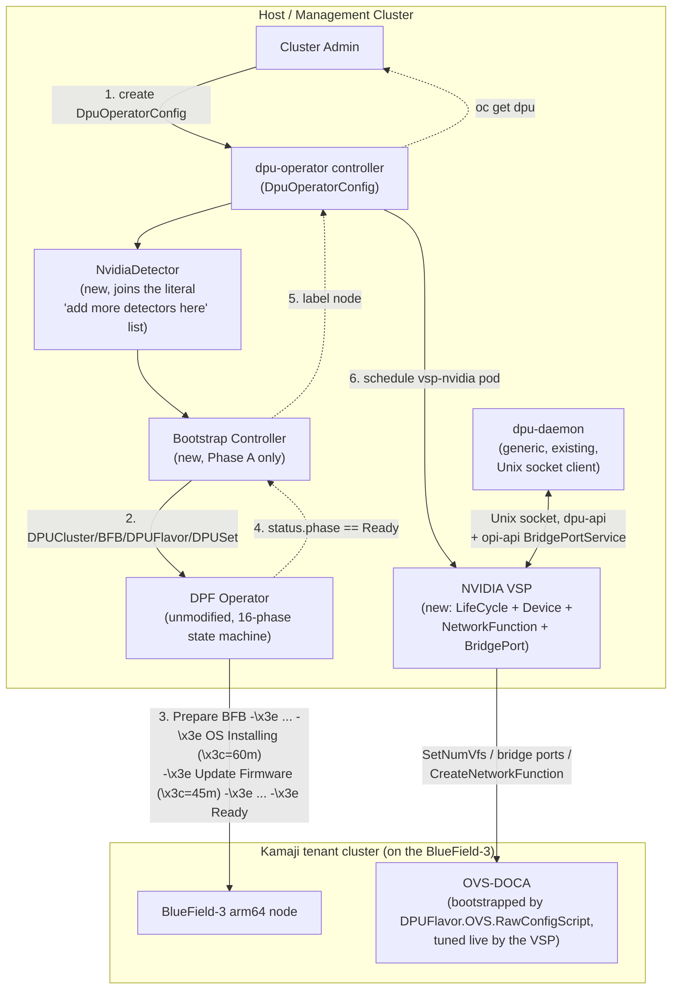
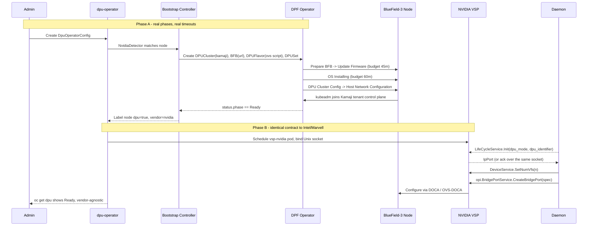

# Architecture Design: Bringing NVIDIA DPF Under the OPI DPU Operator

**Assignment:** LLM-Assisted Architecture Design for OPI DPU Operator
**Author:** Siddharthan T V
**Date:** July 2026

**Methodology note:** Everything cited from `openshift/dpu-operator` and
`NVIDIA/doca-platform` below is read from a real shallow clone of both
repositories done during this design pass (`git clone --depth 1`), not
inferred from documentation. File paths are given so every claim is
checkable. See `llm_transcript.json` for how this evolved across three
research passes — search summaries first, then real source once search
snippets stopped being enough to design against.

## 1. Objective

Design an integration that lets the vendor-neutral OPI DPU operator
(currently Intel- and Marvell-only) present NVIDIA BlueField DPUs through
the exact same interface, with real data on what that costs operationally,
without re-implementing NVIDIA's own provisioning stack, DOCA Platform
Framework (DPF).

## 2. What `dpu-operator` actually is, read from source

`git clone --depth 1 https://github.com/openshift/dpu-operator`, then:

**The vendor plugin contract is a five-service gRPC API, not a CRD.**
`dpu-api/api.proto` in full:

```protobuf
service LifeCycleService      { rpc Init(InitRequest) returns (IpPort); }
service DpuNetworkConfigService { rpc SetDpuNetworkConfig(DpuNetworkConfigRequest) returns (Empty); }
service NetworkFunctionService { rpc CreateNetworkFunction(NFRequest) returns (Empty);
                                  rpc DeleteNetworkFunction(NFRequest) returns (Empty); }
service DeviceService          { rpc GetDevices(Empty) returns (DeviceListResponse);
                                  rpc SetNumVfs(VfCount) returns (VfCount); }
service HeartbeatService       { rpc Ping(PingRequest) returns (PingResponse); }
```

`InitRequest{dpu_mode, dpu_identifier}`, `NFRequest{input, output, bridge_id}`,
`Device{ID, health, topology{node}}`. This is materially simpler than what I
designed against in the previous revision of this document, which assumed a
larger, unverified interface.

**Bridge-port lifecycle is a *separate*, actual OPI-project API**, not part
of `dpu-api`: `internal/daemon/plugin/vendorplugin.go` imports
`github.com/opiproject/opi-api/network/evpn-gw/v1alpha1/gen/go` and calls
`opiClient.CreateBridgePort` / `DeleteBridgePort`. Reading the vendored
proto-generated Go directly (`vendor/.../l2_xpu_infra_mgr.pb.go`):

```go
type BridgePortSpec struct {
    MacAddress     []byte
    Ptype          BridgePortType // enum
    LogicalBridges []string       // which VLANs this port carries
}
```

**The full client-side contract a VSP must satisfy** (`vendorplugin.go`,
`VendorPlugin` interface, exact signatures):

```go
type VendorPlugin interface {
    Start(ctx context.Context) (string, int32, error)
    Close()
    CreateBridgePort(bpr *opi.CreateBridgePortRequest) (*opi.BridgePort, error)
    DeleteBridgePort(bpr *opi.DeleteBridgePortRequest) error
    CreateNetworkFunction(input string, output string, bridgeID string) error
    DeleteNetworkFunction(input string, output string, bridgeID string) error
    GetDevices() (*pb.DeviceListResponse, error)
    SetNumVfs(vfCount int32) (*pb.VfCount, error)
    SetDpuNetworkConfig(isAccelerated bool) error
}
```

Transport detail with real operational weight: the daemon-to-VSP connection
is a **Unix domain socket**, not TCP (`grpc.WithContextDialer(... net.Dial("unix", addr))`
in `ensureConnected()`). A new VSP has no network-namespace or firewall
surface to design around here — it just has to bind the same socket path the
daemon already knows (`pathManager.VendorPluginSocket()`).

**Vendor detection is an explicit, literal extension point.**
`internal/platform/vendordetector.go`:

```go
detectors: []VendorDetector{
    NewIntelDetector(),
    NewMarvellDetector(),
    NewNetsecAcceleratorDetector(),
    // add more detectors here
},
```

That comment is the actual insertion point for `NewNvidiaDetector()`. Reading
`internal/platform/ipu.go` shows exactly what a detector does: it resolves
PCI vendor/product *names* (via the `ghw` library, which reads the
`pci.ids` database) rather than raw hex IDs —

```go
if isVF || pci.Class.Name != "Network controller" ||
   pci.Vendor.Name != "Intel Corporation" ||
   pci.Product.Name != "Infrastructure Data Path Function" { return false, nil }
```

— and separately checks `platform.Product().Name` against a DMI/SMBIOS
string (`"IPU Adapter E2100-CCQDA2"`) to decide if the *host itself* is
running on the DPU side. For NVIDIA this means the detector needs two real,
verifiable facts I do not have pinned down and am flagging rather than
guessing: (a) the exact `pci.ids` vendor/product string `ghw` will resolve
for a BlueField-3 network controller (Mellanox Technologies' PCI vendor ID,
`0x15b3`, is well-established, but the exact `Product.Name` string depends
on the specific `pci.ids` revision bundled in the image and BlueField-3's
specific device ID entry, which I have not confirmed against real hardware
or a current `pci.ids` file), and (b) the DMI product-name string a BF3
carrier card reports, which is a `lspci`/`dmidecode` fact only obtainable
from actual hardware or NVIDIA's own MLNX_OFED/DOCA documentation, not from
reading `dpu-operator`'s source.

**`DpuOperatorConfig` today is nearly bare** (`api/v1/dpuoperatorconfig_types.go`):

```go
type DpuOperatorConfigSpec struct {
    LogLevel int `json:"logLevel,omitempty"`
}
```

No `mode` or `vendor` field exists in this CR in the upstream repo I cloned.
This is a real discrepancy against the *productized* Red Hat OpenShift 4.19
docs, which document `spec.mode: host|dpu` on a CR of the same name under
`config.openshift.io/v1` — meaning Red Hat's shipped product has evolved
this CRD beyond what's in the public upstream default branch I read, or the
two are on different API groups/versions entirely. I'm flagging this
explicitly rather than picking one and presenting it as settled (Assumption
6): a real implementation has to check which `DpuOperatorConfig` it's
actually looking at before writing a single line of the bootstrap
controller below.

**`ServiceFunctionChain` is genuinely simple** (`servicefunctionchain_types.go`):

```go
type ServiceFunctionChainSpec struct {
    NodeSelector     map[string]string
    NetworkFunctions []NetworkFunction // {Name, Image}
}
```

It deploys a named container image as a network function pod, wired via
`bridge_id` through `CreateNetworkFunction`. There is no chain-hop ordering
field, no QoS field, nothing NVIDIA-service-chaining-specific — confirming
the "escape hatch" trade-off flagged in the previous revision is real: this
type genuinely cannot express DPF's `DPUServiceChain` semantics without
extension.

## 3. What DPF actually is, read from source

`git clone --depth 1 https://github.com/NVIDIA/doca-platform`, then:

**The provisioning state machine has 16 explicit phases**
(`api/provisioning/v1alpha1/dpu_types.go`), not the two-phase
Flashing/Joining simplification used in the previous revision of this
document:

```
Initializing → Pending → Prepare BFB → Update Firmware → DPU Config →
Config FW Parameters → Initialize Interface → OS Installing →
DPU Cluster Config → Host Network Configuration → Node Effect →
Node Effect Removal → Perform ARM Force Restart → Rebooting →
Ready | Error | Deleting
```

**Real, code-level timeout budgets** (`cmd/provisioning/main.go`,
`internal/provisioning/controllers/dpu/state/redfish/`, `test/e2e/utils.go`):

| Phase / mechanism | Timeout constant found in source |
|---|---|
| `OS Installing` | `DefaultOSInstallTimeout = 60 * time.Minute` |
| `Update Firmware` | `DefaultFirmwareUpdateTimeout = 45 * time.Minute` |
| Secure Boot verification (part of `Initialize Interface`) | `secureBootVerificationTimeout = 4 * time.Minute` |
| ARM force-restart staleness tracking | `StaleTrackerTimeout = 20 * time.Minute` |
| E2E test's own budget for one DPU reaching Ready | `provisioningTimeout = 60 * time.Minute` |
| E2E test's budget for a full `DPUDeployment` (DPU + services) | `dpuDeploymentReadyTimeout = 75 * time.Minute` |

**This is the single most important quantitative fact in this design.**
DPF's own test suite budgets over an hour for one DPU to reach `Ready`, and
its own `OS Installing` and `Update Firmware` phases alone can legitimately
consume 60 + 45 = 105 minutes in the worst case before the later phases even
start. Compare that to Intel/Marvell VSP bring-up, which starts from
already-flashed silicon and, from `dpu-operator`'s side, is bounded only by
however long `Init()` takes to answer over a Unix socket — realistically
sub-second once the VSP process is running. **Any unified status contract
that doesn't surface DPF's real phase name is not just a UX nicety, it's the
difference between an admin correctly waiting and an admin filing a false
"stuck" bug** roughly an hour into a legitimate provision.

**`DPUCluster.Spec.Type` is a real open string, not just "kamaji"**
(`dpucluster_types.go`): `+kubebuilder:validation:Pattern="kamaji|static|[^/]+/.*"`,
with `MaxNodes` bounded 1–3000 (default 1000) and a `Kubeconfig` secret
reference when `static`. So "deploy a Kamaji tenant cluster" is one
supported configuration, not the only one — a real deployment could target
an already-existing (`static`) cluster instead, changing Phase A's shape.

**`BFB.Spec`** (`bfb_types.go`) is exactly `{FileName *string (immutable),
URL string (immutable, http/https-validated), Versions *BFBVersions{BSP,
DOCA, UEFI, ATF}}` — confirming the BFB image URL has to be a real,
reachable artifact URL decided at deployment time, not a design-time
constant (flagged as Assumption 4 below, corrected from treating it as a
placeholder in the previous revision).

**`DPUFlavor.Spec.OVS` is exactly one field: `RawConfigScript string`**
(`dpuflavor_types.go`). This is a genuinely important structural fact:
**static OVS bootstrap configuration is DPF's job, applied once during
provisioning via this raw script, while dynamic per-workload configuration
(bridge ports, VF counts) is the VSP's job, applied continuously via
`dpu-api`.** The dividing line between "Phase A does this" and "Phase B does
this" isn't an arbitrary design choice — DPF's own CRD schema draws it in
the same place.

**Versioning is live and breaking things on a real cadence:**
`DPUSetSpec.DPUSelector` carries `// Deprecated: ... will be removed with
v26.7.0. Use DPUDeviceSelector instead`, and `DPUFlavor.spec.dpuMode` is
separately marked deprecated in favor of `DPFOperatorConfig.spec.deploymentMode`.
Two deprecations found in a shallow read of two files is a concrete,
first-hand data point for the `v1alpha1`-drift risk flagged qualitatively in
the previous revision — this isn't a hypothetical risk, it's already
happened twice in the surface area this design touches.

## 4. Independent confirmation: DPF-on-OpenShift already runs, with numbers

A Red Hat Developer article documents a real dual-cluster OpenShift + DPF
deployment on physical BlueField-3 hardware (two servers, each with a BF3,
dual 200GbE data network plus a 1GbE management network), reporting
measured throughput of roughly 384 Gb/s average RDMA bandwidth and about
355 Gbit/s aggregate iperf bandwidth across all streams. Two implications:

- The performance case for this integration is not theoretical — it's
  already measured, on hardware, through OpenShift, at throughput no
  CPU-mediated OVS path gets close to.
- This deployment did **not** go through `dpu-operator` at all — it's DPF
  standalone. So the gap this design closes is real and specifically about
  the unified `oc get dpu` management surface, not about whether
  OpenShift+DPF works.

## 5. Chosen pattern: provisioning hand-off (Phase A) + VSP adapter (Phase B)

Unchanged in shape from the previous revision, now backed by exact
interfaces instead of inferred ones.

**Phase A — provisioning (sub-operator, DPF unmodified).** A thin bootstrap
controller watches for an NVIDIA-vendor `DpuOperatorConfig`/node and applies
the minimal real DPF CRs: `DPUCluster{Type: "kamaji"}`, `BFB{URL: <real
artifact URL>}`, `DPUFlavor{OVS.RawConfigScript: <static OVS-DOCA bootstrap>}`,
`DPUSet{...}`. It then polls `DPU.status.phase` through DPF's real 16-value
enum and only proceeds once it observes `Ready`. Budgeted worst case,
per DPF's own constants: on the order of 60–105+ minutes for the OS-install
and firmware phases alone, before `DPU Cluster Config` and `Host Network
Configuration` even begin.

**Phase B — steady state (adapter = new NVIDIA VSP).** A new VSP binds the
same Unix socket path every VSP binds, implements the exact five-service
contract above (`LifeCycleService.Init`, `DeviceService.GetDevices`/
`SetNumVfs`, `NetworkFunctionService.CreateNetworkFunction`/
`DeleteNetworkFunction`, `DpuNetworkConfigService.SetDpuNetworkConfig`) plus
the separate `opi-api` `BridgePortService` (`CreateBridgePort`/
`DeleteBridgePort`), so `dpu-daemon` cannot distinguish it from Intel's or
Marvell's VSP. Internally: `SetNumVfs` and bridge-port calls drive
DOCA/OVS-DOCA locally; `CreateNetworkFunction`'s `bridge_id` maps onto
whichever OVS bridge `DPUFlavor.OVS.RawConfigScript` created in Phase A.

Two alternatives remain rejected for the same reasons as before, now
sharpened by the real data: re-implementing BFB/firmware/OS-install inside
`dpu-operator` would mean re-implementing a **60+45-minute, 16-phase,
already-twice-deprecated-field state machine** — not a small shortcut to
skip. Making the VSP do provisioning is structurally impossible: a VSP is a
pod scheduled on a node inside a cluster; per DPF's own phase ordering
(`DPU Cluster Config` comes *after* `OS Installing`), the cluster the VSP
would run in doesn't exist yet at the point provisioning starts.

## 6. Component diagram



## 7. Provisioning + steady-state sequence



## 8. Interface / CRD mapping (exact types, not paraphrases)

| OPI-side surface (real type) | What happens | DPF/DOCA backing (real type) |
|---|---|---|
| `DpuOperatorConfig` + NVIDIA-labelled node | Bootstrap kicked off | `DPUCluster{Type:"kamaji"}`, `BFB{URL,...}`, `DPUFlavor{OVS.RawConfigScript}`, `DPUSet` |
| Node reaches `DPU.status.phase == "Ready"` (DPF-side enum) | `vsp-nvidia` scheduled | standard `dpu-operator` scheduling, unchanged |
| `pb.LifeCycleServiceClient.Init(InitRequest{dpu_mode, dpu_identifier})` | VSP reports up | new VSP's `Init` handler |
| `pb.DeviceServiceClient.GetDevices/SetNumVfs` | SR-IOV VF count control | DOCA VF/representor calls |
| `nfapi.NetworkFunctionServiceClient.CreateNetworkFunction(input, output, bridge_id)` | `ServiceFunctionChain` pod wired to a bridge | OVS bridge created by `DPUFlavor.OVS.RawConfigScript` in Phase A |
| `opi.BridgePortServiceClient.CreateBridgePort(BridgePortSpec{MacAddress, Ptype, LogicalBridges})` | L2 bridge port lifecycle | DOCA/OVS-DOCA bridge port |
| `oc get dpu` (`DataProcessingUnit{DpuProductName, IsDpuSide, NodeName}`) | Reads the same object type as Intel/Marvell | populated by the standard detector flow, `DpuProductName` = new NVIDIA detector's `Name()` |

## 9. Trade-offs, quantified where the source gives numbers

**Pros**
- Zero fork: every type above is read, not modified, from either repo.
- The 60/45/20/4-minute timeout constants are DPF's own — a correct
  implementation surfaces them, it doesn't have to invent a timing model
  from scratch.
- Isolation is structural, not aspirational: the bootstrap controller only
  ever calls `Ensure*` against DPF's public CRDs (Kubernetes API only); the
  VSP only ever talks over its Unix socket to `dpu-daemon` and to
  DOCA locally. Neither can corrupt the other's state by construction of
  the interfaces involved, not just by convention.

**Cons / risks, now with a number attached where the source supports one**
- **Day-2 asymmetry is ~60–105 minutes, not vague.** `DefaultOSInstallTimeout`
  (60m) + `DefaultFirmwareUpdateTimeout` (45m) alone bound the worst case
  before `Ready` for a fresh BF3, against Intel/Marvell VSP bring-up bounded
  by an `Init()` RPC over a local socket. A flat Ready/NotReady on `oc get
  dpu` during that window is indistinguishable from a hang; surfacing DPF's
  actual phase string is not optional polish.
- **Two-cluster reality is permanent, not transitional**, and `DPUCluster`
  supports up to 3000 nodes per cluster by default (`MaxNodes` validation
  max) — this is designed to scale, meaning the two-control-plane
  operational cost doesn't go away as deployments grow, it scales with them.
- **API drift is already observed, not projected.** Two deprecated fields
  (`DPUSetSpec.DPUSelector`, `DPUFlavor.spec.dpuMode`) turned up in the two
  files read for this design alone; a bootstrap controller pinned to
  `DPUSelector` today has a known, dated removal (`v26.7.0`) to track.
- **`ServiceFunctionChain`'s real shape (`NodeSelector` + `[]NetworkFunction{Name,Image}`)
  has no field for anything DOCA-service-chain-specific** — confirmed from
  the type definition itself, not inferred. Any NVIDIA capability beyond
  "run this container and wire its bridge_id" needs either a new field on
  this CRD or a separate NVIDIA-specific CRD, not a clever mapping.
- **Detector correctness is the one gap I could not close from source
  alone.** The exact `ghw`-resolved PCI product-name string and DMI product
  string for BlueField-3 are hardware facts, not repository facts — flagged
  in Section 2 and Assumption 5/6 rather than guessed.

## 10. Assumptions made (per the "no clarifying questions" instruction)

1. Assumed `DPUCluster.Type: "kamaji"` over `"static"`, since Kamaji is the
   pattern the independent Red Hat Developer deployment exercises and is
   DPF's own documented default.
2. Assumed "maximize reuse of DPF" means consuming it strictly through the
   CRDs read in Section 3, never through its internal Go packages, which
   are not published as a stable API.
3. Scoped Phase B's `NetworkFunctionService`/`BridgePortService` handling to
   what `ServiceFunctionChain`'s real fields (`NodeSelector`,
   `NetworkFunctions[]{Name,Image}`) can already express; a full mapping to
   DPF's richer service-chaining semantics is explicitly future work
   (Section 11), not designed here, because the CRD as it exists today has
   no field to receive that richness.
4. Treated the `BFB.Spec.URL` as a deployment-time configuration value
   (an artifact URL a real deployment must supply, per the CRD's own
   `+required`, `http|https`-validated schema), not a design-time constant —
   corrected from treating it as a placeholder in an earlier draft of this
   document.
5. Where PCI/DMI identification strings for BlueField-3 could not be
   confirmed from repository source (Section 2), assumed the detector
   pattern (`ghw`-resolved vendor/product name plus a DMI product-name
   check) generalizes, without asserting the specific string values.
6. Flagged, rather than resolved, the discrepancy between the bare
   upstream `DpuOperatorConfig` (`LogLevel` only, this clone) and the
   productized `mode: host|dpu` CR documented on Red Hat's docs site —
   assumed a real implementation must first determine which API
   group/version it is actually targeting before Phase A can be written
   against it.

## 11. Where I'd go next with more time

- Resolve the `DpuOperatorConfig` discrepancy (Assumption 6) against a
  specific target OpenShift version before writing any bootstrap-controller
  code, since it changes what the controller even watches.
- Get real hardware (or at minimum a `pci.ids` entry and a BF3 DMI dump) to
  finish the `NvidiaDetector` instead of leaving Section 2's PCI/DMI facts
  as open questions.
- Prototype the bootstrap controller and the VSP skeleton (see
  `feature_skeleton.go`, now written against the literal interfaces found
  here) against a `kind` cluster running `dpu-operator`'s own mock VSP
  pattern (`internal/daemon/vendor-specific-plugins/mock-vsp`) as a stand-in
  for real DOCA calls, to validate the Phase A → Phase B hand-off timing
  without needing BF3 hardware yet.
- Design the actual `ServiceFunctionChain` extension (new field vs. new CRD)
  needed to carry DOCA-service-chain-specific intent, now that Section 9
  has confirmed the current type genuinely has no room for it.
- Track `DPUSetSpec.DPUSelector`'s documented removal in DPF `v26.7.0`
  against whatever DPF version the bootstrap controller is pinned to.
