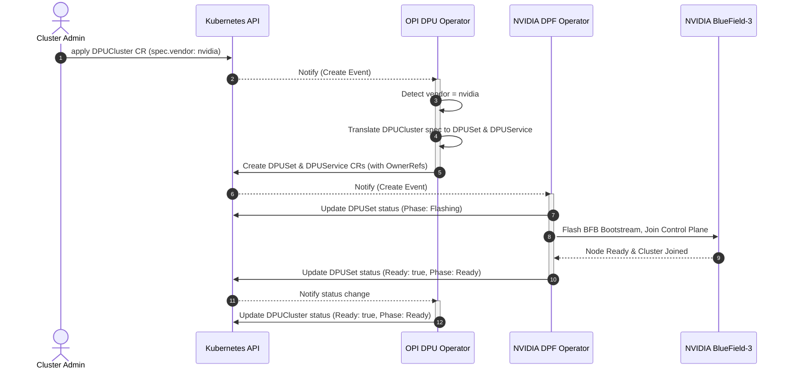
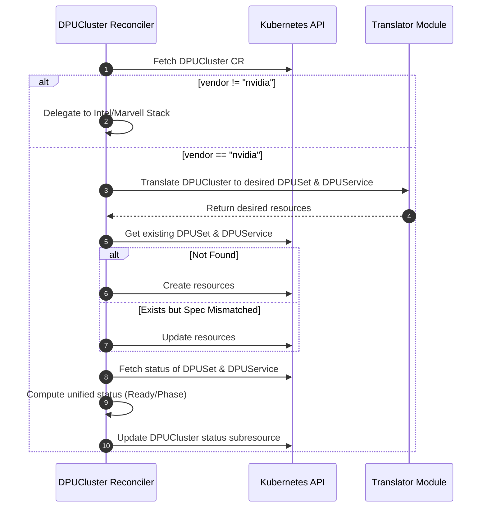
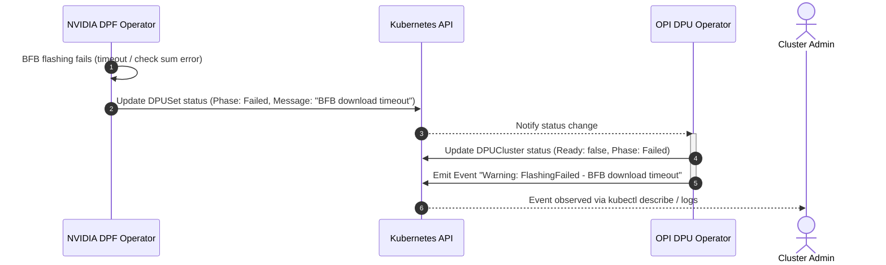

# LLM-Assisted Architecture Design: OPI DPU Operator NVIDIA Support

## 1. Executive Summary & Objective

This document proposes a Kubernetes operator architecture design to integrate NVIDIA BlueField Data Processing Units (DPUs) into the unified Open Programmable Infrastructure (OPI) operator ecosystem. By utilizing an **Adapter/CRD Translation Layer**, the OPI DPU Operator can orchestrate NVIDIA hardware by driving the upstream NVIDIA DOCA Platform Framework (DPF) operator. This maximizes the reuse of existing vendor-specific controllers and maintains a clean, vendor-neutral interface for end users.

In this design, NVIDIA BlueField support is implemented by reusing DPF rather than rebuilding provisioning logic in the OPI adapter itself. The adapter translates an OPI DPUCluster into NVIDIA DPF resources such as DPUSet and DPUService, and the upstream NVIDIA DPF operator handles the real BlueField lifecycle operations.

---

## 2. Implementation Snapshot

The current repository implements the recommended adapter pattern with the following concrete pieces:

- The OPI-facing CRD remains the vendor-neutral DPUCluster resource.
- The adapter layer translates that resource into real upstream NVIDIA DOCA Platform CRDs using the NVIDIA API packages for DPUSet and DPUService.
- The reconciler flow is split into focused helpers for DPUSet reconciliation, DPUService reconciliation, and status propagation.
- The parent DPUCluster status is updated from the child NVIDIA resources using Kubernetes conditions so readiness can be shown clearly.

### Key Files
- `api/v1alpha1/dpf_types.go` – aliases the real NVIDIA DPUSet and DPUService types into the adapter project.
- `pkg/adapter/translator.go` – implements the vendor adapter interface for NVIDIA.
- `controllers/opicluster_reconciler.go` – performs reconciliation and status propagation.
- `controllers/opicluster_reconciler_test.go` – validates create/update/status propagation through a fake client.
- `examples/demo_run.go` – demonstrates the translation logic with a sample DPUCluster.


### Commands to Run

```bash
go test ./...
go run ./examples
```

Expected outcome:
- `go test ./...` should pass.
- The example should print the translated NVIDIA DPUSet and DPUService values derived from the sample OPI DPUCluster.

---

## 4. Integration Design Options, And What I choosed

I evaluated three architectural patterns for integrating NVIDIA support into the OPI operator:

### Option A: Monolithic OPI Operator
Build all NVIDIA-specific provisioning and service deployment logic directly into the main OPI operator.
*   **Pros:** Single controller binary; no external operator dependencies.
*   **Cons:** Re-implements complex, vendor-proprietary bootstream flashing (BFB) and lifecycle workflows; tightly couples the vendor-neutral OPI project with proprietary APIs; high maintenance overhead.

### Option B: NVIDIA Sub-Operator
Create an independent sub-operator binary managed by OPI that interacts directly with DPU hardware.
*   **Pros:** Strong separation of concerns; modularity.
*   **Cons:** High runtime overhead; complex cross-controller status synchronization; duplicate effort since NVIDIA already distributes an active platform operator (DPF).

### Option C: Adapter / CRD Translation Layer 
An adapter controller inside OPI watches OPI custom resources (e.g., `DPUCluster`), translates them into NVIDIA DPF custom resources (`DPUSet`, `DPUService`), and lets the upstream NVIDIA DPF operator handle the physical hardware lifecycle.
*   **Pros:** 
    *   **Maximum Reuse:** Leverages production-ready, vendor-supported code for BFB flashing, cluster joins, and DOCA services.
    *   **Vendor Agnostic:** Keeps the main OPI codebase free of proprietary NVIDIA dependencies.
    *   **Extensible:** The same adapter pattern can easily be applied to AMD/Pensando or Intel stacks in the future.
*   **Cons:** Double-reconciliation loop introduces a small latency penalty; requires maintaining Go API models of the target DPF resources.

### Architectural Trade-off Summary

| Option | Code Reuse | Vendor Isolation | Architectural Complexity | Status Sync Overhead |
| :--- | :--- | :--- | :--- | :--- |
| **A. Monolithic** | Low (Rewrite) | Poor | Low | Low |
| **B. Sub-Operator** | Low (Rewrite) | Good | High | Medium |
| **C. Adapter (Chosen)**| **High (100% Reuse)** | **Excellent** | **Medium** | **Low (Event-driven)** |

---

## 3. Detailed Architecture

The system consists of the following modular layers:

```
            User / GitOps
                  │
            kubectl apply
                  │
      ┌───────────▼───────────┐
      │  OPI DPU Operator     │
      │                       │
      │ ┌───────────────────┐ │
      │ │  OPI Reconciler   │ │  ◄─── Watches OPI CRDs (DPUCluster)
      │ └─────────┬─────────┘ │
      └───────────┼───────────┘
                  │
                  ▼
      ┌───────────────────────┐
      │  Adapter/Translation  │
      │  Layer (Go Library)   │  ◄─── Maps OPI fields to DPF fields
      └───────────┬───────────┘
                  │
         Creates / Updates
                  │
      ┌───────────▼───────────┐
      │  NVIDIA DPF CRDs      │
      │  (DPUSet, DPUService) │  ◄─── API endpoint in management cluster
      └───────────┬───────────┘
                  │
               Watches
                  │
      ┌───────────▼───────────┐
      │  NVIDIA DPF Operator  │  ◄─── Upstream NVIDIA Operator (Unchanged)
      └───────────┬───────────┘
                  │
             Orchestrates
                  │
      ┌───────────▼───────────┐
      │  BlueField-3 DPU      │  ◄─── Performs BFB flashing & configures CNI
      └───────────────────────┘
```

### Components & OPI Terminology
1.  **OPI CRD (DPUCluster):** A vendor-neutral resource describing the cluster-wide DPU requirements (node selectors, networking mode, firmware).
2.  **VendorDetector:** An initial routing layer within the OPI reconciler that inspects the `DPUCluster` manifest. If `spec.vendor == "nvidia"`, it delegates reconciliation to the NVIDIA Adapter module.
3.  **VendorVSP (Vendor Specific Plugin):** The abstract plugin architecture inside the OPI framework. Our NVIDIA Adapter acts as a concrete implementation of a VendorVSP for NVIDIA BlueField hardware.
4. **Translator Module**: The adapter uses a stateless translator (pkg/adapter/translator.go) to convert OPI configurations into NVIDIA DPF-specific resources while keeping the OPI core vendor-neutral.
5.  **NVIDIA DPF Operator:** The DOCA Platform Framework (DPF) target operator executing DPU-specific physical hardware provisioning. It watches DPF CRDs (`DPUSet`, `DPUService`).
6.  **Status Sync & Propagation:** The adapter watches status changes of the child DPF CRDs (using owner references) and propagates ready states and errors back to the OPI `DPUCluster` status.

---

## 4. Sequence Diagrams

### 4.1 Deployment Flow
This diagram illustrates the lifecycle from user submission to physical DPU provisioning.



### 4.2 Reconciliation Loop
Details of the controller-runtime control loop and translation boundary.



### 4.3 Error Handling & Requeue Flow
Handles hardware provisioning errors, such as flashing failures.



---

## 5. Failure Modes & Mitigation Strategies

1.  **DPF Operator Missing:** If the NVIDIA DPF operator is not installed in the cluster, the DPF CRDs will not be present. The OPI operator handles this by logging an error, emitting a Kubernetes warning event, and requeuing with exponential backoff rather than crashing.
2.  **Transient Flashing Failures:** BFB installations can fail due to network instability. The adapter surfaces these failures by reading the DPUSet phase and bubbling it up as a `Ready=False` condition on the `DPUCluster`.
3.  **Conflict/Race Conditions:** Standard controller-runtime resource version matching is utilized. Updates use `Patch` or `Update` API calls, ensuring consistency.
