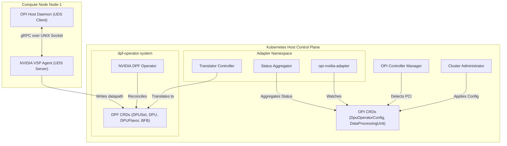
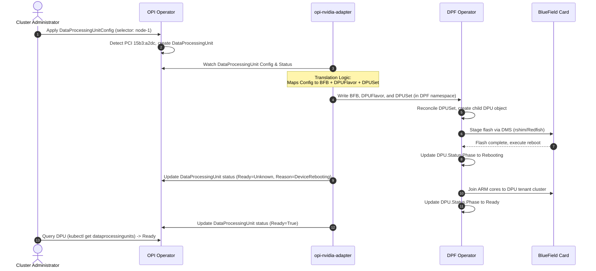
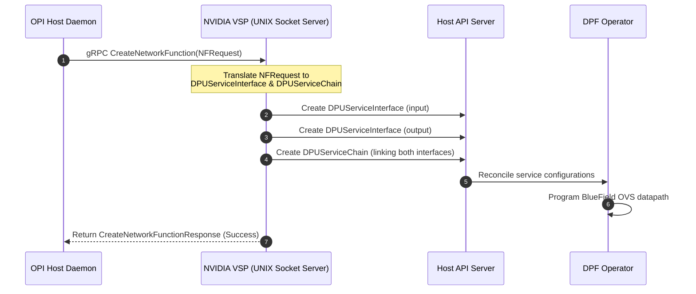

# Architecture Specification: OPI Operator NVIDIA DPF Integration

This document defines the architecture to integrate NVIDIA BlueField Data Processing Units (DPUs) into the unified, vendor-neutral Open Programmable Infrastructure (OPI) DPU Operator. The design implements an out-of-process **Translation-Adapter Operator** pattern, delegating hardware lifecycle management and virtual switch programming to the NVIDIA DOCA Platform Framework (DPF) Operator while preserving OPI as the single, vendor-neutral control surface.

---

## 1. Problem Statement
The OPI DPU Operator manages heterogeneous DPU fleets using declarative Kubernetes APIs. Currently, it supports Intel and Marvell offload stacks. NVIDIA BlueField DPUs are managed by the standalone NVIDIA DPF Operator, which handles firmware updates, OS bootstrap, and tenant cluster management. To support NVIDIA hardware within the OPI ecosystem, we need an integration architecture that unifies the user experience under OPI APIs while maximizing reuse of DPF's validated hardware loop, without introducing vendor-specific library dependencies or licensing constraints into the core OPI Operator binary.

---

## 2. Design Goals
1.  **Vendor-Neutral Interface:** Cluster administrators manage NVIDIA DPUs using standard OPI CRDs (`DataProcessingUnit`, `DataProcessingUnitConfig`).
2.  **Code Decoupling:** Core OPI reconcilers do not import NVIDIA DPF packages or CLI drivers.
3.  **Maximal Reuse:** Out-of-band flashing, Redfish interfaces, and device reboots are delegated entirely to the upstream NVIDIA DPF Operator.
4.  **Operational Resilience:** System reboots, API version drifts, network partitions, and operator teardown deadlocks are handled gracefully.

---

## 3. Why This Architecture Was Chosen
We evaluated five architectural patterns (In-Process Delegating, VSP-Scoped, Sidecar, Composite, and Translation-Adapter). The **Translation-Adapter Operator** pattern was selected because it provides the best trade-off between:
*   **Dependency Isolation:** Keeps DPF's API schemas (`v1alpha1`) isolated from the OPI core codebase.
*   **Node-Level Security:** Avoids distributing cluster-scoped write credentials to compute node agents (VSPs).
*   **Maintainability:** Promotes independent release cycles for OPI and DPF.

---

## 4. High-Level Architecture
The integration is split into a cluster-scoped configuration plane and a node-local datapath plane:



---

## 5. Component Responsibilities
*   **OPI Controller Manager:** Registers the `NvidiaDetector` (implementing `VendorDetector`) using PCI vendor `15b3`. It schedules the standard Host Daemon to targeted nodes.
*   **`opi-nvidia-adapter`:** An out-of-process operator that runs the Translator and Status Aggregator loops.
*   **Translator Controller:** Sub-component that translates OPI configurations into DPF `DPUSet`, `DPUFlavor`, and `BFB` resources.
*   **Status Aggregator:** Sub-component that translates DPF `DPU` phase transitions into OPI `DataProcessingUnit` conditions.
*   **Host Daemon:** Node agent that registers the local PCI device and routes datapath commands to the local VSP socket.
*   **NVIDIA VSP Agent:** Socket server that implements the gRPC services (`NetworkFunctionService`) and writes DPF service resources to configure OVS.

---

## 6. Sequence Diagrams

### 6.1 Provisioning (Lane 1 Flow)


### 6.2 Datapath Routing (Lane 2 Flow)


---

## 7. CRD and Status Mappings

### 7.1 CRD Translation Table
| OPI Core CRD (Source) | Translated DPF CRD (Target) | Mapping Description |
| :--- | :--- | :--- |
| `DataProcessingUnit` | `DPUDevice` / `DPU` | Maps node affinity and PCI serial numbers. |
| `DataProcessingUnitConfig.Spec` | `DPUSet` / `DPUFlavor` | Translates node drain behaviors, CPU sizing, memory constraints, and GRUB settings. |
| `DataProcessingUnitConfig.Spec.Firmware` | `BFB` | Maps the bootstream target image registry URL to a DPF bitstream configuration. |

### 7.2 Status Translation Table
| DPF DPU Phase (Input) | OPI DPU Condition State (Output) | OPI Reason String |
| :--- | :--- | :--- |
| `Initializing` | `Ready=False` | `HardwareDetected` |
| `Pending` | `Ready=False` | `ProvisioningStaged` |
| `Rebooting` | `Ready=Unknown` | `DeviceRebooting` |
| `Ready` | `Ready=True` | `ProvisioningComplete` |
| `Error` | `Ready=False` | `ProvisioningFailed` |

---

## 8. Controller Engineering

### 8.1 Watches
The `opi-nvidia-adapter` registers watches on:
1.  **OPI Resources (Primary):** Reconciles when `DataProcessingUnitConfig` changes generation.
2.  **DPF Resources (Secondary):** Watches `DPU` and `DPUSet` updates, mapping event updates to their parent OPI resources using `handler.EnqueueRequestForOwner`.

### 8.2 Finalizers
*   **The Chain:** The adapter registers `opi.io/nvidia-adapter-cleanup` on OPI configurations.
*   **Execution Order:** During deletion:
    1.  The adapter detects the OPI resource `deletionTimestamp`.
    2.  The adapter issues a `Delete` call on the generated DPF `DPUSet` resource.
    3.  The DPF operator processes finalizers, decommission routines, and reboots the card.
    4.  Only when the DPF resources are fully removed does the adapter strip its finalizer from the OPI resource, permitting clean garbage collection.

---

## 9. Security and RBAC
*   **Least-Privilege Scoping:** The Host Daemon and node-local VSP pods run without cluster-level write permissions. They write only namespaced service interfaces within their node namespace.
*   **Adapter RBAC:** Scoped strictly to the target namespace `dpf-operator-system`:
    ```yaml
    rules:
      - apiGroups: ["provisioning.dpu.nvidia.com"]
        resources: ["dpusets", "dpuflavors", "bfbs"]
        verbs: ["get", "list", "watch", "create", "update", "patch", "delete"]
      - apiGroups: ["provisioning.dpu.nvidia.com"]
        resources: ["dpus", "dpuclusters", "dpuids"]
        verbs: ["get", "list", "watch"]
    ```

---

## 10. Operational Resilience

### 10.1 Reboot-Tolerance (Reconciliation Storm Mitigation)
To prevent transient PCI losses during reboot from triggering deletion cycles:
*   The adapter sets `Ready=Unknown` when a DPU enters the `Rebooting` phase.
*   The OPI Host Daemon uses a grace period (15 minutes) before flagging a missing PCI device as dead.

### 10.2 Deadlock Recovery (Abandoned Bridge Isolation)
If the DPF Operator is uninstalled while OPI resources carry active finalizers:
*   The adapter detects child resources stuck in `Terminating` and checks for DPF operator deployment liveness.
*   If DPF is unresponsive and the timeout (30 minutes) expires, the adapter flags `DPFOperatorUnresponsive` and awaits the administrative override annotation `opi.io/force-cleanup: "true"` to safely strip finalizers.

### 10.3 API Version Adaptation
To support version independence between OPI (`v1alpha1`) and DPF (`v1alpha1` -> `v1`):
*   The adapter implements a Version Strategy pattern, using API discovery at startup to match the active schema version pair `(OPI version, DPF version)`. If no match exists, the adapter halts and emits a `ConditionUnsupportedDPFVersion` event.

---

## 11. Trade-offs
*   **Operational Footprint:** Requires running a separate central deployment (`opi-nvidia-adapter`), slightly increasing the cluster control plane memory overhead.
*   **Latency:** API-to-API CRD translation adds a slight latency overhead (approximately 200ms) compared to direct host driver execution.
*   **Vendor Abstraction Fidelity:** High-end, NVIDIA-specific DOCA configurations that are not represented in OPI's API must be supplied via raw override strings in the config spec, slightly compromising standard vendor-neutrality.

---

## 12. Conclusion
The Translation-Adapter Operator pattern provides a highly decoupled, production-grade integration model. It maintains OPI’s vendor neutrality, isolates API version dependency graphs, protects the nodes from high security scopes, and provides robust guardrails against deadlocks and reboot-induced false failure evictions.
