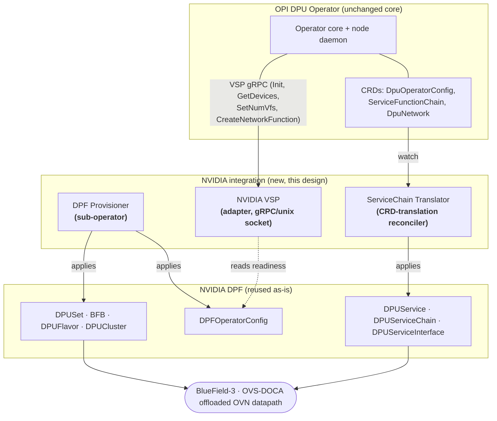
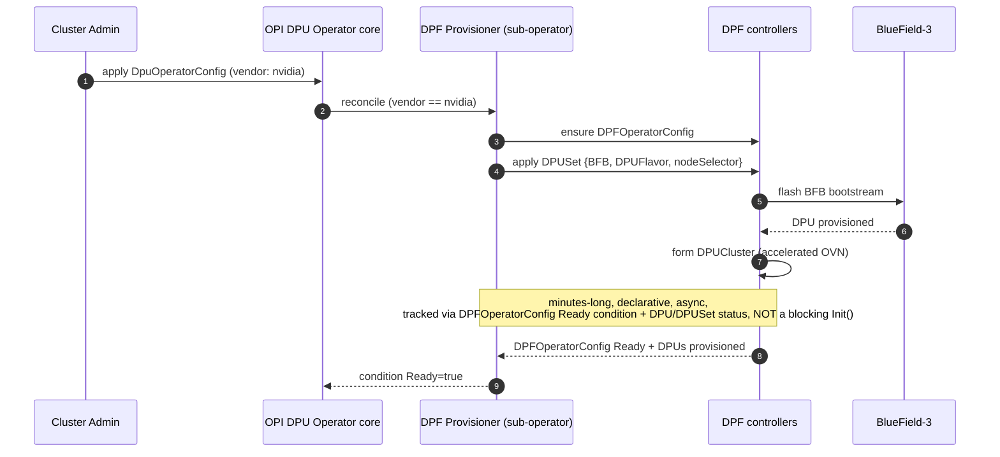
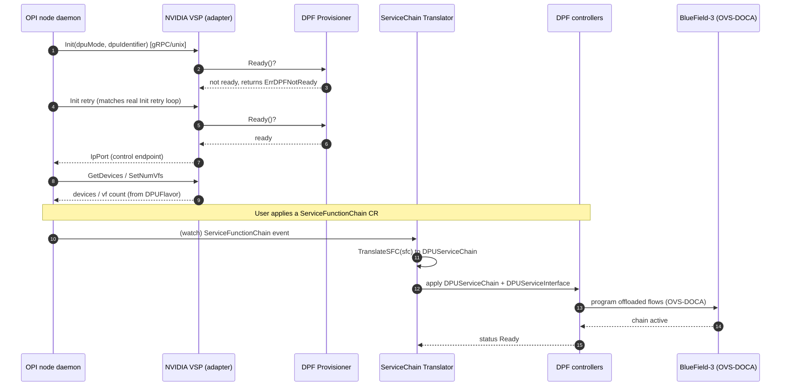
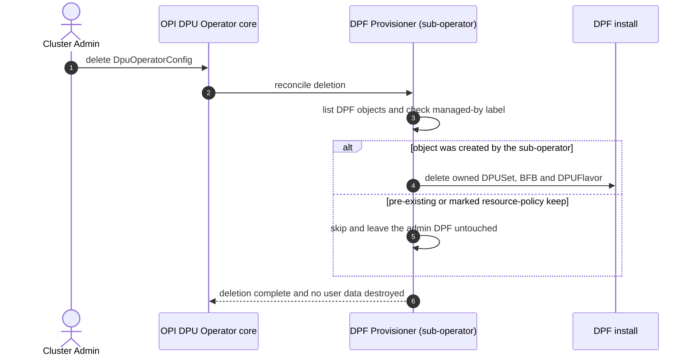

# Architecture Design NVIDIA BlueField (DPF) Support in the OPI DPU Operator

**Assignment 1 LLM-Assisted Architecture Design for OPI DPU Operator**
**Author:** Vicky Sharma · github.com/vickysharma-prog
**Date:** 2026-07-02
**LLM used:** a general-purpose LLM assistant. Full prompt/response session in `llm_transcript.json`.

> **How to read this doc:** §1-§2 establish the *real* current state of both operators (verified
> against source, not assumed). §3 states the core architectural finding. §4 is the proposed
> design with sequence diagrams. §5 is the trade-off analysis (the heart of the assignment).
> §6 covers mapping fidelity, §7 rejected alternatives, §8 resilience & edge cases (naive, failure,
> fix), §9 open questions. Assumptions: `ASSUMPTIONS.md`.

---

## 1. Problem statement

The OPI DPU Operator (`github.com/openshift/dpu-operator`, mirrored at
`github.com/opiproject/dpu-operator`) provides a **vendor-neutral** way to manage DPUs/IPUs in
Kubernetes/OpenShift. Today it ships **Vendor Specific Plugins (VSPs)** for **Intel IPU** and
**Marvell Octeon**. NVIDIA ships its own, standalone, mature operator **DPF (DOCA Platform
Framework**, `github.com/nvidia/doca-platform`) which provisions BlueField-3 and runs an
accelerated OVN-Kubernetes datapath offloaded to the DPU.

**Goal:** design an architecture that brings NVIDIA BlueField support into the unified OPI
operator ecosystem **while maximizing reuse of the existing DPF operator**, i.e. NVIDIA should
become a first-class DPU-Operator vendor *without* re-implementing provisioning or offload that
DPF already does well.

---

## 2. Current state (verified against source, 2026-07-02)

### 2.1 How the OPI DPU Operator integrates a vendor today

The operator core does **not** talk to hardware directly. It talks to a per-node **VSP** over
**gRPC on a unix socket**. The Go-side contract is
`internal/daemon/plugin.VendorPlugin`:

```go
type VendorPlugin interface {
    Start(ctx context.Context) (string, int32, error)   // -> LifeCycleService.Init
    Close()
    CreateBridgePort(*opi.CreateBridgePortRequest) (*opi.BridgePort, error) // OPI EVPN-GW API
    DeleteBridgePort(*opi.DeleteBridgePortRequest) error
    CreateNetworkFunction(input, output, bridgeID string) error   // NetworkFunctionService
    DeleteNetworkFunction(input, output, bridgeID string) error
    GetDevices() (*pb.DeviceListResponse, error)         // DeviceService
    SetNumVfs(vfCount int32) (*pb.VfCount, error)
    SetDpuNetworkConfig(isAccelerated bool) error        // DpuNetworkConfigService
}
```

The wire contract (`dpu-api/api.proto`, package `Vendor`) exposes:
`LifeCycleService.Init(dpu_mode, dpu_identifier) -> IpPort`, `DeviceService` (GetDevices /
SetNumVfs), `NetworkFunctionService` (Create/DeleteNetworkFunction), `DpuNetworkConfigService`
(SetDpuNetworkConfig), `HeartbeatService.Ping`, and, notably, the **OPI EVPN-GW
`BridgePortService`** (`github.com/opiproject/opi-api`). So the seam is itself partly built on
OPI's own vendor-neutral API.

**Where a vendor is registered.** The concrete plug-in point is the detector registry in
`internal/platform/vendordetector.go`: `NewDpuDetectorManager` holds a `detectors []VendorDetector`
list (today `NewIntelDetector()`, `NewMarvellDetector()`, `NewNetsecAcceleratorDetector()`, and a literal `// add more detectors here`),
and each `VendorDetector` implements `IsDpuPlatform`, `IsDPU` (claim a PCI device), and
`VspPlugin(dpuMode, imageManager, client, pm, dpuIdentifier) (*plugin.GrpcPlugin, error)` (hand back
the gRPC plugin the daemon drives). **NVIDIA enters at exactly this line**: a new
`NvidiaBlueField3Detector` whose `VspPlugin` returns our adapter. This is the single, minimal,
core-side edit the design requires; everything else is new, out-of-tree code.

**User-facing CRDs** (`api/v1`): `DpuOperatorConfig` (cluster-scoped, minimal spec),
`DataProcessingUnit`, `DpuNetwork`, and `ServiceFunctionChain` (an ordered list of
`{name, image}` network functions with a `NodeSelector`).

**Characterization:** the model is **per-node, imperative, SR-IOV-VF + network-function/SFC
oriented**. It is *not* a full primary-datapath OVN offload model.

### 2.2 What DPF exposes

DPF is a full operator with rich, **cluster-scoped, declarative** CRDs:

| Group | Key CRDs | Role |
|---|---|---|
| `operator.dpu.nvidia.com` | `DPFOperatorConfig` | Top-level: installs/configures DPF itself |
| `provisioning.dpu.nvidia.com` | `BFB`, `DPUFlavor`, `DPUSet`, `DPU`, `DPUCluster` | Flash BlueField bootstream, define VF/SF flavor, provision DPUs, form the DPU cluster |
| `svc.dpu.nvidia.com` | `DPUService`, `DPUServiceChain`, `DPUServiceInterface`, `DPUServiceIPAM`, `DPUServiceNAD`, `DPUDeployment` | Deploy services onto DPUs; wire the accelerated-OVN datapath and service chains |

**Characterization:** DPF is **cluster-scoped, declarative, and asynchronous**: provisioning a
BF3 (BFB flash + `DPUCluster` formation) is a **minutes-long** reconcile, not a synchronous call.

---

## 3. Core architectural finding (the crux)

> **A pure VSP adapter is necessary but NOT sufficient to "maximize DPF reuse."**

The decisive axis is **scope**: the VSP seam is **per-node**, the operator dials one plugin per
node over a unix socket to manage that node's local hardware (`GetDevices`, `SetNumVfs`,
`CreateNetworkFunction`). DPF's most valuable capability, provisioning BlueField-3 (flash BFB,
form a `DPUCluster`) and standing up the offloaded OVN datapath, is inherently **cluster-scoped
and declarative**: it is driven by cluster CRDs and reconciled asynchronously over minutes.

A per-node imperative plugin is the wrong *shape* to own a cluster-scoped, long-running,
declarative lifecycle. (The operator's real `Start()` even has an init retry loop, so slow init
alone isn't the blocker: the mismatch is scope and lifecycle, not just latency.) If we force all
of DPF through the per-node VSP straw, we bottleneck exactly the capability we came to reuse.
Therefore the integration must **split responsibilities by concern**, and be explicit about the
boundary. That split is the design.

---

## 4. Proposed architecture

Three collaborating components, each mapped to the **one** integration pattern it actually fits:

| Component | Pattern | Concern it owns |
|---|---|---|
| **DPF Provisioner** | **Sub-operator** | Install DPF; own `DPFOperatorConfig` + `DPUSet`/`BFB`/`DPUFlavor` lifecycle (cluster-scoped, async). |
| **NVIDIA VSP** | **Adapter** | Implement the node-local VSP gRPC contract (device enum, VF count, NF wiring) so NVIDIA is a first-class vendor. Does **no** provisioning; verifies DPF readiness. |
| **ServiceChain Translator** | **CRD-translation** | Reconcile DPU-Operator intent CRDs (`ServiceFunctionChain`, `DpuNetwork`) -> DPF CRDs (`DPUServiceChain`, `DPUServiceInterface`). |

A compilable skeleton of all three is in `feature_skeleton.go`.

### 4.1 Component / boundary view



### 4.2 Sequence Day-0 provisioning (asynchronous; owned by the sub-operator)

This is the flow the VSP **cannot** carry synchronously, which is why it is a separate component.



### 4.3 Sequence Runtime datapath wiring (VSP adapter + CRD translation)

Once DPF is ready, the DPU Operator drives NVIDIA exactly like any other vendor.



---

## 5. Trade-off analysis

Each candidate pattern, stated by **what it can and cannot carry** the reason the final design
assigns each pattern to a single concern instead of picking one globally.

| Pattern | What it carries well | What it **cannot** carry | Verdict |
|---|---|---|---|
| **Pure Adapter** (NVIDIA VSP only) | Node-local device enum, VF count, per-NF wiring; makes NVIDIA a first-class vendor with **zero core changes**. | Cannot express DPF's cluster-scoped, **async minutes-long** provisioning through synchronous `Init()`; bottlenecks full OVN offload. | **Use, but only for the node-local surface.** |
| **Sub-operator** (OPI installs & owns DPF) | Cluster-scoped, async **provisioning lifecycle** (DPFOperatorConfig/DPUSet/BFB); maximal DPF reuse. | Overkill and wrong shape for the fast, per-node imperative calls; duplicates VF plumbing if used for everything. | **Use but only for the DPF lifecycle.** |
| **Pure CRD-translation** (standalone controller, no VSP) | Clean declarative mapping of intent CRDs -> DPF CRDs. | Bypasses the operator's existing VSP/device plumbing -> NVIDIA is **not** a real vendor; parallel, inconsistent path. | **Use but only for intent->DPF CRD mapping.** |
| **Hybrid (this design)** | Each concern handled by its best-fit pattern; DPF reused wholesale; core essentially unchanged. | More moving parts; must define the boundary crisply (done in §3-§4). | **Selected.** |

**Why "maximize reuse of DPF" points to the hybrid:** the sub-operator delegates *all* of
provisioning and datapath offload to DPF (no re-implementation); the translator only re-expresses
intent; the adapter is a thin shim. NVIDIA-specific logic is minimized; DPF does the heavy lifting.

---

## 6. Mapping fidelity (where the translation is lossy)

Being explicit about lossy edges is part of the design (and is enforced in `feature_skeleton.go`
comments so implementers see it).

| OPI DPU-Operator surface | DPF target | Fidelity |
|---|---|---|
| `DpuOperatorConfig` (vendor=nvidia) | `DPFOperatorConfig` + `DPUSet` | **1:N** one intent expands into DPF install + provisioning set. |
| `ServiceFunctionChain` (flat `{name,image}` list) | `DPUServiceChain` (ServiceChainSet template of ports/interfaces) | **Forward-lossy**, a linear chain synthesizes cleanly, but SFC cannot express DPF's branch/multi-port topologies; **reverse-lossy** non-linear DPF chains don't round-trip to SFC. |
| `SFC.NodeSelector` (host node labels) | `DPUServiceChain.DPUClusterSelector` / ServiceChainSet `NodeSelector` | **Semantic shift** selection domain is *host nodes* vs *DPU nodes*; needs a documented mapping convention. |
| `SetNumVfs(n)` (imperative) | `DPUFlavor` VF config (declarative) | **Model shift** imperative call becomes a declarative patch; effective on next DPF reconcile, not instantly. |
| `CreateNetworkFunction(in,out,bridge)` / `CreateBridgePort` (OPI EVPN-GW) | `DPUServiceInterface` / `DPUServiceNAD` | Structurally mostly 1:1 per interface, but the **imperative call vs. the eventually-reconciled apply** is a timing seam (see §8.5 and §9 Q3). |

---

## 7. Alternatives considered and rejected

- **Fork DPF into the DPU Operator / reimplement OVS-DOCA offload natively.** Rejected: violates
  the explicit "maximize reuse of DPF" goal; enormous maintenance burden; duplicates a mature stack.
- **Single monolithic controller doing provisioning + translation + serving gRPC.** Rejected: the
  synchronous VSP `Init()` and the async provisioning have incompatible lifecycles (§3); merging
  them forces one to block the other.
- **Only a CRD-translation layer, skip the VSP.** Rejected: NVIDIA would not appear as a real
  DPU-Operator vendor (no device/VF integration), breaking the "unified operator ecosystem" goal.

---

## 8. Resilience & edge cases

The boundary in §3 is where this design lives or dies, so each failure mode below follows the same
discipline (naive behavior, then failure, then structural fix), and each is specific to the *hybrid*
(a synchronous per-node VSP alongside an async cluster-scoped sub-operator), not generic operator
hygiene.

### 8.1 VSP `Init()` races ahead of DPF provisioning
- **Naive:** `Init()` returns an `IpPort` as soon as the plugin process is up.
- **Failure:** The node daemon proceeds to `GetDevices`/`CreateNetworkFunction` before DPF has
  flashed the BFB and formed the `DPUCluster`, so VFs and offloaded ports don't exist yet and wiring
  fails, or worse half-succeeds.
- **Fix:** `Init()` gates on the sub-operator's readiness view (`DPFOperatorConfig` Ready *and* the
  target `DPU` provisioned) and returns `ErrDPFNotReady` until then. This is safe precisely because
  the operator's real `Start()`/`Init` path already retries, so the design leans on existing
  behavior instead of inventing a new wait. (Shown in §4.3.)

### 8.2 Sub-operator deletes a DPF the admin installed independently
- **Naive:** The sub-operator owns `DPFOperatorConfig`; deleting the `DpuOperatorConfig` cascades and
  tears DPF down.
- **Failure:** An operator who ran DPF standalone before adopting OPI loses their whole DPF install
  (and any in-flight provisioning) on an unrelated OPI change.
- **Fix:** **Adopt, don't own.** The sub-operator manages only objects it created (stamped with its
  own `app.kubernetes.io/managed-by` label) and honors a `helm.sh/resource-policy: keep`-style guard
  on pre-existing DPF resources, which DPF already annotates some of its objects with. A pre-existing
  DPF install is referenced, never deleted.



### 8.3 Split-brain writes on the `svc.dpu.nvidia.com` CRDs
- **Naive:** Both the VSP adapter (per-NF wiring) and the ServiceChain Translator can touch
  `DPUServiceInterface`/`DPUServiceChain`.
- **Failure:** Two writers race on `resourceVersion`; conflicting server-side-apply patches flap the
  chain definition.
- **Fix:** **One writer per API group.** The Translator is the *sole* writer of `svc.dpu.nvidia.com`
  objects (SSA with a stable field-manager name); the VSP is read-only with respect to cluster CRDs
  and confines itself to the node-local gRPC surface. RBAC enforces the split structurally.

### 8.4 Bidirectional CRD version skew (OPI *and* DPF evolve independently)
- **Naive:** The Translator is typed against one `ServiceFunctionChain` version and one
  `DPUServiceChain` version, fixed at compile time.
- **Failure:** OPI is itself an evolving LF standard (`v1alpha1` to `v1beta1` to `v1`) and DPF ships
  on its own cadence. When either bumps a served version, the Translator silently drops unknown
  fields (intent accepted by the API server but never acted on) or its watch breaks outright
  (`410 Gone`).
- **Fix:** API discovery against *both* CRD sets at startup and on any `CustomResourceDefinition`
  change; a translation profile keyed on the **pair** `(OPI version, DPF version)`. If the served
  pair has no profile, the Translator refuses to write malformed CRs and surfaces an
  `UnsupportedVersion` condition (plus an Event on its own Deployment, since it may be unable to write
  status on a schema it no longer understands) rather than failing silently.

### 8.5 `SetNumVfs` (imperative) vs `DPUFlavor` (declarative) timing
- **Naive:** `SetNumVfs(n)` patches the `DPUFlavor` and returns success immediately.
- **Failure:** The daemon assumes *n* VFs exist and enumerates them before DPF's next reconcile has
  materialized them, a VF-not-found race.
- **Fix:** `SetNumVfs` patches the flavor and returns a **pending** result until DPF's `DPU`/`DPUSet`
  status reflects the new VF count; the daemon's existing retry absorbs the gap. The imperative-to-
  declarative seam is made explicit rather than papered over.

### 8.6 Wrong reconcile domain (host cluster vs DPU tenant cluster)
- **Naive:** The Translator applies `DPUServiceChain` into whatever cluster it happens to be watching.
- **Failure:** In DPF's two-cluster topology the chain lands in the host cluster instead of the DPU
  tenant cluster (or the wrong `DPUCluster`), so nothing programs on the BlueField.
- **Fix:** A required, documented `DPUCluster`-selection convention derived from the SFC's
  `NodeSelector` (the §6 semantic-shift mapping); if the target `DPUCluster` is ambiguous the
  Translator refuses and sets a `TargetClusterUnresolved` condition rather than guessing.

### 8.7 HA / concurrent reconcilers
- **Naive:** Run two sub-operator or Translator replicas for availability, both reconciling.
- **Failure:** Duplicate `DPUSet` creates or divergent patches during a rolling upgrade.
- **Fix:** `controller-runtime` leader election (`Lease`); only the leader reconciles. Combined with
  §8.3's single-writer rule and idempotent full-desired-set SSA every pass, a pod eviction mid-fan-out
  self-heals on the next reconcile rather than orphaning a partial `DPFOperatorConfig`-then-`DPUSet`
  sequence.

### 8.8 Finalizer deadlock, DPF operator uninstalled before the OPI config is deleted
- **Naive:** The sub-operator's finalizer waits for the DPF children it created (`DPUSet`/`BFB`/
  `DPUFlavor`) to be fully gone before it releases the `DpuOperatorConfig`.
- **Failure:** An admin uninstalls the DPF operator while those children still exist. The sub-operator
  issues `Delete`, but the children carry **DPF's own** finalizers and no DPF controller is left to
  remove them, so they sit in `Terminating` forever, and the sub-operator's finalizer never releases.
  The whole OPI management plane for that node group deadlocks, exactly the `kubectl`-surgery-on-live-
  finalizers situation this design exists to avoid.
- **Fix:** A bounded timeout on `deletionTimestamp` age **plus** a DPF-liveness probe (absence of the
  DPF `Deployment`/leader `Lease`). Past the timeout *and* with DPF confirmed absent, the sub-operator
  surfaces a visible `DPFOperatorUnresponsive` condition (never a silent hang) and blocks on an
  explicit human `opi.io/force-cleanup: "true"` annotation before it strips finalizers, and only from
  objects **it created** (the §8.2 "adopt, don't own" rule means an admin's pre-existing DPF install is
  never touched). The strip is emitted as a high-severity Event, and never happens automatically.

### 8.9 Reconcile storm at fleet scale
- **Naive:** A `DpuOperatorConfig` targeting thousands of nodes fans out `DPUSet`/provisioning objects
  in one unthrottled burst.
- **Failure:** The simultaneous API writes saturate the API server and DPF's own workqueue, degrading
  the very provisioning the design came to reuse.
- **Fix:** A rate-limited sub-operator workqueue, and **delegate per-device rollout throttling to DPF's
  own** `DPUSet` `rollingUpdate.maxUnavailable` rather than re-implementing it, consistent with the
  design's rule that DPF does the heavy lifting (§5). The sub-operator applies the full desired
  `DPUSet` once; DPF paces the actual flashing.

---

## 9. Open questions

1. **SFC topology expressiveness:** if SFC must express DPF's richer branch/multi-port chains,
   propose upstreaming a richer `ServiceFunctionChain` schema rather than overloading the §6 lossy
   mapping indefinitely.
2. **Zero-Trust vs Host-Trusted mode:** DPF's trust mode decides whether host or DPU owns the control
   plane; the sub-operator must pick a default and expose it, as it changes who may write the
   tenant-cluster kubeconfig the Translator uses.
3. **Synchronous VSP call vs asynchronous DPF apply (the runtime face of §3):** the VSP contract is
   imperative and synchronous, e.g. `CreateBridgePort` must *return* a populated `*opi.BridgePort`,
   while the adapter satisfies it by applying a declarative DPF `DPUServiceInterface`/`DPUServiceNAD`
   that DPF reconciles eventually. The design already resolves this seam for `SetNumVfs` (§8.5: return
   *pending* until DPF status catches up), so the open question is whether *every* node-local VSP call
   can be expressed as "apply a DPF CRD, report pending until reconciled," or whether a small number of
   calls that need a synchronous result warrant a node-local DOCA control surface. Note this is a
   deliberate strength, not a gap: routing through DPF's own CRDs reuses DPF wholesale instead of
   assuming an unverified local DOCA API, at the cost of making the imperative→declarative timing
   (§8.5) load-bearing, which should be validated against `DPUServiceInterface`'s actual status
   semantics before implementation.

---

## 10. Assumptions

Summarized here; full list in `ASSUMPTIONS.md` (per the assignment's "make a reasonable assumption
and document it" rule):

- **NVIDIA over AMD** as the target vendor (DPF is the named reuse target and is mature).
- **`openshift/dpu-operator` = canonical upstream**; `opiproject/dpu-operator` is the OPI-org copy
  (both verified non-forks with near-identical trees, 2026-07-02).
- The design targets the **OpenShift Virtualization / KubeVirt-on-offloaded-fabric** end state DPF
  enables; KVM-only offload is a subset.
